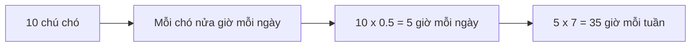

# 🧮 Chain of Thought Prompting: Dạy AI suy luận từng bước như con người

> Nguồn: `069-Chain-of-Thought-Prompting.txt` · [Udemy](https://ua.udemy.com/course/langchain/learn/lecture/37493912)

Chào các bạn! Chúng ta đã đi qua zero-shot, one-shot và few-shot. Hôm nay, mình muốn giới thiệu kỹ thuật được xem là một trong những bước ngoặt lớn nhất của prompt engineering: **Chain of Thought (CoT) Prompting — chuỗi suy nghĩ**.

Đây là kỹ thuật giúp các LLM giải quyết những bài toán mà trước đây chúng "bó tay", bằng cách bắt chước chính cách con người chúng ta tư duy.

---

### 🤔 Vì sao LLM giỏi mà vẫn "ngã ngựa" ở bài toán đơn giản?

Các large language models với **100 tỷ tham số (parameters)** có thể làm được những điều tuyệt vời: cho ra kết quả mạnh mẽ trên đủ loại tác vụ, thậm chí khi chúng ta **không huấn luyện (train) hoặc chỉ train rất ít**.

Tuy nhiên, ngay cả LLM lớn nhất vẫn có thể loay hoay với một số dạng bài toán: **các tác vụ suy luận đa bước (multi-step reasoning)** như bài toán đố (math word problems) hay suy luận thông thường (common sense reasoning).

Với con người thì dễ, nhưng với model thì không hề dễ chút nào.

---

### 💡 Google đã giải quyết bài toán này như thế nào?

Các nhà nghiên cứu tại Google đã đưa ra phương pháp có tên **Chain of Thought**.

CoT prompting nhằm **cải thiện khả năng suy luận của LLM**, cho phép model **phân rã (decompose) một bài toán đa bước thành các bước trung gian**, từ đó giải được những bài toán suy luận phức tạp mà các phương pháp prompting tiêu chuẩn không thể xử lý.

Nói ngắn gọn: **Chain of Thought là việc chia nhỏ một vấn đề thành một chuỗi các bước suy luận trung gian**, và nó cải thiện đáng kể khả năng suy luận phức tạp của LLM.

Nhờ chia nhỏ bài toán lớn thành các bước nhỏ hơn, dễ quản lý hơn, CoT giúp LLM suy luận chính xác hơn và hiệu quả hơn.

Giống như hầu hết kỹ thuật prompt engineering khác, CoT lần đầu được giới thiệu trong một **bài báo nghiên cứu chính thức (research paper)** — đường link được mình để trong phần tài nguyên của khóa học.

---

### 🧸 Ví dụ từ bài báo: Từ thất bại đến đáp án đúng

Trước tiên, hãy cùng xem **standard prompting (prompting tiêu chuẩn)** và thấy vì sao nó chưa đủ mạnh.

**Prompt 1:** *"Sean has five toys for Christmas. He got two toys each from his mom and his dad. How many toys does he have in total?"* — AI model trả lời **9**, chính xác! Bạn ấy đã có 5 món từ trước, cộng 2 món từ mẹ và 2 món từ bố: **5 + 2 + 2 = 9**.

**Prompt 2** (dạng tương tự, cùng quy trình suy nghĩ): *"John takes care of ten dogs. Each dog takes half an hour a day to walk and take care of their business. How many hours a week does John need to take care of his dogs?"*

Ở đây AI model trả về **50** (tức 10 × 5), và đây **không phải đáp án đúng**. Đáp án đúng là **35 giờ**.

Với standard prompting ở trên — nếu phân loại thì nó thuộc nhóm **zero-shot prompting** — chúng ta nhận được câu trả lời chưa đủ. Đây chính là **hạn chế (limitation)** mà bài báo nghiên cứu chỉ ra, và CoT chính là giải pháp được đề xuất.

Chain of Thought thực ra rất đơn giản: chúng ta **hướng dẫn model giải bài toán theo đúng cách con người giải**.

Trong ví dụ của bài báo, các nhà nghiên cứu lấy câu hỏi về đồ chơi và **đưa kèm một câu trả lời mẫu** — bạn có thể xem đây như **one-shot prompting**. Nhưng họ làm nhiều hơn thế: họ cung cấp **luôn cả chuỗi suy nghĩ (chain of thought)** mà con người dùng để giải bài toán đó:

* Sean khởi đầu với **5 món đồ chơi**.
* Bạn ấy nhận **2 món từ mẹ** và **2 món từ bố**.
* Phép tính sẽ là **5 + 2 + 2 = 9**. Vì vậy đáp án là **9**.

Sau đó họ hỏi lại câu hỏi về những chú chó. Và điều thú vị là: model đủ thông minh để **lấy chuỗi suy nghĩ mà các nhà nghiên cứu vừa áp dụng cho câu hỏi tương tự trước đó, rồi áp dụng vào câu trả lời tiếp theo**.

Kết quả: với CoT prompting, model trả về **đáp án đúng** và còn **tự trình bày các bước** để đi đến đáp án:

* John chăm sóc **10 chú chó**.
* Mỗi chú chó cần **nửa giờ (0.5 giờ) mỗi ngày** để đi dạo và giải quyết "nhu cầu".
* Vậy mỗi ngày cần **10 × 0.5 = 5 giờ**.
* Một tuần có **7 ngày**, nên phép tính là **5 × 7 = 35 giờ**.

Các bước suy luận mà model tự trình bày có thể hình dung như sau:

Quy trình suy nghĩ ở cả hai câu hỏi giống hệt nhau: lấy phép tính cần giải và **chia nhỏ thành hai phép tính con**.

Chain of Thought là một bước phát triển quan trọng của prompt engineering vì nó cho phép LLM tiếp cận việc giải quyết vấn đề theo cách **giống con người hơn**, và cho phép model phân rã bài toán phức tạp thành các bước trung gian được giải quyết độc lập. Đây là cánh cửa mở ra khả năng giải quyết rất nhiều bài toán mới.

---

### 🚀 Zero-shot CoT và Few-shot CoT

Tương tự các kỹ thuật trước, CoT cũng có hai biến thể quen thuộc:

**1. Zero-shot Chain of Thought:**

Cực kỳ đơn giản — bạn chỉ cần thêm vào prompt một câu như ***"let's think step by step" (hãy suy nghĩ từng bước một)***.

Model sau đó sẽ xuất ra câu trả lời kèm giải thích các bước nó thực hiện. Ở đây chúng ta **không cung cấp "cỗ máy suy luận"** cho model mà để nó tự do sáng tạo và tự chọn cách giải.

Lợi ích: bạn **quan sát được quá trình suy luận của AI**, nhưng model sẽ không có kiến thức trước (prior knowledge) về dạng bài.

**2. Few-shot Chain of Thought:**

Lần này, bạn **đưa kèm câu trả lời thật mà bạn mong đợi** cho một bài toán tương tự, kèm giải thích các bước và chuỗi suy nghĩ bạn đã dùng để ra đáp án đó.

Model sẽ tiếp nhận, xử lý, "học" cách làm, rồi có thể **suy ra và áp dụng chuỗi suy nghĩ ấy cho những bài toán khác** — giải được những bài **tương tự nhưng không hoàn toàn giống** theo đúng cách bạn muốn.

| Biến thể | Cách làm | Model nhận được gì | Điểm đáng chú ý |
|---|---|---|---|
| Zero-shot CoT | Chỉ thêm câu "let's think step by step" | Tự do sáng tạo, tự chọn cách giải | Quan sát được quá trình suy luận, nhưng không có prior knowledge về dạng bài |
| Few-shot CoT | Đưa câu trả lời mẫu kèm giải thích các bước | Học cách làm từ ví dụ mẫu | Áp dụng được cho bài tương tự nhưng không hoàn toàn giống |

Đến đây, bạn đã nắm được bộ kỹ thuật prompting nền tảng nhất. Bài tiếp theo sẽ cực kỳ thú vị: **ReAct Prompting** — nơi AI không chỉ suy luận mà còn **hành động** để kết nối với thế giới bên ngoài.

### 🎯 Tự kiểm tra nhanh

**Câu 1:** Chain of Thought giải quyết vấn đề gì cho LLM?

<b>Xem đáp án</b>

**Đáp án:** Giúp model phân rã bài toán đa bước thành các bước trung gian, cải thiện khả năng suy luận phức tạp.

Giải thích: Các tác vụ như math word problems hay common sense reasoning vốn là điểm yếu của prompting tiêu chuẩn.

Tham chiếu: Mục Vì sao LLM giỏi mà vẫn ngã ngựa.

**Câu 2:** Vì sao standard prompting trả lời sai bài toán "John và 10 chú chó"?

<b>Xem đáp án</b>

**Đáp án:** Model trả về 50 (10 × 5) mà bỏ qua bước nhân với 7 ngày; đáp án đúng là 35 giờ.

Giải thích: Standard prompting không yêu cầu model trình bày các bước trung gian.

Tham chiếu: Mục Ví dụ từ bài báo.

**Câu 3:** CoT được giới thiệu bởi ai và ở đâu?

<b>Xem đáp án</b>

**Đáp án:** Các nhà nghiên cứu tại Google, trong một bài báo nghiên cứu chính thức (research paper).

Giải thích: Link được để trong phần tài nguyên của khóa học.

Tham chiếu: Mục Google đã giải quyết bài toán này như thế nào.

**Câu 4:** Zero-shot CoT hoạt động ra sao?

<b>Xem đáp án</b>

**Đáp án:** Chỉ cần thêm câu "let's think step by step" vào prompt, không đưa ví dụ; model tự do chọn cách giải.

Giải thích: Lợi ích là quan sát được quá trình suy luận, nhưng model không có prior knowledge về dạng bài.

Tham chiếu: Mục Zero-shot CoT và Few-shot CoT.

**Câu 5:** Few-shot CoT khác zero-shot CoT ở điểm nào?

<b>Xem đáp án</b>

**Đáp án:** Bạn đưa kèm câu trả lời thật mong đợi cùng chuỗi suy nghĩ mẫu, để model "học" cách làm rồi áp dụng cho bài tương tự.

Giải thích: Kết quả giải được các bài tương tự nhưng không hoàn toàn giống theo đúng cách bạn muốn.

Tham chiếu: Mục Zero-shot CoT và Few-shot CoT.

Hẹn gặp lại! 🚀

## Nguồn tham khảo

- [Udemy — Chain of Thought Prompting](https://ua.udemy.com/course/langchain/learn/lecture/37493912)
- [arXiv — Chain-of-Thought Prompting Elicits Reasoning in Large Language Models](https://arxiv.org/abs/2201.11903)
- [arXiv — Large Language Models are Zero-Shot Reasoners](https://arxiv.org/abs/2205.11916)
