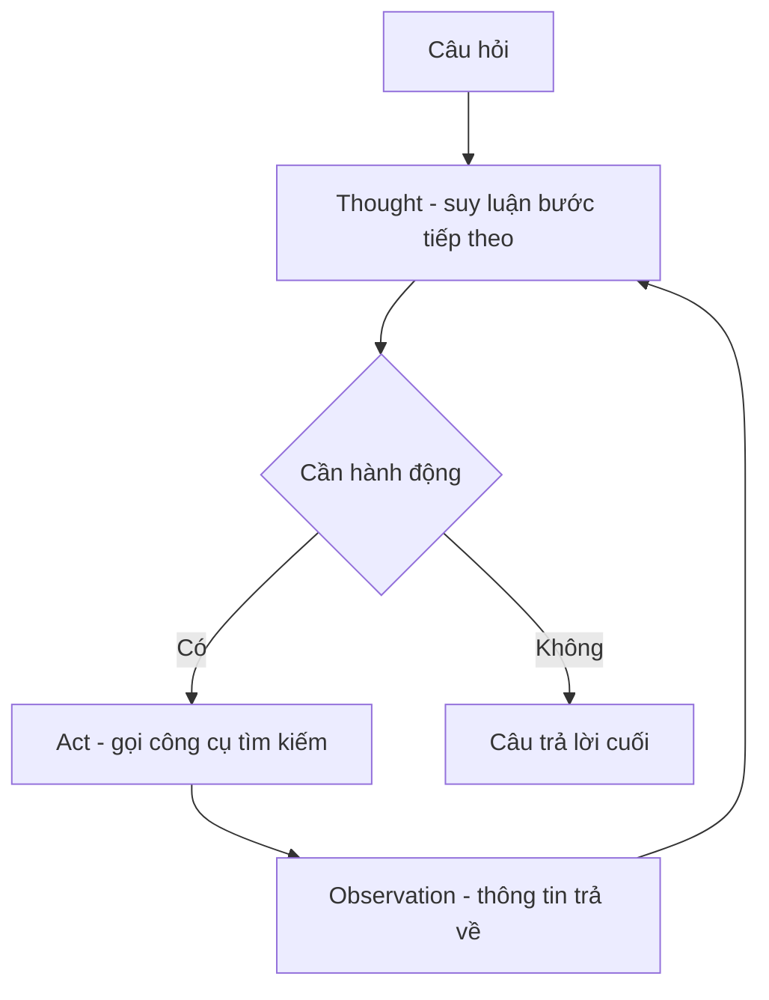

# 🎭 ReAct Prompting: Khi AI vừa suy luận vừa hành động như con người

> Nguồn: `070-ReAct-Prompting.txt` · [Udemy](https://ua.udemy.com/course/langchain/learn/lecture/37493790)

Chào các bạn! Chúng ta vừa học xong Chain of Thought — cách để AI suy luận từng bước. Nhưng nếu AI chỉ "nghĩ" mà không thể "làm" gì với thế giới bên ngoài thì sao?

Hôm nay mình sẽ giới thiệu kỹ thuật đã truyền cảm hứng cho cả một framework huyền thoại: **ReAct Prompting**. Cái tên này ra đời từ hai chữ: **Re** = Reasoning (suy luận), **Act** = Acting (hành động).

---

### 🧠 Con người chúng ta xử lý việc phức tạp như thế nào?

Khi đối mặt một tác vụ phức tạp, phản ứng tự nhiên của con người là: suy nghĩ về các bước cần làm, thực hiện từng bước, rồi chuyển sang bước tiếp theo.

Chúng ta chia nhỏ vấn đề thành nhiều bước, suy luận về chúng, hành động dựa trên các bước đó — và khi mọi thứ hoàn tất, ta hoàn thành được toàn bộ tác vụ.

Các nhà nghiên cứu phát hiện ra rằng: nếu **kết hợp Chain of Thought với khả năng thực hiện hành động và lấy thông tin từ nguồn bên ngoài (external sources)**, LLM có thể vừa tự sinh ra tác vụ cần làm (phần reasoning), vừa **thực thi các tác vụ đó** để giải quyết trọn vẹn cả bài toán.

Nói cách khác, ReAct kết hợp ba năng lực:

1. Khả năng **tự sinh tác vụ** của LLM.
2. Khả năng **suy luận để theo dõi và cập nhật kế hoạch** cho phù hợp.
3. Khả năng **thực thi các bước** để lấy thêm thông tin từ nguồn bên ngoài.

Đây được xem là một kỹ thuật cực kỳ mạnh mẽ, là nền tảng cho các ứng dụng LLM **có tính thực tế (factual) hơn cả ChatGPT**, có thể sử dụng **external API và công cụ (tools)**.

Chính kỹ thuật này đã khai sinh ra **LangChain** — framework cực kỳ phổ biến để xây dựng ứng dụng LLM.

---

### 🔎 Ví dụ "huyền thoại": Chiếc điều khiển Apple Remote

Hãy cùng phân tích ví dụ trong bài báo nghiên cứu để hiểu rõ mô hình ReAct.

Câu hỏi: ***"Aside from the Apple remote, what other device can control the program the Apple remote was originally intended to interact with?"*** — *Ngoài chiếc Apple Remote, còn thiết bị nào khác điều khiển được chương trình mà Apple Remote vốn được thiết kế để tương tác?*

Kết quả với các phương pháp thông thường:

* **Zero-shot prompt đơn giản:** model trả lời **iPad** — sai.
* **Chain of Thought** (yêu cầu model mô tả cách suy nghĩ): model trả về **iPhone, iPad, iPod**, v.v. — vẫn không đúng.
* **Act-only** (chỉ áp dụng được với LLM có thể tương tác với thế giới bên ngoài): prompt yêu cầu **search (tìm kiếm)** thông tin về Apple Remote rồi liệt kê các quan sát. Kết quả cuối cùng là "**yes**" — đơn giản là không phải câu trả lời cho câu hỏi.

| Phương pháp | Cách tiếp cận | Kết quả |
|---|---|---|
| Zero-shot | Hỏi trực tiếp, không kèm ví dụ | Trả lời **iPad** — sai |
| Chain of Thought | Yêu cầu model mô tả cách suy nghĩ | Trả về **iPhone, iPad, iPod** — vẫn sai |
| Act-only | Chỉ tìm kiếm và liệt kê quan sát | Trả về "**yes**" — không phải câu trả lời |
| ReAct | Xen kẽ suy luận và hành động | Chính xác: **keyboard function keys** |

Cả ba phương pháp đều thất bại. Nhưng khi dùng model dựa trên **ReAct paradigm**, câu trả lời nhận được là **chính xác**: **các phím chức năng trên bàn phím (keyboard function keys)**!

---

### 🔄 Mổ xẻ vòng lặp Thought → Act → Observation

Vậy điều gì đã xảy ra bên trong? Hãy cùng theo dõi từng bước:

1. **Thought (suy nghĩ):** LLM cần **search thông tin về Apple Remote** và tìm xem chương trình nó được thiết kế để tương tác ban đầu là gì.
2. **Act (hành động):** Nó sinh ra một hành động cần thực hiện để truy cập tài nguyên bên ngoài — cú pháp **search for the Apple Remote**.
3. **Observation (quan sát):** Nguồn bên ngoài cho biết Apple Remote vốn được thiết kế để điều khiển **Front Row media center**.
4. **Thought tiếp theo:** Có gì đó liên quan đến Front Row media center → LLM quyết định hành động tiếp theo là **search cho "front row"**.
5. **Observation:** Không tìm thấy gì trực tiếp, nhưng tìm thấy thứ tương tự là **Front Row software**.
6. **Thought mới:** Nên **xem xét Front Row software** → hành động tương ứng là **search for the Front Row software**.
7. **Observation:** Kết quả thu được chưa thật sự liên quan.
8. **Thought cuối cùng:** Từ nguồn thông tin ở bước trước, model suy ra rằng **Front Row software được điều khiển bởi Apple Remote hoặc các phím chức năng Apple** → và câu trả lời được chốt: **keyboard function keys**.

Theo mình, điều này thật sự "mind-blowing": nó đang **mô phỏng chính xác tư duy của con người**. Nếu mình cần trả lời câu hỏi này, mình cũng sẽ làm đúng như vậy. Kỹ thuật này cực kỳ, cực kỳ mạnh mẽ!

---

### ⚙️ "Phép thuật" đằng sau ReAct thực chất là gì?

Bạn có thể đang nghĩ: "Wow, nghe như ma thuật vậy?". Sự thật là **không có phép thuật nào ở đây cả** — chỉ là **tích hợp một chút code với Chain of Thought** mà chúng ta đã học:

* Chain of Thought có thể tạo ra các suy nghĩ (thoughts) và các bước (steps), và LLM hoàn toàn có khả năng sinh ra các bước đó.
* Việc tiếp theo là **thực thi (act) dựa trên những bước ấy** — và điều này có thể được làm bằng code.
* Nó còn **không hề khó như bạn tưởng**: chỉ cần lấy output mô tả việc cần làm, **tra các từ khóa như "search"** để xác định chủ đề cần tìm, rồi thực thi.
* Sau đó, **chạy lại (rerun) prompt với các quan sát (observations)** vừa thu được — lặp đi lặp lại **cho đến khi tìm ra lời giải**.

Và đây chính là nền tảng của **LangChain** — framework phổ biến nhất hiện nay để xây dựng các ứng dụng LLM có thể xử lý những việc phức tạp như tương tác với nguồn dữ liệu bên ngoài, lưu trữ dữ liệu (persisting data), và nhiều thứ khác nữa.

Bạn vừa nắm được kỹ thuật quan trọng bậc nhất đứng sau các AI agent hiện đại! Ở bài tiếp theo, chúng ta sẽ tổng hợp loạt **Prompt Engineering Quick Tips** — những "mẹo nhanh" dễ áp dụng mà hiệu quả bất ngờ.

### 🎯 Tự kiểm tra nhanh

**Câu 1:** ReAct là viết tắt của hai chữ nào?

<b>Xem đáp án</b>

**Đáp án:** Re = Reasoning (suy luận), Act = Acting (hành động).

Giải thích: Cái tên phản ánh việc kết hợp suy luận với hành động.

Tham chiếu: Đoạn mở bài.

**Câu 2:** ReAct kết hợp ba năng lực nào của LLM?

<b>Xem đáp án</b>

**Đáp án:** Tự sinh tác vụ, suy luận để theo dõi và cập nhật kế hoạch, thực thi các bước để lấy thêm thông tin từ nguồn bên ngoài.

Giải thích: Kết hợp Chain of Thought với hành động và nguồn dữ liệu ngoài.

Tham chiếu: Mục Con người xử lý việc phức tạp như thế nào.

**Câu 3:** Vì sao zero-shot, CoT và Act-only đều thất bại ở ví dụ Apple Remote?

<b>Xem đáp án</b>

**Đáp án:** Zero-shot trả lời iPad, CoT liệt kê iPhone/iPad/iPod, Act-only trả về "yes" — thiếu sự kết hợp giữa suy luận và hành động để lần ra Front Row.

Giải thích: Chỉ ReAct mới trả lời đúng "keyboard function keys".

Tham chiếu: Mục Ví dụ huyền thoại.

**Câu 4:** "Phép thuật" đằng sau ReAct thực chất là gì?

<b>Xem đáp án</b>

**Đáp án:** Tích hợp một chút code với Chain of Thought: tra từ khóa như "search", thực thi, rồi chạy lại prompt với các quan sát — lặp đến khi có lời giải.

Giải thích: Không có phép thuật nào ở đây cả.

Tham chiếu: Mục Phép thuật đằng sau ReAct.

**Câu 5:** ReAct có liên hệ thế nào với LangChain?

<b>Xem đáp án</b>

**Đáp án:** Chính kỹ thuật ReAct đã khai sinh ra LangChain.

Giải thích: LangChain là framework phổ biến để xây dựng ứng dụng LLM tương tác nguồn dữ liệu ngoài.

Tham chiếu: Mục Con người xử lý việc phức tạp như thế nào và đoạn kết.

Hẹn gặp lại! 🚀

## Nguồn tham khảo

- [Udemy — ReAct Prompting](https://ua.udemy.com/course/langchain/learn/lecture/37493790)
- [arXiv — ReAct: Synergizing Reasoning and Acting in Language Models](https://arxiv.org/abs/2210.03629)
