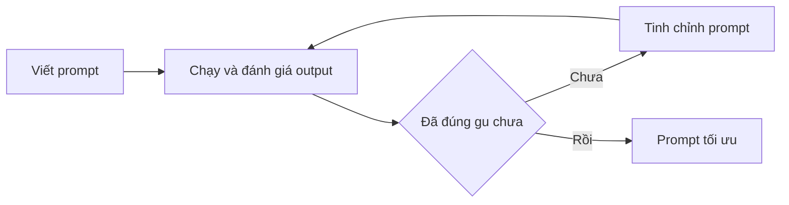

# 💡 Prompt Engineering Quick Tips: 3 mẹo "low hanging fruit" thay đổi chất lượng prompt

> Nguồn: `071-Prompt-Engineering-Quick-Tips.txt` · [Udemy](https://ua.udemy.com/course/langchain/learn/lecture/37554570)

Chào các bạn, lại là mình đây! Sau khi đã đi qua các kỹ thuật prompting nền tảng, hôm nay mình muốn chia sẻ những **tips (mẹo)** cực kỳ dễ áp dụng để bạn bắt đầu chế tạo những prompt chất lượng cao.

Mình gọi chúng là **low hanging fruit (quả chín ở tầm với)** — nghĩa là siêu dễ đưa vào prompt, nhưng một khi áp dụng, prompt của bạn sẽ tốt lên trông thấy và câu trả lời từ LLM cũng cải thiện rõ rệt.

---

### 📍 Mẹo 1: Đừng bỏ quên Context

**Context (ngữ cảnh) siêu quan trọng** vì nó mang lại cho prompt của bạn tính liên quan về mặt ngữ cảnh, giúp tạo ra những câu trả lời **mạch lạc và chính xác**.

Nếu bạn không cung cấp context cho prompt, bạn đang **đẩy hẳn nhiệm vụ tạo context cho LLM** — và LLM sẽ không cung cấp ngữ cảnh bạn thực sự muốn.

Bạn đang để nó tự đoán, dẫn đến câu trả lời **lạc đề, thiếu liên quan hoặc không khớp mục tiêu** của bạn.

Ví dụ mình đưa cho LLM một prompt có context và yêu cầu nó **phân tách (break down) prompt theo mức độ liên quan ngữ cảnh**:

* *"We want to generate a list of technical interview questions for a senior DevOps engineer position in a tech startup in a fast-paced culture working in the cloud."* — *Chúng ta muốn tạo danh sách câu hỏi phỏng vấn kỹ thuật cho vị trí senior DevOps engineer tại một tech startup có văn hóa nhanh, làm việc trên cloud.*

Ở đây, **task** là "liệt kê câu hỏi phỏng vấn kỹ thuật", còn toàn bộ phần còn lại chính là **context**. LLM đã đủ thông minh để **nhận diện đâu là context, dán nhãn nó, và dán nhãn cả task** — nhờ đó kết quả tốt hơn hẳn.

Câu hỏi đầu tiên nó tạo ra: *"How would you handle a sudden spike in traffic on the company's website? What steps would you take to ensure the website remains available and responsive to the users?"*

Mình xuất thân từ lập trình phần mềm, DevOps và phát triển ứng dụng cloud native, nên mình khẳng định: đây là **câu hỏi rất sâu**, có thể nói liền **nửa tiếng, một tiếng, thậm chí hai tiếng** về chiến lược, cách triển khai và use case.

Hồi còn phỏng vấn ứng viên cho vị trí software engineering có liên quan DevOps, mình cũng từng hỏi câu tương tự.

Tóm lại: **càng thêm nhiều ngữ cảnh liên quan, kết quả càng tốt**. Đây là mẹo low hanging fruit cực dễ áp dụng mà hiệu quả rất lớn.

---

### 🎯 Mẹo 2: Đặt task thật rõ ràng, đừng mập mờ

Task definition cần đặt ra **một mục tiêu (goal/objective) cụ thể** cho LLM đạt được.

Nếu bạn không cung cấp mục tiêu rõ ràng, chính xác, đúng ý — bạn đang **để LLM tự chọn thay bạn**.

Mình thích ví von thế này: khi vợ mình nhờ ra siêu thị mua táo. Cô ấy không nói loại táo nào — xanh hay đỏ, nhỏ, vừa hay lớn? Mình mang táo về, và dĩ nhiên kết quả không như cô ấy muốn, thế là cô ấy thất vọng vì mình không mua đúng loại táo cô ấy cần.

Theo mình, **làm prompt engineer chính là có kỹ năng giao tiếp tốt**. Giao tiếp giỏi với con người giúp bạn truyền đạt thông điệp để người khác hiểu điều bạn muốn — và điều tương tự xảy ra với LLM.

Muốn giỏi prompt engineering, hãy **mài giũa kỹ năng giao tiếp của bạn, lần này là với LLM**.

Và LLM thích những prompt có task **ngắn gọn, rõ ràng, không mập mờ (concise, clear and non-ambiguous)**.

Ví dụ về một task mập mờ: *"improve the user experience of this e-commerce website"* — *cải thiện trải nghiệm người dùng của website thương mại điện tử này*.

Prompt này mập mờ vì không nói rõ **khía cạnh nào** của trải nghiệm cần cải thiện, hay **cải thiện như thế nào**. Nó không có hướng dẫn cụ thể hay chỉ số (metrics) để đánh giá tiêu chí thành công.

Task sẽ bị diễn giải theo vô số cách, dẫn đến **nhầm lẫn, thiếu rõ ràng và hiệu suất tổng thể thấp hơn**.

Giờ hãy sửa lại cho rõ ràng hơn: *"identify and address specific pain points in the user experience of the e-commerce website to increase customer satisfaction and sales conversion rates"* — *xác định và xử lý các điểm đau (pain points) cụ thể trong trải nghiệm người dùng để tăng mức độ hài lòng và tỷ lệ chuyển đổi bán hàng*.

Prompt này rõ ràng hơn vì nói cụ thể task là **xác định và xử lý các pain points**, thay vì "cải thiện trải nghiệm người dùng" chung chung; đồng thời có **mục tiêu cụ thể** để đánh giá thành công.

**Specificity (độ đặc thù)** chính là mức độ chi tiết bạn đưa vào prompt để chính xác hơn. **Prompt càng specific, LLM càng có khả năng tạo ra câu trả lời đúng mục tiêu và chính xác hơn.**

---

### 🔁 Mẹo 3: Lặp lại và tinh chỉnh (Iterations)

**Iterations (vòng lặp cải tiến) là yếu tố then chốt** trong prompt engineering và trong thiết kế quy trình prompt.

Mình là fan cứng của quy trình này — nó được thực hành rất nhiều trong ngành phần mềm, và cũng được giới thiệu trong cuốn sách **"The Lean Startup"**.

Về cơ bản, **iterate nghĩa là lặp đi lặp lại**: mỗi lần lặp, bạn thay đổi một chút và làm cho việc thực thi tốt hơn.

Trong prompt engineering, iteration bao gồm:

1. **Tinh chỉnh (refine) prompt** để cải thiện tổng thể.
2. **Kiểm thử và đánh giá output** (testing & evaluating).
3. **Mỗi vòng lặp dựa trên output của vòng trước** để tiếp tục refine.

Vòng lặp cải tiến đó diễn ra như sau:

Quá trình này sẽ dẫn đến một **prompt tối ưu đúng gu bạn**: sau khi lặp và tinh chỉnh, bạn có được prompt hoàn hảo cho ra kết quả hoàn hảo.

---

### 💎 Điều cốt lõi mình muốn bạn mang theo

Điều quan trọng nhất mình muốn bạn ghi nhớ sau bài này: **thời gian bạn dành để viết prompt cực kỳ quan trọng.**

Mình biết rất dễ bị cám dỗ viết vội vài chữ rồi bấm Enter. Nhưng nếu bạn đầu tư thời gian để **prompt engineering cho câu lệnh của mình** — làm nó chính xác hơn, tinh chỉnh task, thêm context, cụ thể hơn, bớt mập mờ, và liên tục refine qua nhiều vòng lặp — kết quả sẽ tốt hơn rất nhiều, và **tổng thể lại tiết kiệm thời gian cho bạn**.

Theo mình, **prompt engineering chính là chế tạo và tạo ra prompt hoàn hảo để có được chính xác thứ bạn muốn**.

### 🎯 Tự kiểm tra nhanh

**Câu 1:** Vì sao không nên bỏ quên context khi viết prompt?

<b>Xem đáp án</b>

**Đáp án:** Vì không có context, bạn đang đẩy nhiệm vụ tạo context cho LLM — nó sẽ tự đoán và cho câu trả lời lạc đề, thiếu liên quan.

Giải thích: Context mang lại tính liên quan, giúp câu trả lời mạch lạc và chính xác.

Tham chiếu: Mục Mẹo 1.

**Câu 2:** Task mập mờ dẫn đến hậu quả gì?

<b>Xem đáp án</b>

**Đáp án:** Task bị diễn giải theo vô số cách, gây nhầm lẫn, thiếu rõ ràng và hiệu suất tổng thể thấp hơn.

Giải thích: Prompt mập mờ thiếu hướng dẫn cụ thể và metrics đánh giá thành công.

Tham chiếu: Mục Mẹo 2.

**Câu 3:** Ví dụ về task rõ ràng hơn trong bài là gì?

<b>Xem đáp án</b>

**Đáp án:** "Identify and address specific pain points in the user experience of the e-commerce website to increase customer satisfaction and sales conversion rates."

Giải thích: Nêu cụ thể task (xác định và xử lý pain points) và mục tiêu để đánh giá thành công.

Tham chiếu: Mục Mẹo 2.

**Câu 4:** Iteration trong prompt engineering bao gồm những gì?

<b>Xem đáp án</b>

**Đáp án:** Refine prompt, kiểm thử và đánh giá output, và mỗi vòng lặp dựa trên output của vòng trước.

Giải thích: Quá trình này dẫn đến prompt tối ưu đúng gu bạn.

Tham chiếu: Mục Mẹo 3.

**Câu 5:** Thông điệp cốt lõi mà Eden muốn bạn mang theo là gì?

<b>Xem đáp án</b>

**Đáp án:** Thời gian bạn dành để viết và tinh chỉnh prompt cực kỳ quan trọng; đầu tư thời gian sẽ cho kết quả tốt hơn và tổng thể tiết kiệm thời gian.

Giải thích: Đừng viết vội vài chữ rồi bấm Enter.

Tham chiếu: Mục Điều cốt lõi.

Ở bài tiếp theo, chúng ta sẽ bước sang một tầng sâu hơn: **Context Engineering** — bước tiến hóa tự nhiên của Prompt Engineering. Hẹn gặp lại các bạn! 🚀

## Nguồn tham khảo

- [Udemy — Prompt Engineering Quick Tips](https://ua.udemy.com/course/langchain/learn/lecture/37554570)
- [OpenAI — Prompt engineering guide](https://developers.openai.com/api/docs/guides/prompt-engineering)
