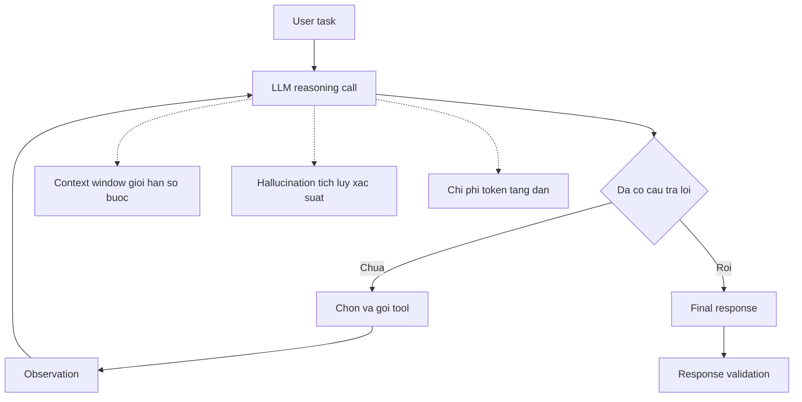

# 🤖 Đưa LLM Agent lên Production: Những thách thức thật không ai nói trước với bạn

> Nguồn: `074-LLM-Applications-in-Production.txt` · [Udemy](https://ua.udemy.com/course/langchain/learn/lecture/40592700)

Chào các bạn, lại là Eden đây! Trong bài này, mình muốn nói về việc **tích hợp agent vào môi trường production (môi trường thật, phục vụ người dùng thật)** — và cụ thể hơn là những thách thức đi kèm với nó.

Mình sẽ không tô hồng đâu, vì đây là những bài toán rất thật. Và tin mình đi — **tất cả các chủ đề trong bài này đều áp dụng cho mọi ứng dụng LLM**, không riêng gì agent.

---

### 🧠 Agents = rất nhiều LLM call tuần tự

Khi làm việc với agents, các bạn dùng LLM như một **reasoning engine (cỗ máy suy luận)**. Mỗi bước đi và mỗi tool được sử dụng đều phải diễn ra sau một LLM call đã quyết định dùng tool đó.

Hệ quả là ta có **nhiều LLM call liên tiếp, cái sau chờ kết quả của cái trước**. Tùy độ phức tạp của tác vụ và số bước suy luận, ứng dụng có thể "chạy dài" đáng kể — các bạn cần ghi nhớ điều này khi thiết kế.

*Có vài cách xử lý như dùng **semantic cache** hoặc **LLM cache**, nhưng mình sẽ không đi sâu trong khóa học này.*

Toàn bộ vòng lặp suy luận và những thách thức đi kèm trông như thế này:

---

### 📏 Context window và những giới hạn trần trụi

Các bạn có để ý rằng mỗi lần suy luận, ta gửi vào LLM một prompt rất lớn không? Hầu hết các LLM hiện nay xử lý được khoảng **32k token** — nghe thì nhiều, nhưng trong ứng dụng thực tế, ta có thể vượt qua giới hạn này một cách dễ dàng.

Nghĩa là số bước ta làm được bị giới hạn bởi **context window**. Mình biết có những model như **Claude của Anthropic** có thể nhận tới **100k token**, nhưng trên thực tế gửi 100k token vào LLM lại mang đến rất nhiều vấn đề — ví dụ LLM có xu hướng **"quên" thông tin nằm ở giữa** (các bạn tìm đọc paper **"Lost in the Middle"** nhé).

---

### 🎲 Ảo giác (hallucination) và bài toán xác suất

**Hallucination** là khi ta gửi một câu hỏi cho LLM và nhận về câu trả lời không liên quan — vì suy cho cùng, LLM chỉ đang "đoán" từng token một. **Retrieval augmentation (RAG)** là kỹ thuật tốt để giảm hallucination, vì ta "neo" LLM vào thông tin gửi kèm trong context.

Nhưng vì LLM là một "sinh vật thống kê", luôn có **xác suất** để ra câu trả lời đúng — và với agent, "câu trả lời đúng" chính là **chọn đúng tool**. Giả sử xác suất đó là **0.9 (90%)**:

1. Nếu chỉ gọi một lần, 0.9 là con số rất tốt.
2. Nhưng khi gọi tuần tự hết lần này đến lần khác, theo **luật nhân xác suất**, chỉ sau vài bước — ví dụ 6 bước — xác suất có câu trả lời tốt tụt xuống chỉ còn khoảng **0.59**.
3. Và nếu tác vụ còn lớn hơn, cần nhiều bước hơn, con số này còn rơi sâu hơn nữa.

Một hướng giải quyết là **fine-tuning (tinh chỉnh)** LLM cho việc **chọn tool (tool selection)**. Đã có nhiều research paper chứng minh LLM được fine-tune để chọn tool — ví dụ để gọi API — cho kết quả tốt hơn hẳn: thay vì 90%, xác suất chọn đúng tool cao hơn rất, rất nhiều.

---

### 💸 Chi phí, kiểm chứng phản hồi và bảo mật

**Về giá cả:** ta trả tiền cho token gửi đi và nhận về. Với agents, prompt có thể rất lớn, và khi chạy ở quy mô hàng triệu lần, hóa đơn sẽ không hề nhỏ. Chưa kể **GPT-4** — suy luận mạnh nhưng chạy rất chậm và rất đắt. Dùng nó ở quy mô lớn có thể khiến bài toán **không còn đáng tiền về mặt tài chính**.

*Hai chiến lược xử lý:* một là dùng **cache** (semantic cache) thay vì gọi LLM; hai là dùng **retrieval augmentation cho việc chọn tool** — khi có quá nhiều tool, ta semantic search trước để lấy ra những tool liên quan nhất trước khi gọi LLM suy luận. *(Mình không demo phần này trong khóa, nhưng đây là hướng rất đáng thử.)*

**Về response validation (kiểm chứng phản hồi):** vì ta dựa vào phản hồi của LLM để chọn tool hoặc trả nội dung cho người dùng, ta cần cơ chế kiểm chứng. Ngay cả khi câu trả lời đúng nhưng **sai format**, ứng dụng vẫn có thể "tèo". Việc test cái này rất phức tạp — và cá nhân mình **chưa từng thấy một giải pháp thật sự bền vững cho vấn đề này**.

**Về bảo mật:** trong ứng dụng AI, ta trao cho LLM khả năng chạy query database, gọi API, nói chuyện với bên thứ ba... Nếu kẻ xấu **prompt injection** hoặc chiếm được **API key**, họ có thể chạm tới các tool đó. Nếu database là tài sản riêng của công ty, đây thực sự là vấn đề lớn. Hãy tuân thủ **nguyên tắc least privilege (đặc quyền tối thiểu)** — cấp cho tool và agent ít quyền nhất có thể, đồng thời đặt **guardrails** cho prompt gửi tới agent. Mình khuyên dùng **LLM Guard**, một giải pháp open source rất hứa hẹn cho bảo mật LLM.

---

### ⚖️ Đừng "overkill" với agents

Nếu các bạn biết chính xác mình muốn thực thi điều gì và có thể định nghĩa nó bằng code, thì **các bạn không cần dùng agents**. Mình đã gặp không ít người trong các công ty cố giải bài toán bằng LLM agent, trong khi giải pháp bền vững thật sự chỉ là **một đoạn code Python tất định (deterministic)**.

Vậy nên lời khuyên của mình: trước khi dùng agent, hãy thật sự tự hỏi *"Mình có thể tự implement bằng code tất định không?"*. Nếu câu trả lời là có, mình không khuyên bạn dùng agent — vì như các bạn thấy, nó đi kèm vô vàn thách thức.

| Tiêu chí | LLM Agent | Code tất định |
|---|---|---|
| Bản chất | LLM tự quyết định từng bước và tool | Luồng bước cố định do bạn định nghĩa |
| Khi phù hợp | Tác vụ mở, không đoán trước được các bước | Biết chính xác cần thực thi điều gì |
| Đánh đổi | Nhiều LLM call, tốn token, có xác suất sai, cần guardrails | Bền vững, rẻ, dễ kiểm chứng |
| Lời khuyên của mình | Chỉ dùng khi không thể viết code tất định | Ưu tiên nếu tự implement được |

### 🎯 Tự kiểm tra nhanh

**Câu 1:** Vì sao agent thường là một chuỗi LLM call tuần tự?

<b>Xem đáp án</b>

**Đáp án:** Vì mỗi bước và mỗi tool đều phải chờ một LLM call quyết định dùng tool đó.

Giải thích: Các call nối tiếp nhau, cái sau chờ kết quả của cái trước.

Tham chiếu: Mục Agents = rất nhiều LLM call tuần tự.

**Câu 2:** Nếu mỗi bước có xác suất chọn đúng tool là 0.9, sau 6 bước còn khoảng bao nhiêu?

<b>Xem đáp án</b>

**Đáp án:** Khoảng **0.59**.

Giải thích: Theo luật nhân xác suất, xác suất tụt rất nhanh khi số bước tăng.

Tham chiếu: Mục Ảo giác và bài toán xác suất.

**Câu 3:** Cách nào được nhắc để giảm hallucination?

<b>Xem đáp án</b>

**Đáp án:** Retrieval augmentation (RAG) — "neo" LLM vào thông tin gửi kèm trong context.

Giải thích: Câu trả lời bám vào dữ liệu truy xuất thay vì chỉ đoán token.

Tham chiếu: Mục Ảo giác và bài toán xác suất.

**Câu 4:** Vì sao cần nguyên tắc least privilege và guardrails?

<b>Xem đáp án</b>

**Đáp án:** Vì prompt injection hoặc lộ API key có thể cho kẻ xấu chạm tới tool và database.

Giải thích: Tool/agent càng ít quyền, thiệt hại tiềm tàng càng nhỏ.

Tham chiếu: Mục Chi phí, kiểm chứng phản hồi và bảo mật.

**Câu 5:** Khi nào mình khuyên KHÔNG nên dùng agent?

<b>Xem đáp án</b>

**Đáp án:** Khi bạn có thể tự implement bằng code Python tất định.

Giải thích: Agent chỉ đáng dùng khi các bước không thể định nghĩa trước bằng code.

Tham chiếu: Mục Đừng "overkill" với agents.

Và để công bằng, mình muốn nói rõ: **agents là một công nghệ tuyệt vời** với tiềm năng khổng lồ. Đi từ prototype lên production không hề dễ, nhưng **hoàn toàn khả thi**. Mình không hề nói agents chưa sẵn sàng cho production — mình chỉ nói hãy cẩn thận, vì tích hợp công nghệ lớn luôn đi kèm cái giá của nó.

Hẹn gặp lại các bạn trong bài tiếp theo, nơi mình sẽ vẽ bức tranh toàn cảnh về các mẫu ứng dụng LLM hiện nay nhé! 🚀

## Nguồn tham khảo

- [Udemy — LLM Applications in Production](https://ua.udemy.com/course/langchain/learn/lecture/40592700)
- [Lost in the Middle: How Language Models Use Long Contexts](https://arxiv.org/abs/2307.03172)
- [LLM Guard — The Security Toolkit for LLM Interactions](https://github.com/protectai/llm-guard/)
