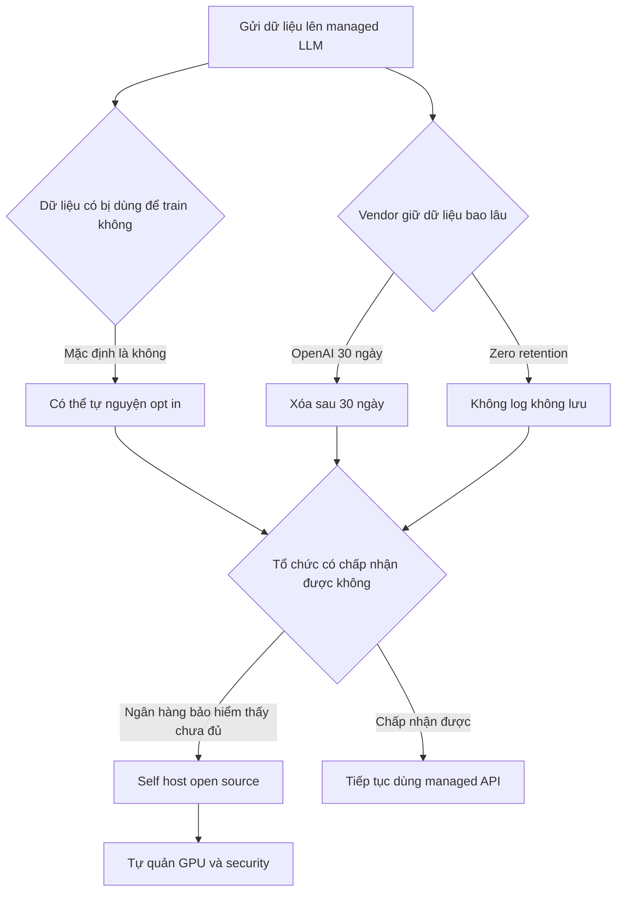

# 🔐 Privacy & Data Retention: Những câu hỏi bạn phải trả lời trước khi dùng Managed LLM

> Nguồn: `076-LLMs-in-Production-Privacy-Data-Retention.txt` · [Udemy](https://ua.udemy.com/course/langchain/learn/lecture/46383693)

Chào các bạn, Eden đây! Trong bài này, mình muốn nói về những mối quan tâm quan trọng khi làm việc với **managed large language models (các mô hình ngôn ngữ lớn được cung cấp dưới dạng dịch vụ)** — cụ thể là **data retention (lưu trữ dữ liệu)** và **privacy (quyền riêng tư)**.

Đây là chủ đề cực kỳ rộng, mình có thể nói hàng giờ, nên bài này chỉ là phần mở đầu — **chắc chắn không phải danh sách đầy đủ** những gì các bạn cần biết. Nhưng ít nhất nó sẽ giúp các bạn biết mình phải bắt đầu từ đâu.

---

### ⚠️ Một disclaimer quan trọng trước khi bắt đầu

Mình không phải luật sư. **Đây không phải là lời khuyên pháp lý.** Các bạn nên tham vấn **đội ngũ pháp lý (legal team) và đội ngũ privacy** trước khi tích hợp bất kỳ giải pháp LLM nào vào doanh nghiệp của mình.

Có rất nhiều luật lệ và quy định mà mình không biết hết, và chủ đề data retention & privacy vô cùng nhạy cảm, cần được xử lý đúng cách. Mình cũng **không đại diện cho bất kỳ LLM vendor nào**. Mỗi vendor đều có **EULA (end user license agreement — thỏa thuận cấp phép người dùng cuối)** với các điều khoản dịch vụ quy định cách họ xử lý dữ liệu của bạn — đây là **văn bản pháp lý bạn nên đọc**. Mình chỉ đóng góp "2 xu" quan điểm thôi, hãy xem bài này với một chút hoài nghi và **tự nghiên cứu** nhé.

---

### 🎓 Dữ liệu của bạn có bị đem đi train không?

Lưu ý quan trọng: mình **không** nói về các sản phẩm B2C như **ChatGPT hay Gemini (trước đây là Bard)**, mà nói về **các cloud API dành cho doanh nghiệp** — ví dụ các managed model của OpenAI (GPT-4, GPT-4 mini) hay **Google Cloud's Vertex AI Gemini**.

Nỗi lo lớn nhất của nhiều người: managed vendor có lấy dữ liệu ta gửi lên (hoặc phần văn bản được sinh ra) để **train model tiếp theo** không? Theo những gì mình thấy, **trong hầu hết trường hợp — ít nhất với các top-tier model — đều có cam kết rằng dữ liệu gửi lên và văn bản sinh ra không được dùng cho mục đích training.** Đó là hành vi mặc định; nếu bạn muốn cho phép, bạn phải **tự nguyện opt in**.

Đây là mối quan tâm chính đáng: nếu doanh nghiệp bạn có **dữ liệu độc quyền (proprietary data)** không muốn lộ, hoặc dữ liệu khách hàng mà bạn có **nghĩa vụ pháp lý** phải bảo vệ — thì bạn bắt buộc phải xác nhận điều này trước khi tích hợp giải pháp LLM. Và tất nhiên, **mỗi vendor sẽ có khác biệt**.

---

### 🗄️ Data retention: Vendor giữ dữ liệu của bạn bao lâu?

Vấn đề tiếp theo: vendor có lưu dữ liệu ta gửi không, và nếu có thì **giữ trong bao lâu, vì mục đích gì**?

Ví dụ với **OpenAI**: họ nêu rõ rằng để **phát hiện hành vi lạm dụng (abuse)**, họ có thể giữ request của bạn trong **30 ngày**, sau đó sẽ xóa — hoặc lâu hơn nếu có yêu cầu pháp lý khác. Họ cũng đề cập rằng một số khách hàng có thể dùng **zero retention policy (chính sách lưu trữ bằng 0)**: không dữ liệu nào bị log hay lưu lại, chỉ dùng để phục vụ request.

Một số vendor khác có **zero retention mặc định ngay từ đầu**, và muốn log/lưu thì bạn phải **opt in rõ ràng**. *Vì vậy hãy nhớ: khác biệt giữa các vendor là chuyện đương nhiên, và các quy tắc này có thể thay đổi theo thời gian.*

---

### 🏦 Khi cam kết từ vendor vẫn là chưa đủ

Kể cả khi nhà cung cấp cam kết không train trên dữ liệu của bạn và có zero retention, **với một số tổ chức như ngân hàng hay công ty bảo hiểm, thế vẫn chưa đủ**. Họ thường có quy định cực kỳ nghiêm ngặt về privacy, data retention và chia sẻ dữ liệu khách hàng, vì đây là những dữ liệu rất nhạy cảm.

Với những công ty này, nếu muốn tích hợp generative AI, họ thường chọn **self-deploy (tự triển khai) các open source model** trong môi trường của mình. Khi đó họ **toàn quyền kiểm soát dữ liệu, chính sách retention và security**. Nhưng đổi lại là **cái giá không nhỏ**:

1. Vận hành LLM không hề đơn giản — phải xử lý **scalability (khả năng mở rộng), durability (độ bền), availability (tính sẵn sàng)** và đủ thứ "-ility" khác.
2. Chi phí lớn: **GPU** để host model, **con người** để maintain và vận hành deployment.
3. Phải tự lo **security**, vì ngay cả open source model cũng có thể chứa lỗ hổng.

Còn một **giải pháp trung gian**: host các open source LLM **trong chính môi trường cloud của mình**, dùng managed service của nhà cung cấp cloud. Cách này giúp **chuyển bớt gánh nặng vận hành sang nhà cung cấp cloud**, mà bạn vẫn giữ quyền kiểm soát — vì đó là môi trường cloud của bạn, và bạn có thể áp đặt các security control của mình tại đó.

Ba mức triển khai nhìn nhanh như sau:

| Mức triển khai | Kiểm soát dữ liệu | Đánh đổi chính |
|---|---|---|
| Managed cloud API | Vendor xử lý và cam kết qua EULA; có thể có zero retention | Nhanh, đơn giản, nhưng phụ thuộc cam kết vendor |
| Open source host trong cloud của mình | Bạn kiểm soát, cloud provider lo vận hành | Vẫn phải tự áp security control trong môi trường cloud |
| Self-deploy hoàn toàn | Toàn quyền dữ liệu, retention, security | Tốn GPU, nhân sự, tự lo scalability và lỗ hổng |

### 🎯 Tự kiểm tra nhanh

**Câu 1:** Hai câu hỏi cốt lõi cần trả lời khi dùng managed LLM là gì?

<b>Xem đáp án</b>

**Đáp án:** Dữ liệu có bị dùng để train không, và vendor giữ dữ liệu bao lâu, vì mục đích gì.

Giải thích: Đây là phần mở đầu của danh sách câu hỏi về privacy, retention và copyright.

Tham chiếu: Mục mở đầu và Data retention.

**Câu 2:** Mặc định với các top-tier model hiện nay là gì?

<b>Xem đáp án</b>

**Đáp án:** Cam kết không dùng dữ liệu gửi lên và văn bản sinh ra cho training; muốn cho phép phải tự nguyện opt in.

Giải thích: Đó là hành vi mặc định theo quan sát của mình.

Tham chiếu: Mục Dữ liệu của bạn có bị đem đi train không.

**Câu 3:** OpenAI giữ request của bạn bao lâu để phát hiện lạm dụng?

<b>Xem đáp án</b>

**Đáp án:** Có thể giữ **30 ngày**, sau đó xóa — hoặc lâu hơn nếu có yêu cầu pháp lý khác.

Giải thích: Đây là mục đích abuse detection, không phải training.

Tham chiếu: Mục Data retention.

**Câu 4:** Zero retention policy nghĩa là gì?

<b>Xem đáp án</b>

**Đáp án:** Không dữ liệu nào bị log hay lưu lại — chỉ dùng để phục vụ request.

Giải thích: Một số vendor có zero retention mặc định, muốn log phải opt in.

Tham chiếu: Mục Data retention.

**Câu 5:** Vì sao ngân hàng, bảo hiểm thường chọn self-deploy open source model?

<b>Xem đáp án</b>

**Đáp án:** Vì cam kết không train và zero retention từ vendor vẫn chưa đủ; họ cần toàn quyền kiểm soát dữ liệu, retention và security.

Giải thích: Đổi lại là chi phí GPU, nhân sự vận hành và tự lo security.

Tham chiếu: Mục Khi cam kết từ vendor vẫn là chưa đủ.

Privacy và data retention là chủ đề rất sâu, và mục tiêu của mình ở đây chỉ là giúp các bạn **bắt đầu đặt đúng câu hỏi**. Hãy ghi nhớ: khi đưa ứng dụng Gen AI lên production, bạn cần trả lời được **dữ liệu có bị dùng để train không, được giữ bao lâu, dùng cho mục đích gì**, cùng các vấn đề **copyright (bản quyền)** và cách sử dụng văn bản sinh ra. Hẹn gặp lại các bạn ở bài tiếp theo! 🚀

## Nguồn tham khảo

- [Udemy — LLMs in Production: Privacy & Data Retention](https://ua.udemy.com/course/langchain/learn/lecture/46383693)
- [OpenAI Platform — Data controls](https://developers.openai.com/api/docs/guides/your-data)
- [Google Cloud — How Gemini products in Google Cloud use your data](https://docs.cloud.google.com/gemini/docs/discover/data-governance)
