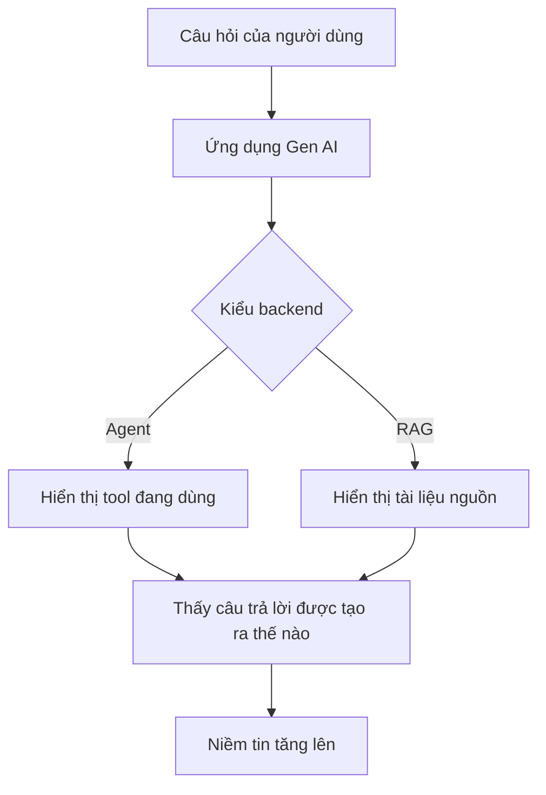

# 🎨 Generative UI/UX với CopilotKit: Giao diện chính là nơi niềm tin bắt đầu

> Nguồn: `077-Generative-UIUX-featuring-CopilotKit.txt` · [Udemy](https://ua.udemy.com/course/langchain/learn/lecture/46421767)

Chào các bạn, Eden đây! Hôm nay mình muốn nói về **user experience (UX) và user interface (UI) trong các ứng dụng generative AI** — phần mà anh em kỹ thuật chúng ta hay... quên.

Xây backend cho ứng dụng Gen AI đã khó, nhưng nó **chỉ là một mảnh ghép**. Để ứng dụng hoàn chỉnh, ta còn cần một **giao diện đẹp** và một **trải nghiệm tự nhiên** khiến người dùng cảm thấy an tâm. Và trong bài này, mình đặc biệt giới thiệu một dự án mình rất tâm đắc: **CopilotKit**.

---

### 🧱 Backend tốt vẫn là chưa đủ

Ta có thể dồn rất nhiều thời gian cho backend: xây agent, xây hệ thống RAG, đảm bảo output trả về người dùng **đúng, đáng tin và chất lượng**. Nhưng giao diện và trải nghiệm lại là câu chuyện khác.

**Niềm tin giữa người dùng và ứng dụng generative AI là thứ ta phải chủ động xây dựng**, bởi vì người dùng biết rõ các ứng dụng Gen AI... nói thẳng ra là **"flaky" (thất thường)** — không phải lúc nào cũng trả lời đúng, và đôi khi thất bại. Làm điều này cho đúng là một thách thức cực lớn.

**CopilotKit** là một dự án **open source tuyệt vời**, giúp ta bắc cầu qua khoảng cách đó: tạo ra giao diện đẹp, và quan trọng hơn là **trải nghiệm người dùng tự nhiên** cho ứng dụng Gen AI. Theo mình, CopilotKit hiện đang cung cấp **những building block tốt nhất** để xây một **generative UI** đẹp.

---

### 🧭 Minh bạch: chìa khóa của niềm tin

"Generative UI" ở đây ý nói đến **giao diện người dùng của ứng dụng Gen AI dựa trên LLM**. Và để tạo được niềm tin giữa người dùng và hệ thống, ta cần **minh bạch** — người dùng phải biết **câu trả lời đến từ đâu**:

* Nếu là **agent**: agent có những tool nào, đang dùng tool nào để tạo câu trả lời, **vì sao lại chọn tool đó**, cùng những bước suy luận và tính toán trung gian trước khi ra kết quả cuối. Người dùng sẽ thấy **câu trả lời cuối được "chưng cất" như thế nào**.
* Nếu là **ứng dụng RAG**: hiển thị rõ **những tài liệu nào đã được dùng để sinh câu trả lời**, để người dùng biết câu trả lời được "neo" vào nguồn nào.

Tất cả những điều này sẽ tạo ra **niềm tin tốt hơn** giữa người dùng và ứng dụng Gen AI của bạn.

| Loại ứng dụng | Cần minh bạch điều gì | Lợi ích |
|---|---|---|
| Agent | Tool đang dùng, lý do chọn tool, các bước suy luận và tính toán trung gian | Người dùng thấy câu trả lời cuối được "chưng cất" thế nào |
| Ứng dụng RAG | Những tài liệu đã được dùng để sinh câu trả lời | Người dùng biết câu trả lời được "neo" vào nguồn nào |

---

### 🧩 CopilotKit & LangGraph: những mảnh ghép vừa vặn

Các demo mình nhắc trong bài đều lấy từ **tài liệu của CopilotKit**, tất cả đều open source. Theo mình, họ đang **tiên phong** trong lĩnh vực generative UI và generative UX. Trong repository của họ có sẵn các **starter kit** để bạn implement frontend đẹp cho backend Gen AI của mình.

*Đây không phải khóa học full stack, nên mình chỉ giới thiệu ở mức khái niệm.* Nhìn chung, CopilotKit cung cấp một bộ **components và hooks** dùng ở frontend, giúp việc xây generative UI và UX tốt trở nên cực kỳ dễ dàng — trên nền các ứng dụng **LangChain hoặc LangGraph**.

Điểm mình muốn nhấn mạnh là **khả năng hỗ trợ LangChain/LangGraph**: họ giới thiệu **co-agents** tích hợp mượt mà với backend LangGraph. Khi chạy một ứng dụng LangGraph, có **rất nhiều thứ chuyển động cùng lúc**:

1. **State** thay đổi liên tục, với các **kết quả trung gian** nằm trong đó.
2. Các **node** đang thực thi — thậm chí **chạy song song**.
3. **Human-in-the-loop**: dừng graph để lấy input người dùng, rồi **resume** (chạy tiếp).

Xây frontend cho đống này nghe như... ác mộng. Nhưng CopilotKit đã làm rất tốt: **implement sẵn component cho tất cả những thứ mình vừa kể**, và tích hợp với LangGraph cực kỳ dễ. Video của **Ariel** từ CopilotKit (mình có để link trong bài giảng) demo điều này rất đẹp mắt.

---

### 💙 Một lời nói thật lòng

Mình cần nói rõ: **mình không có bất kỳ liên kết nào với CopilotKit cả** — không được tài trợ, không affiliate gì hết. Mình thật sự tin đây là một dự án tốt, và họ đang làm rất tuyệt vời trong lĩnh vực generative UI.

### 🎯 Tự kiểm tra nhanh

**Câu 1:** Vì sao backend tốt vẫn chưa đủ?

<b>Xem đáp án</b>

**Đáp án:** Vì người dùng còn cần giao diện đẹp và trải nghiệm tự nhiên để thật sự tin và dùng sản phẩm.

Giải thích: Niềm tin là thứ phải chủ động xây, vì người dùng biết ứng dụng Gen AI hay "flaky".

Tham chiếu: Mục Backend tốt vẫn là chưa đủ.

**Câu 2:** "Generative UI" trong bài được hiểu là gì?

<b>Xem đáp án</b>

**Đáp án:** Giao diện người dùng của ứng dụng Gen AI dựa trên LLM.

Giải thích: Trọng tâm là UI/UX cho chính các ứng dụng generative AI.

Tham chiếu: Mục Minh bạch: chìa khóa của niềm tin.

**Câu 3:** Với một ứng dụng RAG, cần minh bạch điều gì?

<b>Xem đáp án</b>

**Đáp án:** Hiển thị rõ những tài liệu nào đã được dùng để sinh câu trả lời.

Giải thích: Người dùng cần biết câu trả lời được "neo" vào nguồn nào.

Tham chiếu: Mục Minh bạch: chìa khóa của niềm tin.

**Câu 4:** CopilotKit cung cấp gì cho frontend?

<b>Xem đáp án</b>

**Đáp án:** Một bộ components và hooks giúp xây generative UI/UX trên nền LangChain hoặc LangGraph.

Giải thích: Có sẵn starter kit trong repository để tham khảo.

Tham chiếu: Mục CopilotKit & LangGraph.

**Câu 5:** Khi chạy ứng dụng LangGraph, những thứ "chuyển động" nào đã được CopilotKit xử lý sẵn?

<b>Xem đáp án</b>

**Đáp án:** State thay đổi liên tục với kết quả trung gian, các node thực thi (có thể song song), và human-in-the-loop dừng rồi resume graph.

Giải thích: Đây chính là phần frontend mà CopilotKit implement sẵn cho LangGraph.

Tham chiếu: Mục CopilotKit & LangGraph.

Nếu các bạn đang xây ứng dụng Gen AI và muốn người dùng thật sự tin rồi dùng sản phẩm của mình, hãy dành thời gian cho **giao diện và trải nghiệm** — vì backend giỏi thôi chưa đủ để thắng. Hẹn gặp lại các bạn ở bài tiếp theo nhé! 🚀

## Nguồn tham khảo

- [Udemy — Generative UI/UX featuring CopilotKit](https://ua.udemy.com/course/langchain/learn/lecture/46421767)
- [CopilotKit Documentation](https://docs.copilotkit.ai/)
- [LangChain Docs — CopilotKit integration](https://docs.langchain.com/oss/python/langchain/frontend/integrations/copilotkit)
