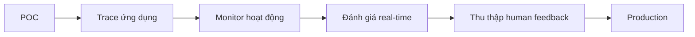

# 🎓 LangChain Academy: Kho khóa học miễn phí từ chính đội ngũ LangChain

> Nguồn: `078-Official-LangChain-Academy-Courses.txt` · [Udemy](https://ua.udemy.com/course/langchain/learn/lecture/47459213)

Chào các bạn, Eden đây! Trong bài này mình muốn giới thiệu một tài nguyên cực kỳ chất lượng mà **đội ngũ LangChain đã chính thức tuyển chọn** cho cộng đồng: **LangChain Academy**.

Nếu bạn đã học xong khóa này và muốn đào sâu hơn vào hệ sinh thái LangChain — đặc biệt là LangSmith — thì đây là điểm đến tiếp theo mình khuyên các bạn ghé thăm.

---

### 🗺️ LangChain Academy là gì?

Trên **website LangChain**, vào mục **Resources**, các bạn sẽ thấy **LangChain Academy**. Đây là một **tập hợp các khóa học online miễn phí**, cung cấp thông tin giá trị về cách sử dụng và xây dựng trên hệ sinh thái LangChain.

Cách tham gia rất đơn giản: đăng nhập tài khoản, **enroll miễn phí**, và bạn sẽ thấy các **video lesson** được chia theo section ở cột bên trái — giống hệt trải nghiệm bạn đang xem ở khóa này.

Trong video, mình cũng mở luôn trang khóa học để các bạn thấy tận mắt: chỉ cần **sign in**, bấm **enroll** là vào học được ngay, không mất phí. Toàn bộ video được sắp xếp theo từng section rõ ràng ở thanh bên trái.

---

### 🔍 Khóa LangSmith: con đường từ POC lên production

Trong khóa học của mình, mình chỉ giới thiệu **những nét chính (the gist) của LangSmith**, chứ không đi sâu — và thật ra **sản phẩm LangSmith còn rất nhiều chiều sâu** về **tracing (theo dõi luồng chạy), monitoring (giám sát) và evaluating (đánh giá)** các ứng dụng LLM. Các bạn có thể học đầy đủ hơn trong **khóa LangSmith** ở LangChain Academy.

Mình đánh giá đây là khóa rất tốt nếu bạn muốn **đưa ứng dụng từ POC (proof of concept) tới production**. Bởi vì muốn làm được điều đó, bạn phải:

1. **Trace** ứng dụng của mình.
2. **Monitor** nó.
3. **Đánh giá theo thời gian thực (real-time evaluation)**.
4. Và **thu thập phản hồi từ người dùng (human feedback)**: câu trả lời sinh ra tốt hay chưa tốt?

Khóa học này đưa ra phần giới thiệu rất tốt về cách dùng dịch vụ LangSmith để làm tất cả những việc trên. Theo mình, **LangSmith hiện là một trong những sản phẩm tốt nhất — nếu không muốn nói là tốt nhất — cho tracing, observability và monitoring ứng dụng LLM**. Điều này cũng không làm mình ngạc nhiên, vì LangChain đang là những người dẫn đầu hệ sinh thái này, ít nhất theo cách mình nhìn nhận.

| Khía cạnh | Khóa này | Khóa LangSmith trên Academy |
|---|---|---|
| Nội dung LangSmith | Giới thiệu "the gist" | Đi sâu tracing, monitoring, evaluating |
| Mục tiêu | Nắm hệ sinh thái LangChain | Đưa ứng dụng từ POC tới production |
| Học liệu | Bài giảng trong khóa | Video kèm resources và GitHub repository |

---

### 📦 Học liệu đi kèm và đôi lời đánh giá

Điểm mình thích: **mọi video đều đi kèm tài nguyên (resources) có thể dùng và tải về**, cùng các **GitHub repository** để bạn chạy thử local hoặc trong notebook.

Mình thật sự khuyên các bạn dành thời gian cho LangChain Academy — nội dung được **biên tập kỹ lưỡng và sản xuất chỉn chu**. Xin gửi lời khen tới đội ngũ LangChain vì đã làm rất tốt phần việc này.

### 🎯 Tự kiểm tra nhanh

**Câu 1:** LangChain Academy nằm ở đâu trên website LangChain?

<b>Xem đáp án</b>

**Đáp án:** Trong mục **Resources**.

Giải thích: Đây là nơi đội ngũ LangChain tuyển chọn các khóa học chính thức.

Tham chiếu: Mục LangChain Academy là gì.

**Câu 2:** Chi phí tham gia LangChain Academy là bao nhiêu?

<b>Xem đáp án</b>

**Đáp án:** Miễn phí — chỉ cần sign in và enroll.

Giải thích: Video được chia theo section ở cột bên trái giống trải nghiệm Udemy.

Tham chiếu: Mục LangChain Academy là gì.

**Câu 3:** Khóa LangSmith trên Academy giúp gì?

<b>Xem đáp án</b>

**Đáp án:** Học đầy đủ về tracing, monitoring, evaluating — và đưa ứng dụng từ POC tới production.

Giải thích: Trong khóa của mình, Eden chỉ giới thiệu "the gist" của LangSmith.

Tham chiếu: Mục Khóa LangSmith.

**Câu 4:** Bốn việc cần làm để đưa ứng dụng từ POC tới production là gì?

<b>Xem đáp án</b>

**Đáp án:** Trace, monitor, đánh giá theo thời gian thực, và thu thập phản hồi từ người dùng.

Giải thích: Khóa LangSmith hướng dẫn dùng dịch vụ để làm cả bốn việc này.

Tham chiếu: Mục Khóa LangSmith.

**Câu 5:** Học liệu của Academy có điểm gì đáng chú ý?

<b>Xem đáp án</b>

**Đáp án:** Mọi video đều đi kèm tài nguyên dùng/tải được và GitHub repository để chạy local hoặc trong notebook.

Giải thích: Nội dung được biên tập kỹ lưỡng và sản xuất chỉn chu.

Tham chiếu: Mục Học liệu đi kèm và đôi lời đánh giá.

*Và đừng quên: đây chỉ là một trong số các khóa học miễn phí của LangChain Academy — các bạn có thể khám phá thêm nhiều chủ đề khác trong hệ sinh thái.* Hãy học khi bạn thật sự cần, đừng biến nó thành áp lực nhé. Hẹn gặp các bạn ở bài tiếp theo! 🚀

## Nguồn tham khảo

- [Udemy — Official LangChain Academy Courses](https://ua.udemy.com/course/langchain/learn/lecture/47459213)
- [LangChain Academy](https://academy.langchain.com/)
