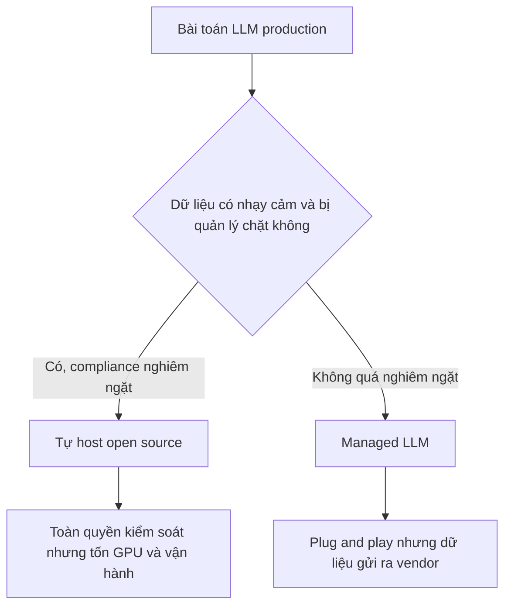

# ⚔️ Open Source LLM vs Managed LLM: Doanh nghiệp nên chọn bên nào?

> Nguồn: `079-Open-Source-LLMs-VS-Managed-LLM-Providers-Deepseek.txt` · [Udemy](https://ua.udemy.com/course/langchain/learn/lecture/48369147)

Chào các bạn, Eden đây! Hôm nay mình muốn giải đáp một câu hỏi mình nhận được rất nhiều: **khi đưa LLM lên production, nên dùng open source LLM (như Deepseek, Llama 3.2) hay managed LLM (như GPT-4o mini của OpenAI, Sonnet của Anthropic, hay Google Gemini)?**

Góc nhìn của mình ở đây là **góc nhìn của một tổ chức doanh nghiệp (enterprise)** và mình khuyên họ nên làm gì. Tất nhiên, **không có giải pháp "one size fits all"** — mỗi use case cần được cân nhắc độc lập. Đây chỉ là ý kiến chung của mình.

---

### ⚠️ Một disclaimer không thể bỏ qua

Mình **không phải luật sư** và **đây không phải lời khuyên pháp lý**. Các bạn nên tham vấn **đội ngũ pháp lý và privacy** trước khi tích hợp bất kỳ giải pháp LLM nào vào doanh nghiệp, vì có rất nhiều quy định mình không biết hết, và chủ đề **data retention (lưu trữ dữ liệu)** và **privacy (quyền riêng tư)** cực kỳ nhạy cảm.

Mình cũng **không đại diện cho vendor LLM nào**. Mỗi vendor đều có **EULA (end user license agreement)** với điều khoản dịch vụ quy định cách họ xử lý dữ liệu của bạn — hãy đọc kỹ. Mình chỉ đưa ra "2 xu" quan điểm, các bạn hãy **tự nghiên cứu** và xem mọi thứ trong bài với một chút hoài nghi nhé.

---

### 🌱 Open source LLM: những điểm sáng thật sự

Đầu tiên, phải công nhận: **tính đến thời điểm này (ít nhất là năm 2025), các open source model đã tiến rất xa và trở nên khá tốt**. Điển hình như **Deepseek** — đạt kết quả ấn tượng trên benchmark và **có thể vượt qua cả managed model**. Trong tương lai, việc ngày càng nhiều open source model vượt mặt managed LLM là điều **không thể tránh khỏi**.

Những lợi thế được nhắc đến nhiều nhất của open source:

* **Tiết kiệm chi phí:** model miễn phí, đôi khi rẻ hơn khi vận hành vì nhỏ hơn các model độc quyền. *(Nhưng mình đặt dấu hỏi lớn ở đây — xem phần dưới.)*
* **Tùy biến:** doanh nghiệp có thể **fine-tune (tinh chỉnh) model cho tác vụ hoặc domain cụ thể**, thậm chí vượt qua các model đa dụng độc quyền.
* **Kiểm soát và quyền riêng tư:** đây là lợi thế lớn nhất. Công ty có thể **host model trên server nội bộ**, dữ liệu **không rời khỏi hạ tầng của mình**, giữ an toàn và riêng tư. Điều này đặc biệt đúng với các ngành bị quản lý chặt như **ngân hàng, bệnh viện hay tổ chức xử lý dữ liệu sức khỏe** — những nơi chịu compliance và quy định nặng nề.

---

### 🚧 Nhưng sự thật về chi phí thì không "màu hồng"

Theo mình, **"tiết kiệm chi phí" không thật sự đúng**. Model thì miễn phí, bạn có thể chạy local trên máy mình — nhưng **triển khai nó để phục vụ khách hàng ở quy mô lớn lại là bài toán cực khó**:

1. Phải xử lý availability, durability, scalability và đủ loại "-ility" khác.
2. Phải lo security và vô số thứ khác.
3. Nhiệm vụ của bạn bị "chệch hướng": từ **phát triển ứng dụng LLM** thành **vận hành một LLM model phục vụ khách hàng** — tức là đẩy hết trách nhiệm về phía operations.

Có người sẽ nói: vậy dùng **managed service host sẵn open source model, ví dụ Groq**. Đúng là được — nhưng khi đó bạn **mất luôn phần lớn lợi ích của open source**, vì điều bạn muốn là model nằm trên server của mình để riêng tư và kiểm soát nội dung sinh ra. Dùng service bên ngoài nghĩa là mất điều đó.

Về giá: tự deploy thì tốn kém — **compute và GPU** để phục vụ model, tiền lương **engineer** để deploy, **đội operations** để vận hành và monitoring. Còn nếu dùng managed service như Groq, **giá không thật sự hấp dẫn và chẳng rẻ hơn bao nhiêu** so với managed LLM độc quyền từ OpenAI, Anthropic, Google. Và xu hướng của các model first-party là **ngày càng tốt hơn, nhanh hơn và rẻ hơn theo thời gian**.

---

### ☁️ Managed LLM: ưu điểm và "con voi trong phòng"

Vậy còn managed LLM thì sao? Những lợi thế rõ ràng:

* **Dễ dùng, tích hợp đơn giản**, không phải lo deployment → **giảm time-to-market**, chỉ cần "plug and play".
* **Đáng tin cậy và có hỗ trợ chuyên nghiệp**: vendor cung cấp support, cập nhật và tối ưu liên tục.
* **Compliance:** phần lớn LLM đã **tuân thủ SOC 2 và HIPAA**; mỗi vendor đều có thể cho bạn biết họ compliant với những tiêu chuẩn nào.
* **Hiệu năng:** managed LLM của các ông lớn thường rất tốt và cho kết quả chất lượng cao.

Còn **"con voi trong phòng"**: gửi dữ liệu nhạy cảm cho bên thứ ba có thể không phù hợp với mọi tổ chức. Nhưng thực tế, **rất nhiều tổ chức đã ở trên cloud** — database của họ đã nằm trên AWS hay Google Cloud, dữ liệu vốn đã ở đó rồi. Vậy tại sao việc gửi prompt cho vendor lại đáng sợ đến thế?

Ví dụ: **Anthropic có model trên cả AWS Bedrock và Google Cloud** — khách hàng deploy trên những cloud đó có thể dùng dịch vụ ngay tại đó, dữ liệu vẫn ở trên cloud. Nếu bạn dùng **Gemini của Google** và đã deploy trên **Google Cloud**, thì việc này **chẳng khác gì dùng thêm một database hay một managed service khác**.

Cuối cùng, về **fine-tuning**: bạn hoàn toàn có thể fine-tune model độc quyền và các vendor đều cung cấp tính năng này. Nhưng cá nhân mình **không phải fan của fine-tuning**, vì đa số trường hợp **ta không thật sự cần** — nó chỉ làm tốn thời gian tạo dataset và compute để train. Với các model hiện đại ngày nay, chỉ cần **prompt đúng và một vài few-shot example**, ta đã đạt kết quả tuyệt vời mà không cần fine-tune. *(Nếu các bạn muốn mình làm một video đào sâu chủ đề này, hãy cho mình biết nhé!)*

| Tiêu chí | Open source LLM | Managed LLM |
|---|---|---|
| Chi phí | Model miễn phí nhưng tốn GPU, engineer và ops; qua managed service thì giá không rẻ hơn đáng kể | Trả theo token; model first-party ngày càng tốt hơn, nhanh hơn, rẻ hơn |
| Tùy biến | Fine-tune cho tác vụ hoặc domain cụ thể | Có hỗ trợ fine-tuning nhưng mình không khuyên dùng |
| Kiểm soát và privacy | Host nội bộ, dữ liệu không rời hạ tầng — lợi thế lớn nhất | Dữ liệu gửi cho vendor; nhiều model đã có trên AWS Bedrock, Google Cloud |
| Vận hành | Tự lo availability, durability, scalability, security | Không phải lo deployment, plug and play |
| Compliance | Tự chứng minh với cơ quan quản lý | Phần lớn đã tuân thủ SOC 2 và HIPAA |

### 🎯 Tự kiểm tra nhanh

**Câu 1:** Vì sao "tiết kiệm chi phí" của open source không thật sự đúng?

<b>Xem đáp án</b>

**Đáp án:** Vì triển khai phục vụ khách hàng ở quy mô lớn rất khó — tốn GPU, engineer và đội ops; còn dùng managed service host open source thì giá không rẻ hơn đáng kể.

Giải thích: Nhiệm vụ bị "chệch hướng" từ phát triển ứng dụng sang vận hành model.

Tham chiếu: Mục Nhưng sự thật về chi phí.

**Câu 2:** Lợi thế lớn nhất của open source theo bài là gì?

<b>Xem đáp án</b>

**Đáp án:** Kiểm soát và quyền riêng tư — host model trên server nội bộ, dữ liệu không rời hạ tầng.

Giải thích: Đặc biệt quan trọng với ngân hàng, bệnh viện, tổ chức xử lý dữ liệu sức khỏe.

Tham chiếu: Mục Open source LLM.

**Câu 3:** Vì sao dùng Groq — managed service host open source — lại làm mất lợi ích?

<b>Xem đáp án</b>

**Đáp án:** Vì điều bạn muốn là model nằm trên server của mình để riêng tư và kiểm soát nội dung sinh ra; dùng service bên ngoài là mất điều đó.

Giải thích: Bạn không còn toàn quyền với dữ liệu và model nữa.

Tham chiếu: Mục Nhưng sự thật về chi phí.

**Câu 4:** "Con voi trong phòng" của managed LLM được phản biện thế nào?

<b>Xem đáp án</b>

**Đáp án:** Nỗi lo gửi dữ liệu nhạy cảm cho bên thứ ba — nhưng rất nhiều tổ chức đã ở trên cloud, và Anthropic có model trên AWS Bedrock lẫn Google Cloud, dữ liệu vốn đã ở đó.

Giải thích: Nếu bạn đã deploy trên Google Cloud, dùng Gemini chẳng khác gì thêm một managed service khác.

Tham chiếu: Mục Managed LLM.

**Câu 5:** Quan điểm của mình về fine-tuning là gì?

<b>Xem đáp án</b>

**Đáp án:** Không phải fan — đa số trường hợp không thật sự cần; chỉ cần prompt đúng và vài few-shot example là đã đạt kết quả tốt.

Giải thích: Fine-tuning tốn thời gian tạo dataset và compute để train.

Tham chiếu: Mục Managed LLM.

Chọn open source hay managed không có đáp án chung — hãy nhìn vào mức độ nhạy cảm dữ liệu, yêu cầu compliance, nguồn lực vận hành và bài toán cụ thể của mình. Hẹn gặp các bạn ở bài sau! 🚀

## Nguồn tham khảo

- [Udemy — Open Source LLMs VS Managed LLM Providers (Deepseek)](https://ua.udemy.com/course/langchain/learn/lecture/48369147)
- [DeepSeek — open source models trên GitHub](https://github.com/deepseek-ai/DeepSeek-R1)
- [AWS Docs — Anthropic Claude models on Amazon Bedrock](https://docs.aws.amazon.com/bedrock/latest/userguide/model-cards-anthropic.html)
