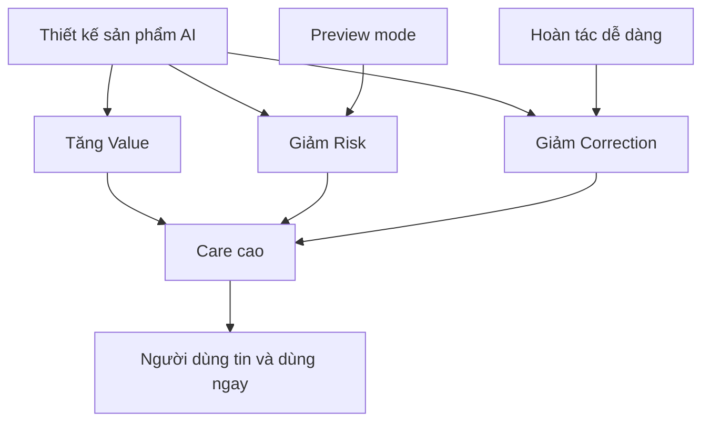

# 💡 Vì sao sản phẩm AI thành công? Công thức "Care" của Assaf Elovic & Harrison Chase

> Nguồn: `080-Confidence-in-AI-Results-By-Assaf-Elovic-Harrison-Chase.txt` · [Udemy](https://ua.udemy.com/course/langchain/learn/lecture/50890333)

Chào các bạn, Eden đây! Các bạn có bao giờ tự hỏi vì sao **một số sản phẩm AI "cất cánh" và ai cũng dùng**, trong khi những sản phẩm khác — dù công nghệ thật sự ấn tượng — lại chẳng ai mặn mà?

Hóa ra **"công thức bí mật" thường ít liên quan đến độ chính xác siêu phàm hay độ phức tạp kỹ thuật của AI** hơn ta tưởng. Hai người bạn của mình là **Assaf Elovic và Harrison Chase** đã viết một bài rất hay về điều này, và hôm nay mình muốn tóm tắt lại cho các bạn.

---

### 🧠 Bí mật không nằm ở model

Theo Assaf và Harrison, thứ thật sự tạo nên khác biệt là **"care" (sự quan tâm/chăm sóc)** — nghĩa là **niềm tin (confidence) vào kết quả của AI**. Đây không phải một ý tưởng "mềm" cho có: **bạn hoàn toàn có thể đo lường được mức độ care của sản phẩm mình**, biết nó thay đổi ra sao và chủ động cải thiện nó.

Và thẳng thắn mà nói, đây chính là **yếu tố quyết định thành bại của sản phẩm AI**. Dù "dưới nắp capo" có tuyệt vời đến đâu, việc khiến người ta chịu dùng một thứ gì đó **xoay quanh việc vượt qua nỗi sợ và xây dựng niềm tin**. Người dùng phải **cảm thấy thoải mái** khi dùng AI thì mới thật sự "nhảy vào".

---

### 🧮 Giải phẫu công thức Care

Vậy làm sao biết được mức độ care? Care cơ bản là **những điều tốt đẹp người dùng nhận được, so với những rắc rối họ gặp phải**. Công thức:

**Care = Value ÷ (Risk × Correction)**

Ba thành tố:

1. **Value (Giá trị):** những điều tốt mà người dùng nhận được khi AI làm đúng việc. Nó **tiết kiệm thời gian**? **Tiết kiệm tiền**? Hay **giúp họ tạo ra thứ gì đó mới**?
2. **Risk (Rủi ro):** điều gì xảy ra nếu AI sai? Nếu AI làm hỏng việc, đó chỉ là **chuyện phiền nhỏ** hay có thể gây **hậu quả lớn**?
3. **Correction (Công sức sửa chữa):** người dùng phải bỏ bao nhiêu công để sửa sai cho AI? **Có khó hoàn tác không**? Phải **làm lại từ đầu**, hay chỉ cần **bấm nút "lùi lại"** đơn giản?

Khi care cao, người ta háo hức và dùng ngay. Khi care thấp, **không ai dùng cả**. Rõ ràng và đơn giản.

Điểm cực kỳ quan trọng: **care phần lớn đến từ cách thiết kế sản phẩm, chứ không chỉ từ việc model AI tốt đến đâu**. Tất nhiên, nếu AI cứ thất bại liên tục thì **value = 0 và care sụp đổ**. Nhưng câu chuyện ở đây là những thứ mà **đội product có thể chủ động kiểm soát: mức rủi ro và độ dễ sửa chữa**.

---

### 🖱️ Case study: Cursor

Nhìn vào **Cursor** — trình soạn thảo code tích hợp AI đã trở nên vô cùng phổ biến — các bạn sẽ thấy công thức này vận hành.

Sinh code bằng AI nghe có vẻ **rủi ro**, đúng không? Một gợi ý tồi có thể làm hỏng thứ gì đó rất quan trọng. Nhưng Cursor đã thiết kế trải nghiệm để bạn **cảm thấy tự tin tối đa** khi dùng ý tưởng của nó:

* **Risk thấp:** code xuất hiện **ngay trong editor của bạn**, nó **không tự động thay đổi hệ thống đang chạy**.
* **Correction thấp:** nếu gợi ý không tốt, bạn chỉ cần **xóa hoặc gõ đè lên** — sửa cực dễ.
* **Value cao:** lập trình viên **tiết kiệm lượng thời gian và "năng lượng não" khổng lồ**.

Vậy care = cao ÷ (thấp × thấp) = **rất cao**. Đây đơn thuần là **thiết kế sản phẩm thông minh**.

Thử tưởng tượng Cursor **tự động lưu thay đổi trực tiếp vào nhánh main của repo** xem: risk sẽ **cao ngất**, kể cả khi có cách dễ dàng để revert về phiên bản cũ — và **care sẽ thấp hơn hẳn**. Điều này cho thấy tầm quan trọng của việc **tách "thử nghiệm" khỏi "đưa lên chạy thật"**.

Các công cụ sáng tạo như **Jasper** cũng vận hành tương tự: nó khiến mình cảm thấy mình là **người trợ lý đang làm chủ** — bạn nhận được ý tưởng, nhưng **bạn là người có tiếng nói cuối cùng**. Điều đó giữ **risk và correction thấp**, và cho bạn **care cao**.

---

### 📋 Monday.com và bài học về "Preview Mode"

Giờ hãy nhìn vào **monday.com** và các tính năng AI của họ. **AI block** của họ có thể **tự động làm mọi thứ và thay đổi board của bạn**.

Vấn đề: board thường giống như **trái tim của công ty**, chứa thông tin quan trọng về cách công việc được vận hành. **Rủi ro trung bình** cộng với **automation sai** có thể làm **hỏng timeline dự án, gửi sai thông tin**, hoặc làm hỏng những thứ liên quan vì **các board liên kết với nhau**. Còn việc **sửa sai** có thể buộc bạn phải **lục tìm khắp nơi để tìm ra thay đổi tự động và gỡ thủ công từng cái**.

*Đổi lại, tự động hóa các việc nhàm chán giúp đội nhóm tiết kiệm rất nhiều thời gian.* Care ở đây = cao ÷ (trung bình × trung bình) = **mức trung bình (medium)**. Chính kiểu care "lưng chừng" này giải thích vì sao người ta **chần chừ** — nhất là với những board dùng cho việc cực kỳ quan trọng. Người dùng phải **phê duyệt những thay đổi mà họ chưa chắc chắn**, trước khi thấy chính xác mọi thứ sẽ diễn ra thế nào.

Giải pháp chính: **thêm chế độ xem trước (preview mode)**. Cho người dùng **thấy chính xác AI sẽ thay đổi những gì trước khi nó thực sự làm**. Chỉ một thay đổi đó đã giảm **risk từ trung bình xuống thấp**, và care mới = cao ÷ (thấp × trung bình) = **cao**. Người dùng tự tin hơn, và nhiều người sẽ dùng hơn.

Đặc biệt ấn tượng: **tất cả những điều này không cần đổi model AI** — chỉ là thay đổi cách thiết kế sản phẩm. Những ý tưởng kiểu này cực kỳ quan trọng ở các lĩnh vực rủi ro cao như **tiền bạc hay sức khỏe**.

| Sản phẩm | Risk | Correction | Value | Care |
|---|---|---|---|---|
| Cursor | Thấp — code nằm trong editor, không tự đổi hệ thống đang chạy | Thấp — xóa hoặc gõ đè là xong | Cao — tiết kiệm thời gian và "năng lượng não" | Rất cao |
| Monday.com AI block | Trung bình — board là trái tim công ty, các board liên kết nhau | Trung bình — phải lục tìm và gỡ thủ công từng thay đổi | Cao — tự động hóa việc nhàm chán | Trung bình; thêm preview mode thì risk giảm và care tăng |

### 🎯 Tự kiểm tra nhanh

**Câu 1:** "Care" trong bài thật ra đo điều gì?

<b>Xem đáp án</b>

**Đáp án:** Niềm tin (confidence) của người dùng vào kết quả AI — những điều tốt họ nhận được so với rắc rối họ gặp phải.

Giải thích: Đây là yếu tố quyết định thành bại của sản phẩm AI, và đo lường được.

Tham chiếu: Mục Bí mật không nằm ở model.

**Câu 2:** Công thức tính care là gì?

<b>Xem đáp án</b>

**Đáp án:** **Care = Value ÷ (Risk × Correction).**

Giải thích: Value càng cao, Risk và Correction càng thấp thì care càng lớn.

Tham chiếu: Mục Giải phẫu công thức Care.

**Câu 3:** Vì sao Cursor có care rất cao?

<b>Xem đáp án</b>

**Đáp án:** Risk thấp (code nằm trong editor, không tự đổi hệ thống), Correction thấp (xóa hoặc gõ đè), Value cao (tiết kiệm thời gian và năng lượng não).

Giải thích: Đây là thiết kế sản phẩm thông minh, không phải model siêu việt.

Tham chiếu: Mục Case study: Cursor.

**Câu 4:** Điều gì khiến care của Monday.com chỉ ở mức trung bình?

<b>Xem đáp án</b>

**Đáp án:** Board là trái tim công ty và liên kết với nhau, nên automation sai gây hậu quả; còn sửa sai phải lục tìm khắp nơi và gỡ thủ công từng thay đổi.

Giải thích: Risk trung bình × Correction trung bình → care trung bình, người dùng chần chừ.

Tham chiếu: Mục Monday.com và bài học về Preview Mode.

**Câu 5:** Giải pháp preview mode cải thiện care như thế nào?

<b>Xem đáp án</b>

**Đáp án:** Cho người dùng thấy chính xác AI sẽ thay đổi gì trước khi làm — giảm Risk từ trung bình xuống thấp, kéo care lên cao.

Giải thích: Chỉ đổi trải nghiệm sản phẩm, không cần đổi model AI.

Tham chiếu: Mục Monday.com và bài học về Preview Mode.

Hãy ghi nhớ công thức care khi thiết kế sản phẩm AI của mình — đôi khi **giảm rủi ro và giúp người dùng sửa lỗi dễ hơn** lại là đòn bẩy mạnh nhất. Hẹn gặp các bạn ở bài sau! 🚀

## Nguồn tham khảo

- [Udemy — Confidence in AI Results By Assaf Elovic & Harrison Chase](https://ua.udemy.com/course/langchain/learn/lecture/50890333)
- [LangChain Blog — The Hidden Metric That Determines AI Product Success](https://www.langchain.com/blog/the-hidden-metric-that-determines-ai-product-success)
