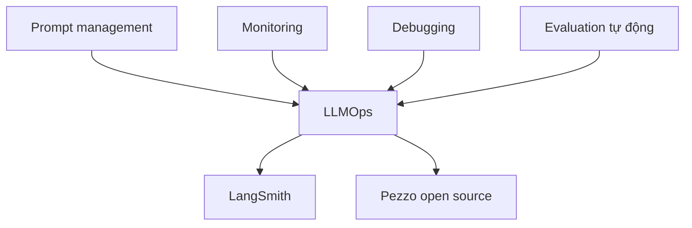

# 🎓 Hoàn thành khóa học rồi! Bước tiếp theo của bạn là gì?

> Nguồn: `082-Finished-course-Whats-next.txt` · [Udemy](https://ua.udemy.com/course/langchain/learn/lecture/39902390)

Chào các bạn, Eden đây! Cảm ơn bạn đã đồng hành cùng mình đến tận đây. *Nếu thấy khóa học hữu ích, các bạn dành chút thời gian viết cho mình một review trên Udemy nhé — điều đó giúp mình rất nhiều.*

Trong bài cuối này, mình muốn **nhìn lại toàn bộ hành trình chúng ta đã đi qua** và quan trọng hơn là **chỉ cho các bạn con đường phía trước** trong sự nghiệp phát triển ứng dụng LLM.

---

### 🔍 Nhìn lại: hai pattern quan trọng nhất

Ý tưởng chính của khóa học là mang đến cho các bạn **một phần giới thiệu kỹ lưỡng về phát triển ứng dụng LLM**. Chúng ta đã đi qua **hai pattern cực kỳ quan trọng**:

1. **Agents:** tận dụng **khả năng suy luận của LLM** để tạo ra các agent **thực thi hành động phi tất định (non-deterministic)**.
2. **Retrieval augmentation:** dùng **vector store, semantic search và embeddings** để **chat trên chính dữ liệu độc quyền của bạn**.

Mọi ứng dụng LLM đều đang dùng pattern này, pattern kia, hoặc đơn giản là **gọi LLM trực tiếp**. Và giờ các bạn đã có đủ công cụ để tự tay tạo ra chúng.

---

### 🚧 Khi "chạy được" chưa đủ: bốn bài toán mới

Nếu theo dõi khóa học, bạn sẽ nhận ra **phát triển ứng dụng LLM không hề đơn giản**. Ví dụ:

* Viết ra **prompt hoàn hảo** để có phản hồi tốt nhất từ LLM **đòi hỏi nhiều công sức và thời gian**.
* Lỡ LLM thay đổi khiến prompt **không còn hoạt động như mong đợi** thì sao?
* Muốn thử **LLM khác nhanh hơn, rẻ hơn, hoặc bảo mật hơn** thì bạn sẽ phải **điều chỉnh lại prompt** cho model mới.

Chính vì vậy **prompt management (quản lý prompt)** là bài toán rất quan trọng. Bên cạnh đó:

1. **Monitoring (giám sát):** tốc độ phản hồi, **latency (độ trễ)** là bao nhiêu, **mỗi request tốn bao nhiêu tiền** và ta phải trả vendor bao nhiêu.
2. **Debugging (gỡ lỗi):** khi có gì đó sai, làm sao hiểu **vì sao LLM không trả về phản hồi đúng** — việc này cực kỳ thách thức khi làm với **agents**.
3. **Evaluation (đánh giá):** làm sao biết phản hồi nhận được là tốt? Ta cần **công cụ tự động hóa**, vì **đánh giá thủ công tốn rất nhiều thời gian và không thể mở rộng (doesn't scale)**.

Tất cả những bài toán này được gom vào một lĩnh vực đang tiến hóa: **LLMOps (LLM operations)**.

---

### 🛠️ LLMOps: LangSmith và Pezzo

Có nhiều công cụ phổ biến giúp làm LLMOps tốt hơn. Một trong những cái tên nổi tiếng nhất là **LangSmith của LangChain** — một **nền tảng hợp nhất (unified platform)** giúp developer **xây dựng ứng dụng LLM đạt chuẩn production**. Nó hỗ trợ **debugging, testing, evaluating và monitoring**, giúp **vòng đời phát triển nhanh và hiệu quả**.

*Một điểm các bạn cần cân nhắc: LangSmith hiện **không phải open source**.* Nếu bạn muốn **giải pháp open source thay thế**, hãy thử **Pezzo** — hỗ trợ **prompt management, tracing và monitoring** cho hoạt động LLM. Theo mình, các bạn nên ghé thăm Pezzo.

| Tiêu chí | LangSmith | Pezzo |
|---|---|---|
| Bản chất | Nền tảng hợp nhất của LangChain, hiện không open source | Giải pháp open source thay thế |
| Chức năng | Debugging, testing, evaluating, monitoring | Prompt management, tracing, monitoring |
| Khi nào cân nhắc | Muốn hệ sinh thái LangChain đầy đủ | Muốn mã nguồn mở cho hoạt động LLM |

---

### 🔐 Bảo mật LLM và nguồn theo dõi tiếp theo

**Về bảo mật LLM:** trong khóa này chúng ta chưa thật sự nói về chủ đề này. Nhưng có **sự khác biệt lớn giữa phát triển local và deployment lên production**: khi đã có **khách hàng thật sử dụng**, bạn phải đảm bảo ứng dụng của mình **an toàn trước các mối đe dọa (threat safe)**. Điều này rất thách thức vì LLM **mang đến nhiều vector tấn công mới**: **prompt injection**, hay **agents truy cập vào dữ liệu mà chúng không được phép**. Đây là những vấn đề thực tế phải tính đến.

LangChain gần đây cũng đã có **thay đổi lớn về repository**: toàn bộ code **không an toàn, chứa lỗ hổng mới** đã được **chuyển vào thư mục experimental**. Bảo mật là chủ đề quan trọng — có thể vì mình xuất thân từ nền tảng security mà mình nhấn mạnh điều này, nhưng mình tin các bạn nên biết và khám phá, đặc biệt khi làm với LLM.

**Còn nguồn thông tin để theo dõi?** Mình gợi ý hai thứ, và theo mình như vậy là bao quát gần hết:

* **Theo dõi blog của LangChain:** mỗi tuần họ ra blog mới với ý tưởng và cách triển khai mới về Gen AI — nguồn thông tin tuyệt vời để bạn tiếp tục.
* **Tham gia Twitter:** rất nhiều người chia sẻ về nghiên cứu, ứng dụng mới, use case mới và cách tối ưu — tin tức được **stream trực tiếp** về đó.

### 🎯 Tự kiểm tra nhanh

**Câu 1:** Hai pattern quan trọng nhất mà khóa học đã đi qua là gì?

<b>Xem đáp án</b>

**Đáp án:** Agents (tận dụng reasoning để thực thi hành động phi tất định) và retrieval augmentation (vector store, semantic search, embeddings trên dữ liệu riêng).

Giải thích: Mọi ứng dụng LLM đều dùng một trong hai pattern này hoặc gọi LLM trực tiếp.

Tham chiếu: Mục Nhìn lại.

**Câu 2:** Vì sao prompt management lại quan trọng?

<b>Xem đáp án</b>

**Đáp án:** Vì viết prompt hoàn hảo tốn nhiều công sức; LLM thay đổi có thể làm prompt hỏng; đổi model nhanh/rẻ/bảo mật hơn thì phải chỉnh lại prompt.

Giải thích: Prompt không phải viết một lần là xong.

Tham chiếu: Mục Khi "chạy được" chưa đủ.

**Câu 3:** LLMOps bao gồm những bài toán nào?

<b>Xem đáp án</b>

**Đáp án:** Prompt management, monitoring (tốc độ, latency, chi phí mỗi request), debugging và evaluation tự động.

Giải thích: Đánh giá thủ công tốn thời gian và không thể mở rộng.

Tham chiếu: Mục Khi "chạy được" chưa đủ + LLMOps.

**Câu 4:** LangSmith là gì và có điểm gì cần cân nhắc?

<b>Xem đáp án</b>

**Đáp án:** Nền tảng hợp nhất của LangChain hỗ trợ debugging, testing, evaluating, monitoring — nhưng **hiện không phải open source**.

Giải thích: Nếu cần open source, cân nhắc Pezzo.

Tham chiếu: Mục LLMOps: LangSmith và Pezzo.

**Câu 5:** Hai nguồn theo dõi thông tin tiếp theo được gợi ý là gì?

<b>Xem đáp án</b>

**Đáp án:** Theo dõi blog của LangChain và tham gia Twitter.

Giải thích: Blog ra mỗi tuần; Twitter là nơi tin tức được stream trực tiếp.

Tham chiếu: Mục Bảo mật LLM và nguồn theo dõi tiếp theo.

Mình **cập nhật khóa học này thường xuyên**, nên khi có gì mới và quan trọng, mình sẽ bổ sung. Cảm ơn các bạn đã đi hết hành trình cùng mình. Hãy tiếp tục build, tiếp tục thử nghiệm, và **đừng quên để lại review nếu bạn thấy khóa học giá trị** nhé — bạn sẽ giúp khóa học đến được với nhiều người hơn trên khắp thế giới. Chúc các bạn may mắn! 🚀

## Nguồn tham khảo

- [Udemy — Finished course? Whats next!](https://ua.udemy.com/course/langchain/learn/lecture/39902390)
- [LangSmith Observability — Official Docs](https://docs.langchain.com/langsmith/observability)
- [Pezzo — Open-source LLMOps platform](https://github.com/pezzolabs/pezzo/)
- [LangChain Blog](https://www.langchain.com/blog)
