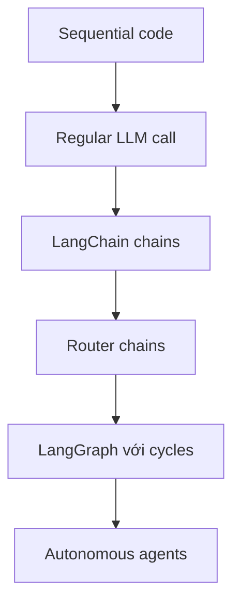

# 🕸️ LangGraph là gì? Khi Agent cần một "chiều không gian" mới để tiến hóa

> Nguồn: `083-What-is-LangGraph.txt` · [Udemy](https://ua.udemy.com/course/langchain/learn/lecture/43592832)

Chào các bạn, Eden đây! Trong bài này, chúng ta sẽ cùng trả lời ba câu hỏi: **LangGraph là gì, vì sao chúng ta cần nó, và nó khác LangChain ở điểm nào?**

Đây là nền tảng lý thuyết quan trọng trước khi bước vào phần thực hành, nên các bạn cứ thư giãn và đi cùng mình nhé.

### 🏗️ LangChain đã đi rất xa — nhưng vẫn có giới hạn

LangChain đã tồn tại được một năm và là một framework tuyệt vời để xây dựng các ứng dụng **generative AI (AI tạo sinh)**. Bạn muốn làm **RAG application** hay thậm chí là **agents** — LangChain đều sẵn sàng hỗ trợ.

Qua thời gian, nó đã trở nên **an toàn hơn, linh hoạt hơn, dễ đọc hơn và dễ dùng hơn**, đặc biệt là nhờ **LangChain Expression Language**. Nhờ tính **composability (khả năng lắp ghép)**, cách chúng ta tương tác với các component của LangChain chưa bao giờ tiện lợi đến thế.

LangChain cũng là framework mã nguồn mở đang **tiên phong (pioneering)** rất nhiều công trình xung quanh agents. Mình đã chỉ cho các bạn cách xây dựng agent và logic đằng sau nó trong khóa LangChain.

Tuy nhiên, chúng ta vẫn có những **giới hạn** khi xây dựng agent bên trong LangChain.

---

### 🧭 Sơ đồ "mức độ tự chủ": Từ code tuần tự đến autonomous agent

Khi ra mắt LangGraph, đội ngũ LangChain đã công bố một sơ đồ minh họa những thách thức khi xây dựng các **complex agentic systems (hệ thống agent phức tạp)**. Hãy hình dung thế này: người ngồi với máy tính là **code**, còn người đang nói chuyện là **LLM**.

* **Đường trên cùng — sequential code (code tuần tự):** đây là **deterministic code (code xác định)**, chỉ đơn giản là chạy và thực thi. Chúng ta — những developer — nắm toàn quyền kiểm soát.
* **Dưới cùng — agents / autonomous agents:** chúng tự quyết định cần làm gì, làm như thế nào rồi cứ thế thực hiện. Đây là nhóm có **độ tự do cao nhất**. *Và thật lòng mà nói, ở thời điểm hiện tại chưa có autonomous agent nào thực sự production-ready hay dùng được.*

Ở giữa hai cực đó, chúng ta có:

* **Regular LLM call:** LLM quyết định output và chúng ta không kiểm soát được nó, nhưng chúng ta quyết định các bước trước và sau. Kiểu ứng dụng này khá đơn giản — ví dụ một công ty **cybersecurity** gửi request cho LLM để giải thích một alert. Hữu ích, nhưng chưa thực sự phức tạp.
* **LangChain chains:** chúng ta có thể có một loạt LLM call và vẫn kiểm soát được những gì xảy ra trước/sau các call đó, nhờ vậy xây được nhiều thứ rất hay.
* **Router chains / router agents:** dùng LLM để quyết định nên gọi cái nào hoặc đi bước nào. Với LangChain Expression Language, việc này khá dễ dàng.

Sơ đồ dưới đây tóm tắt dải phổ đó — càng đi xuống, quyền kiểm soát của developer càng giảm và độ tự do của LLM càng tăng:

---

### ⚠️ "Nút thắt" mang tên Cycles — và lý do LangGraph ra đời

Có một điều mà LangChain Expression Language **không thể làm**: tạo ra **cycles (vòng lặp)**. Chúng ta chỉ có thể viết **acyclic graphs (đồ thị không chu trình)** — một luồng được định sẵn, không thể lặp lại, không thể quay về node ban đầu để bắt đầu lại quy trình.

LangChain có vài implementation cho kiểu này, nhưng chúng đều là **ad hoc (tùy tình huống)** — ví dụ thuật toán **ReAct**, trong source code có hẳn một **while loop**.

| Tiêu chí | LangChain Expression Language | LangGraph |
|---|---|---|
| Loại đồ thị | Acyclic — một chiều, định sẵn | Có cycles — quay lại node trước được |
| Luồng thực thi | Không lặp lại, không quay về điểm bắt đầu | State machine với nodes và edges, LLM quyết định đường đi |
| Mức độ tự do | Hạn chế, cycles phải làm ad hoc | Thêm một chiều tự do cho agent phức tạp |

Đây chính xác là nơi LangGraph bước vào. Nó cho chúng ta thêm một chiều tự do và độ phức tạp để đưa vào agent: **implement cycles**. Tính năng này cực kỳ quan trọng khi muốn xây những agent rất phức tạp, có mức độ tự do mà trước đây chúng ta chưa từng quen.

Khái niệm này gắn liền với **flow engineering (kỹ thuật thiết kế luồng)**: developer định nghĩa flow của chương trình, còn LLM giúp quyết định nên đi đâu trong flow — đi flow A hay flow B, kết thúc, hay quay lại điểm bắt đầu và tiếp tục từ đó. Cycles mang lại rất nhiều tự do, và với LangGraph, việc implement những giải pháp như vậy trở nên **thanh lịch và dễ dàng**.

Theo tài liệu của LangGraph, nó được mô tả là **"building language agents as graphs"** — toàn bộ logic, toàn bộ flow của agent được biểu diễn dưới dạng một **graph with cycles (đồ thị có chu trình)**. Rất tiện lợi, và trong khóa học này chúng ta sẽ cùng xây những hệ thống rất tiên tiến với nó.

### 🎯 Tự kiểm tra nhanh

**Câu 1:** LangGraph ra đời để bổ sung điều gì mà LangChain Expression Language không làm được?

<b>Xem đáp án</b>

**Đáp án:** Cycles — vòng lặp trong đồ thị.

Giải thích: LCEL chỉ viết được acyclic graphs, không thể quay về node ban đầu để chạy lại quy trình.

Tham chiếu: Mục "Nút thắt" mang tên Cycles.

**Câu 2:** Vì sao autonomous agents hiện chưa production-ready?

<b>Xem đáp án</b>

**Đáp án:** Vì quá tự do, phụ thuộc quá nhiều vào LLM nên không đáng tin cậy.

Giải thích: Càng ít kiểm soát, LLM càng dễ "lan man" và cho ra kết quả ngoài mong muốn.

Tham chiếu: Mục Sơ đồ mức độ tự chủ.

**Câu 3:** Router chain dùng LLM để làm gì và còn thiếu điểm gì?

<b>Xem đáp án</b>

**Đáp án:** LLM quyết định đi nhánh nào/bước nào, nhưng router chain không có cycles.

Giải thích: LLM đã tham gia chọn bước, song luồng vẫn một chiều, không lặp lại được.

Tham chiếu: Mục Sơ đồ mức độ tự chủ.

**Câu 4:** Trong flow engineering, developer và LLM chia vai như thế nào?

<b>Xem đáp án</b>

**Đáp án:** Developer định nghĩa flow, LLM quyết định nên đi đâu trong flow đó.

Giải thích: Con người nắm cấu trúc, LLM giúp chọn flow A hay flow B, kết thúc hay quay lại.

Tham chiếu: Mục "Nút thắt" mang tên Cycles.

**Câu 5:** Theo tài liệu, LangGraph được mô tả bằng câu gì?

<b>Xem đáp án</b>

**Đáp án:** "Building language agents as graphs" — agent được biểu diễn dạng graph with cycles.

Giải thích: Toàn bộ logic và flow của agent nằm trong một đồ thị có chu trình.

Tham chiếu: Mục "Nút thắt" mang tên Cycles.

Vậy là các bạn đã nắm được bức tranh tổng thể. Ở bài tiếp theo, mình sẽ đào sâu hơn vào **động lực ra đời của LangGraph** và cuộc "so găng" thú vị với LangChain nhé! 🚀

## Nguồn tham khảo

- [Udemy — What is LangGraph](https://ua.udemy.com/course/langchain/learn/lecture/43592832)
- [LangGraph overview — Docs by LangChain](https://docs.langchain.com/oss/python/langgraph/overview)
