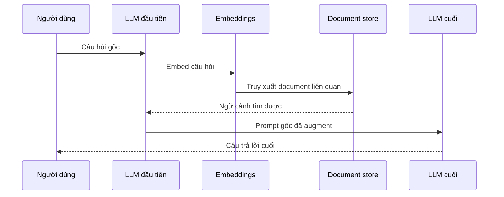

# ⚖️ Vì sao LangGraph ra đời? Cuộc "so găng" chi tiết với LangChain

> Nguồn: `084-Why-LangGraph-LangGraph-VS-LangChain.txt` · [Udemy](https://ua.udemy.com/course/langchain/learn/lecture/50029199)

Chào các bạn, Eden đây! Bài này sẽ mang hơi hướng **lý thuyết và triết lý** một chút, vì chúng ta sẽ cùng trả lời câu hỏi lớn: **động lực nào khiến đội ngũ LangChain tạo ra LangGraph?**

Trước khi bắt đầu, mình muốn gửi lời cảm ơn lớn đến đội ngũ **LangChain** vì đã cung cấp một số slide và hình minh họa để mình dùng trong bài này.

### 🎚️ Phổ tự chủ: Hai cực của hệ thống AI

Nếu nhìn các hệ thống AI theo **mức độ tự chủ (levels of autonomy)**, chúng ta sẽ thấy một dải phổ liên tục. Ở một đầu là **deterministic code (code xác định)** — hệ thống do chúng ta viết ra, **không tích hợp LLM**. Chúng ta biết chính xác output ở từng bước, input là gì, sẽ đi qua những bước nào, và kiểm soát toàn bộ hệ thống. Những hệ thống này rất **bền bỉ và đáng tin cậy**, nhưng **hoàn toàn không linh hoạt**, bởi mọi thứ đều bị hardcode.

Ở đầu kia là ý tưởng về **autonomous agents** — những agent có thể làm mọi thứ: tự đặt ra nhiệm vụ, tự viết code, tự thực thi code, tự sắp xếp lại công việc rồi viết một đoạn code khác. Chúng cực kỳ năng động, linh hoạt, có thể nhận một prompt kiểu *"hãy giúp tôi thành YouTuber số một"* và "được cho là" làm được. Nhưng trên thực tế, những hệ thống như vậy **không thực sự tồn tại**.

Các dự án như **RGPT, GPT Engineer, BabyAGI** từng cố gắng implement ý tưởng này. *Mình thực sự đánh giá cao những dự án đó vì chúng thúc đẩy đổi mới và mở rộng giới hạn của ngành*, nhưng chúng **không hướng tới production** và chúng ta không thấy chúng được dùng trong production. Lý do rất đơn giản: quá linh hoạt, chúng ta không kiểm soát được vì phụ thuộc quá nhiều vào LLM — và khi đó LLM có xu hướng "lan man" và không cho ra kết quả như mong muốn. Suy cho cùng, ở tầng cơ bản nhất, **LLM chỉ là những cỗ máy thống kê đoán từng token một**. Autonomous agent thì linh hoạt, nhưng **không đáng tin cậy**.

---

### 🔗 Ở giữa phổ: Tích hợp LLM, Chaining và LLM Router

Bước tiến ngay sau deterministic code là **tích hợp một LLM vào code**. Chúng ta vẫn viết code, vẫn kiểm soát control flow, nhưng bên trong luồng đó, LLM có thể được dùng để **tóm tắt** hoặc **trích xuất thông tin, entity**. LLM chỉ kiểm soát duy nhất một output trong toàn bộ flow, còn lại chúng ta giữ phần lớn quyền kiểm soát — và chỉ nhờ vậy thôi, chúng ta đã **tăng đáng kể độ linh hoạt**.

Tiến thêm một bước, chúng ta có khái niệm **chaining**: lấy output của LLM này làm input cho LLM khác, tức là **ghép các call chồng lên nhau**. Ví dụ kinh điển là luồng **RAG (Retrieval-Augmented Generation)**:

1. Đưa câu hỏi gốc cho LLM đầu tiên.
2. Tích hợp **embeddings (vector nhúng)** — embed câu hỏi.
3. Truy xuất những **document liên quan** có khả năng giúp trả lời câu hỏi.
4. Lấy prompt gốc, **augment (tăng cường)** thêm ngữ cảnh rồi gửi tất cả cho LLM.
5. LLM cuối cùng sinh ra câu trả lời.

Toàn bộ luồng RAG đó được mô tả ngắn gọn bằng sơ đồ tuần tự sau:

Đây chỉ là một ví dụ; còn vô số use case và flow chain khác. Tóm lại, trong một **chain**, LLM quyết định output ở **nhiều bước** chứ không chỉ một bước.

Tiếp theo là khái niệm **LLM router** — một loại chain dùng LLM để **quyết định chúng ta nên đi đâu**: thực thi code ở **Branch 1** hay **Branch 2**, đi tìm trong **database** hay tìm trên **web**. Lần đầu tiên, LLM quyết định các bước cần thực hiện, mở ra thêm nhiều tự do. Tuy nhiên, có một điểm rất quan trọng: **LLM router không có cycles** — và đường nét đứt trên sơ đồ chính là ranh giới. Mọi thứ **phía trên đường đó** được implement rất tốt trong LangChain (mình là fan lớn của LangChain và tin rằng chỉ với những building block ấy thôi, bạn đã có thể xây hệ thống rất tiên tiến).

Còn khoảng trống nằm giữa **autonomous agent** và **router**? *Bật mí nhé: LangGraph được đặt chính xác ở đó.*

---

### 🤖 Agent là gì? Và Function Calling giúp ích thế nào?

Đã có rất nhiều cuộc tranh luận về định nghĩa của **agent** và **agentic application**. Nếu bạn hỏi ba người, bạn sẽ nhận được ba câu trả lời khác nhau; hỏi lại vào hôm sau, bạn sẽ có thêm ba câu trả lời mới. Định nghĩa hiện nay vẫn còn khá **mềm** và chưa có câu trả lời dứt khoát.

Mình khá thích những gì **Andrew Ng** (DeepLearning.AI) và **Harrison Chase** (LangChain) viết về chủ đề này, và mình thấy họ có đồng thuận chung về các **core components (thành phần cốt lõi)** của agent. Còn nếu đơn giản hóa đến tận cùng, theo mình: **agent về bản chất là một control flow mà LLM quyết định đường đi**. Ví dụ cơ bản nhất: LLM quyết định đi **step 1** hay **step 2**.

Vậy agent khác chain ở đâu? Điểm khác biệt chính nằm ở chỗ: **chain là một chiều** — chúng ta đi từ trái sang phải; còn **agent có cycles** — và chính những vòng lặp này mang lại cho ứng dụng của chúng ta **thuộc tính agentic**.

Các agent hiện nay dùng **function calling** để quyết định bước đi. Đây là tính năng rất hay của một số LLM: ngoài query/câu hỏi gửi cho LLM, chúng ta có thể gửi kèm **mô tả của các tool (công cụ)** — đó là các function chạy ở backend, do chúng ta orchestrate. Chúng ta gửi cho LLM mô tả function, **arguments, title, chức năng và giá trị trả về**, và làm điều này rất dễ dàng với **tool decorator**. Nếu thấy phù hợp, LLM sẽ nói cho chúng ta biết cần gọi function nào với arguments nào — chúng ta gọi function đó và nhận lại kết quả mong muốn.

---

### 🧩 ReAct: Khi "quá linh hoạt" trở thành vấn đề, và cách LangGraph giải quyết

Thiết kế agent cơ bản nhất được giới thiệu lần đầu trong **ReAct paper**, và mình cho rằng nó đã thay đổi cả ngành. Thuật toán rất đơn giản:

1. LLM quyết định có cần dùng **tool** hay không — ví dụ gọi API hoặc query database.
2. Gọi tool với những arguments mà LLM đã chọn.
3. Nhận câu trả lời và **feed back** toàn bộ cho LLM.
4. LLM quyết định dùng thêm tool khác hay trả kết quả cuối cùng cho người dùng.

Đội ngũ LangChain đã implement thuật toán này rất đẹp trong framework, và các agent bắt đầu nở rộ. Chúng rất linh hoạt: LLM có thể gọi tool 1, tool 2, hay tool 1 rồi tool 2… với **mọi hoán vị có thể**. Nhưng chính vì **quá linh hoạt**, mọi hoán vị đều được phép — kể cả hoán vị "xấu". Chắc các bạn từng gặp lỗi agent **gọi mãi một tool lặp đi lặp lại và bị kẹt**. Có nhiều nguyên nhân: tool định nghĩa chưa đúng, LLM **non-deterministic** hoặc chưa đủ mạnh, chọn sai tool, đưa sai arguments, hay thậm chí **hallucinate** ra một tool không tồn tại.

Vậy vấn đề là: ta có agent linh hoạt như **RGPT** hay theo thuật toán **ReAct**, nhưng **không đủ tin cậy** để dùng thật. Điều chúng ta muốn là vừa **linh hoạt** vừa **đáng tin cậy hơn** — đủ để đưa vào production, để người dùng thật tương tác và nhận kết quả tốt ngoài phạm vi một bản demo.

**Đây chính xác là lý do LangGraph được tạo ra.** Thay vì giao toàn bộ tự do cho LLM, LangGraph **thu hẹp (scope)** nó lại, giảm bớt một chiều tự do. Chúng ta biểu diễn phần mềm agentic dưới dạng **graph với nodes và edges**, như một **state machine (máy trạng thái)** có thể chứa **cycles** — nhờ đó agent trông như biết suy luận, biết nghĩ về việc cần làm. LLM vẫn đóng vai trò then chốt khi quyết định đi đâu trong flow, nhưng **developer là người định nghĩa flow** — và chính việc giảm một chiều tự do lại giúp chúng ta **tăng mạnh độ tin cậy**.

Bạn có thể hỏi: *"Vì sao không dùng Airflow, NetworkX hay một graph framework khác?"* Câu trả lời là LangGraph **rất opinionated (được thiết kế chuyên biệt)** cho agentic application và được xây để giải đúng bài toán này. Nó cung cấp hàng loạt building block:

* **Controllability (khả năng kiểm soát)** và chạy **nodes song song (in parallel)**.
* **Conditional branching (phân nhánh có điều kiện)** với LLM.
* **Persistence (lưu trữ bền vững)** tích hợp sẵn — lưu state hiện tại của graph, cái gì đang chạy và cái gì đã chạy.
* **Human-in-the-loop:** tích hợp phản hồi từ con người để hiệu chỉnh quá trình thực thi agent.
* **Time traveling:** replay lại một bước chạy chưa đúng.
* **Debugging và tooling cho tracing**, vì tích hợp sẵn **LangSmith** out of the box.

Và một điều thú vị: trong LangGraph, bạn có thể viết **bất kỳ code nào** — không nhất thiết phải là code LangChain.

Một động lực khác để kiến trúc phần mềm dưới dạng graph: hầu hết các **paper về agentic application** đều minh họa hành vi agent bằng graph, nên mô tả giải pháp dưới dạng graph rất tự nhiên, **dễ đọc, dễ bảo trì, dễ test và monitor**.

| Tiêu chí | LangChain | LangGraph |
|---|---|---|
| Loại flow | Acyclic, đi một chiều | Graph có cycles, như state machine |
| Ai quyết định đường đi | Developer định nghĩa, LLM chỉ sinh output từng bước | Developer định nghĩa flow, LLM quyết định đi đâu trong flow |
| Persistence | Không tích hợp sẵn | Lưu state, resume đúng điểm dừng |
| Human-in-the-loop | Khó implement | Tích hợp sẵn |
| Tracing và debugging | Hạn chế | LangSmith out of the box |

### 🎯 Tự kiểm tra nhanh

**Câu 1:** Vì sao autonomous agent linh hoạt nhưng không đáng tin cậy?

<b>Xem đáp án</b>

**Đáp án:** Vì quá phụ thuộc vào LLM — thứ chỉ là cỗ máy thống kê đoán từng token.

Giải thích: RGPT, GPT Engineer, BabyAGI không hướng tới production và không được dùng trong production.

Tham chiếu: Mục Phổ tự chủ.

**Câu 2:** Điểm khác biệt chính giữa chain và agent là gì?

<b>Xem đáp án</b>

**Đáp án:** Chain là một chiều; agent có cycles.

Giải thích: Chính các vòng lặp mang lại cho ứng dụng thuộc tính agentic.

Tham chiếu: Mục Agent là gì.

**Câu 3:** Function calling giúp LLM quyết định bước đi như thế nào?

<b>Xem đáp án</b>

**Đáp án:** Ta gửi kèm mô tả tool gồm arguments, title, chức năng và giá trị trả về; LLM chọn hàm cùng arguments.

Giải thích: Tool decorator giúp việc gửi mô tả trở nên dễ dàng; ta chỉ việc gọi function LLM đã chọn.

Tham chiếu: Mục Agent là gì.

**Câu 4:** LangGraph giải quyết vấn đề "quá linh hoạt" của ReAct như thế nào?

<b>Xem đáp án</b>

**Đáp án:** Thu hẹp scope, giảm một chiều tự do: developer định nghĩa flow dạng graph có cycles, LLM chỉ định đi đâu trong flow.

Giải thích: Việc giảm tự do giúp tăng mạnh độ tin cậy — đủ để đưa vào production.

Tham chiếu: Mục ReAct.

**Câu 5:** Kể tên ít nhất hai building block mà LangGraph cung cấp cho agentic application.

<b>Xem đáp án</b>

**Đáp án:** Ví dụ: persistence, human-in-the-loop, time traveling, chạy node song song, tracing tích hợp LangSmith.

Giải thích: Đây là lý do LangGraph rất opinionated cho agentic application thay vì dùng Airflow hay NetworkX.

Tham chiếu: Mục ReAct.

Tóm lại: chúng ta kiểm soát flow, viết ra flow, tích hợp LLM để quyết định đi đâu và thực thi gì — kèm **cycles**. Vì là state machine nên cần có **state (trạng thái)**: state được **chia sẻ giữa các node và edge**, lưu mọi kết quả trung gian, và cung cấp thông tin hữu ích cho LLM để quyết định đường đi. Ở bài tiếp theo, chúng ta sẽ làm quen với hai khái niệm nền tảng: **graph** và **state machine** nhé! 🚀

## Nguồn tham khảo

- [Udemy — Why LangGraph, LangGraph VS LangChain](https://ua.udemy.com/course/langchain/learn/lecture/50029199)
- [LangGraph overview — Docs by LangChain](https://docs.langchain.com/oss/python/langgraph/overview)
- [LangChain overview — Docs by LangChain](https://docs.langchain.com/oss/python/langchain/overview)
