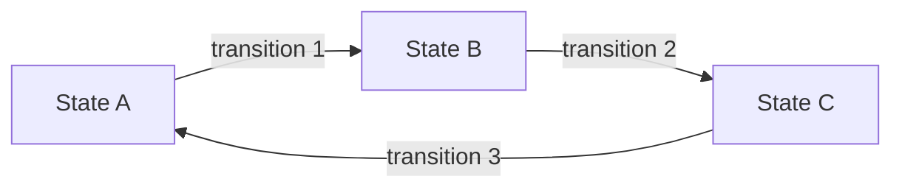

# 📐 Graph và State Machine: Hai khái niệm nền tảng trước khi bước vào LangGraph

> Nguồn: `085-What-are-Graphs.txt` · [Udemy](https://ua.udemy.com/course/langchain/learn/lecture/50029225)

Chào các bạn, Eden đây! Trước khi lao vào LangGraph, mình muốn cùng các bạn đi qua **hai khái niệm lý thuyết và thuật ngữ** mà chúng ta sẽ dùng liên tục trong suốt khóa học.

Đó là **graph (đồ thị)** — một cấu trúc dữ liệu, và **state machine (máy trạng thái)**. Nghe có vẻ hàn lâm, nhưng mình hứa là rất dễ hình dung thôi!

### 🌐 Graph là gì? Từ mạng xã hội đến bảo mật đám mây

**Graph** là một **đối tượng toán học (mathematical object)** giúp chúng ta biểu diễn các mối quan hệ. Nó bao gồm **nodes (nút)**, còn gọi là **vertices (đỉnh)**, và **edges (cạnh)** — những đường nối các node đó với nhau.

Cấu trúc dữ liệu graph cực kỳ **đa năng (versatile)** và được dùng trong vô số ứng dụng thuộc nhiều lĩnh vực khác nhau:

* Mô tả **mạng xã hội (social networks)**.
* Mô tả **bản đồ giao thông** giữa các thành phố và các tuyến đường.
* Mô tả **lộ trình di chuyển** giữa các thành phố.

Điều thú vị là trong khoa học máy tính đã có **rất nhiều nghiên cứu** về cấu trúc dữ liệu này, cùng vô số **thuật toán và kỹ thuật trích xuất thuộc tính (property extraction)** giúp giải quyết các bài toán thực tế.

*Một chút chia sẻ ngoài lề:* là một software engineer, mình từng làm việc rất nhiều với **graph database** khi làm cho các công ty **cybersecurity**. Chúng mình dùng graph để **tìm và mô tả các attack vector (đường tấn công)** của tài nguyên trên các public cloud như **AWS, GCP và Azure**, cũng như mô tả **tính kết nối (connectivity)** giữa các tài nguyên đó.

Ví dụ câu hỏi mà graph giúp trả lời: *"Web server này có đang phơi ra Internet (internet-facing) và có kết nối vào database hay không?"* — phục vụ cho **cloud security posture management**. Mình có để lại trong phần **Resources** của video một buổi talk mình từng trình bày ở **Minsk**, tại **Python Developer Meetup**, về chủ đề này, nếu các bạn thấy hứng thú nhé.

Và nếu muốn "geek" một chút, chúng ta có thể nhìn vào **định nghĩa hình thức** của graph: một graph **G(V, E)** gồm **V** là tập hợp các đỉnh và **E** là tập hợp các cạnh, được mô tả bằng cặp **X và Y** với X, Y thuộc tập đỉnh.

*Và các bạn cứ yên tâm: đây là lần cuối cùng chúng ta nhìn thấy toán học trong khóa học này!* 😄

---

### 🔄 State Machine: Khi trạng thái và bước chuyển gặp nhau

**State machine** là một **mô hình tính toán (model of computation)** bao gồm các **states (trạng thái)** và các **transition (bước chuyển)** giữa chúng.

Bằng cách định nghĩa các trạng thái khác nhau và **luật chuyển đổi** giữa chúng, state machine có thể quản lý những điều kiện phức tạp và các chuỗi trình tự trong hệ thống phần mềm.

Điểm rất hay: **state machine có thể được biểu diễn dưới dạng graph**, trong đó **states là nodes** và **transitions là edges**. Cách trực quan hóa này giúp chúng ta hiểu rõ luồng chạy của state machine và quản lý độ phức tạp của nó.

| Khái niệm | Định nghĩa | Thành phần chính | Ví dụ |
|---|---|---|---|
| Graph | Đối tượng toán học biểu diễn các mối quan hệ | Nodes và edges | Mạng xã hội, bản đồ giao thông |
| State machine | Mô hình tính toán với các trạng thái | States và transitions | Luồng xử lý nhiều bước trong phần mềm |

---

### 🕸️ Và đây là lúc LangGraph xuất hiện

**LangGraph** là một thư viện mạnh mẽ được xây dựng **trên nền LangChain**. Với LangGraph, chúng ta có thể mô tả các flow của mình bằng chính những **nodes và edges** vừa học, từ đó xây dựng những **agentic application** rất mạnh mẽ và tinh vi.

Trong khóa học, các bạn sẽ thấy chúng ta mô tả những agent rất cao cấp và phức tạp — viết bằng LangGraph sẽ **rất dễ dàng** và chạy cũng rất mượt.

### 🎯 Tự kiểm tra nhanh

**Câu 1:** Graph gồm những thành phần cơ bản nào?

<b>Xem đáp án</b>

**Đáp án:** Nodes (vertices) và edges.

Giải thích: Graph là đối tượng toán học mô tả quan hệ giữa các đỉnh qua các cạnh; định nghĩa hình thức là G(V, E).

Tham chiếu: Mục Graph là gì.

**Câu 2:** State machine là gì?

<b>Xem đáp án</b>

**Đáp án:** Một mô hình tính toán gồm các states và các transition giữa chúng.

Giải thích: Nhờ định nghĩa trạng thái và luật chuyển đổi, nó quản lý được chuỗi trình tự phức tạp.

Tham chiếu: Mục State Machine.

**Câu 3:** State machine liên hệ với graph như thế nào?

<b>Xem đáp án</b>

**Đáp án:** State machine biểu diễn được dưới dạng graph: states là nodes, transitions là edges.

Giải thích: Cách trực quan hóa này giúp hiểu luồng chạy và quản lý độ phức tạp.

Tham chiếu: Mục State Machine.

**Câu 4:** Eden kể ví dụ thực tế nào về ứng dụng graph trong bảo mật?

<b>Xem đáp án</b>

**Đáp án:** Dùng graph database để tìm và mô tả attack vector của tài nguyên trên public cloud như AWS, GCP, Azure.

Giải thích: Graph giúp trả lời câu hỏi như web server có internet-facing và kết nối vào database hay không, phục vụ cloud security posture management.

Tham chiếu: Mục Graph là gì.

**Câu 5:** LangGraph là gì và giúp chúng ta làm gì?

<b>Xem đáp án</b>

**Đáp án:** Thư viện mạnh xây trên nền LangChain, cho phép mô tả flow bằng nodes và edges để xây agentic application.

Giải thích: Nhờ đó việc hiện thực các agent phức tạp trở nên dễ dàng và chạy mượt.

Tham chiếu: Mục Và đây là lúc LangGraph xuất hiện.

Bài này đến đây là hết. Mình tin rằng việc **thống nhất** xem graph là gì và state machine là gì là bước quan trọng trước khi chúng ta đi vào **Flow Engineering** và LangGraph ở các bài tiếp theo. Hẹn gặp lại các bạn! 🚀

## Nguồn tham khảo

- [Udemy — What are Graphs](https://ua.udemy.com/course/langchain/learn/lecture/50029225)
- [Graph API overview — Docs by LangChain](https://docs.langchain.com/oss/python/langgraph/graph-api)
- [LangGraph overview — Docs by LangChain](https://docs.langchain.com/oss/python/langgraph/overview)
