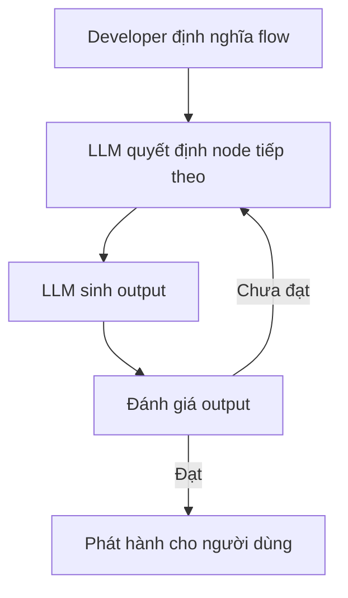

# 🧠 Flow Engineering là gì? Nghệ thuật "vẽ" luồng cho AI thay vì để AI tự bơi

> Nguồn: `086-LangGraph-Flow-Engineering.txt` · [Udemy](https://ua.udemy.com/course/langchain/learn/lecture/43592714)

Chào các bạn, Eden đây! Chúng ta sẽ cùng bàn về **flow engineering (kỹ thuật thiết kế luồng)** — một ý tưởng mới đang được thảo luận sôi nổi trong cộng đồng **generative AI** gần đây.

Mình xin "cảnh báo trước": đây là một bài **rất lý thuyết**, khái niệm flow engineering còn khá **trừu tượng** và **chưa được định hình hoàn chỉnh**. Nếu bạn chưa hiểu hết mọi thứ ngay lúc này, *đừng lo lắng nhé* — mình hứa đến cuối khóa học, các bạn sẽ hiểu tường tận flow engineering là gì và vì sao nó quan trọng.

### 🗺️ Flow Engineering: Định nghĩa và mục tiêu cốt lõi

**Flow engineering** là một cách tiếp cận **có hệ thống và có chiến lược (systematic and strategic)** để phát triển phần mềm có tích hợp các **quá trình ra quyết định do AI dẫn dắt (AI-driven decision-making)**.

Mục tiêu thiết yếu của nó là **quản lý và tối ưu cách các hệ thống AI với LLM xử lý nhiệm vụ**, thông qua việc **định nghĩa rõ ràng một flow (luồng) hay một chuỗi thao tác (sequence of operations)**.

Điểm mấu chốt: những flow này **không chỉ là tuyến tính**. Chúng có thể chứa các **decision-making node (nút ra quyết định)** phức tạp, nơi AI sinh ra nhiều output khác nhau, và những output này thường được **đánh giá rồi tinh chỉnh trong một vòng lặp (iterative cycle)**.

Nói cách khác, flow engineering là một **quy trình có cấu trúc**, dẫn dắt AI đi qua từng bước được định nghĩa rõ ràng để **nâng cao chất lượng output** của hệ thống AI. Nó đưa vào các **pha lập kế hoạch và testing có hệ thống**, mô phỏng quy trình phát triển của con người — tất cả nhằm **tăng độ tin cậy và tính năng hữu dụng** cho các giải pháp do AI tạo ra.

Vòng lặp "sinh output rồi đánh giá để tinh chỉnh" mà mình vừa nói trông như thế này:

---

### ⚠️ Bài học từ AutoGPT và BabyAGI: Đừng để AI tự "vẽ" nhiệm vụ

Một trong những vấn đề của **AutoGPT** và các dự án autonomous agent khác như **BabyAGI** nằm ở **long-term planning (lập kế hoạch dài hạn)**. Chúng nhận một **goal (mục tiêu)** cần đạt được, rồi bắt đầu chia nhỏ thành các task, thực thi các task đó, lại sinh ra subtask của subtask, cứ thế tiếp diễn.

Và trên thực tế (de facto), **chúng không thực sự hoạt động hiệu quả**.

Điểm mấu chốt ở đây là: **chúng ta — những developer — muốn đưa ra chỉ dẫn về việc cần làm**. Chúng ta **không muốn** AI tự nghĩ ra những "nỗ lực tưởng tượng" rồi bắt đầu thực thi chúng. Kiểu đó **rất dễ phát sinh vấn đề** và khiến LLM "vượt khỏi tầm kiểm soát".

Chúng ta muốn nói cho LLM biết **chính xác cần làm gì**, muốn **định nghĩa các task** và muốn LLM **ở trong phạm vi của những task đó**.

Tất nhiên, LLM vẫn có những quyết định của riêng nó. Ví dụ:

* Xác định liệu output đã **sẵn sàng để phát hành** và đã đủ tốt hay chưa.
* Quyết định **bước tiếp theo nên làm gì**.

Nhưng chúng ta là người **định nghĩa phạm vi (scope)** và làm phần lớn việc lập kế hoạch cho LLM. LLM chỉ làm việc **bên trong flow mà chúng ta tạo ra**. Chúng ta đưa cho LLM **bản thiết kế (blueprints)** để đi theo.

---

### 🚦 State Machine: Developer viết luật chơi, LLM chọn nước đi

Nếu nhìn dưới góc độ **state machine**: chúng ta viết ra các **states**, tức là viết ra flow là gì, cần làm gì, có những bước nào.

Tuy nhiên, chúng ta **có thể tích hợp LLM** để quyết định nên đi theo flow nào dựa trên input nhận được. Ví dụ: nên **tinh chỉnh (curate) câu trả lời** thêm hay **phát hành thẳng cho người dùng**. Trong state machine, đó là quyết định đi tới **step i**, hay **i+2**, hay bất kỳ bước nào khác.

*Lưu ý quan trọng:* state machine là một **quyết định kỹ thuật (engineering decision)** — **không có yếu tố thống kê (statistics)** nào tham gia ở đây cả.

Vậy LangGraph nằm ở đâu trong bức tranh này? Nó đang implement **vùng trung gian (middle ground)** của flow engineering: giữa một bên là **autonomous agent hoàn toàn** — tự quyết làm gì và làm thế nào, với một bên là **LangChain chain** — hoàn toàn deterministic, **không có chút linh hoạt nào trong flow**.

| Tiêu chí | Autonomous agent | Flow engineering | LangChain chain |
|---|---|---|---|
| Ai định nghĩa flow | Agent tự quyết mọi thứ | Developer định nghĩa, LLM chọn bước | Developer hardcode toàn bộ |
| Độ linh hoạt | Rất cao, khó đoán | Trung bình, có kiểm soát | Thấp |
| Độ tin cậy | Thấp, chưa production-ready | Cao hơn nhờ scope rõ ràng | Cao, deterministic |

Với flow engineering, chúng ta có thể đạt được những **giải pháp agentic phức tạp**, đòi hỏi xây dựng một state machine để định nghĩa các bước của flow. Và chúng ta có thể dùng LLM theo hai cách:

* **Là một phần của bước** — ví dụ gọi LLM để sinh một tweet.
* **Là người chỉ đường** — cho biết nên đi tới bước nào.

Điểm cốt lõi vẫn là: **chúng ta định nghĩa flow và nắm toàn quyền kiểm soát nó**. Trong LangGraph, chúng ta định nghĩa graph bằng **nodes và edges**, có thể có **cycles**, và sẽ cùng nhau xây những logic rất tiên tiến — tạo ra các hệ thống AI cực kỳ phức tạp.

Một ví dụ mình rất thích: một graph **viết một tweet**, rồi **phản chiếu và phê bình (reflect and critique)** chính tweet đó, lặp đi lặp lại theo **iterations** cho đến khi thu được một bài đăng Twitter thật sự chất lượng.

---

### 📊 Tương lai: 60% flow engineering, 35% fine-tuning, 5% prompt engineering

Mình tin rằng trong tương lai gần, khi phát triển phần mềm AI và generative AI, thời gian chúng ta dành cho phần mềm sẽ được phân bổ như sau:

1. **60% cho flow engineering và kiến trúc** — state machine, các node, những bước nào có thể thực hiện, có nên nhúng LLM vào trong đó, và liệu LLM có thể quyết định nên đi bước nào.
2. **35% cho fine-tuning** — làm cho model thật sự chuyên biệt cho những task chúng ta cần giải quyết.
3. **5% cho prompt engineering**.

### 🎯 Tự kiểm tra nhanh

**Câu 1:** Flow engineering là gì?

<b>Xem đáp án</b>

**Đáp án:** Cách tiếp cận có hệ thống và chiến lược để phát triển phần mềm có AI dẫn dắt việc ra quyết định, thông qua định nghĩa flow rõ ràng.

Giải thích: Mục tiêu là quản lý và tối ưu cách hệ thống LLM xử lý nhiệm vụ, tăng độ tin cậy cho output.

Tham chiếu: Mục Flow Engineering: Định nghĩa.

**Câu 2:** Vấn đề lớn nhất của AutoGPT và BabyAGI là gì?

<b>Xem đáp án</b>

**Đáp án:** Long-term planning — chúng tự chia task rồi subtask của subtask và trên thực tế không hoạt động hiệu quả.

Giải thích: Kiểu AI tự nghĩ ra "nỗ lực tưởng tượng" rất dễ phát sinh vấn đề và vượt khỏi tầm kiểm soát.

Tham chiếu: Mục Bài học từ AutoGPT và BabyAGI.

**Câu 3:** Trong flow engineering, developer giữ vai trò gì?

<b>Xem đáp án</b>

**Đáp án:** Định nghĩa task, scope và bản thiết kế (blueprint) cho LLM đi theo.

Giải thích: LLM chỉ ra quyết định bên trong flow do chúng ta tạo — ví dụ output đã sẵn sàng phát hành chưa, bước tiếp theo là gì.

Tham chiếu: Mục Bài học từ AutoGPT và BabyAGI.

**Câu 4:** LLM có thể được dùng theo hai cách nào trong một state machine?

<b>Xem đáp án</b>

**Đáp án:** Là một phần của bước (ví dụ sinh một tweet) hoặc là người chỉ đường (cho biết nên đi tới bước nào).

Giải thích: Dù ở vai trò nào, developer vẫn là người định nghĩa flow và nắm toàn quyền kiểm soát.

Tham chiếu: Mục State Machine.

**Câu 5:** Eden dự đoán tỷ lệ phân bổ thời gian tương lai giữa flow engineering, fine-tuning và prompt engineering là bao nhiêu?

<b>Xem đáp án</b>

**Đáp án:** 60% flow engineering và kiến trúc, 35% fine-tuning, 5% prompt engineering.

Giải thích: Phần lớn công sức sẽ dành cho state machine, các node và quyết định nhúng LLM vào đâu.

Tham chiếu: Mục Tương lai.

Mình biết bài này **siêu trừu tượng** và chắc hẳn các bạn chưa hiểu hết mọi thứ. **Đừng lo nhé!** Đây là một chủ đề mới và còn khá mơ hồ, nhưng mình cam kết rằng đến cuối khóa học, các bạn sẽ hiểu chính xác flow engineering là gì — và vì sao nó quan trọng đến vậy khi xây dựng những agent tiên tiến. Hẹn gặp lại ở bài tiếp theo! 🚀

## Nguồn tham khảo

- [Udemy — LangGraph Flow Engineering](https://ua.udemy.com/course/langchain/learn/lecture/43592714)
- [LangGraph overview — Docs by LangChain](https://docs.langchain.com/oss/python/langgraph/overview)
