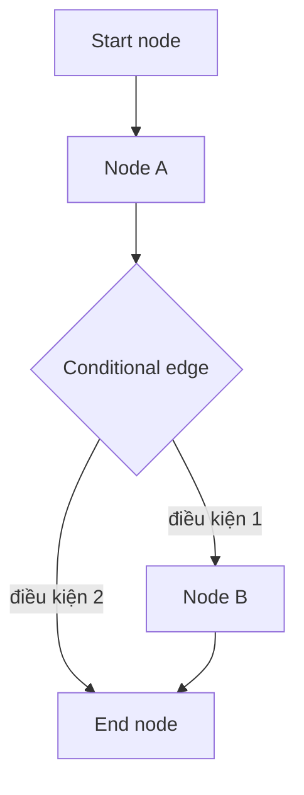

# 🧩 Giải phẫu LangGraph: Nodes, Edges, State và những viên gạch đầu tiên

> Nguồn: `087-LangGraph-Core-Components.txt` · [Udemy](https://ua.udemy.com/course/langchain/learn/lecture/50029219)

Chào các bạn, Eden đây! Trong bài này, chúng ta sẽ cùng điểm qua **các component cốt lõi của LangGraph** dưới góc độ lý thuyết.

Đây là bài **cực kỳ quan trọng**, bởi vì ngay sau đây, chúng ta sẽ bắt tay vào implement một dự án thực tế bằng chính những component này.

### 🧱 Bộ ba cốt lõi: Nodes, Edges và Conditional Edges

Với LangGraph, chúng ta sẽ implement một **control flow (luồng điều khiển) được định nghĩa rõ ràng**, hay còn gọi là **state machine** hoặc **graph** — bạn muốn gọi thế nào cũng được. Bên trong luồng được định nghĩa và giới hạn phạm vi rõ ràng đó, chúng ta sẽ **tận dụng LLM** với vai trò hết sức then chốt:

* LLM **quyết định bước tiếp theo** trong control flow — đây là phần **non-deterministic (phi xác định)**.
* Hoặc chúng ta **thực thi các LLM call / agent call** ngay trong luồng đó.

Để bắt đầu, chúng ta cần **ba LangGraph core component: nodes (nút), edges (cạnh), và conditional edges (cạnh có điều kiện)**.

**Nodes** thực chất chỉ là những **Python function (hàm Python)**. Bạn có thể đặt vào đó bất kỳ code nào: **deterministic code** thông thường, code gọi LLM, hay thậm chí một **LLM agent**. Bạn có toàn quyền linh hoạt về những gì diễn ra bên trong node.

**Edges** kết nối các node trong quá trình thực thi graph. Còn **conditional edges** giúp đưa ra quyết định nên đi tới **node A** hay **node B** — việc này mang tính **động (dynamic)** và cực kỳ linh hoạt.

Và đây chính là **sức mạnh của LangGraph**: chúng ta kiểm soát hoàn toàn cách graph thực thi và di chuyển.

Một graph tối giản với đầy đủ start node, hai node xử lý và conditional edge sẽ trông như sau:

| Thành phần | Là gì | Vai trò |
|---|---|---|
| Nodes | Python function bất kỳ | Nhận state, thực thi code, trả về cập nhật state |
| Edges | Đường nối các node | Quyết định node nào chạy tiếp theo |
| Conditional edges | Edge động | Chọn node A hay node B dựa trên state |
| State | Dictionary dùng chung | Lưu kết quả, chat history; mọi node đều truy cập được |

---

### 🚩 Start Node, End Node và vai trò "no operation"

Hai built-in node quan trọng của LangGraph là **start node** và **end node**.

* **Start node** là **điểm vào (entry point)** cho quá trình thực thi graph — chúng ta sẽ bắt đầu từ đó.
* **End node** là **node cuối cùng** được thực thi.

Điều thú vị là cả hai node này **không thực sự làm gì cả** — các bạn có thể nghĩ về chúng như những **no operation (không thao tác)**.

---

### 🗃️ State: "Bộ nhớ" dùng chung của toàn bộ graph

Một trong những khái niệm quan trọng nhất của LangGraph là **state** hay **agent state (trạng thái của agent)**.

State đơn giản chỉ là một **dictionary** chứa những thông tin quan trọng cần theo dõi trong graph. Nó có thể chứa:

* Kết quả thực thi của một số node.
* Một vài **kết quả tạm thời (temporary results)**.
* Hoặc **chat history (lịch sử trò chuyện)**.

State có thể **rất đơn giản** — ví dụ chỉ lưu chat history, tức kết quả của LLM sau mỗi lần gọi — hoặc có thể **rất phức tạp** và được tùy biến theo bất cứ điều gì bạn muốn.

Điểm mấu chốt:

* State **mang tính cục bộ (local)** với graph, tức là **mọi node đều có thể truy cập** trong quá trình thực thi graph.
* State cũng **khả dụng trên mỗi edge**, và tồn tại cục bộ trong runtime của chúng ta.
* Tuy nhiên, chúng ta cũng có thể **persist (lưu trữ bền vững)** state vào bộ nhớ lâu dài. Nhờ đó, nếu muốn **dừng luồng thực thi** vì lý do nào đó và sau này **tiếp tục đúng từ điểm dừng với state đó**, chúng ta hoàn toàn làm được — và mình sẽ demo điều này trong khóa học.

---

### 🔁 Node luôn nhận state, và luôn trả về cập nhật cho state

Như đã nói, mỗi node trong LangGraph là một function và bạn có thể viết bất cứ thứ gì bên trong. Nhưng có một điểm đặc biệt: **node là những function đặc biệt** — chúng **luôn nhận vào tham số đầu vào là state hiện tại của graph**, nơi chứa mọi thông tin node cần để làm việc.

Và thứ mà function này trả về chính là **phần cập nhật cho state**. Node **luôn trả về một dictionary** với các key tương ứng với những gì chúng ta muốn cập nhật trong state.

Kết quả là: trong LangGraph, **mỗi node đều cập nhật state**. Đối tượng state sẽ **thay đổi dần theo thời gian**, và **conditional edges cùng các edges sẽ dựa vào state** để quyết định đi tới node A hay node B. Toàn bộ phần mềm của chúng ta sẽ vận hành theo đúng cách đó — và chỉ với những core component này thôi, chúng ta đã có thể xây dựng những thứ rất tiên tiến.

Bên cạnh đó, có thêm vài khái niệm sẽ theo chúng ta suốt khóa học:

1. **Cyclic graph (đồ thị có chu trình):** LangGraph cho phép chúng ta implement **loops (vòng lặp)** — một thứ cực kỳ mạnh mẽ mà với LangChain trước đây **vô cùng khó làm được**.
2. **Human-in-the-loop:** khi muốn lấy **phản hồi từ con người** để quyết định nên đi tới node A hay node B trong graph, LangGraph cũng giúp implement rất dễ dàng.
3. **Persistence:** LangGraph đi kèm những built-in function gọn gàng và mạnh mẽ để **lưu state của graph**, giúp phần mềm **robust (mạnh mẽ) hơn, chịu lỗi tốt hơn (fault-tolerant)**, đồng thời mở ra những logic rất hay để mang lại **trải nghiệm người dùng tuyệt vời** — các bạn sẽ thấy trong khóa học.

### 🎯 Tự kiểm tra nhanh

**Câu 1:** Ba core component của LangGraph là gì?

<b>Xem đáp án</b>

**Đáp án:** Nodes, edges và conditional edges.

Giải thích: Chúng tạo nên control flow rõ ràng, bên trong đó LLM giữ vai trò quyết định bước tiếp theo.

Tham chiếu: Mục Bộ ba cốt lõi.

**Câu 2:** Node trong LangGraph thực chất là gì?

<b>Xem đáp án</b>

**Đáp án:** Một Python function chứa code bất kỳ — deterministic code, LLM call hay cả LLM agent.

Giải thích: Node luôn nhận state hiện tại và luôn trả về dictionary cập nhật cho state.

Tham chiếu: Mục Bộ ba cốt lõi và Mục Node luôn nhận state.

**Câu 3:** Conditional edge làm được gì mà edge thường không làm được?

<b>Xem đáp án</b>

**Đáp án:** Quyết định động nên đi tới node A hay node B dựa trên state.

Giải thích: Đây là phần mang tính dynamic, giúp graph linh hoạt và là sức mạnh của LangGraph.

Tham chiếu: Mục Bộ ba cốt lõi.

**Câu 4:** State của LangGraph có phạm vi hoạt động như thế nào?

<b>Xem đáp án</b>

**Đáp án:** Cục bộ với graph — mọi node và edge đều truy cập được; ngoài ra có thể persist để dừng và resume.

Giải thích: State là dictionary chứa kết quả, temporary results hoặc chat history.

Tham chiếu: Mục State.

**Câu 5:** Start node và end node có điểm gì đặc biệt?

<b>Xem đáp án</b>

**Đáp án:** Là built-in node, đóng vai trò entry point và node cuối, nhưng không thực sự làm gì — như no operation.

Giải thích: Chúng đánh dấu điểm bắt đầu và kết thúc của quá trình thực thi graph.

Tham chiếu: Mục Start Node, End Node.

Nào, lý thuyết đã đủ rồi! Hãy cùng bước sang phần **hands-on** để xây dựng dự án đầu tiên với LangGraph nhé! 🚀

## Nguồn tham khảo

- [Udemy — LangGraph Core Components](https://ua.udemy.com/course/langchain/learn/lecture/50029219)
- [Graph API overview — Docs by LangChain](https://docs.langchain.com/oss/python/langgraph/graph-api)
- [Use the graph API — Docs by LangChain](https://docs.langchain.com/oss/python/langgraph/use-graph-api)
