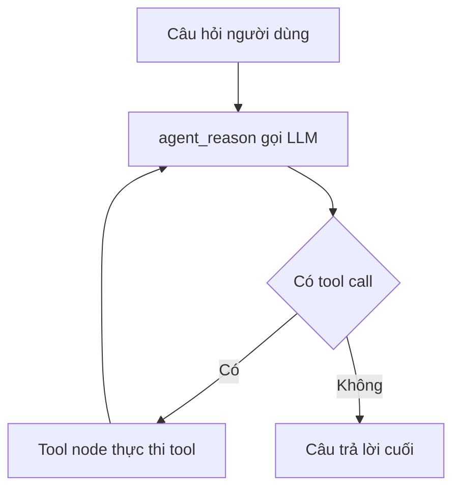

# 🛠️ Hands-On: Dựng ReAct Agent Executor bằng LangGraph — bài "hello world" của Agents

> Nguồn: `088-----------Hands-On-Implementing-ReAct-AgentExecutor-with-Lan.txt` · [Udemy](https://ua.udemy.com/course/langchain/learn/lecture/50029457)

Chào các bạn, Eden đây! Trong bài này, mình sẽ giới thiệu **tổng quan dự án mà chúng ta sắp xây dựng**: một **ReAct agent executor**, nhưng lần này được implement hoàn toàn bằng **LangGraph**.

*Lý do mình chọn dự án này* rất đơn giản: nó cho thấy việc dùng **graph để mô tả agent flow** dễ dàng đến mức nào — đặc biệt là **ReAct agent**, một thuật toán vốn khá khó hiểu, nhưng khi nhìn qua lăng kính graph thì trở nên **cực kỳ dễ implement**.

### 🎯 Chúng ta sẽ xây dựng gì?

Trong suốt bài thực hành này, chúng ta sẽ:

* Implement một **agent executor** hoạt động theo **ReAct algorithm**, nhưng dựng bằng **LangGraph**.
* **Đi sâu vào graph state** và cách implement một **custom state (trạng thái tùy biến)**.
* Kết thúc bằng một **agent executor chạy được**, sẵn sàng nhận **tools (công cụ)** để sử dụng.

Về bộ công cụ, chúng ta sẽ dùng **search tool** cùng một **custom tool** do chính chúng ta viết.

Cách vận hành sẽ như sau: agent **thực thi graph có chứa một loop (vòng lặp)**, tự quyết định **có dùng tool hay không**, và cuối cùng đưa ra câu trả lời cho người dùng.

Và đây là câu hỏi "kinh điển" mà chúng ta sẽ hỏi agent:

> **"What's the weather in San Francisco? And please multiply it by three."**

*Đúng vậy, đây chính là ví dụ "hello world" của thế giới agents* — nhưng lần này chúng ta sẽ implement toàn bộ bằng **LangGraph**.

---

### 🆕 Cập nhật mới: Tái quay với Tool Node và Function Calling

Một cập nhật nhanh cho các bạn: đây là **mình của một năm sau**, với **ít tóc hơn một chút** và **vài cân nặng cộng thêm**. 😄

Điều quan trọng hơn là: **LangChain đang dần chuyển hướng về LangGraph** khi nói đến việc xây dựng và implement agents. Vì vậy, mình đã **quay lại toàn bộ section này** để tận dụng **phiên bản LangGraph mới nhất**, sử dụng một thứ gọi là **tool node** cùng kỹ thuật **function calling**.

Nhờ đó, agent của chúng ta sẽ trở nên **robust (mạnh mẽ) hơn rất nhiều** và **đáng tin cậy hơn (more trustworthy)**. Mình hy vọng các bạn sẽ thích phần này!

| Tiêu chí | Cách cũ — ReAct prompt | Cách mới — tool node và function calling |
|---|---|---|
| Chọn tool | LLM sinh text theo ReAct prompt | LLM vendor trả về function call chuẩn hóa |
| Parse output | Tự parse, dễ vỡ nếu sai token | Vendor chịu trách nhiệm parse |
| Độ ổn định | Thấp | Cao, agent đáng tin cậy hơn |
| Code phải viết | Nhiều boilerplate | Ít, tận dụng prebuilt ToolNode |

---

### 💡 Vì sao vẫn nên hiểu "cách cũ" của ReAct?

Có một **side note quan trọng**: trong thế giới **GenAI**, mọi thứ đều được xây **chồng lên nhau**. Việc hiểu **ReAct algorithm hoạt động ra sao cùng ReAct prompt** — tức cách làm cũ — theo mình là **cực kỳ, cực kỳ quan trọng**.

Bởi vì một khi bạn hiểu được **những điều cơ bản** và biết mọi thứ **bắt nguồn từ đâu**, thì mọi thứ còn lại **đều trở nên dễ hiểu (makes sense)**.

Thêm nữa, nếu bạn đã từng implement **ReAct executor** ở section trước, thì bây giờ mọi thứ sẽ **dễ hơn rất nhiều**: bạn đã nắm rõ các khái niệm, các ý tưởng và cách mọi thứ tiến hóa — điều đó mang lại cho bạn một **hiểu biết sâu sắc hơn về agents**.

### 🎯 Tự kiểm tra nhanh

**Câu 1:** Dự án thực hành trong section này là gì?

<b>Xem đáp án</b>

**Đáp án:** Implement một ReAct agent executor hoàn toàn bằng LangGraph, dùng search tool và custom tool.

Giải thích: Agent thực thi graph có loop, tự quyết định dùng tool hay không rồi trả lời người dùng.

Tham chiếu: Mục Chúng ta sẽ xây dựng gì.

**Câu 2:** Vì sao Eden chọn ReAct agent làm dự án đầu tiên?

<b>Xem đáp án</b>

**Đáp án:** Vì nó cho thấy mô tả agent flow bằng graph dễ đến mức nào — ReAct vốn khó hiểu, qua lăng kính graph trở nên cực dễ implement.

Giải thích: Đây là ví dụ "hello world" của thế giới agents.

Tham chiếu: Mục Chúng ta sẽ xây dựng gì.

**Câu 3:** Câu hỏi "kinh điển" dành cho agent là gì?

<b>Xem đáp án</b>

**Đáp án:** "What's the weather in San Francisco? And please multiply it by three."

Giải thích: Câu hỏi buộc agent phải gọi search tool rồi gọi tiếp custom tool nhân ba.

Tham chiếu: Mục Chúng ta sẽ xây dựng gì.

**Câu 4:** Vì sao vẫn nên hiểu cách cũ — ReAct algorithm và ReAct prompt?

<b>Xem đáp án</b>

**Đáp án:** Vì trong GenAI mọi thứ xây chồng lên nhau; hiểu cơ bản và nguồn gốc giúp mọi thứ còn lại trở nên dễ hiểu.

Giải thích: Nếu đã implement ReAct executor ở section trước, bạn có hiểu biết sâu sắc hơn về agents.

Tham chiếu: Mục Vì sao vẫn nên hiểu cách cũ.

**Câu 5:** Bản cập nhật mới của section dùng kỹ thuật gì?

<b>Xem đáp án</b>

**Đáp án:** Tool node cùng function calling, trên phiên bản LangGraph mới nhất.

Giải thích: Nhờ đó agent robust hơn nhiều và đáng tin cậy hơn.

Tham chiếu: Mục Cập nhật mới.

Thế là đủ cho phần giới thiệu! Hãy chuẩn bị tinh thần bước vào code — chúng ta sẽ cùng nhau dựng nên ReAct agent đầu tiên bằng LangGraph ở bài tiếp theo. Gặp lại các bạn ngay sau đây nhé! 🚀

## Nguồn tham khảo

- [Udemy — Hands-On Implementing ReAct AgentExecutor with LangChain](https://ua.udemy.com/course/langchain/learn/lecture/50029457)
- [LangGraph overview — Docs by LangChain](https://docs.langchain.com/oss/python/langgraph/overview)
- [Agents — Docs by LangChain](https://docs.langchain.com/oss/python/langchain/agents)
