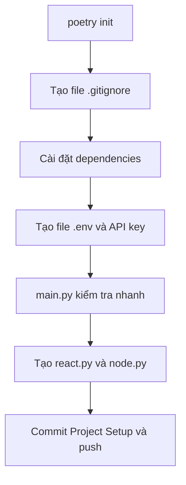

# 🛠️ Dựng nền móng cho ReAct Agent: Cài đặt môi trường dự án từ A đến Z

> Nguồn: `089-Hands-On-Get-Started-Setting-Up-Your-ReAct-Agent-Project-Env.txt` · [Udemy](https://ua.udemy.com/course/langchain/learn/lecture/50029463)

Chào các bạn, Eden đây! 👋 Trước khi bước vào phần "nóng" nhất của chương này, chúng ta hãy cùng nhau dọn dẹp "sân khấu" một chút — tức là hoàn thành toàn bộ phần **boilerplate setup (cấu hình nền tảng ban đầu)** cho dự án.

Trong video này, mình sẽ cùng các bạn khởi tạo **môi trường ảo (virtual environment)** bằng **Poetry**, cài đặt mọi **dependency (thư viện phụ thuộc)** cần thiết và điền đầy đủ các **API key** vào file `.env`. Kết thúc video này, chúng ta sẽ sẵn sàng để hiện thực hóa chiếc **ReAct graph** đầu tiên.

---

### ⚙️ Khởi tạo dự án với Poetry

Chúng ta bắt đầu với một thư mục hoàn toàn trống. Việc đầu tiên là chạy `poetry init` để khởi tạo project — cứ thoải mái nhấn **Enter** cho tất cả các câu hỏi nhé.

Ngay sau đó, mình tạo thêm file **`.gitignore`** và dán vào đó một file `.gitignore` Python tiêu chuẩn. Điểm quan trọng nhất ở đây là nó sẽ **ngăn các file `.env` bị đẩy lên GitHub**, nhờ đó **API key của bạn không bao giờ bị lộ**. Nếu chưa có nội dung file này, bạn có thể lấy từ repository của khóa học hoặc từ phần **Resources** của video — mình đã đính kèm sẵn.

Toàn bộ các bước setup của video này đi theo trình tự:



---

### 📦 Cài đặt các "nguyên liệu" cần thiết

Tiếp theo, chúng ta cài đặt toàn bộ các package cần cho dự án:

* **langchain** — thư viện chính.
* **langchain-openai** — để gọi các mô hình GPT.
* **langchain-tavily** — công cụ tìm kiếm (search tool) dựng sẵn.
* **langgraph** — "nhân vật chính" của chương này.
* **python-dotenv** — nạp các biến môi trường.
* **black** và **isort** — hai công cụ **format code** mà chúng ta sẽ dùng sau khi viết xong.

*Cứ để quá trình cài đặt chạy hết nhé, mọi thứ đều được tự động hóa.* Khi xong, bạn mở file `project.toml` là sẽ thấy danh sách đầy đủ các dependency vừa được thêm vào.

---

### 🔑 Điền "chìa khóa" vào file .env

Giờ là lúc tạo file `.env` và dán vào tất cả các biến môi trường cần thiết:

1. **OPENAI_API_KEY** — để thực hiện các lời gọi LLM (LLM calls).
2. **LANGCHAIN_API_KEY** — để bật **LangChain tracing**.
3. **LANGCHAIN_TRACING_V2 = true** — bật tracing phiên bản 2, kèm theo đó mình đặt tên project là **react-function-calling**.
4. **API key của công cụ search** — để dùng dịch vụ tìm kiếm.

*Đừng lo về việc mình để lộ API key trên màn hình nhé* — mình đã **thu hồi (revoke) toàn bộ chúng trước khi xuất bản video** này. Các giá trị trên có nhiệm vụ bật tracing cho cả graph lẫn những lời gọi API tới OpenAI.

---

### ✅ Kiểm tra nhanh và dựng khung file

Mình tạo file `main.py` — nơi mọi thứ của dự án sẽ được chạy từ đây:

```python
from dotenv import load_dotenv

if __name__ == "__main__":
    load_dotenv()
    print("hello react lang graph with function calling")
```

Mình in thử một dòng để kiểm tra "sức khỏe" (sanity check), sau đó nạp biến môi trường bằng `load_dotenv` và in ra **OpenAI API key** chỉ để chắc chắn rằng biến đã được nạp đúng giá trị. Chạy thử — mọi thứ hoạt động chính xác, nên mình xóa dòng in đó khỏi code.

Cuối cùng, mình tạo thêm hai file "để dành" cho các video sau:

* **`react.py`** — sẽ chứa **reasoning engine (bộ máy suy luận)** của agent.
* **`node.py`** — sẽ chứa phần hiện thực các **node (nút)** của graph.

Sau đó mình **commit** toàn bộ thay đổi với tên **"Project Setup"** và **push** lên repository. Muốn xem lại, các bạn vào repository, chọn branch của dự án (nhóm branch bắt đầu bằng `project/`) rồi mở danh sách commit — bạn sẽ thấy đúng commit chứa toàn bộ phần cài đặt của video này.

### 🎯 Tự kiểm tra nhanh

**Câu 1:** Công cụ nào được dùng để khởi tạo project và quản lý môi trường ảo?

<details>
<summary><b>Xem đáp án</b></summary>

**Đáp án:** Poetry, khởi tạo bằng lệnh `poetry init`.

Giải thích: Cứ nhấn Enter cho tất cả câu hỏi; sau đó mọi dependency được quản lý trong project.toml.

Tham chiếu: Mục Khởi tạo dự án với Poetry.

</details>

**Câu 2:** Vì sao phải tạo file `.gitignore` ngay từ đầu?

<details>
<summary><b>Xem đáp án</b></summary>

**Đáp án:** Để ngăn các file `.env` bị đẩy lên GitHub, nhờ đó API key không bao giờ bị lộ.

Giải thích: Nội dung có thể lấy từ repository khóa học hoặc phần Resources của video.

Tham chiếu: Mục Khởi tạo dự án với Poetry.

</details>

**Câu 3:** Kể tên các package chính và vai trò của chúng.

<details>
<summary><b>Xem đáp án</b></summary>

**Đáp án:** langchain (thư viện chính), langchain-openai (gọi GPT), langchain-tavily (search tool), langgraph (nhân vật chính), python-dotenv (biến môi trường), black và isort (format code).

Giải thích: Danh sách đầy đủ sẽ hiện trong file project.toml sau khi cài đặt.

Tham chiếu: Mục Cài đặt các nguyên liệu.

</details>

**Câu 4:** File `.env` cần những biến môi trường nào?

<details>
<summary><b>Xem đáp án</b></summary>

**Đáp án:** OPENAI_API_KEY, LANGCHAIN_API_KEY, LANGCHAIN_TRACING_V2=true (kèm tên project react-function-calling) và API key của công cụ search.

Giải thích: Các giá trị này bật tracing cho cả graph lẫn các lời gọi API tới OpenAI.

Tham chiếu: Mục Điền chìa khóa vào file .env.

</details>

**Câu 5:** Hai file "để dành" được tạo ở cuối video có vai trò gì?

<details>
<summary><b>Xem đáp án</b></summary>

**Đáp án:** `react.py` chứa reasoning engine, `node.py` chứa phần hiện thực các node của graph.

Giải thích: Chúng sẽ được dùng ở các video tiếp theo; sau đó commit với tên "Project Setup" và push lên repository.

Tham chiếu: Mục Kiểm tra nhanh và dựng khung file.

</details>

Vậy là nền móng đã xong! *Nếu bạn thấy danh sách package hơi dài, cứ yên tâm — chúng ta sẽ dùng đến từng thư viện một.* Ở video tiếp theo, mình sẽ cùng các bạn viết "bộ não" suy luận của agent với **function calling**. Hẹn gặp lại các bạn! 🚀

## Nguồn tham khảo

- [Udemy — Hands-On Get Started Setting Up Your ReAct Agent Project Environment](https://ua.udemy.com/course/langchain/learn/lecture/50029463)
- [Poetry documentation](https://python-poetry.org/docs/)
- [LangGraph overview — Docs by LangChain](https://docs.langchain.com/oss/python/langgraph/overview)
