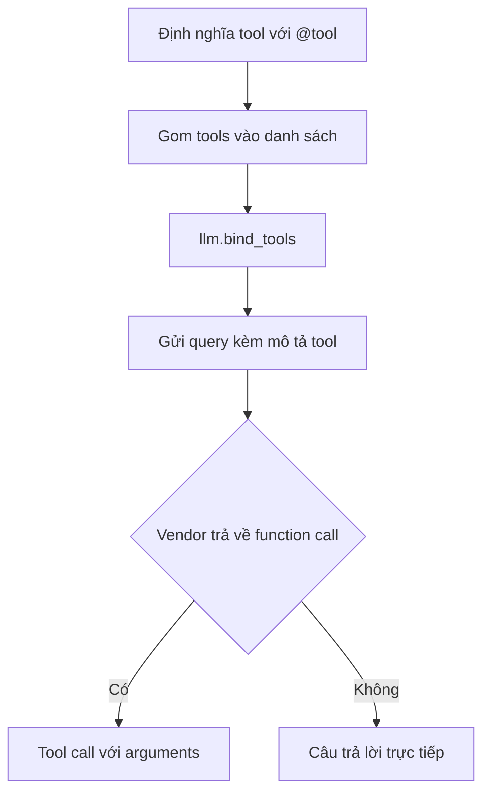

# 🧠 Lập trình "bộ não" của Agent: Hiện thực ReAct Runnable với Function Calling

> Nguồn: `090-Hands-On-Coding-the-Agents-Brain-Implementing-the-ReAct-Runn.txt` · [Udemy](https://ua.udemy.com/course/langchain/learn/lecture/50650905)

Chào các bạn, Eden đây! 👋 Chúng ta đã có môi trường dự án sẵn sàng, giờ là lúc viết "bộ não" cho agent. Trong video này, mình sẽ cùng các bạn hiện thực file `react.py` — nơi chứa **toàn bộ logic suy luận (reasoning logic)** mà graph sẽ sử dụng.

Nói ngắn gọn (TLDR): chúng ta sẽ dùng **function calling** làm **reasoning engine (bộ máy suy luận)** để quyết định xem agent nên gọi công cụ nào.

---

### 📥 Import, nạp biến môi trường và viết công cụ triple

Mình bắt đầu với các import:

* `load_dotenv` từ **dotenv** — nạp biến môi trường và API key.
* `tool` decorator từ **langchain-core** — biến hàm Python thường thành **LangChain tool**.
* `ChatOpenAI` từ **langchain-openai** — thực hiện LLM call tới GPT.
* Đối tượng `search` dựng sẵn từ **langchain-tavily** — công cụ tìm kiếm có thể "cắm" thẳng vào agent.

Nạp biến môi trường xong, mình viết công cụ đầu tiên: hàm **`triple`** nhận đầu vào là một số nguyên hoặc số thực và trả về kết quả nhân ba. Mình chỉ gõ phần đầu của hàm rồi để **Cursor tự động hoàn thiện** — *thật lòng mà nói, mình vẫn thấy việc lập trình đã thay đổi đáng kinh ngạc như thế nào nhờ LLM*. Phần **description (mô tả)** của hàm sau này sẽ được truyền cho LM, để nó tự quyết định có dùng hàm hay không. Và để biến hàm thành một LangChain tool, mình chỉ cần thêm decorator `@tool`:

```python
@tool
def triple(num: float) -> float:
    return num * 3
```

---

### 🧰 Gom các công cụ vào một danh sách

Giờ mình muốn trang bị cho agent không chỉ hàm `triple` mà cả **search tool**. Vì vậy mình tạo biến `tools` — một list gồm hai phần tử, cả hai đều là LangChain tool:

1. Đối tượng **search** dựng sẵn, khởi tạo với **`max_results=1`** — tức là chỉ lấy về đúng **một kết quả tìm kiếm**.
2. Hàm **`triple`** vừa viết ở trên.

```python
tools = [TavilySearch(max_results=1), triple]
```

Một chi tiết hay ho: search tool đã có **description dựng sẵn** do các maintainer của package viết, và nó cũng sẽ được truyền cho LM để LM biết khi nào nên dùng công cụ này.

---

### ⚡ Vì sao function calling thay thế ReAct prompt?

Đã đến lúc bàn về **khả năng suy luận của LLM**: làm sao nó biết nên gọi tool nào? Chắc các bạn còn nhớ **thuật toán ReAct** cùng **ReAct prompt** — một prompt rất "xịn" ra đời từ **ReAct paper**, giúp khai thác khả năng suy luận của LLM. Thời kỳ đầu của agent, người ta dùng đúng prompt đặc biệt này để LLM chọn tool.

| Tiêu chí | ReAct prompt | Function calling |
|---|---|---|
| Cách chọn tool | Prompt đặc biệt, LLM sinh text | LLM trả về function call ở key riêng trong response |
| Parsing | Phải parse output, dễ đổ vỡ | Vendor chịu trách nhiệm parse |
| Chất lượng | Phụ thuộc model thời kỳ đầu | Tốt dần nhờ vendor tối ưu |
| Code cần viết | Nhiều | Ít hơn hẳn |

Ngày nay mọi thứ đã tiến hóa thành **function calling** — một tính năng có trong hầu hết LLM hiện đại. Khi khởi tạo LLM, ta cung cấp **định nghĩa, hướng dẫn và chi tiết của các tool**, rồi LLM sẽ trả về trong response xem có cần gọi hàm nào và với **arguments (đối số)** gì.

Chúng ta **không được thấy** phần hiện thực bên trong của từng nhà cung cấp LLM — mỗi vendor làm một kiểu, có thể là một **system prompt đặc biệt** tương tự ReAct prompt để định dạng câu trả lời cho đúng. Nhưng điểm mấu chốt là: **vendor chịu trách nhiệm parse (phân tích) response** và đặt phần function call vào đúng key trong response trả về. Nếu muốn đào sâu cách hiện thực này, mình đã dành riêng vài video trong khóa học để mổ xẻ chủ đề đó.

*Đừng lo nếu bạn chưa hiểu tường tận phần này.* Điều cần nhớ: đây là cách **hiện đại** để chọn tool, và chúng ta đang **offload (khoán)** việc chọn tool đúng cho vendor. Lợi ích rất lớn: **ít code phải viết hơn**, còn chất lượng kết quả thì ngày càng tốt lên vì mỗi vendor đều có đội kỹ sư chuyên trách tinh chỉnh việc này.

---

### 🚀 Khởi tạo LLM với bind_tools và chạy thử

Bước cuối cùng: mình khởi tạo một **LLM hỗ trợ function calling**, đưa cho nó danh sách tools vừa định nghĩa, rồi dùng phương thức **`bind_tools`**:

```python
llm = ChatOpenAI().bind_tools(tools)
```

LangChain sẽ lấy **description của các tool** và gửi kèm trong **mọi request** tới LM. Nhờ đó LM có thể trả về **function call / tool calling** với đúng hàm cần gọi, và chúng ta **không phải tự parse** gì cả — vendor đã lo phần đó, kết quả nằm ở một key đặc biệt trong response.



Mình chạy thử script để chắc chắn không có lỗi (dù chưa thực sự gọi gì), rồi **commit** với tên **"function calling reasoning"** và **push** lên repo. Bạn có thể vào mục commits để xem lại toàn bộ code của video này.

---

### 💻 Code mẫu đầy đủ — `react.py`

Toàn bộ "bộ não" của agent nằm gọn trong file `react.py` (tham khảo từ repo chính thức của khóa học):

```python
from dotenv import load_dotenv
from langchain_core.tools import tool
from langchain_openai import ChatOpenAI
from langchain_tavily import TavilySearch

load_dotenv()


@tool
def triple(num: float) -> float:
    """
    param num: a number to triple
    returns: the triple of the input number
    """
    return float(num) * 3


tools = [TavilySearch(max_results=1), triple]

llm = ChatOpenAI().bind_tools(tools)
```

### 🎯 Tự kiểm tra nhanh

**Câu 1:** File `react.py` chứa gì cho agent?

<details>
<summary><b>Xem đáp án</b></summary>

**Đáp án:** Toàn bộ logic suy luận — reasoning engine dùng function calling để quyết định gọi tool nào.

Giải thích: Đây là "bộ não" mà graph sẽ sử dụng trong suốt quá trình thực thi.

Tham chiếu: Mục mở đầu bài.

</details>

**Câu 2:** Decorator `@tool` có tác dụng gì?

<details>
<summary><b>Xem đáp án</b></summary>

**Đáp án:** Biến một hàm Python thường thành LangChain tool.

Giải thích: Description của hàm sẽ được truyền cho LM để nó quyết định có dùng hàm hay không.

Tham chiếu: Mục Import, nạp biến môi trường.

</details>

**Câu 3:** Danh sách `tools` trong bài gồm những gì?

<details>
<summary><b>Xem đáp án</b></summary>

**Đáp án:** Search tool dựng sẵn khởi tạo với max_results=1, và hàm triple.

Giải thích: Cả hai đều là LangChain tool; search tool có description dựng sẵn do maintainer viết.

Tham chiếu: Mục Gom các công cụ vào một danh sách.

</details>

**Câu 4:** Vì sao function calling thay thế được ReAct prompt?

<details>
<summary><b>Xem đáp án</b></summary>

**Đáp án:** Vì nó chuẩn hóa việc chọn tool: vendor parse response và đặt function call vào đúng key; ta không phải tự parse.

Giải thích: Lợi ích là ít code hơn và chất lượng ngày càng tốt nhờ đội kỹ sư của vendor tinh chỉnh.

Tham chiếu: Mục Vì sao function calling thay thế ReAct prompt.

</details>

**Câu 5:** Phương thức `bind_tools` làm gì?

<details>
<summary><b>Xem đáp án</b></summary>

**Đáp án:** Gửi kèm description của các tool trong mọi request tới LM để LM trả về tool call đúng hàm.

Giải thích: Kết quả nằm ở một key đặc biệt trong response, vendor đã lo phần parse.

Tham chiếu: Mục Khởi tạo LLM với bind_tools.

</details>

"Bộ não" đã hình thành! Ở video tiếp theo, chúng ta sẽ hiện thực các **node (nút)** của LangGraph — những "khối thi hành" sẽ chạy trong suốt quá trình thực thi agent. Hẹn gặp lại! 🚀

## Nguồn tham khảo

- [Udemy — Hands-On Coding the Agent's Brain: Implementing the ReAct Runnable](https://ua.udemy.com/course/langchain/learn/lecture/50650905)
- [Tools — Docs by LangChain](https://docs.langchain.com/oss/python/langchain/tools)
- [Agents — Docs by LangChain](https://docs.langchain.com/oss/python/langchain/agents)
