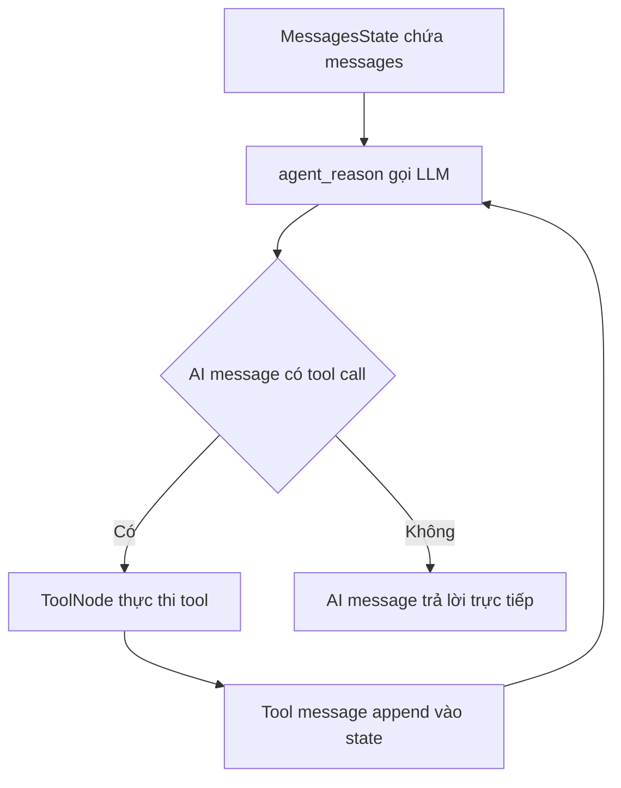

# 🧩 Những "viên gạch" đầu tiên: Định nghĩa các node cho ReAct Agent trong LangGraph

> Nguồn: `091-Hands-On-43-Building-Blocks-Defining-Your-Agents-Nodes-in-La.txt` · [Udemy](https://ua.udemy.com/course/langchain/learn/lecture/50656113)

Chào các bạn, Eden đây! 👋 Chúng ta đã có "bộ não" suy luận với function calling, giờ là lúc dựng tiếp các **building block (khối xây dựng)** của graph. Trong video này, mình sẽ cùng các bạn viết file `node.py` — nơi chứa **hiện thực các node** mà agent sẽ thực thi.

---

### 📦 Import các "viên gạch" từ LangGraph

Mình bắt đầu bằng việc nạp biến môi trường, sau đó import các **primitive (thành phần nguyên thủy)** của LangGraph:

* **`MessagesState`** — một object đơn giản chứa **dictionary** với key là `messages`, còn giá trị là **danh sách các message**. Nó giữ **state (trạng thái)** của toàn bộ hội thoại qua lại giữa agent và con người: **human message** và **AI message**.
* **`ToolNode`** — một **node dựng sẵn (prebuilt node)** trong `langgraph.prebuilt`, chuyên lo việc **thực thi tool**.
* Từ file `react.py`: **LLM đã bind tools** và **danh sách tools** mà chúng ta định nghĩa ở video trước.

---

### 🧠 Node suy luận: agent_reason

Đây chính là **reasoning engine (bộ máy suy luận)** của agent. Node này nhận message, quyết định xem có thể trả lời trực tiếp hay cần gọi tool, và nếu cần thì chuẩn bị luôn các **arguments (đối số)** cho tool đó.

Mình định nghĩa một **system message** rất chung chung: "bạn là một trợ lý hữu ích, có quyền truy cập vào các tool để trả lời câu hỏi". Sau đó là node đầu tiên — nhận **state** (là `MessagesState`, một dictionary có key `messages`) và đơn giản gọi LLM với đầu vào của người dùng. LLM sẽ "cân" toàn bộ phần việc nặng nhọc vì nó đã được **bind tools** và tận dụng **function calling**.

Mình truyền vào LLM **system message** cùng **toàn bộ messages** trong state: ở vòng lặp đầu tiên chỉ có **human message**; sang vòng thứ hai sẽ có thêm **response của LLM**, và cứ thế tiếp tục — mọi thông tin đều nằm trong `messages` của state. Sau khi node chạy xong, mình trả về một dictionary với key `messages` chứa **AI message** vừa sinh ra, và nó tự động được **append** vào state.

*Một chi tiết nhỏ mình muốn lưu ý:* ban đầu mình truy cập `messages` như một **thuộc tính Python**, nhưng sau đó đổi sang truy cập bằng **key của dictionary** để chắc chắn hơn.

```python
SYSTEM_MESSAGE = "You are a helpful assistant with access to tools that you can use to answer the question."

def agent_reason(state: MessagesState) -> MessagesState:
    response = llm.invoke(
        [{"role": "system", "content": SYSTEM_MESSAGE}, *state["messages"]]
    )
    return {"messages": [response]}
```

---

### 🛠️ Node công cụ: ToolNode

Phần còn lại là định nghĩa node chứa các tool liên quan, giúp LangGraph **thực thi tool** khi cần. Mình khởi tạo đối tượng `ToolNode` từ `langgraph.prebuilt` và truyền vào danh sách tools của chúng ta — search tool và triple tool (đều là LangChain tool).

Node này "cân" rất nhiều việc nặng: nó có thể **chạy tool song song (parallel)**, chạy ở **chế độ streaming**, cùng rất nhiều tính năng thú vị khác. Nhưng ở thời điểm này chúng ta chỉ dùng **phiên bản vanilla (cơ bản nhất)**.

Vòng đời dữ liệu giữa `agent_reason` và `tool_node` diễn ra như sau:



Cách nó hoạt động: kiểm tra **message cuối cùng** giữa agent và con người; nếu đó là một AI message có **tool call hợp lệ**, nó sẽ đi thực thi đúng đoạn code của tool đó. Nghĩa là nếu agent quyết định chạy search hoặc gọi hàm `triple`, mọi thứ sẽ diễn ra ngay trong ToolNode. *Trước khi có object này, mình từng phải viết cả một tràng boilerplate chỉ để chạy tool trong graph.*

```python
tool_node = ToolNode(tools)
```

| Node | Nhiệm vụ | Đầu vào | Đầu ra |
|---|---|---|---|
| `agent_reason` | Gọi LLM suy luận và chọn tool | State với danh sách messages | AI message chứa tool call hoặc câu trả lời |
| `tool_node` | Thực thi tool mà LLM yêu cầu | AI message có tool call hợp lệ | Tool message chứa kết quả tool |

---

### ✅ Chốt lại và commit

### 🎯 Tự kiểm tra nhanh

**Câu 1:** `MessagesState` là gì?

<details>
<summary><b>Xem đáp án</b></summary>

**Đáp án:** Object chứa dictionary với key `messages`, giá trị là danh sách message.

Giải thích: Nó giữ state của toàn bộ hội thoại qua lại giữa agent và con người — human message và AI message.

Tham chiếu: Mục Import các viên gạch.

</details>

**Câu 2:** `ToolNode` là gì và nằm ở đâu?

<details>
<summary><b>Xem đáp án</b></summary>

**Đáp án:** Prebuilt node trong `langgraph.prebuilt`, chuyên thực thi tool.

Giải thích: Nó có thể chạy tool song song, hỗ trợ streaming; trong bài chỉ dùng phiên bản vanilla.

Tham chiếu: Mục Node công cụ.

</details>

**Câu 3:** Node `agent_reason` làm gì?

<details>
<summary><b>Xem đáp án</b></summary>

**Đáp án:** Nhận state, gọi LLM (đã bind tools) với system message và toàn bộ messages để quyết định trả lời trực tiếp hay gọi tool.

Giải thích: LLM "cân" phần việc nặng nhờ function calling; kết quả trả về là AI message được append vào state.

Tham chiếu: Mục Node suy luận: agent_reason.

</details>

**Câu 4:** Mỗi node trong LangGraph trả về gì?

<details>
<summary><b>Xem đáp án</b></summary>

**Đáp án:** Một dictionary chứa phần cập nhật cho state.

Giải thích: Node luôn nhận state hiện tại và luôn trả về cập nhật; state thay đổi dần theo thời gian.

Tham chiếu: Mục Node suy luận: agent_reason.

</details>

**Câu 5:** ToolNode quyết định chạy tool dựa trên cơ sở nào?

<details>
<summary><b>Xem đáp án</b></summary>

**Đáp án:** Kiểm tra message cuối cùng; nếu là AI message có tool call hợp lệ thì thực thi đúng code của tool đó.

Giải thích: Nhờ vậy khi agent chọn search hoặc triple, mọi thứ diễn ra ngay trong ToolNode.

Tham chiếu: Mục Node công cụ.

</details>

Chúng ta vừa hoàn thành các node của graph — và để ý rằng mình viết **rất ít code**, nhờ tận dụng các primitive của LangGraph nên tiết kiệm được kha khá **boilerplate**. Và nhờ **function calling**, LLM tự lo phần **reasoning**: chúng ta không cần viết prompt đặc biệt, cũng không cần parse gì cả.

Mình commit phần này với tên **"notes"** và push lên repo để các bạn tiện theo dõi. Ở video tiếp theo, chúng ta sẽ **stitch (nối) mọi thứ lại** thành một graph hoàn chỉnh. Cùng chờ nhé! 🚀

## Nguồn tham khảo

- [Udemy — Hands-On Building Blocks: Defining Your Agent's Nodes in LangGraph](https://ua.udemy.com/course/langchain/learn/lecture/50656113)
- [Use the graph API — Docs by LangChain](https://docs.langchain.com/oss/python/langgraph/use-graph-api)
- [Graph API overview — Docs by LangChain](https://docs.langchain.com/oss/python/langgraph/graph-api)
