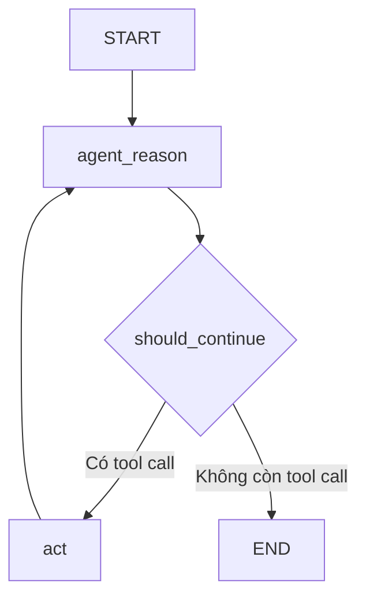

# 🔗 Đưa ReAct Agent "sống dậy": Nối các node thành một Graph hoàn chỉnh

> Nguồn: `092-Hands-On-Bringing-Your-ReAct-Agent-to-Life-Connecting-Nodes-.txt` · [Udemy](https://ua.udemy.com/course/langchain/learn/lecture/50659311)

Chào các bạn, Eden đây! 👋 Sau khi đã có "bộ não" và các node, đây là thời khắc đẹp nhất: **ghép tất cả chúng lại với nhau**. Trong video này, mình sẽ cùng các bạn hiện thực graph trong `main.py` và biến ý tưởng thành một **ReAct graph** thực sự chạy được.

---

### 🧱 Import và các hằng số cho code sạch

Mình bắt đầu với các import:

* **`HumanMessage`** từ **langchain-core** — đây sẽ là **đầu vào (input)** để khởi động graph.
* **`MessagesState`** và **`StateGraph`** từ **langgraph.graph** — trong đó `StateGraph` là **graph tổng quát nhất**, có thể nhận bất kỳ object state nào chúng ta đưa vào.
* Hai node vừa viết ở file `node.py`: **`agent_reason`** và **`tool_node`**.

Tiếp đó, mình định nghĩa vài **hằng số** để code gọn gàng hơn: tên của node suy luận, tên `act` cho node hành động, và hằng số **`LAST = -1`** — chỉ số của message cuối cùng giữa người dùng và agent (một cú pháp index quen thuộc của Python). *Nghe có vẻ nhỏ nhặt, nhưng những hằng số này giúp code dễ đọc hơn hẳn khi graph lớn dần.*

---

### 🗺️ Khởi tạo graph, thêm node và entry point

Giờ là lúc tạo object **`StateGraph`** và truyền vào `MessagesState`. Mình đặt tên biến là **`flow`** (thay vì `graph`) cho dễ phân biệt. Sau đó lần lượt `add_node` cho hai node: **`agent_reason`** và **`act`** — dùng chính các hằng số vừa khai báo.

Một điểm thú vị: Cursor tự động gợi ý mình thêm **edge từ START tới `agent_reason`** — hoàn toàn chính xác. Nhưng mình muốn định nghĩa theo cách khác: dùng **`flow.set_entry_point(AGENT_REASON)`**. Đây là cách mình thích dùng để khai báo edge đi từ node khởi đầu tới node suy luận.

---

### 🔀 Conditional edge và hàm should_continue

Đây là phần thú vị nhất của video. Mình thêm một **conditional edge (cạnh có điều kiện)** xuất phát từ `agent_reason`, đi tới `act` hoặc tới `end` tùy theo một hàm mà chúng ta tự viết: **`should_continue`**.

Hàm này nhận **state** của graph (chính là `MessagesState`) và trả về một **chuỗi**, cho biết node nào sẽ chạy tiếp theo. Logic cực kỳ đơn giản: nó kiểm tra message cuối cùng — nếu đó là một **tool call**, nghĩa là **reasoning engine** đã quyết định phải gọi tool (và đã có đủ thông tin về arguments), nên graph sẽ đi tới node `act` để thực thi tool. Nếu không có tool call, mọi thứ **kết thúc** — đây là "heuristic" cho biết LLM đã có thể tự trả lời câu hỏi, dù có hay không có tool.

Đi kèm conditional edge là một **dictionary mapping (ánh xạ)**: từ chuỗi `end` tới node end, và từ chuỗi `act` tới node `act`. Ánh xạ này cho LangGraph biết kết quả trả về của `should_continue` tương ứng với node nào. *Nếu không viết mapping, graph vẫn chạy đúng như chúng ta muốn, nhưng bản vẽ sẽ không rõ ràng* — mapping giúp thể hiện trực quan những **đường nét đứt (dotted lines)** trên sơ đồ graph.

| Loại edge | Cách hoạt động | Ví dụ trong bài |
|---|---|---|
| Edge thường | Nối cố định node này sang node kế tiếp | `act` quay về `agent_reason` |
| Conditional edge | Gọi hàm quyết định, hàm trả về tên node | `should_continue` chọn `act` hoặc `end` |
| Entry point | Edge đặc biệt từ START | `set_entry_point` tới `agent_reason` |

Cuối cùng, mình thêm **edge từ `act` quay về `agent_reason`**: sau khi gọi tool xong, agent cần **suy luận lại** để xem nên trả lời luôn hay tiếp tục gọi một tool khác.

Ghép tất cả lại, chiếc ReAct graph có dạng:



```python
def should_continue(state: MessagesState) -> str:
    if state["messages"][LAST].tool_calls:
        return ACT
    return "end"

flow = StateGraph(MessagesState)
flow.add_node(AGENT_REASON, agent_reason)
flow.add_node(ACT, tool_node)
flow.set_entry_point(AGENT_REASON)
flow.add_conditional_edges(AGENT_REASON, should_continue, {"act": ACT, "end": "end"})
flow.add_edge(ACT, AGENT_REASON)
app = flow.compile()
```

---

### ✅ Compile và "trục trặc" nhỏ khi vẽ graph

Sau khi định nghĩa xong **node**, **entry point** và **edge**, mình **compile** graph rồi in nó ra để kiểm tra: dùng `get_graph().draw_mermaid_png()` để vẽ sơ đồ và xuất ra file **`flow.png`**.

Chạy lần đầu, chúng ta gặp lỗi: **không import được `MessagesState`** — hóa ra mình thiếu một chữ **S** (thành `MessageState`). *Đúng kiểu lỗi nhỏ mà Cursor đôi khi gây ra.* Mình sửa lại, và nhận ra phải cập nhật luôn phần còn lại của code — cả trong hàm `should_continue` — để dùng đúng `MessagesState`. Chạy lại: thành công, và bản vẽ graph hiện ra đúng như sơ đồ mình trình bày trong video.

### 🎯 Tự kiểm tra nhanh

**Câu 1:** `StateGraph` được khởi tạo với gì trong bài?

<details>
<summary><b>Xem đáp án</b></summary>

**Đáp án:** `MessagesState`.

Giải thích: StateGraph là graph tổng quát nhất, nhận bất kỳ object state nào; biến được đặt tên `flow`.

Tham chiếu: Mục Khởi tạo graph.

</details>

**Câu 2:** `set_entry_point` dùng để làm gì?

<details>
<summary><b>Xem đáp án</b></summary>

**Đáp án:** Khai báo node bắt đầu của graph — trong bài là `agent_reason`.

Giải thích: Đây là cách Eden thích dùng thay cho edge START, dù Cursor gợi ý cách kia cũng đúng.

Tham chiếu: Mục Khởi tạo graph.

</details>

**Câu 3:** Hàm `should_continue` trả về gì và dựa trên cơ sở nào?

<details>
<summary><b>Xem đáp án</b></summary>

**Đáp án:** Trả về chuỗi `"act"` hoặc `"end"`, dựa trên việc message cuối có tool call hay không.

Giải thích: Có tool call nghĩa là reasoning engine muốn gọi tool; không có nghĩa là LLM đã tự trả lời được.

Tham chiếu: Mục Conditional edge và hàm should_continue.

</details>

**Câu 4:** Vì sao có edge từ `act` quay về `agent_reason`?

<details>
<summary><b>Xem đáp án</b></summary>

**Đáp án:** Để sau khi gọi tool xong, agent suy luận lại xem nên trả lời luôn hay gọi tiếp tool khác.

Giải thích: Đây chính là cycles — phần cốt lõi làm nên agent loop.

Tham chiếu: Mục Conditional edge và hàm should_continue.

</details>

**Câu 5:** "Trục trặc" nhỏ gặp phải khi chạy graph lần đầu là gì?

<details>
<summary><b>Xem đáp án</b></summary>

**Đáp án:** Không import được `MessagesState` vì thiếu một chữ S — viết nhầm thành `MessageState`.

Giải thích: Cursor đôi khi gây ra lỗi nhỏ kiểu này; sửa xong ở mọi chỗ thì bản vẽ graph hiện ra đúng.

Tham chiếu: Mục Compile và trục trặc nhỏ.

</details>

Vậy là chiếc graph đầu tiên đã thành hình! Ở video tiếp theo, chúng ta sẽ **chạy thử toàn bộ mọi thứ**, mở **trace** trên LangSmith và xem chính xác nó hoạt động ra sao. Hẹn gặp lại! 🚀

## Nguồn tham khảo

- [Udemy — Hands-On Bringing Your ReAct Agent to Life: Connecting Nodes into a Graph](https://ua.udemy.com/course/langchain/learn/lecture/50659311)
- [Use the graph API — Docs by LangChain](https://docs.langchain.com/oss/python/langgraph/use-graph-api)
- [Graph API overview — Docs by LangChain](https://docs.langchain.com/oss/python/langgraph/graph-api)
