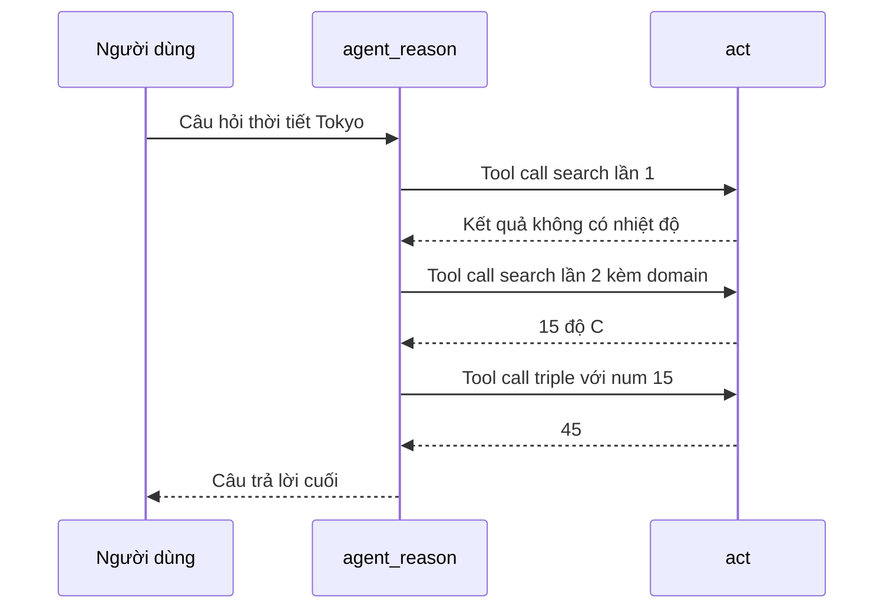

# 🏃 Chạy thử ReAct Agent: Gọi tool thật, nhìn trace thật

> Nguồn: `093-Hands-On-Running-Our-LangGraph-React-Agent-with-Function-Cal.txt` · [Udemy](https://ua.udemy.com/course/langchain/learn/lecture/50679481)

Chào các bạn, Eden đây! 👋 Graph đã sẵn sàng, và đây là khoảnh khắc chúng ta chờ đợi: **chạy thử ReAct Agent** đầu tiên và xem nó xử lý một câu hỏi thực tế như thế nào.

---

### 🚀 Gọi graph lần đầu và kỳ vọng của chúng ta

Mình bắt đầu bằng `app.invoke()` — gọi graph với **input** là một dictionary có key `messages`, bên trong là một **human message** với nội dung: *"what is the weather in Tokyo. List it and then triple it."*

Kỳ vọng của mình rất rõ ràng: vì cần **thông tin thời gian thực (real-time)**, agent phải tự suy luận rằng nó cần gọi **search tool** để tìm thời tiết ở Tokyo; sau khi có kết quả, nó phải gọi tiếp **triple tool**. Khi cả hai tool chạy xong, nó mới có thể trả lời.

```python
result = app.invoke(
    {"messages": [HumanMessage(content="What is the weather in Tokyo. List it and then triple it.")]}
)
print(result["messages"][LAST].content)
```

Mình in kết quả ra bằng cách lấy **message cuối cùng** và đọc `content`, dùng đúng hằng số `LAST`. Chờ một chút... và **boom**, kết quả hiện ra!

---

### 📊 Kết quả và một chút tinh chỉnh

Lần chạy đầu tiên, agent liệt kê một loạt chỉ số thời tiết, rồi chọn **độ ẩm là 69** và nhân ba thành **207**. *Hơi thiếu rõ ràng một chút!* Nên mình đổi câu hỏi thành: *"what is the temperature in Tokyo listed and then triple it"*.

Chạy lại, chúng ta nhận được: **nhiệt độ hiện tại ở Tokyo là 15 độ C**, nhân ba thành **45**. ReAct agent với LangGraph đã hoạt động đúng như mong đợi!

Một điều đáng lưu ý: câu trả lời **chạy hơi lâu**, bởi agent phải thực hiện một chuỗi bước: **suy luận** (một LLM call) → **gọi tool** → **suy luận lại** → gọi tiếp tool... *Đừng sốt ruột khi thấy nó chạy lâu hơn một lời gọi chat thông thường — đó là cái giá của một agent thực thụ.*

---

### 🔍 Mổ xẻ trace trên LangSmith

Để "nhìn tận mắt" những gì đang diễn ra, mình mở **LangSmith** và xem **trace** của quá trình thực thi: các node đã chạy, các tool call đã gọi — mọi thứ đều hiện rõ. Trong project **react-function-calling**, chúng ta có **hai trace**; mình mở trace thứ hai.

Điều đầu tiên đập vào mắt: **search tool được gọi tới hai lần**, dù ta có thể kỳ vọng chỉ một lần. Theo kinh nghiệm của mình, đây là **hành vi hoàn toàn bình thường**: kết quả tìm kiếm đôi khi không chính xác hoặc không đủ thông tin, và agent **đủ thông minh để nhận ra** rồi **tự chạy lại tool** cho tới khi có câu trả lời.

*Một mẹo nhỏ nếu bạn muốn tiết kiệm số lần gọi tool:* với công cụ tìm kiếm, hãy thêm argument **`max_results`** — ví dụ đặt thành **5** thay vì **1** — để một trong các kết quả chắc chắn chứa thông tin bạn cần. *Tất nhiên đây chỉ là heuristic (suy đoán có cơ sở), không phải bảo đảm tuyệt đối.*

Giờ hãy đi qua từng node:

1. **Node `agent_reason`** — ta thấy **system message** cùng **cả hai tool** được gửi đi, và kết quả trả về là quyết định gọi search tool với truy vấn *"current temperature in Tokyo"*.
2. **Hàm `should_continue`** — thú vị ở chỗ nó **không phải là một node**, mà là **conditional edge function**. Đầu vào của nó là message cuối — một **AI tool call** — và nó quyết định graph nên đi tới node `act`.
3. **Node `act`** — thực thi hàm search với đầu vào *"current temperature in Tokyo"*. Lần này kết quả trả về **không chứa nhiệt độ**, tức là một kết quả **không hữu ích**. Nhưng nhờ có **edge từ `act` quay về `agent_reason`**, agent nhận được kết quả đó, tự đánh giá và quyết định **tìm kiếm thêm một lần nữa** — lần này kèm theo một **domain cụ thể**, và kết quả đã có **15°C**, tốt hơn hẳn.
4. **Quay lại `agent_reason`** — lần này agent quyết định gọi **triple tool** với `num = 15`, được **trích xuất từ kết quả tool trước đó**. Node `act` thực thi triple với đầu vào **15**, trả về **45**.
5. **Node cuối cùng** — lại là `agent_reason`, và lần này nó quyết định **không cần làm gì thêm**, tức là kết thúc.

Mình có đính kèm **trace này vào phần Resources** của video và **công khai (public)** nó để các bạn xem trực tiếp.

Diễn biến đầy đủ của một lần chạy được tóm tắt bằng sơ đồ tuần tự:



---

### 🎯 Chốt lại và commit

Mình commit phần này với tên **"graph"** và push lên repo — bạn có thể tìm thấy toàn bộ code của section trong commit đó.

Mục tiêu lớn nhất của section này là cho các bạn thấy **việc hiện thực một ReAct agent với LangGraph dễ dàng đến mức nào**. Không chỉ dùng graph, chúng ta còn tận dụng **function calling**, và chính điều đó mang lại cho ReAct agent của chúng ta **sự ổn định (stability)** cùng **hiệu năng tốt hơn**.

### 🎯 Tự kiểm tra nhanh

**Câu 1:** Input để gọi graph bằng `app.invoke()` có dạng thế nào?

<details>
<summary><b>Xem đáp án</b></summary>

**Đáp án:** Một dictionary có key `messages`, bên trong là HumanMessage chứa câu hỏi.

Giải thích: Kết quả in ra bằng cách lấy message cuối cùng và đọc `content`, dùng hằng số `LAST`.

Tham chiếu: Mục Gọi graph lần đầu.

</details>

**Câu 2:** Vì sao agent phải gọi search tool rồi tới triple tool?

<details>
<summary><b>Xem đáp án</b></summary>

**Đáp án:** Vì cần thông tin thời gian thực (nhiệt độ Tokyo) trước, rồi mới nhân ba kết quả đó.

Giải thích: Đây là biểu hiện của reasoning: suy luận — gọi tool — suy luận lại.

Tham chiếu: Mục Gọi graph lần đầu.

</details>

**Câu 3:** Vì sao search tool trong trace bị gọi tới hai lần?

<details>
<summary><b>Xem đáp án</b></summary>

**Đáp án:** Vì kết quả tìm kiếm lần đầu không chứa nhiệt độ, agent tự nhận ra và chạy lại tool.

Giải thích: Đây là hành vi hoàn toàn bình thường — agent chạy lại cho tới khi có câu trả lời.

Tham chiếu: Mục Mổ xẻ trace trên LangSmith.

</details>

**Câu 4:** Mẹo nào giúp giảm số lần gọi search tool?

<details>
<summary><b>Xem đáp án</b></summary>

**Đáp án:** Tăng argument `max_results` — ví dụ từ 1 lên 5 — để chắc chắn có kết quả chứa thông tin cần.

Giải thích: Đây chỉ là heuristic, không phải bảo đảm tuyệt đối.

Tham chiếu: Mục Mổ xẻ trace trên LangSmith.

</details>

**Câu 5:** `should_continue` xuất hiện trong trace với vai trò gì?

<details>
<summary><b>Xem đáp án</b></summary>

**Đáp án:** Nó không phải node mà là conditional edge function, quyết định graph đi tới `act` hay kết thúc.

Giải thích: Đầu vào của nó là message cuối — một AI tool call.

Tham chiếu: Mục Mổ xẻ trace trên LangSmith.

</details>

Chúc mừng các bạn đã đi hết chặng này! *Nếu lần chạy đầu tiên của bạn tốn vài giây, cứ yên tâm — agent đang suy nghĩ, chứ không phải bị "đơ" đâu.* Hẹn gặp lại các bạn ở những bài tiếp theo! 🚀

## Nguồn tham khảo

- [Udemy — Hands-On Running Our LangGraph ReAct Agent with Function Calling](https://ua.udemy.com/course/langchain/learn/lecture/50679481)
- [LangSmith Observability — Docs by LangChain](https://docs.langchain.com/langsmith/observability)
- [LangGraph overview — Docs by LangChain](https://docs.langchain.com/oss/python/langgraph/overview)
