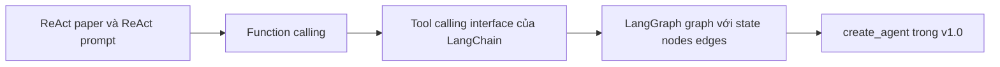

# 🕰️ Từ ReAct Paper đến LangGraph v1.0: Hành trình tiến hóa của LLM Agent

> Nguồn: `094-IMPORTANT-Building-Modern-LLM-Agents-From-History-to-LangGra.txt` · [Udemy](https://ua.udemy.com/course/langchain/learn/lecture/53996453)

Chào các bạn, Eden đây! 👋 Trước khi bước sang những chặng đường mới, mình muốn cùng các bạn **nhìn lại toàn bộ hành trình agent** mà chúng ta đã đi qua — từ thuật toán ReAct cho tới LangGraph v1.0 hiện đại.

Đến giờ, mình thực sự hy vọng **ReAct algorithm** cùng toàn bộ kiến trúc và cách hiện thực của nó đã **rõ như ban ngày** với các bạn. *Nếu có ai đánh thức bạn dậy lúc nửa đêm và hỏi "Flow của thuật toán ReAct là gì?", mình tin bạn sẽ kể vanh vách không sót một chữ!*

---

### 🔁 Ôn nhanh và khởi nguồn: ReAct paper

Ôn lại một chút: chúng ta gửi **query** tới ReAct agent; **large language model** suy ngẫm, tính toán và quyết định nên gọi tool nào; chúng ta thực thi tool đó; và lặp lại quy trình như vậy cho tới khi có **câu trả lời cuối cùng** — tức là khi không còn tool nào cần gọi nữa.

Mọi thứ bắt đầu từ **ReAct paper** và **ReAct prompt**: LLM đóng vai **reasoning engine**, còn LangChain thực hiện phần **parsing (phân tích)** khá "màu mè" để trích ra tool cần thực thi. Cách hiện thực này **cực kỳ ấn tượng** so với thời điểm đó, nhưng nó **không đủ đáng tin cậy** để dùng trong môi trường thực tế (production): các mô hình thời ấy còn yếu và rất khó để parse output.

Vấn đề nằm ở chỗ output rất **non-deterministic (không xác định)**: ta hầu như không kiểm soát được LLM sẽ sinh ra **token** nào, nên chỉ cần model sinh **sai một token**, toàn bộ quá trình parsing có thể **đổ vỡ**.

---

### ⚡ Function calling và Tool Calling Interface

Rồi các LLM trở nên tốt hơn và **function calling** ra đời, **chuẩn hóa (normalized)** toàn bộ quá trình để LLM hoạt động như một reasoning engine. **ReAct prompt không còn cần thiết nữa**: ta có thể dựa vào khả năng function calling của vendor và của model, model sẽ tự trả về **hàm cần gọi** — ở một **vị trí đặc biệt** trong response. Việc parsing "kỳ dị" và thiếu ổn định ngày trước giờ do vendor lo.

Nhưng tiến hóa luôn kéo theo vấn đề mới: **mỗi vendor làm một kiểu**. Có nơi gọi là **function calling**, có nơi gọi là **tool calling**; thông tin về hàm nằm ở những phần khác nhau của response. Vậy nên LangChain đã tạo ra **một interface duy nhất — tool calling interface** — đồng thời hiện thực **tích hợp (integration) cho từng vendor**. Kết quả: chúng ta chỉ cần một interface, nhận đủ thông tin về các hàm cần gọi, và **chạy được với mọi vendor**.

---

### 🕸️ LangGraph: khi agent trở thành một graph

Đến khi **LangGraph** xuất hiện, mọi thứ thay đổi về mặt kiến trúc. Trước đây, agent là một **vòng lặp dựa trên hàm (function-based agent loop)** — thực chất là một vòng `while` được "đóng gói" bởi class **AgentExecutor** của LangChain. Vòng lặp đó **thiếu linh hoạt**, **thiếu khả năng quan sát (visibility)** và gần như **không thể kiểm soát**.

LangGraph mô hình hóa agent thành **graph**, với ba thành phần:

* **State (trạng thái)** — một dictionary lưu giữ hội thoại và có thể cả các kết quả trung gian.
* **Node (nút)** — những hàm Python đơn giản nhận state, thực hiện tính toán (ví dụ gọi LLM hoặc chạy tool), rồi trả về **state đã cập nhật**.
* **Edge (cạnh)** — định hình **luồng điều khiển (control flow)**.

Động lực rất lớn đằng sau LangGraph: LangChain nhận ra rằng trong **hầu hết các paper mô tả agent**, người ta thực chất đang mô tả một **graph với node và edge**. Sự thay đổi kiến trúc này giúp **"lộ diện" luồng điều khiển** — giờ đây ta có một cấu trúc graph tường minh, thậm chí có thể **in ra thành hình ảnh**, thay vì đoán mò điều gì đang được thực thi.

Còn nhớ **state** thời AgentExecutor không? Muốn thêm state là một cơn ác mộng: phải dùng **keyword arguments** với một **config object**, cực kỳ khó khăn. Với LangGraph và **state schema**, mọi chuyện đơn giản hơn hẳn: chỉ cần khai báo **field** muốn theo dõi trong state.

Về **monitoring (giám sát)** và **tracing (theo dõi luồng chạy)**: AgentExecutor nguyên bản gần như **không cho ta cách nào** để theo dõi. LangGraph thì có **automatic checkpoints (điểm lưu tự động)**: trước mỗi lần node được thực thi, LangChain **lưu lại state**, và ta có thể truy cập để biết **chính xác điều gì đã xảy ra, vào lúc nào** — thậm chí **rewind (tua lại)** và **du hành ngược thời gian**, mang lại độ linh hoạt lớn hơn rất nhiều.

Và điều lớn lao nhất mà LangGraph mở ra: **compose (lắp ghép) các graph** — agent này nằm trong agent khác. Ta có thể dùng **một LangGraph graph làm node của một LangGraph khác**, kèm theo **tracing out-of-the-box** và mọi lợi ích khác. *Điều này gần như bất khả thi với AgentExecutor nguyên bản.*

| Tiêu chí | AgentExecutor | LangGraph |
|---|---|---|
| Kiến trúc | Vòng while function-based | Graph với state, node, edge |
| Thêm state | Rất khó, phải dùng config object | Khai báo field trong state schema |
| Monitoring và tracing | Gần như không có | Automatic checkpoints, rewind, LangSmith |
| Lắp ghép agent | Gần như bất khả thi | Graph lồng nhau với tracing sẵn có |
| Kiểm soát luồng | Thiếu visibility | Luồng tường minh, in ra được |

---

### 🚀 LangGraph v1.0 và create_agent

Agent LangGraph này sống trong thư viện LangGraph, dưới **graph prebuilt agents**, suốt một thời gian dài — và chính chúng ta vừa tự tay hiện thực một phiên bản rất giống nó trong section này!

Rồi **LangChain và LangGraph chạm mốc version 1.0**, mang đến một **API sạch sẽ hơn** với hàm **`create_agent`**. LangChain đã **deprecated `create_react_agent`** cùng **prebuilt agent của LangGraph**, gom tất cả vào một hàm duy nhất. `create_agent` trả về **một compiled graph** — thực chất là **LangGraph ở bên dưới (under the hood)** — nhưng với interface đơn giản: đưa vào **model** và **tools**, bạn nhận ngay một ReAct agent sẵn sàng hoạt động, kèm **observability (khả năng quan sát)**, **debugging** và cả sự linh hoạt để tùy biến.

Cả hành trình tiến hóa mà chúng ta vừa đi qua gói gọn trong sơ đồ:

### 🎯 Tự kiểm tra nhanh

**Câu 1:** Cách hiện thực ReAct thời kỳ đầu có nhược điểm gì?

<b>Xem đáp án</b>

**Đáp án:** Output rất non-deterministic và việc parse rất dễ đổ vỡ — chỉ cần model sinh sai một token.

Giải thích: Các mô hình thời ấy còn yếu, nên cách này không đủ đáng tin cậy để dùng trong production.

Tham chiếu: Mục Ôn nhanh và khởi nguồn.

**Câu 2:** Function calling và tool calling interface giải quyết vấn đề gì?

<b>Xem đáp án</b>

**Đáp án:** Chuẩn hóa việc chọn tool; vendor tự parse và đặt function call vào đúng vị trí, còn LangChain tạo một interface duy nhất chạy được với mọi vendor.

Giải thích: ReAct prompt không còn cần thiết; thông tin hàm luôn được trả về đầy đủ.

Tham chiếu: Mục Function calling và Tool Calling Interface.

**Câu 3:** AgentExecutor có những hạn chế nào?

<b>Xem đáp án</b>

**Đáp án:** Là vòng while function-based thiếu linh hoạt, thiếu visibility, gần như không kiểm soát được; thêm state cực khó.

Giải thích: Muốn thêm state phải dùng keyword arguments với config object rất khó khăn.

Tham chiếu: Mục LangGraph: khi agent trở thành một graph.

**Câu 4:** LangGraph cải thiện state và monitoring như thế nào?

<b>Xem đáp án</b>

**Đáp án:** State schema cho phép khai báo field muốn theo dõi; automatic checkpoints lưu state trước mỗi node, cho phép rewind và du hành ngược thời gian.

Giải thích: Nhờ đó ta biết chính xác điều gì đã xảy ra và vào lúc nào.

Tham chiếu: Mục LangGraph: khi agent trở thành một graph.

**Câu 5:** `create_agent` ở LangGraph/LangChain v1.0 là gì?

<b>Xem đáp án</b>

**Đáp án:** API sạch sẽ thay thế create_react_agent và prebuilt agent, trả về một compiled graph với model và tools là có ngay ReAct agent.

Giải thích: Bên dưới vẫn là LangGraph, kèm observability, debugging và khả năng tùy biến.

Tham chiếu: Mục LangGraph v1.0 và create_agent.

Hy vọng các bạn thích video này và toàn bộ **dòng chảy học tập về LangChain agents**. Theo mình, việc **biết mọi thứ khởi đầu từ đâu** vô cùng quan trọng: bạn biết dùng `create_agent`, nhưng **không còn xem nó là "phép thuật"** — bạn hiểu chính xác nó được hiện thực ra sao; interface kia chỉ là cách dùng dễ dàng hơn mà thôi.

Và đây chính là **nền móng cho modern LLM agents cùng deep agents** — chủ đề mà mình rất mong sớm được trình bày trong khóa học. Hẹn gặp lại các bạn ở bài tiếp theo! 🚀

## Nguồn tham khảo

- [Udemy — IMPORTANT: Building Modern LLM Agents: From History to LangGraph](https://ua.udemy.com/course/langchain/learn/lecture/53996453)
- [ReAct: Synergizing Reasoning and Acting in Language Models — arXiv](https://arxiv.org/abs/2210.03629)
- [Agents — Docs by LangChain](https://docs.langchain.com/oss/python/langchain/agents)
- [LangGraph overview — Docs by LangChain](https://docs.langchain.com/oss/python/langgraph/overview)
