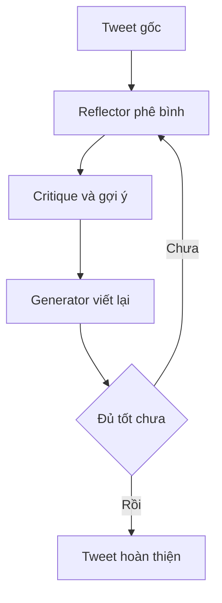

# 🤖 Reflection Agent: Xây "cỗ máy" giúp AI tự phê bình và hoàn thiện chính mình

> Nguồn: `095-What-are-we-building-A-Reflection-Agent.txt` · [Udemy](https://ua.udemy.com/course/langchain/learn/lecture/51118757)

Chào các bạn, hành trình LangChain của chúng ta lại tiếp tục! Bước sang section mới này, mình và các bạn sẽ cùng **lặn sâu vào thế giới của reflection agent (agent tự phản chiếu)** — một kỹ thuật cực kỳ thú vị và hữu dụng. Trước khi bắt tay vào code, hãy cùng điểm qua xem chúng ta sắp xây dựng điều gì nhé.

### 🎯 Reflection Agent là gì và mạnh ở đâu?

Reflection agent là một công cụ mạnh mẽ, được dùng để **nâng cao chất lượng và tỉ lệ thành công của các hệ thống AI**. Cơ chế cốt lõi của nó nằm ở việc **nhắc LLM tự phản chiếu (reflect) lại những hành động trong quá khứ của chính nó**, nhờ đó mà nó có thể học hỏi và tiến bộ dần theo thời gian.

Nghe thì đơn giản, nhưng đây lại là một kỹ thuật vô cùng hiệu quả để biến những câu trả lời "tàm tạm" thành những kết quả chất lượng cao — và nó chính là nền tảng cho rất nhiều kiến trúc agent tiên tiến hơn mà các bạn sẽ gặp về sau.

Có thể hình dung dễ hiểu thế này: thay vì chấp nhận kết quả của lần thử đầu tiên, agent sẽ **tự đặt câu hỏi ngược lại chính mình** — mình đã làm gì, kết quả ra sao, và cần chỉnh sửa điều gì? Chính vòng lặp "làm — tự soi lại — cải thiện" ấy tạo nên sự khác biệt, và cũng là lý do vì sao kỹ thuật này giúp **tăng chất lượng lẫn tỉ lệ thành công** của hệ thống AI theo thời gian.

Vòng lặp đó gói gọn trong sơ đồ sau:

---

### 🐦 Dự án thực hành: Viết lại tweet cho đến khi thật "bay"

Trong dự án lần này, reflection agent của chúng ta sẽ đảm nhận vai trò **chỉnh sửa và cải thiện các bài đăng Twitter**. Mình sẽ dùng một ví dụ thực tế: một tweet mình viết cách đây ít lâu về **LinkedIn**, và agent sẽ giúp mình "mài dũa" nó tốt hơn qua từng vòng lặp.

Cụ thể, quy trình sẽ diễn ra như sau:

1. Agent nhận **tweet gốc** làm đầu vào.
2. Ở bước reflection, nó **đưa ra lời phê bình (critique)** — nhận xét và phản hồi thẳng thắn về tweet của chúng ta.
3. Mình lấy phản hồi này "mớm" ngược lại cho LLM và yêu cầu nó **viết lại** — ta thu được phiên bản revision số 1.
4. Cứ thế, quá trình **lặp đi lặp lại** cho đến khi có một tweet thật sự ổn — và biết đâu đấy, đủ sức để "bay" (viral) trên Twitter.

Điều hay ho là sau mỗi vòng lặp, tweet của chúng ta lại được "nâng cấp" thêm một chút dựa trên chính những lời góp ý trước đó.

---

### ⚙️ Dưới 100 dòng code — nhờ LangGraph "gánh team"

Các bạn có thể đang tự hỏi: làm được tất cả những điều này thì tốn bao nhiêu công sức? Tin cực vui là **không tốn nhiều chút nào!**

Bởi vì **LangGraph** sẽ đảm nhiệm phần lớn công việc nặng nhọc, toàn bộ dự án này sẽ gói gọn trong **chưa đầy 100 dòng code**. Đúng vậy, chỉ dưới 100 dòng là các bạn đã có trong tay một hệ thống AI biết tự phê bình, tự sửa sai và tự hoàn thiện — điều mà nếu tự làm thủ công sẽ ngốn của bạn rất nhiều thời gian và công sức.

*Đừng lo lắng nếu bạn chưa hình dung được vòng lặp này vận hành ra sao — mọi thứ sẽ trở nên cực kỳ rõ ràng ngay khi chúng ta bắt tay vào code, mình hứa đấy!*

Thay vì phải tự tay viết logic vòng lặp phức tạp, chúng ta chỉ cần mô tả luồng chạy của các node và để LangGraph lo phần "nặng nhọc" còn lại.

### 🎯 Tự kiểm tra nhanh

**Câu 1:** Reflection agent giúp ích gì cho hệ thống AI?

<b>Xem đáp án</b>

**Đáp án:** Nâng cao chất lượng câu trả lời và tỉ lệ thành công của hệ thống.

Giải thích: Cơ chế cốt lõi là nhắc LLM tự phản chiếu hành động trong quá khứ để học hỏi và tiến bộ dần.

Tham chiếu: Mục Reflection Agent là gì và mạnh ở đâu.

**Câu 2:** Dự án trong section này dùng agent để cải thiện thứ gì?

<b>Xem đáp án</b>

**Đáp án:** Các bài đăng Twitter — cụ thể là một tweet về LinkedIn.

Giải thích: Agent nhận tweet gốc rồi "mài dũa" nó tốt hơn qua từng vòng lặp.

Tham chiếu: Mục Dự án thực hành.

**Câu 3:** Quy trình của reflection agent gồm những bước nào?

<b>Xem đáp án</b>

**Đáp án:** Nhận tweet gốc → đưa ra critique → "mớm" phản hồi lại cho LLM để viết lại → lặp đến khi ổn.

Giải thích: Sau mỗi vòng, tweet lại được nâng cấp dựa trên chính góp ý trước đó.

Tham chiếu: Mục Dự án thực hành.

**Câu 4:** Vì sao dự án chỉ tốn chưa đầy 100 dòng code?

<b>Xem đáp án</b>

**Đáp án:** Vì LangGraph đảm nhiệm phần lớn công việc nặng nhọc.

Giải thích: Ta chỉ cần mô tả luồng chạy của các node, còn logic vòng lặp để LangGraph lo.

Tham chiếu: Mục Dưới 100 dòng code.

**Câu 5:** Điều gì khiến kỹ thuật này trở thành nền tảng cho các kiến trúc agent tiên tiến?

<b>Xem đáp án</b>

**Đáp án:** Việc LLM tự soi lại và cải thiện qua từng vòng lặp.

Giải thích: Từ vòng lặp "làm — tự soi lại — cải thiện", nhiều kiến trúc agent mạnh hơn được xây dựng về sau.

Tham chiếu: Mục Reflection Agent là gì và mạnh ở đâu.

Hãy thắt dây an toàn, vì ở bài tiếp theo chúng ta sẽ cùng nhau **setup dự án** từ con số không để chuẩn bị cho hành trình này nhé! 🚀

## Nguồn tham khảo

- [Udemy — What are we building? A Reflection Agent](https://ua.udemy.com/course/langchain/learn/lecture/51118757)
- [LangChain Blog — Reflection Agents](https://www.langchain.com/blog/reflection-agents)
