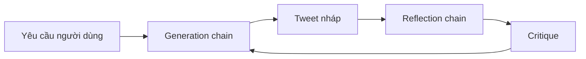

# 🧩 Reflector & Revisor: Bộ đôi chain "phê bình – viết lại" cho Reflection Agent

> Nguồn: `097-Creating-the-Reflector-Chain-and-the-Tweet-Reviosr-Chain.txt` · [Udemy](https://ua.udemy.com/course/langchain/learn/lecture/51118769)

Chào các bạn, lại là Eden đây! Trong bài này, chúng ta sẽ cùng **triển khai những chain sẽ chạy bên trong graph** của reflection agent. Hãy nhớ rằng graph chỉ là "bộ khung" điều phối — muốn lắp ráp nó, chúng ta phải xây dựng trước những "linh kiện" sẽ vận hành bên trong đã.

### ⚙️ Vì sao phải dựng chain trước khi dựng graph?

Trước khi xây graph, chúng ta cần **xây dựng những component sẽ chạy bên trong nó**. Cụ thể ở đây là hai chain:

1. **Generation chain** — chịu trách nhiệm **tạo mới và chỉnh sửa tweet** cho đến khi nó ngày một tốt hơn.
2. **Reflection chain** — nhận tweet đầu vào, **đưa ra phản hồi, phê bình và gợi ý** cách cải thiện.

| Chain | Nhiệm vụ | Prompt sử dụng |
|---|---|---|
| Generation chain | Tạo mới và revise tweet | Generation prompt |
| Reflection chain | Phê bình và gợi ý cách cải thiện | Reflection prompt |

Ở mỗi vòng lặp trong graph, phần critique (lời phê bình) này sẽ được "bơm" ngược trở lại generation chain để nó tiếp tục revise.

Mình tạo file **`chains.py`** — nơi chứa toàn bộ prompt và chain dùng trong graph. File bắt đầu với các import quan trọng:

* **`ChatPromptTemplate`** — nơi chứa nội dung chúng ta gửi cho LLM với vai trò "human", hoặc nhận về từ LLM với nhãn "AI".
* **`MessagesPlaceholder`** — cho phép chèn một "chỗ trống" linh động cho các message trong tương lai.
* **`ChatOpenAI`** — để khởi tạo model.

---

### 🔍 Reflection prompt: "Người phê bình" khó tính

Prompt đầu tiên là **reflection prompt** — đóng vai trò như bên phê bình (critique) trong kiến trúc agent của chúng ta. Nó nhìn vào kết quả đầu ra (ở đây là một tweet) và chỉ ra cách để tốt hơn.

System message của nó có nội dung đại ý:

*"You're a viral Twitter influencer creating a tweet. Generate critique and recommendation for the user's tweet. Always provide detailed recommendations including requests for length, virality, style, etc."*

Sau đó, chúng ta đặt một **messages placeholder** với tên biến là `messages`. Khi khởi tạo reflection prompt, mình sẽ "cắm" toàn bộ chuỗi message lịch sử vào đây — nhờ vậy agent có thể phê bình và đưa lời khuyên lặp đi lặp lại qua nhiều vòng.

---

### ✍️ Generation prompt: "Cây viết" không ngừng sửa mình

Prompt thứ hai là **generation prompt** — có nhiệm vụ tạo ra những tweet sẽ được chỉnh sửa liên tục dựa trên feedback từ reflection prompt. Mục tiêu là revise cho đến khi đạt được một tweet thật sự hoàn hảo.

Nội dung message đại ý:

*"You are a Twitter techie influencer assistant tasked with writing excellent Twitter posts. Generate the best Twitter posts possible for the user's request. If the user provides critique, respond with a revised version of your previous attempts."*

Các bạn có thể đặt tên cho nó tùy thích — gọi là **generation prompt** hay **creator prompt** đều được. Ở đây cũng có một `MessagesPlaceholder` với key `messages`, để chứa tất cả reflection và revision từ các bước trước đó.

---

### 🔗 Ghép chain bằng LangChain Expression Language

Giờ là lúc tạo hai chain hoàn chỉnh. Đầu tiên, mình khởi tạo một LLM — mặc định sẽ dùng **GPT-3.5 Turbo**. Sau đó, mình dùng **LangChain Expression Language (LCEL)** để nối prompt với model:

* **Generation chain** — "đấu ống" (`pipe`) generation prompt vào LLM.
* **Reflection chain** — tương tự, pipe reflection prompt vào chính LLM đó.

Hai chain này nối với nhau thành một vòng lặp khép kín:

### 🎯 Tự kiểm tra nhanh

**Câu 1:** Vì sao phải dựng chain trước khi dựng graph?

<b>Xem đáp án</b>

**Đáp án:** Vì graph chỉ là khung điều phối, còn chain mới là "linh kiện" chạy bên trong nó.

Giải thích: Muốn lắp ráp graph, ta phải xây dựng trước những component sẽ vận hành bên trong.

Tham chiếu: Mục Vì sao phải dựng chain trước khi dựng graph.

**Câu 2:** Reflection prompt đóng vai trò gì trong kiến trúc agent?

<b>Xem đáp án</b>

**Đáp án:** Đóng vai "người phê bình" — nhìn vào tweet và chỉ ra cách để tốt hơn.

Giải thích: System message yêu cầu nó generate critique và recommendation, gồm cả độ dài, tính viral, phong cách.

Tham chiếu: Mục Reflection prompt.

**Câu 3:** `MessagesPlaceholder` được dùng để làm gì?

<b>Xem đáp án</b>

**Đáp án:** Tạo một "chỗ trống" linh động để chèn lịch sử message vào prompt.

Giải thích: Nhờ đó agent có thể phê bình và đưa lời khuyên lặp đi lặp lại qua nhiều vòng.

Tham chiếu: Mục Reflection prompt và Generation prompt.

**Câu 4:** Nhiệm vụ của generation prompt là gì?

<b>Xem đáp án</b>

**Đáp án:** Tạo ra tweet và liên tục chỉnh sửa dựa trên feedback từ reflection prompt.

Giải thích: Nếu người dùng đưa critique, nó phải trả về phiên bản revise của lần thử trước.

Tham chiếu: Mục Generation prompt.

**Câu 5:** LCEL được dùng như thế nào để tạo hai chain?

<b>Xem đáp án</b>

**Đáp án:** "Đấu ống" (`pipe`) từng prompt vào cùng một LLM — mặc định là GPT-3.5 Turbo.

Giải thích: Generation prompt pipe vào LLM thành generation chain; reflection prompt tương tự thành reflection chain.

Tham chiếu: Mục Ghép chain bằng LangChain Expression Language.

Vậy là xong phần chain! Ở bài tiếp theo, chúng ta sẽ cùng **lắp ráp graph LangGraph** hoàn chỉnh — nơi các chain này được kết nối thành một vòng lặp tự hoàn thiện. Hẹn gặp lại các bạn! 🚀

## Nguồn tham khảo

- [Udemy — Creating the Reflector Chain and the Tweet Revisor Chain](https://ua.udemy.com/course/langchain/learn/lecture/51118769)
- [LangChain Blog — LangChain Expression Language](https://www.langchain.com/blog/langchain-expression-language)
- [LangChain Blog — Reflection Agents](https://www.langchain.com/blog/reflection-agents)
