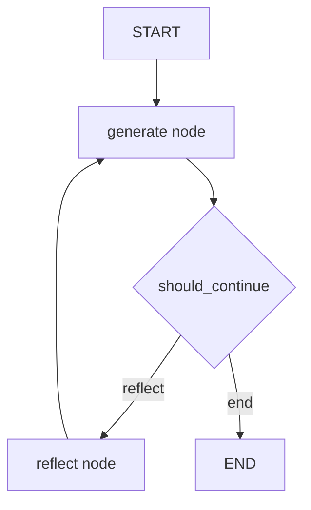

# 🗺️ Defining Our Graph: Lắp "vòng lặp hoàn hảo" cho Reflection Agent với LangGraph

> Nguồn: `098-Defining-our-LangGraph-Graph.txt` · [Udemy](https://ua.udemy.com/course/langchain/learn/lecture/52505041)

Chào các bạn, mình là Eden đây! Sau khi đã có trong tay hai chain "phê bình" và "viết lại", hôm nay chúng ta sẽ làm điều thú vị nhất: **lắp ráp toàn bộ chúng thành một graph LangGraph hoàn chỉnh**. Đây là bài hands-on dài và nhiều "đồ nghề" nhất trong section này, nên các bạn cứ thong thả, từng bước một nhé!

### 🧱 Nodes, edges và state — bộ ba của mọi graph

Sau khi định nghĩa chain, việc tiếp theo là **định nghĩa các node** — những "trạm" sẽ thực thi các chain đó, rồi **nối chúng lại bằng edges** để tạo thành luồng thực thi.

Luồng của chúng ta sẽ như sau:

1. Bắt đầu từ **generate node** — chạy generation chain trên input đầu vào.
2. Sau đó quyết định xem nên **kết thúc** hay tiếp tục đi **reflect**.
3. Nếu tiếp tục, ta lấy output của generation chain và chạy **reflection chain**.
4. Lấy output của reflection node để **tạo lại (regenerate)** nội dung.
5. Cứ thế **lặp lại vòng lặp** cho đến khi thỏa một điều kiện nhất định.

Về **state** — mỗi node đều có quyền truy cập vào state và state chính là **input** của node đó; khi node chạy xong, nó sẽ cập nhật lại state. Trong trường hợp này, state của chúng ta chỉ đơn giản là **một danh sách các message** mà chúng ta liên tục thêm vào.

*Một lưu ý nhỏ:* Video này được **quay lại** để khớp với **LangGraph 1.0**, nên mình sẽ dùng IDE **Cursor** thay vì IDE trước đó — code hoàn toàn giống nhau, chỉ khác IDE thôi, các bạn đừng "hoảng" nhé!

---

### 📦 Imports và state schema với TypedDict + reducer

Đầu tiên, mình import **`TypedDict`** và **`Annotated`**. `TypedDict` tạo ra một dictionary có cấu trúc với gợi ý kiểu cho từng key — cần thiết vì **LangGraph yêu cầu khai báo state có kiểu rõ ràng** để biết dữ liệu nào chảy vào và chảy ra khỏi graph. Còn `Annotated` giúp thêm metadata vào các type hint đó.

Tiếp theo là các import từ LangChain và LangGraph:

* **`BaseMessage`** — abstract base class cho mọi loại message, dùng làm type hint cho danh sách messages, đảm bảo an toàn cho cả `HumanMessage`, `AIMessage` lẫn `SystemMessage`.
* **`HumanMessage`** — đại diện cho message đến từ người dùng.
* **`END`** — hằng số đặc biệt đánh dấu điểm kết thúc của graph.
* **`StateGraph`** — class chính để xây dựng graph có state. Khi khởi tạo, ta truyền vào state schema — một cấu trúc dữ liệu (thường là dict hoặc class Pydantic) được duy trì xuyên suốt quá trình thực thi, có thể chứa kết quả trung gian, phản hồi từ LLM, và mọi thứ ta cần.

Một import cực kỳ quan trọng nữa là **`add_messages`** — một **reducer function** của LangGraph. Toàn bộ mục đích của nó là **đảm bảo các message mới được nối thêm (append) vào lịch sử hội thoại hiện có thay vì ghi đè lên nó**.

| Cách cập nhật state | Hành vi | Hệ quả |
|---|---|---|
| Không khai báo reducer | Ghi đè giá trị mới lên key cũ | Lịch sử hội thoại bị mất |
| Dùng `add_messages` | Nối thêm message mới vào danh sách | Giữ đầy đủ lịch sử hội thoại |

Cuối cùng, mình import `generate_chain` và `reflect_chain` từ file `chains.py` đã viết ở bài trước — mỗi node trong graph sẽ chạy một chain khác nhau. Xong phần import, mình chạy thử file để đảm bảo không có gì "vỡ".

---

### 🔄 Generation node & Reflection node — và "chiêu" cast HumanMessage

Đầu tiên, mình định nghĩa **schema của state** — gọi là `MessageGraph`, kế thừa từ `TypedDict`, chỉ có duy nhất một key là `messages` kiểu danh sách `BaseMessage`, được annotate với `add_messages`. Chính phần annotation này là "metadata" cho LangGraph biết: khi cập nhật state, **đừng ghi đè mà hãy append** các phần tử mới vào danh sách.

Sau đó mình khai báo hai hằng số tên node: **reflect** và **generate**, rồi triển khai node đầu tiên:

* **Generation node** nhận state (chỉ chứa các message đã sinh ra, message đầu tiên là input của người dùng, các message sau là AI message), chạy generation chain với toàn bộ message hiện có. Ở vòng lặp đầu tiên, nó chỉ có input người dùng nên sẽ tạo ra tweet; ở các vòng sau, nó đã có thêm critique.
* Đây cũng là một **kỹ thuật prompt engineering**: LLM luôn nhận được toàn bộ lịch sử nên luôn biết critique trước đó là gì, điều gì đã thay đổi — nó có đầy đủ context của cả cuộc hội thoại.
* Node trả về một dictionary với key `messages`, giá trị là AI message vừa sinh ra; nhờ reducer `add_messages`, giá trị này được **append** vào danh sách state hiện tại.

Với **reflection node**, mọi thứ tương tự — nó nhận cùng state và gọi reflection chain. Nhưng có một điểm tinh tế: khi cập nhật state, chúng ta **cast critique thành `HumanMessage`** thay vì để nguyên AI message. Đây là một **heuristic (suy luận có chủ đích)**: chúng ta muốn LLM nghĩ rằng lời phê bình này do **người dùng viết ra**. Bởi vì LLM được huấn luyện cho hội thoại và tiếp nhận phản hồi từ con người, việc gắn nhãn human cho critique được kỳ vọng sẽ mang lại kết quả tốt hơn khi "mớm" nó trở lại LLM.

---

### 🧷 Lắp ráp graph: entry point, conditional edge và path map

Giờ là lúc "stitch" mọi thứ lại. Mình tạo một object `StateGraph` với state schema là class `MessageGraph`, rồi lần lượt:

1. **Thêm hai node**: generation node (tên `generate`) và reflection node (tên `reflect`).
2. **Đặt entry point** bằng `set_entry_point("generate")`. Điều thú vị: mọi graph trong LangGraph đều bắt đầu từ một **start node tích hợp sẵn** — khi gọi `set_entry_point`, thực chất ta tạo một edge từ start node đến `generate`.
3. **Nối các edge**: một edge **deterministic** từ `reflect` về `generate` (sau khi reflect xong, luôn quay lại tạo tweet mới dựa trên phản hồi), và một **conditional edge** từ `generate` đi tới `reflect` hoặc `END` (thể hiện bằng mũi tên nét đứt trong sơ đồ).

Với conditional edge, mình viết hàm **`should_continue`** — nhận state và trả về **một chuỗi tên node** để "điện báo" bước đi tiếp theo. Logic rất đơn giản: **đếm số lượng message**, nếu bằng **6** thì kết thúc, nếu dưới 6 thì đi reflect — như vậy ta có **hai vòng lặp reflection**. *Các bạn đừng lo nếu thấy logic này hơi "thô" — đây là một trong những graph đầu tiên của khóa học, và hoàn toàn có thể thay bằng một LLM đứng ra quyết định nên lặp tiếp hay dừng. Đó chính là vẻ đẹp của LangGraph: chúng ta định nghĩa luồng, định nghĩa node nào chạy, và có thể đặt LLM vào bất kỳ điểm quyết định nào.*

Một điểm **cực kỳ quan trọng** cần làm rõ: `should_continue` **không phải là một node**, nó chỉ là hàm logic của conditional edge. Hàm này trả về **string** (không phải dictionary), và string đó **phải khớp với tên node** — nếu không khớp, bạn sẽ gặp lỗi.

Sau khi compile graph và in bằng `get_graph().draw_mermaid()`, mình dán code Mermaid vào **Excalidraw** (có tùy chọn Mermaid to Excalidraw) để vẽ sơ đồ và phát hiện một điều thú vị: **conditional edge từ `generate` không hiển thị**. Không phải bug đâu — "it's not a bug, it's a feature": graph vẫn chạy đúng, chỉ là vấn đề hiển thị, bởi LangGraph **không biết trước** hàm `should_continue` có thể trả về những node nào.

Cách khắc phục rất đơn giản: thêm **argument thứ ba — path map** vào `add_conditional_edges`, một dictionary ánh xạ các output có thể có của hàm về node đích (`"end"` → `END`, `"reflect"` → `reflect`). Sau khi khai báo tường minh, vẽ lại Mermaid là thấy ngay conditional edge từ `generate` tỏa ra hai hướng. Ngoài Mermaid, các bạn còn có thể in graph dưới dạng ASCII bằng `print_ascii()` nữa đấy.

### 🎯 Tự kiểm tra nhanh

**Câu 1:** Trong graph này, "state" là gì và mỗi node tương tác với nó ra sao?

<b>Xem đáp án</b>

**Đáp án:** State là danh sách message; mỗi node nhận state làm input và cập nhật lại state sau khi chạy.

Giải thích: Ở đây state chỉ có một key `messages` và liên tục được nối thêm.

Tham chiếu: Mục Nodes, edges và state.

**Câu 2:** Vì sao cần reducer `add_messages`?

<b>Xem đáp án</b>

**Đáp án:** Để message mới được append vào lịch sử thay vì ghi đè lên nó.

Giải thích: Annotation này là metadata cho LangGraph biết cách cập nhật state.

Tham chiếu: Mục Imports và state schema.

**Câu 3:** `should_continue` có phải là một node không?

<b>Xem đáp án</b>

**Đáp án:** Không — nó là hàm logic của conditional edge.

Giải thích: Hàm trả về string tên node, và string đó phải khớp với tên node nếu không sẽ lỗi.

Tham chiếu: Mục Lắp ráp graph.

**Câu 4:** Vì sao conditional edge từ `generate` không hiển thị trên sơ đồ Mermaid?

<b>Xem đáp án</b>

**Đáp án:** Vì LangGraph không biết trước `should_continue` có thể trả về node nào.

Giải thích: Thêm path map (`"end"` → `END`, `"reflect"` → `reflect`) là conditional edge hiện ra ngay.

Tham chiếu: Mục Lắp ráp graph.

**Câu 5:** Điều kiện để graph kết thúc là gì?

<b>Xem đáp án</b>

**Đáp án:** Khi số lượng message bằng 6 thì kết thúc; dưới 6 thì đi reflect.

Giải thích: Cách đếm đơn giản này cho ta hai vòng lặp reflection.

Tham chiếu: Mục Lắp ráp graph.

Vậy là chiếc graph hoàn chỉnh đã sẵn sàng! Ở bài tiếp theo, chúng ta sẽ **chạy thử và quan sát từng bước suy nghĩ** của nó trên LangSmith. Hẹn gặp lại các bạn! 🚀

## Nguồn tham khảo

- [Udemy — Defining our LangGraph Graph](https://ua.udemy.com/course/langchain/learn/lecture/52505041)
- [LangChain Docs — LangGraph overview](https://docs.langchain.com/oss/python/langgraph/overview)
- [LangChain Blog — Reflection Agents](https://www.langchain.com/blog/reflection-agents)
