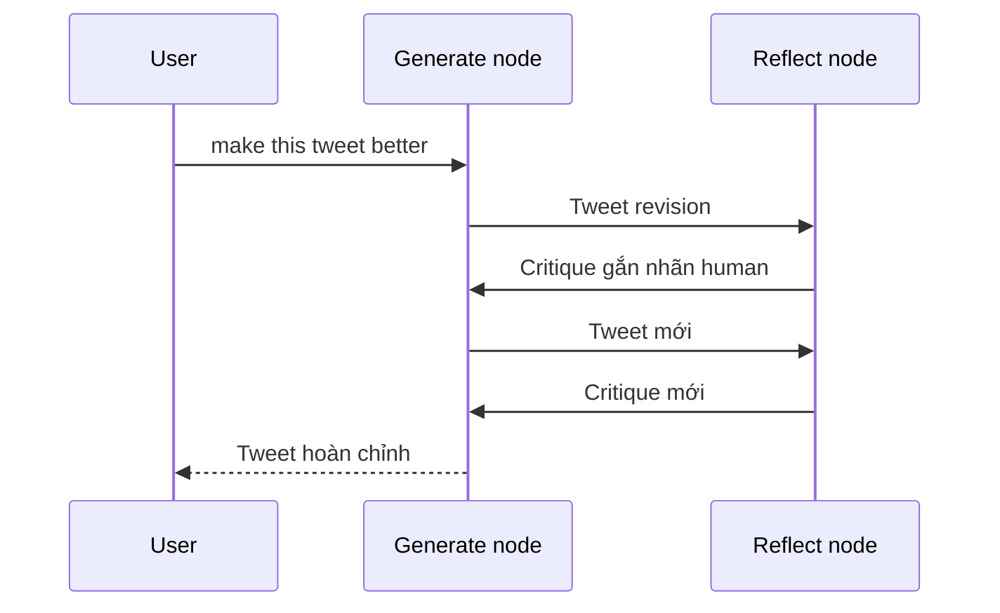

# 🔬 LangSmith Tracing: "Chụp X-quang" từng bước suy nghĩ của Reflection Agent

> Nguồn: `099-LangSmith-Tracing.txt` · [Udemy](https://ua.udemy.com/course/langchain/learn/lecture/51118779)

Chào các bạn, mình là Eden đây! Graph đã lắp xong, hôm nay chúng ta sẽ **chạy thử nó với dữ liệu thật** và cùng "mổ xẻ" toàn bộ quá trình agent suy nghĩ trên **LangSmith**. Đây là lúc để thấy thành quả của chúng ta hoạt động như thế nào.

### ▶️ Chạy thử graph với một tweet thật

Mình gọi `graph.invoke` với đầu vào gồm câu lệnh **"make this tweet better"** kèm theo một tweet mình viết cách đây ít lâu về **tính năng tool calling mới của LangChain** — tính năng cung cấp **một interface duy nhất cho function calling**.

Đây là bước tiến lớn, bởi trước đó chỉ có **OpenAI function** được hỗ trợ, còn giờ đây với interface duy nhất này, chúng ta có thể dùng **Gemini**, **Anthropic Claude**, hay bất kỳ model nào hỗ trợ function calling.

Sau khi chạy xong, mình mở LangSmith và thấy một trace đang thực thi. Điều đầu tiên đập vào mắt: quá trình chạy mất **gần 20 giây** — hoàn toàn hợp lý, bởi chúng ta đã thực hiện rất nhiều API call tới LLM.

---

### 📊 Mổ xẻ trace trên LangSmith

*Mình không phải chuyên gia bản quyền, nên điều mình muốn các bạn thấy là **quá trình** và cách LLM đi đến kết quả cuối cùng.*

Cách dễ nhất là nhìn vào **prompt cuối cùng gửi cho LLM**, vì nó đã chứa toàn bộ lịch sử và mọi tương tác của agent. Trong đó, các bạn sẽ thấy:

1. Một **system message** mở đầu: "You are a tech influencer tasked with writing excellent Twitter posts..."
2. Tiếp theo là yêu cầu của mình: **"make this tweet better"**.
3. Rồi graph bắt đầu lặp: đầu tiên là **generate node** tạo một bản revision cho tweet.
4. Vì chưa đủ số vòng lặp, agent chuyển sang **reflection node** — và phản hồi nhận về từ LLM (được gắn nhãn "human" một cách có chủ đích) chính là **những lời phê bình chi tiết** về tweet.
5. Sau khi node này kết thúc, agent quay lại **generate node**, tạo tweet mới theo đúng phản hồi đó, rồi cứ thế lặp tiếp.
6. Cuối cùng, ta thu được **output cuối** — tweet hoàn chỉnh sau tất cả các vòng reflection.

Toàn bộ hành trình đó diễn ra theo trình tự:

---

### 🧭 Một "phiên bản tinh gọn" của thuật toán phê bình

Điều mình thích nhất ở đây: phía bên trái trace, LangChain có khả năng **traceability (khả năng theo dõi) và observability (khả năng quan sát)** cho cả các object LangGraph. Nhờ đó, chúng ta thấy rõ từng thành phần của graph xuất hiện ngay trong trace:

* Hàm **`should_continue`** — "trọng tài" quyết định rẽ hướng.
* Các **reflection node** với toàn bộ nội dung phê bình.
* Và mọi object khác của graph được tích hợp sẵn vào trace.

Vậy là chúng ta vừa hoàn thành **một phiên bản cực kỳ tinh gọn của thuật toán phê bình (critiquing algorithm)** bằng LangGraph. Tất nhiên, ta hoàn toàn có thể làm điều tương tự với LangChain "thuần" — nhưng các bạn thấy đấy, dùng graph **đơn giản và rõ ràng đến nhường nào**.

### 🎯 Tự kiểm tra nhanh

**Câu 1:** Graph chạy thử mất khoảng bao lâu và vì sao?

<b>Xem đáp án</b>

**Đáp án:** Gần 20 giây — vì đã thực hiện rất nhiều API call tới LLM.

Giải thích: Nhiều vòng lặp generate/reflect đồng nghĩa với nhiều lần gọi model.

Tham chiếu: Mục Chạy thử graph với một tweet thật.

**Câu 2:** Vì sao nên xem prompt cuối cùng gửi cho LLM?

<b>Xem đáp án</b>

**Đáp án:** Vì nó chứa toàn bộ lịch sử và mọi tương tác của agent.

Giải thích: Đó là cách dễ nhất để thấy quá trình LLM đi đến kết quả cuối.

Tham chiếu: Mục Mổ xẻ trace trên LangSmith.

**Câu 3:** Phản hồi critique từ reflection node được gắn nhãn gì?

<b>Xem đáp án</b>

**Đáp án:** Được gắn nhãn "human" một cách có chủ đích.

Giải thích: Việc gắn nhãn người dùng cho critique giúp LLM tiếp nhận phản hồi hiệu quả hơn.

Tham chiếu: Mục Mổ xẻ trace trên LangSmith.

**Câu 4:** LangSmith hiển thị những gì cho các object của LangGraph?

<b>Xem đáp án</b>

**Đáp án:** Traceability và observability — thấy rõ `should_continue`, các reflection node và mọi object của graph.

Giải thích: Đây là lợi thế khi dùng graph so với LangChain "thuần".

Tham chiếu: Mục Một phiên bản tinh gọn của thuật toán phê bình.

**Câu 5:** Điều gì đang chờ chúng ta ở section tiếp theo?

<b>Xem đáp án</b>

**Đáp án:** Nâng cấp kiến trúc lên **Reflexion Agent** với công cụ tìm kiếm và trích dẫn nguồn.

Giải thích: Reflection agent hiện tại sẽ được mở rộng thêm tool và citations.

Tham chiếu: Đoạn kết bài.

Hãy tự thưởng cho mình một tràng pháo tay nhỏ, rồi chuẩn bị tinh thần bước sang section tiếp theo, nơi chúng ta sẽ nâng cấp kiến trúc này lên một tầm cao mới với **Reflexion Agent** — có cả công cụ tìm kiếm và trích dẫn nguồn đấy! 🚀

## Nguồn tham khảo

- [Udemy — LangSmith Tracing](https://ua.udemy.com/course/langchain/learn/lecture/51118779)
- [LangSmith Docs — Trace LangChain applications](https://docs.langchain.com/langsmith/trace-with-langchain)
