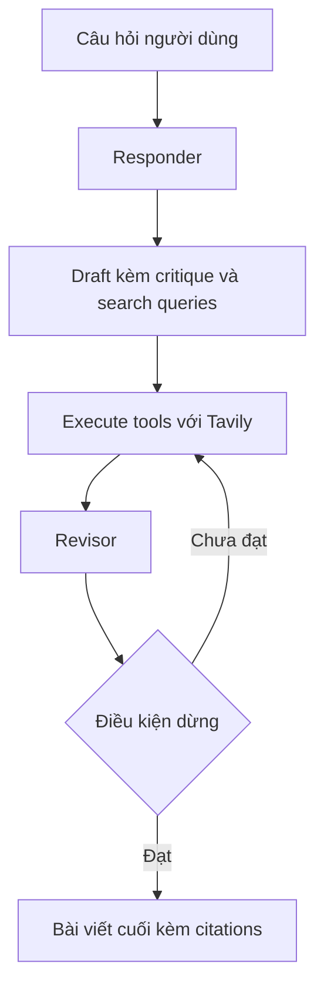

# 🧠 Reflexion Agent: Khi agent biết tự phản chiếu, tìm kiếm và trích dẫn nguồn

> Nguồn: `100-What-are-we-building-A-Reflexion-Agent.txt` · [Udemy](https://ua.udemy.com/course/langchain/learn/lecture/51122501)

Chào các bạn, mình là Eden đây! Chúng ta vừa hoàn thành reflection agent ở section trước, và hôm nay sẽ cùng nhau **nâng cấp nó lên một tầm cao mới**. Trong section này, chúng ta sẽ xây dựng **Reflexion Agent** — phiên bản mở rộng có khả năng **sử dụng công cụ** để tìm kiếm dữ liệu thời gian thực và tự trích dẫn nguồn. Hãy cùng xem chúng ta sắp xây dựng điều gì nhé!

### 🔁 Từ Reflection đến Reflexion: thêm công cụ, thêm sức mạnh

Reflexion agent sẽ **mở rộng ví dụ reflection agent trước đó**, nhưng được trang bị thêm **các công cụ (tools)** — ví dụ một **search tool (công cụ tìm kiếm)** có thể tìm dữ liệu trực tuyến theo thời gian thực để làm giàu câu trả lời.

Bên cạnh đó, chúng ta sẽ ôn lại và áp dụng một số **kỹ thuật prompt engineering nâng cao** để agent có thể "tiêu hóa" phản hồi một cách chính xác và thực sự cải thiện qua từng vòng lặp. Lý do rất thực tế: **tạo ra một lời phê bình thì không khó, nhưng để LLM thực sự tiếp thu lời phê bình đó và tiến bộ dần theo thời gian lại là một bài toán đầy thách thức.** Vì vậy, mình sẽ chia sẻ với các bạn những "tuyệt chiêu" rất thú vị để làm được điều đó.

Để các bạn thấy rõ mức nâng cấp, đây là bảng đối chiếu nhanh giữa hai kiến trúc:

| Tiêu chí | Reflection Agent | Reflexion Agent |
|---|---|---|
| Nguồn gốc | Xây ở section trước | Paper Reflexion của Northeastern, MIT và Princeton |
| Công cụ | Chỉ dùng LLM | Thêm Tavily search để lấy dữ liệu thời gian thực |
| Đầu ra | Tweet được cải thiện | Bài viết chi tiết kèm trích dẫn nguồn |
| Model | GPT-3.5 Turbo | GPT-4 Turbo kết hợp function calling |
| Điều kiện dừng | Đếm số message | Điều kiện dừng riêng của vòng lặp |

---

### 📄 Nguồn gốc kiến trúc: paper Reflexion và dấu ấn của team LangChain

Vậy kiến trúc này đến từ đâu? Nó xuất phát từ một paper tên là **Reflexion** — công trình nghiên cứu chung của **Northeastern, MIT và Princeton**. Ý tưởng triển khai của mình bắt nguồn từ một **bài giảng/blog** mà team nghiên cứu này tạo ra, trong đó họ trình bày về reflection agent và cụ thể là paper Reflexion, đồng thời hiện thực hóa mọi thứ bằng **LangGraph**.

Mình phải nói thật lòng: team LangChain, cụ thể là **Lance**, đã làm một công việc tuyệt vời. Tuy nhiên, **bản triển khai gốc khá khó hiểu** — mình đã mất khá nhiều thời gian mới nắm được nó đang chạy thế nào. Thế nên mình quyết định **refactor (tái cấu trúc)** lại một chút để phiên bản mới dễ giải thích và dễ "tiêu hóa" hơn. Tất nhiên, mình sẽ để link tham khảo trong phần Resources của video.

---

### 🏗️ Kiến trúc: Responder → Execute Tools → Revisor

Mục tiêu của reflexion agent là viết cho chúng ta một **bài viết chi tiết về một chủ đề** cho trước, trong đó:

* Bài viết phải **tự động truy xuất thông tin liên quan từ web**.
* Phải có **trích dẫn (citations)** cho dữ liệu tham khảo.
* Phải có một **vòng lặp phê bình chất lượng** để đảm bảo câu trả lời đạt chuẩn cao.

Ví dụ câu hỏi của chúng ta sẽ xoay quanh **AI-powered SOC / autonomous SOC** — lĩnh vực startup giải quyết bài toán tự động hóa trung tâm vận hành an ninh mạng (Security Operations Center) và các startup đã gọi được vốn. Nếu các bạn chưa quen: đây là một lĩnh vực đang **bùng nổ** và nhận được rất nhiều sự chú ý. Ý tưởng là dùng **AI agent để xử lý các ticket và sự cố an ninh cấp 1** — nhóm việc không đòi hỏi nhiều suy luận phức tạp, có thể dùng công cụ bên ngoài để phân loại và xử lý, từ đó **giải phóng rất nhiều công việc cho các chuyên viên SOC**.

Kiến trúc của agent trông rất giống reflection agent ở section trước, chỉ thêm một search engine vào giữa:

1. **Responder node** — không chỉ tạo câu trả lời ban đầu, mà còn tự kèm theo một **critique** cho câu trả lời đó và một **search term** — tức các **truy vấn tìm kiếm lý tưởng** giúp "neo" (ground) đầu ra vào các sự kiện thời sự và dữ liệu bên ngoài.
2. **Execute tools node** — nhận các search query và dùng công cụ tìm kiếm để **truy xuất kết quả theo thời gian thực**.
3. **Revisor node** — nhận câu trả lời ban đầu (đã có critique) cùng kết quả tìm kiếm, rồi **xem xét lại và chỉnh sửa** câu trả lời để xử lý đúng các góp ý. Đặc biệt, revisor còn cung cấp **một critique mới** cho bản revision, **các search term mới** cần tra cứu thêm, và **trích dẫn của lần tìm kiếm đầu tiên**.
4. Sau đó vòng lặp tiếp tục: tìm kiếm theo query mới, đưa thông tin mới + critique xuống, revise lần nữa — cho đến khi chạm **điều kiện dừng**.

Sơ đồ kiến trúc gói gọn như sau:

---

### 🧰 Bộ đồ nghề: GPT-4 Turbo, Tavily và LangSmith

Để hiện thực kiến trúc đầy tham vọng này, chúng ta sẽ dùng:

* **GPT-4 Turbo** — cần một model đủ mạnh để viết văn bản, viết critique với khả năng suy luận tốt, đồng thời **leverage được function calling** — yếu tố cực kỳ quan trọng trong implementation này.
* **Tavily** — search engine bên thứ ba, được tối ưu hóa cho các ứng dụng LLM.
* **LangSmith** — để tracing, bởi với một kiến trúc phức tạp thế này, chúng ta cần theo dõi luồng chạy một cách dễ dàng.

### 🎯 Tự kiểm tra nhanh

**Câu 1:** Reflexion Agent mở rộng Reflection Agent ở điểm cốt lõi nào?

<b>Xem đáp án</b>

**Đáp án:** Bổ sung **các công cụ (tools)**, ví dụ search tool tìm dữ liệu trực tuyến theo thời gian thực.

Giải thích: Nhờ đó câu trả lời được làm giàu bằng dữ liệu bên ngoài thay vì chỉ dựa vào kiến thức sẵn có.

Tham chiếu: Mục Từ Reflection đến Reflexion.

**Câu 2:** Kiến trúc gồm những node chính nào?

<b>Xem đáp án</b>

**Đáp án:** Responder node → Execute tools node → Revisor node, rồi lặp lại đến điều kiện dừng.

Giải thích: Cấu trúc rất giống reflection agent nhưng có thêm search engine ở giữa.

Tham chiếu: Mục Kiến trúc.

**Câu 3:** Responder node tạo ra những gì?

<b>Xem đáp án</b>

**Đáp án:** Câu trả lời ban đầu, kèm critique cho câu trả lời đó và các search term lý tưởng.

Giải thích: Search term giúp "neo" đầu ra vào sự kiện thời sự và dữ liệu bên ngoài.

Tham chiếu: Mục Kiến trúc.

**Câu 4:** Revisor node cung cấp thêm những gì ngoài bản revision?

<b>Xem đáp án</b>

**Đáp án:** Một critique mới, các search term mới và trích dẫn của lần tìm kiếm đầu tiên.

Giải thích: Vòng lặp tiếp tục với query mới, thông tin mới và critique mới cho đến khi dừng.

Tham chiếu: Mục Kiến trúc.

**Câu 5:** Vì sao cần "tuyệt chiêu" prompt engineering nâng cao?

<b>Xem đáp án</b>

**Đáp án:** Vì tạo critique thì dễ, nhưng để LLM thực sự tiếp thu và tiến bộ qua từng vòng là bài toán khó.

Giải thích: Mục tiêu là agent "tiêu hóa" phản hồi chính xác và thực sự cải thiện.

Tham chiếu: Mục Từ Reflection đến Reflexion.

Mọi thứ đã rõ như ban ngày rồi đấy! Ở bài tiếp theo, chúng ta sẽ cùng **setup dự án** để chuẩn bị cho "cỗ máy" reflexion này nhé! 🚀

## Nguồn tham khảo

- [Udemy — What are we building? A Reflexion Agent](https://ua.udemy.com/course/langchain/learn/lecture/51122501)
- [arXiv — Reflexion: Language Agents with Verbal Reinforcement Learning](https://arxiv.org/abs/2303.11366)
- [LangChain Blog — Reflection Agents](https://www.langchain.com/blog/reflection-agents)
