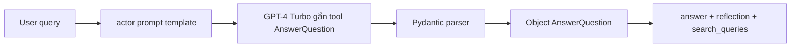

# 🎭 Actor Agent: "Chuyên gia nghiên cứu" viết bản nháp đầu tiên với structured output

> Nguồn: `102-Actor-Agent-V2.txt` · [Udemy](https://ua.udemy.com/course/langchain/learn/lecture/54702755)

Chào các bạn, mình là Eden đây! Hôm nay chúng ta sẽ cùng viết **actor agent (bên hành động)** — cụ thể là chain `first_responder_chain`, bước đầu tiên trong graph Reflexion. Chain này nhận câu hỏi của người dùng và tạo ra bài viết nháp đầu tiên. Trong bài này, chúng ta sẽ "bỏ túi" những kỹ thuật prompting cực hay ho cùng **output parsers** kết hợp **function calling** để nhận về **structured output (đầu ra có cấu trúc)**.

### 🎬 Chuẩn bị: imports và một "bật mí" về MessageGraph

Code của bài luôn có sẵn trong phần Resources của khóa học, nên các bạn cứ yên tâm. Bắt đầu với imports:

* **`datetime`** — chúng ta sẽ truyền cho agent **ngày giờ hiện tại**.
* **`load_dotenv`** — nạp biến môi trường từ file `.env`.
* **`JsonOutputToolsParser` và `PydanticToolsParser`** — hai output parser xử lý kết quả từ function calling của OpenAI: một cái biến kết quả thành **JSON/dictionary**, cái còn lại biến thành **đối tượng Pydantic**.
* **`HumanMessage`** — để gửi vào LLM.
* **`ChatPromptTemplate`** — nơi giữ toàn bộ lịch sử các vòng lặp của agent, chúng ta sẽ liên tục append message vào đó.
* **`MessagesPlaceholder`** — chỗ trống linh động cho các message mới (các bạn đã thấy cách dùng ở reflection agent section trước).
* **`ChatOpenAI`** — vì chúng ta sẽ dùng **GPT-4 Turbo**.

*Một bật mí nhanh trước khi code:* chúng ta sẽ dùng **`MessageGraph`**, tức state của graph chỉ đơn giản là **một danh sách các message** biến đổi dần qua từng node.

---

### 📝 Prompt template: "You are an expert researcher"

Đầu vào của agent là **chủ đề chúng ta muốn viết**, và agent sẽ tạo câu trả lời ban đầu. Trong câu trả lời đó, chúng ta cần ba phần: **nội dung (bản nháp đầu tiên của bài viết)**, một **critique (lời phê bình)** cho bài viết mới tạo, và các **search term** giúp nâng chất lượng bài viết.

Mình định nghĩa biến `actor_prompt_template` — một `ChatPromptTemplate` gồm main prompt và toàn bộ lịch sử hội thoại. System prompt có nội dung:

* **"You are an expert researcher. The current time is {time}"** — thời gian sẽ được "cắm" động vào.
* Phần output indicator gồm **ba phần**: placeholder `{first_instructions}` (lần đầu sẽ được điền vào yêu cầu **viết một essay 250 chữ**), tiếp đó là **"Reflect and critique your answer. Be severe to maximize improvement."** — lời phê bình này sẽ được reviser agent dùng ở bước sau; và cuối cùng là **"Recommend search queries to research information and improve your answer."** — đây chỉ là **các truy vấn tìm kiếm**, chưa phải kết quả, và sẽ được dùng ở node execute tools với Tavily.

Điểm thú vị: template này còn được **tái sử dụng cho reviser node** — một kỹ thuật prompt engineering giúp ta không phải viết lại prompt từ đầu. Và vì cả quá trình "revise rồi critique, critique rồi revise" diễn ra liên tục, ta cũng truyền vào `MessagesPlaceholder` toàn bộ lịch sử trước đó — nơi chứa thông tin cần tìm kiếm và những gì đã được góp ý.

Cuối cùng, mình dùng phương thức **`partial()`** để điền trước những placeholder đã biết. Với thời gian hiện tại, mình dùng **lambda function** trả về ngày hôm nay theo **định dạng ISO** — giá trị này chỉ được tính khi prompt template được gọi, tức là đúng lúc agent khởi chạy.

*Nếu bạn chưa hình dung hết reviser agent sẽ làm gì, đừng lo — chúng ta sẽ mổ xẻ kỹ càng ở video sau, hôm nay chỉ cần nắm thật chắc prompt đầu tiên gửi cho LLM là được!*

---

### 📦 schemas.py: Reflection và AnswerQuestion

Để đầu ra của LLM có cấu trúc, mình tạo file **`schemas.py`** chứa các schema mong muốn, dùng **Pydantic `BaseModel` và `Field`**:

* **Class `Reflection`** — chứa thông tin về critique, tập trung vào hai điều: **missing information (thông tin bị thiếu)** — những dữ liệu quan trọng nhưng LLM chưa tạo ra — và **superfluous information (thông tin thừa)** — mình phải tra từ điển mới biết "superfluous" nghĩa là thông tin không cần thiết, không đóng góp giá trị. Khi dùng kèm function calling, class này sẽ **neo (ground)** phản hồi của LLM để điền đúng các giá trị, cho ta phản hồi cực kỳ súc tích.
* **Class `AnswerQuestion`** — gồm ba field:
  1. **`answer`** — câu trả lời 250 chữ cho câu hỏi ban đầu.
  2. **`reflection`** — một object `Reflection` với mô tả *"Your reflection on the initial answer."* Đây là một "chiêu" rất thú vị: chúng ta **prompt LLM ngay qua phần description của field**, giúp model "neo" câu trả lời chặt hơn.
  3. **`search_queries`** — từ **1 đến 3 truy vấn tìm kiếm** để nghiên cứu thêm, nhằm giải quyết critique hiện tại của câu trả lời.

---

### 🔧 Function calling, chain hoàn chỉnh và kết quả thực tế

Quay lại file `chains.py`, mình khởi tạo LLM **GPT-4 Turbo** và hai output parser:

* **`JsonOutputToolsParser`** — trả về function call dưới dạng **dictionary**.
* **`PydanticToolsOutputParser`** — tìm function-calling invocation trong phản hồi và **parse thành object `AnswerQuestion`** để chúng ta làm việc dễ dàng.

| Parser | Đầu ra | Dùng khi nào |
|---|---|---|
| `JsonOutputToolsParser` | Dictionary/JSON | Cần nhìn raw function call |
| `PydanticToolsParser` | Object Pydantic | Cần làm việc với field có kiểu rõ ràng |

Sau đó, mình điền `first_instruction` bằng câu **"Provide a detailed 250 word answer."**, rồi tạo `first_responder_chain`: prompt template pipe vào LLM GPT-4 Turbo — nhưng **trước đó bind object `AnswerQuestion` như một tool** cho function calling. Và với **`tool_choice="AnswerQuestion"`**, LLM bị **buộc luôn luôn dùng tool này**, nhờ vậy câu trả lời được neo đúng vào object chúng ta muốn. Đây chính là kỹ thuật "grounding" đến từ object Pydantic mà ta tạo ra.

Toàn bộ luồng tạo structured output gói gọn như sau:



Giờ là lúc chạy thử chain với input:

*"Write about AI-powered SOC / autonomous SOC problem domain, and list startups that have raised capital on this."*

Kết quả lần đầu gặp một lỗi thú vị: object `AnswerQuestion` thiếu field `search_queries` — tức LLM không đưa ra search query nào. Lỗi này có thể xử lý bằng prompt engineering kiểu *"You must provide the search queries at all costs"*, hoặc tách riêng thành một prompt chạy độc lập. *Nhưng vì đây chỉ là proof of concept, chúng ta sẽ chỉ chạy lại và quả nhiên lần này thành công!*

Các kết quả thu được:

* **Answer**: bài viết về AI-powered SOC / autonomous SOC — dùng AI và machine learning để tăng cường phát hiện, ứng phó và vận hành an ninh mạng; giải quyết sự phức tạp và khối lượng mối đe dọa ngày càng tăng; tự động hóa nhận diện và vô hiệu hóa mối đe dọa, giảm false positive, giải phóng chuyên viên cho các việc chiến lược hơn; cùng các thách thức về tích hợp công nghệ AI, độ chính xác và quyền riêng tư dữ liệu.
* **Reflection — missing**: bài viết cần dữ liệu chính xác hơn về **số vốn mà mỗi startup đã gọi được** để người đọc hình dung rõ quy mô.
* **Reflection — superfluous**: phần giải thích chi tiết về problem domain **hơi dài dòng** với những độc giả đã quen khái niệm này.
* **Search queries** (4 truy vấn): *AI-powered SOC startup funding*, *Darktrace funding history*, *Vectra capital raised*, và *Arctic Wolf investment rounds*.

---

### 💻 Code mẫu đầy đủ — `schemas.py` & `chains.py`

Toàn bộ code của bài nằm trong hai file `schemas.py` và `chains.py` (tham khảo từ repo chính thức của khóa học).

**`schemas.py`**

```python
from typing import List

from pydantic import BaseModel, Field


class Reflection(BaseModel):
    missing: str = Field(description="Critique of what is missing.")
    superfluous: str = Field(description="Critique of what is superfluous")


class AnswerQuestion(BaseModel):
    """Answer the question."""

    answer: str = Field(description="~250 word detailed answer to the question.")
    reflection: Reflection = Field(description="Your reflection on the initial answer.")
    search_queries: List[str] = Field(
        description="1-3 search queries for researching improvements to address the critique of your current answer."
    )
```

**`chains.py`**

```python
import datetime

from dotenv import load_dotenv

load_dotenv()

from langchain_core.messages import HumanMessage
from langchain_core.output_parsers.openai_tools import (
    JsonOutputToolsParser,
    PydanticToolsParser,
)
from langchain_core.prompts import ChatPromptTemplate, MessagesPlaceholder
from langchain_openai import ChatOpenAI

from schemas import AnswerQuestion

llm = ChatOpenAI(model="gpt-4-turbo")
parser = JsonOutputToolsParser(return_id=True)
parser_pydantic = PydanticToolsParser(tools=[AnswerQuestion])

actor_prompt_template = ChatPromptTemplate.from_messages(
    [
        (
            "system",
            """You are expert researcher.
Current time: {time}

1. {first_instruction}
2. Reflect and critique your answer. Be severe to maximize improvement.
3. Recommend search queries to research information and improve your answer.""",
        ),
        MessagesPlaceholder(variable_name="messages"),
        ("system", "Answer the user's question above using the required format."),
    ]
).partial(
    time=lambda: datetime.datetime.now().isoformat(),
)


first_responder_prompt_template = actor_prompt_template.partial(
    first_instruction="Provide a detailed ~250 word answer."
)

first_responder_chain = first_responder_prompt_template | llm.bind_tools(
    tools=[AnswerQuestion], tool_choice="AnswerQuestion"
)


if __name__ == "__main__":
    human_message = HumanMessage(
        content="Write about AI-Powered SOC / autonomous soc  problem domain,"
        " list startups that do that and raised capital."
    )
    chain = (
        first_responder_prompt_template
        | llm.bind_tools(tools=[AnswerQuestion], tool_choice="AnswerQuestion")
        | parser_pydantic
    )

    res = chain.invoke(input={"messages": [human_message]})
    print(res)
```

### 🎯 Tự kiểm tra nhanh

**Câu 1:** `first_responder_chain` tạo ra những gì cho graph?

<details>
<summary><b>Xem đáp án</b></summary>

**Đáp án:** Bản nháp đầu tiên của bài viết, kèm critique và các search query.

Giải thích: Kết quả là object `AnswerQuestion` có cấu trúc rõ ràng — chính là logic cho responder node.

Tham chiếu: Mục Function calling, chain hoàn chỉnh và kết quả thực tế.

</details>

**Câu 2:** Hai output parser khác nhau ở điểm nào?

<details>
<summary><b>Xem đáp án</b></summary>

**Đáp án:** `JsonOutputToolsParser` trả về dictionary; `PydanticToolsParser` parse thành object Pydantic `AnswerQuestion`.

Giải thích: Object Pydantic giúp thao tác với các field dễ dàng hơn trong code.

Tham chiếu: Mục Function calling, chain hoàn chỉnh và kết quả thực tế.

</details>

**Câu 3:** Class `Reflection` tập trung vào hai loại thông tin nào?

<details>
<summary><b>Xem đáp án</b></summary>

**Đáp án:** Missing information (thông tin bị thiếu) và superfluous information (thông tin thừa, không đóng góp giá trị).

Giải thích: Khi dùng kèm function calling, class này "neo" phản hồi của LLM để cho critique cực kỳ súc tích.

Tham chiếu: Mục schemas.py.

</details>

**Câu 4:** Vì sao `tool_choice="AnswerQuestion"` quan trọng?

<details>
<summary><b>Xem đáp án</b></summary>

**Đáp án:** Nó buộc LLM luôn dùng tool này, nhờ đó câu trả lời được neo đúng vào object mong muốn.

Giải thích: Đây là kỹ thuật "grounding" đến từ chính object Pydantic mà ta tạo ra.

Tham chiếu: Mục Function calling, chain hoàn chỉnh và kết quả thực tế.

</details>

**Câu 5:** Lỗi thú vị ở lần chạy đầu tiên là gì và có thể xử lý ra sao?

<details>
<summary><b>Xem đáp án</b></summary>

**Đáp án:** Object `AnswerQuestion` thiếu field `search_queries`; có thể thêm prompt "You must provide the search queries at all costs" hoặc tách riêng một prompt độc lập.

Giải thích: Vì đây chỉ là proof of concept, mình chỉ chạy lại và lần này thành công.

Tham chiếu: Mục Function calling, chain hoàn chỉnh và kết quả thực tế.

</details>

Mở LangSmith, chúng ta thấy trace của prompt gửi OpenAI cùng câu trả lời được parse bởi Pydantic output parser. Một video dài đấy, nhưng chúng ta đã hoàn thành logic cho **responder agent** — phần sẽ chạy trong responder node, tạo câu trả lời đầu tiên kèm critique và search term. Ở bài tiếp theo, chúng ta sẽ cùng xem logic của **reviser chain** nhé! 🚀

## Nguồn tham khảo

- [Udemy — Actor Agent](https://ua.udemy.com/course/langchain/learn/lecture/54702755)
- [LangChain Blog — Reflection Agents](https://www.langchain.com/blog/reflection-agents)
