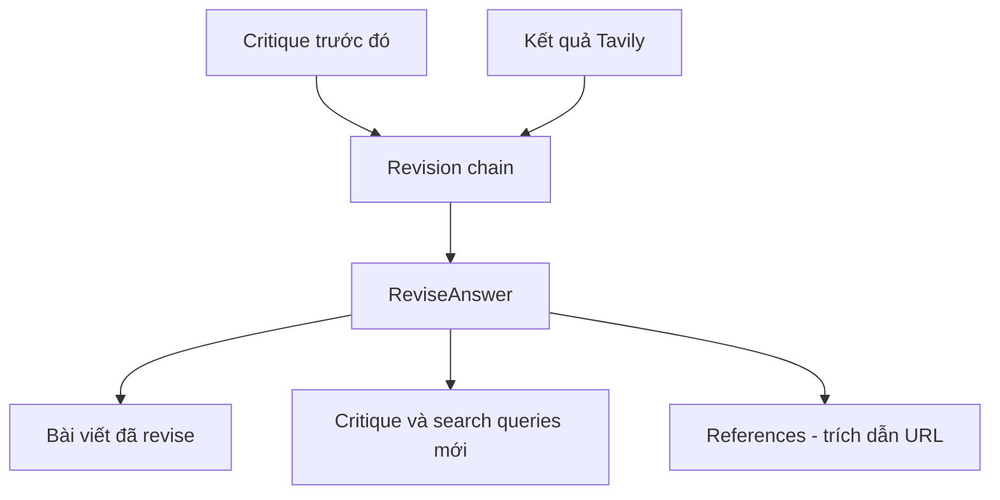

# ✍️ Revisor Agent: Vòng lặp "đọc phê bình – thêm nguồn – viết lại"

> Nguồn: `103-Revisor-Agent.txt` · [Udemy](https://ua.udemy.com/course/langchain/learn/lecture/51122519)

Chào các bạn, mình là Eden đây! Mình biết bài trước là một video dài, nhưng tin vui là hôm nay mọi chuyện **ngắn gọn hơn rất nhiều**. Chúng ta sẽ cùng triển khai **Revisor Agent (bên duyệt lại)**. Vì phần lớn hạ tầng đã sẵn sàng, công việc của chúng ta chỉ gồm: thêm một instruction mới vào prompt và tạo một class mới cho response — thế là xong!

Nhiệm vụ của agent này: nhận **bài viết mới nhất**, dùng **critique** để sửa lại bài viết, rồi xuất ra cho chúng ta một **bài viết tốt hơn**.

### 🧾 Revision instructions: bản "đề bài" khó tính

Mình quay lại code và thêm một template mới — chính là các **revision instructions**. Nội dung của chúng như sau:

1. **"Revise your previous answer using the new information."** — dùng thông tin mới để sửa lại câu trả lời trước.
2. **"You should use the previous critique to add important information to your answer."** — dùng critique trước đó để bổ sung thông tin quan trọng.
3. **"You must include numerical citations in your revised answer to ensure it can be verified."** — bắt buộc phải có **trích dẫn dạng số** để người đọc kiểm chứng được.
4. **"Add a reference section to the bottom of your answer, which does not count towards the word limit, in the form of [URLs]."** — thêm một **mục tài liệu tham khảo** ở cuối bài, không tính vào giới hạn số chữ, dưới dạng các URL.
5. **"You should use the previous critique to remove superfluous information from your answer, to make sure it doesn't go over 250 words."** — dùng critique để **loại bỏ thông tin thừa**, đảm bảo bài không vượt quá **250 chữ**.

Và đây là "chiêu" tái sử dụng: instruction này sẽ được "cắm" vào chính **actor prompt template** cũ (ở dòng số 23) — cụ thể là điền vào placeholder `first_instruction`. Đúng vậy, cùng một template, chỉ thay "đề bài" đầu vào mà thôi!

---

### 🧬 ReviseAnswer: kế thừa và mở rộng schema

Tiếp theo, mình mở file `schemas.py` và tạo class mới cho câu trả lời đã được revise, đặt tên là **`ReviseAnswer`**. Điểm đáng chú ý: nó **kế thừa từ class `AnswerQuestion`**, nên thừa hưởng toàn bộ field cũ — `answer`, `reflection`, `search_queries`.

Nhưng `ReviseAnswer` còn có thêm một thứ nữa: field **`references`** — một **danh sách các string**, chính là các **trích dẫn URL** chủ yếu lấy từ search engine.

| Schema | Kế thừa từ | Các field |
|---|---|---|
| `AnswerQuestion` | Pydantic `BaseModel` | `answer`, `reflection`, `search_queries` |
| `ReviseAnswer` | `AnswerQuestion` | thêm `references` — danh sách URL trích dẫn |

*Còn chuyện search engine sẽ hoạt động ra sao thì chúng ta chưa bàn tới — đừng lo, mình sẽ giải thích cặn kẽ ở video tiếp theo!*

---

### 🔗 Revision chain: cùng công thức, khác "đề bài"

Quay lại file `chains.py`, mình viết **revision chain** theo đúng công thức quen thuộc:

* Lấy **actor prompt template**, điền placeholder `first_instruction` bằng biến **revision instructions**.
* Pipe thẳng vào LLM **GPT-4 Turbo**, một lần nữa dùng **function calling**.
* Cung cấp tool là **ReviseAnswer**, đồng thời đặt **`tool_choice` là ReviseAnswer** — điều này **ép buộc schema của object Pydantic `ReviseAnswer`**, về mặt thực tế khiến LLM phải "dính" câu trả lời vào đúng dạng object đó.

Mình cũng import `ReviseAnswer` từ file `schemas.py` (đã có sẵn ở dòng 15). Và như vậy là xong phần revisor — đây chính là logic sẽ chạy trong **revision node** của graph.

---

### 🌀 Nhìn lại vòng lặp Revisor

Cùng điểm lại những gì chúng ta vừa làm:

* Viết xong **Revisor chain**.
* Trong bước revision (hay Revisor node), agent sẽ lấy **kết quả tìm kiếm từ Tavily** theo các search query liên quan, đưa chúng vào bài viết hiện có cùng với **critique đã được tạo trước đó**.
* Agent sẽ **revise** câu trả lời dựa trên critique đã viết, kết hợp thêm kết quả tìm kiếm từ Tavily vào nội dung.
* Và tất nhiên, nó sẽ **trích dẫn (cite)** toàn bộ nguồn tài nguyên đã dùng từ internet.

Vòng lặp của revisor được mô tả như sau:



---

### 💻 Code mẫu đầy đủ — `schemas.py` & `chains.py`

Phần code mới của bài nằm trong hai file `schemas.py` và `chains.py` (tham khảo từ repo chính thức của khóa học).

**`schemas.py`** — thêm class `ReviseAnswer` vào cuối file:

```python
class ReviseAnswer(AnswerQuestion):
    """Revise your original answer to your question."""

    references: List[str] = Field(
        description="Citations motivating your updated answer."
    )
```

**`chains.py`** — cập nhật import (`from schemas import AnswerQuestion, ReviseAnswer`) rồi thêm đoạn sau vào cuối file:

```python
revise_instructions = """Revise your previous answer using the new information.
    - You should use the previous critique to add important information to your answer.
        - You MUST include numerical citations in your revised answer to ensure it can be verified.
        - Add a "References" section to the bottom of your answer (which does not count towards the word limit). In form of:
            - [1] https://example.com
            - [2] https://example.com
    - You should use the previous critique to remove superfluous information from your answer and make SURE it is not more than 250 words.
"""

reviser_chain = actor_prompt_template.partial(
    first_instruction=revise_instructions
) | llm.bind_tools(tools=[ReviseAnswer], tool_choice="ReviseAnswer")
```

### 🎯 Tự kiểm tra nhanh

**Câu 1:** Nhiệm vụ của Revisor Agent là gì?

<details>
<summary><b>Xem đáp án</b></summary>

**Đáp án:** Nhận bài viết mới nhất, dùng critique để sửa lại và xuất ra một bài viết tốt hơn.

Giải thích: Đây là bước cải thiện câu trả lời dựa trên phản hồi đã có.

Tham chiếu: Đoạn mở bài.

</details>

**Câu 2:** Bộ revision instructions gồm những yêu cầu chính nào?

<details>
<summary><b>Xem đáp án</b></summary>

**Đáp án:** Revise bằng thông tin mới; dùng critique để bổ sung thông tin quan trọng; bắt buộc numerical citations; thêm reference section dạng URL không tính vào giới hạn chữ; loại bỏ thông tin thừa để không vượt quá 250 chữ.

Giải thích: Đây là "đề bài" khó tính giúp bản revise vừa đủ ý vừa kiểm chứng được.

Tham chiếu: Mục Revision instructions.

</details>

**Câu 3:** Làm sao tái sử dụng actor prompt template cho revisor?

<details>
<summary><b>Xem đáp án</b></summary>

**Đáp án:** Điền revision instructions vào placeholder `first_instruction` của template cũ.

Giải thích: Cùng một template, chỉ thay "đề bài" đầu vào — không phải viết prompt mới từ đầu.

Tham chiếu: Mục Revision instructions.

</details>

**Câu 4:** `ReviseAnswer` thêm field gì so với `AnswerQuestion`?

<details>
<summary><b>Xem đáp án</b></summary>

**Đáp án:** Field `references` — danh sách các trích dẫn URL chủ yếu lấy từ search engine.

Giải thích: Nó kế thừa toàn bộ `answer`, `reflection`, `search_queries` từ `AnswerQuestion`.

Tham chiếu: Mục ReviseAnswer.

</details>

**Câu 5:** Điều gì đảm bảo LLM trả về đúng schema `ReviseAnswer`?

<details>
<summary><b>Xem đáp án</b></summary>

**Đáp án:** Cung cấp tool là `ReviseAnswer` và đặt `tool_choice` là `ReviseAnswer`.

Giải thích: Điều này ép buộc schema của object Pydantic, khiến LLM phải "dính" câu trả lời vào đúng dạng object đó.

Tham chiếu: Mục Revision chain.

</details>

Ở bài tiếp theo, chúng ta sẽ xử lý phần **thực thi công cụ (tool executions)** — tìm hiểu cách Tavily search hoạt động và cách đưa kết quả vào bài viết đã revise. Hẹn gặp lại các bạn! 🚀

## Nguồn tham khảo

- [Udemy — Revisor Agent](https://ua.udemy.com/course/langchain/learn/lecture/51122519)
- [LangChain Blog — Reflection Agents](https://www.langchain.com/blog/reflection-agents)
