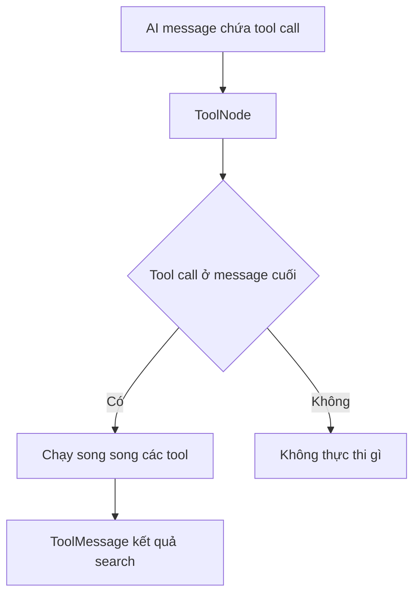

# 🛠️ ToolNode & Executing Tools: Cho agent "ra ngoài internet" với Tavily

> Nguồn: `104-ToolNode---Executing-Tools.txt` · [Udemy](https://ua.udemy.com/course/langchain/learn/lecture/51122525)

Chào các bạn, mình là Eden đây! Trong bài này, chúng ta sẽ cùng triển khai **tool executor node** — "cánh tay nối dài" giúp agent vươn ra internet. Node này nhận vào một **AI message** chứa các search query mong muốn, rồi chạy **Tavily** để mang về kết quả và thông tin **thời gian thực** từ web. Sau bài này, chúng ta sẽ có đầy đủ "linh kiện" để lắp ráp graph hoàn chỉnh!

### 🔎 Cài đặt và khởi tạo Tavily search

Mình tạo file mới tên **`tool_executor.py`**, bắt đầu bằng `load_dotenv` để nạp biến môi trường. Sau đó:

1. **Cài đặt Tavily**: chạy `poetry add langchain-tavily` để có package cần thiết, và đảm bảo bạn đã có **API key** trong file `.env`. *À, và các bạn đừng lo về việc lộ API key của mình nhé — sau khi quay xong video này, mình đã thu hồi (revoke) toàn bộ chúng rồi!*
2. **Import `TavilySearch`** — search tool của Tavily.
3. **Import class `StructuredTool`** từ LangChain — component cho phép **biến một hàm Python thành tool** mà LLM có thể dùng, bằng cách cung cấp cho LLM một **schema có cấu trúc** của hàm để nó hiểu cách sử dụng.
4. **Import class `ToolNode`** từ LangGraph — một class cực hay giúp tiết kiệm vô số công sức. Nó là một node trong graph, có thể được invoke: nó sẽ **tìm key `messages` trong state**, kiểm tra **message cuối cùng** xem có **tool call nào do LLM quyết định** không, và nếu có thì **thực thi các tool đó cho chúng ta** — thậm chí có thể chạy **song song**!

Cơ chế hoạt động của `ToolNode` gói gọn như sau:



Thú thật, trước khi có `ToolNode`, chúng ta phải tự làm mọi thứ. Mình từng làm như vậy ở phiên bản gốc của khóa học, và mình sẽ để implementation đó dưới dạng **tùy chọn (optional)** để bạn nào tò mò có thể xem khối lượng công việc khổng lồ mà `ToolNode` "gánh" giúp chúng ta.

Mình khởi tạo search tool với **`max_results=5`** — tức lấy về 5 kết quả mỗi lần tìm kiếm.

---

### 🎭 "Chiêu" tách một tool thành hai: AnswerQuestion & ReviseAnswer

Đây là phần thú vị nhất. Thay vì dùng tool "nguyên bản", mình thực hiện một **cool trick**: lấy tool gốc cùng chức năng tìm kiếm, rồi **tạo ra hai tool khác nhau** — cùng chức năng, nhưng **khác tên**, vì chúng phục vụ hai mục đích khác nhau trong workflow:

* **AnswerQuestion tool** — dùng trong **pha nghiên cứu ban đầu**, khi agent lần đầu trả lời câu hỏi.
* **ReviseAnswer tool** — dùng trong **pha revision**, khi agent cải thiện câu trả lời dựa trên reflection.

| Tool | Pha sử dụng | Mục đích |
|---|---|---|
| `AnswerQuestion` | Nghiên cứu ban đầu | Tìm kiếm cho bản nháp đầu tiên |
| `ReviseAnswer` | Revision | Tìm kiếm bổ sung sau critique |

Cả hai tool đều chạy tìm kiếm như nhau. Chúng cần tên của object `AnswerQuestion` và `ReviseAnswer` để đặt nhãn. Về lý thuyết, một tool là đủ — nhưng **hai tên riêng biệt cho hai tool** cho phép hệ thống **theo dõi rõ ràng giai đoạn nào của quá trình nghiên cứu đã kích hoạt tìm kiếm** (nghiên cứu ban đầu hay nghiên cứu khi revise). Điều này giúp ích rất nhiều cho việc **debugging và đánh giá** câu trả lời.

---

### ⚡ Hàm run_queries và batch chạy song song

Mình tạo hàm **`run_queries`** — nhận đầu vào là `search_queries`, một **danh sách các string**. Phần description của hàm ghi rõ: *"run the generated queries"*.

Một chi tiết nhỏ nhưng hữu ích: mình thêm **giá trị mặc định** cho tham số, phòng trường hợp LLM truyền thiếu giá trị nào đó thì hệ thống cũng không gặp lỗi.

Phần implementation rất đơn giản:

* Chạy tool Tavily với các query nhận được.
* Duyệt qua từng query và gọi chúng bằng phương thức **`batch`** — phương thức này sẽ **chạy tất cả đồng thời (concurrently)**, thay vì tuần tự.

---

### 📦 Ghép ToolNode và commit code lên GitHub

Cuối cùng, mình dùng **`StructuredTool.from_function`** để tạo hai tool từ cùng một hàm `run_queries`:

* Tool thứ nhất mang tên của class **`AnswerQuestion`**.
* Tool thứ hai mang tên của class **`ReviseAnswer`**.

Cả hai đều chạy ở **tool mode**. Nhắc lại một chút về `ToolNode`: nó sẽ **soi vào state, kiểm tra message cuối cùng**, và nếu có tool call thì **thực thi tool tương ứng** cho chúng ta.

---

### 💻 Code mẫu đầy đủ — `tool_executor.py`

Toàn bộ code của bài nằm trong file `tool_executor.py` (tham khảo từ repo chính thức của khóa học):

```python
from dotenv import load_dotenv

load_dotenv()

from langchain_core.tools import StructuredTool
from langchain_tavily import TavilySearch
from langgraph.prebuilt import ToolNode

from schemas import AnswerQuestion, ReviseAnswer

tavily_tool = TavilySearch(max_results=5)


def run_queries(search_queries: list[str], **kwargs):
    """Run the generated queries."""
    return tavily_tool.batch([{"query": query} for query in search_queries])


execute_tools = ToolNode(
    [
        StructuredTool.from_function(run_queries, name=AnswerQuestion.__name__),
        StructuredTool.from_function(run_queries, name=ReviseAnswer.__name__),
    ]
)
```

### 🎯 Tự kiểm tra nhanh

**Câu 1:** `ToolNode` hoạt động như thế nào?

<details>
<summary><b>Xem đáp án</b></summary>

**Đáp án:** Nó tìm key `messages` trong state, kiểm tra message cuối cùng xem có tool call không, nếu có thì thực thi — thậm chí song song.

Giải thích: Nhờ đó ta không phải tự viết logic thực thi tool.

Tham chiếu: Mục Cài đặt và khởi tạo Tavily search.

</details>

**Câu 2:** Vì sao phải tách thành hai tool `AnswerQuestion` và `ReviseAnswer` dù chức năng giống nhau?

<details>
<summary><b>Xem đáp án</b></summary>

**Đáp án:** Để hệ thống theo dõi rõ giai đoạn nào của quá trình nghiên cứu đã kích hoạt tìm kiếm.

Giải thích: Phân biệt nghiên cứu ban đầu với nghiên cứu khi revise giúp debugging và đánh giá câu trả lời.

Tham chiếu: Mục Chiêu tách một tool thành hai.

</details>

**Câu 3:** Hàm `run_queries` nhận đầu vào gì và chạy query bằng cách nào?

<details>
<summary><b>Xem đáp án</b></summary>

**Đáp án:** Nhận danh sách `search_queries`; chạy từng query bằng phương thức `batch` để thực thi đồng thời.

Giải thích: Hàm còn có giá trị mặc định cho tham số để tránh lỗi khi LLM truyền thiếu giá trị.

Tham chiếu: Mục Hàm run_queries và batch chạy song song.

</details>

**Câu 4:** Việc khởi tạo search tool với `max_results=5` nghĩa là gì?

<details>
<summary><b>Xem đáp án</b></summary>

**Đáp án:** Mỗi lần tìm kiếm sẽ lấy về 5 kết quả.

Giải thích: Đây là tham số cấu hình của Tavily search tool.

Tham chiếu: Mục Cài đặt và khởi tạo Tavily search.

</details>

**Câu 5:** `StructuredTool.from_function` được dùng để làm gì?

<details>
<summary><b>Xem đáp án</b></summary>

**Đáp án:** Biến hàm `run_queries` thành hai tool có tên khác nhau kèm schema để LLM hiểu cách dùng.

Giải thích: Một tool mang tên `AnswerQuestion`, một tool mang tên `ReviseAnswer`, cùng chạy một hàm.

Tham chiếu: Mục Ghép ToolNode và commit code lên GitHub.

</details>

Vậy là tất cả các "moving parts" của graph đã sẵn sàng! Mình chạy format lại code, rồi **commit lên nhánh `project/reflection-agent`** trên repo của khóa học — các bạn có thể chọn nhánh này trong repo để xem commit chứa toàn bộ code của bài hôm nay (link cũng sẽ có trong phần Resources của video).

Ở bài tiếp theo, chúng ta sẽ cùng nhau **lắp ráp graph hoàn chỉnh** — hẹn gặp lại các bạn! 🚀

## Nguồn tham khảo

- [Udemy — ToolNode: Executing Tools](https://ua.udemy.com/course/langchain/learn/lecture/51122525)
- [LangGraph Reference — ToolNode](https://reference.langchain.com/python/langgraph.prebuilt/tool_node/ToolNode)
- [LangChain Docs — Tavily search integration](https://docs.langchain.com/oss/python/integrations/tools/tavily_search)
