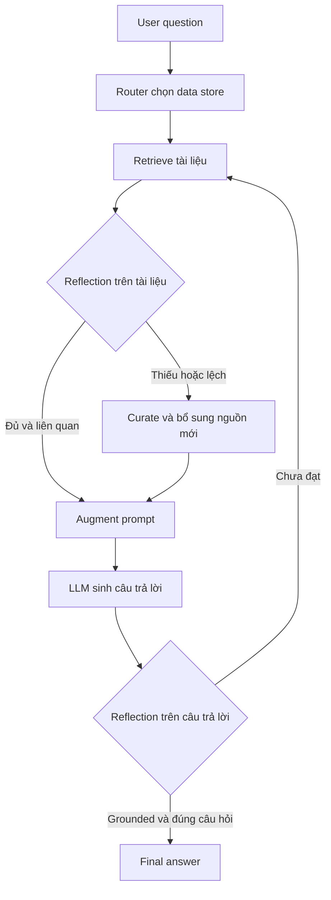

# 🧠 Xây gì trong Section này? Kiến trúc Agentic RAG nâng cao (Reflection + Routing)

> Nguồn: `107-What-are-Building-In-this-Section--Agentic-RAG-Architecture.txt` · [Udemy](https://ua.udemy.com/course/langchain/learn/lecture/51132381)

Chào các bạn, mình là Eden đây! 👋 Thật tuyệt vời khi các bạn đã đi cùng mình đến tận đây.

Trước khi bắt tay vào code, mình muốn dành một video để nói về "bản thiết kế" của thứ chúng ta sắp xây dựng: một **advanced RAG workflow (luồng RAG nâng cao)** phức tạp, có khả năng cho ra kết quả chất lượng hơn hẳn những hệ RAG thông thường mà các bạn từng gặp — tất cả nhờ tận dụng sức mạnh của **LangGraph**.

---

### 🎯 Dự án này được lấy cảm hứng từ đâu?

Dự án được lấy cảm hứng từ **LangChain và Mistral Cookbook** — nơi nhóm tác giả giới thiệu chủ đề này. Code của họ được đặt trong repository của khóa học, và họ cũng có một video YouTube rất hay về nó.

Tuy nhiên, điều mình cảm thấy còn thiếu trong cookbook chính là **góc nhìn software engineering**. Vì vậy, mình đã lấy code của họ, chỉnh sửa và refactor lại để hướng tới môi trường production hơn:

* **Dễ bảo trì (maintainable)** hơn.
* **Dễ đọc (readable)** hơn.
* **Dễ kiểm thử (testable)** hơn.
* Và **dễ mở rộng** khi bạn muốn thêm chức năng mới.

Đồng thời, mình sẽ **xây hệ thống từ con số 0** và cho các bạn thấy góc nhìn kỹ sư phần mềm xuyên suốt quá trình dựng một workflow nâng cao.

---

### 📚 Ba research paper làm nền móng

Vậy luồng RAG nâng cao mà mình cứ nhắc mãi kia rốt cuộc dựa trên cái gì? Câu trả lời là **ba bài báo nghiên cứu (research papers)**:

1. **Self-RAG**
2. **Corrective RAG**
3. **Adaptive RAG**

Chúng ta sẽ cùng nhau đi qua tinh thần cốt lõi của từng paper trong các video sau. Nhưng ý tưởng chung của cả ba bài báo này rất rõ ràng: **thêm khả năng reflection (tự phản chiếu) vào workflow**.

---

### 🪞 Reflection: tự soi lại tài liệu và câu trả lời

Cụ thể, mình muốn bổ sung hai lớp reflection:

* **Reflection trên tài liệu:** kiểm tra xem những document mà mình truy xuất về có thực sự đúng và phù hợp với câu hỏi hay không. Nếu chưa đủ, mình sẽ **chọn lọc lại (curate)** và **bổ sung thông tin mới**.
* **Reflection trên câu trả lời:** sau khi đã có đáp án, kiểm tra xem câu trả lời có thực sự **được neo vào tài liệu (grounded)** hay không, và liệu nó có trả lời đúng câu hỏi hay không.

Hai lớp reflection này khác nhau ở mục tiêu kiểm tra và cách xử lý:

| Lớp reflection | Kiểm tra điều gì | Kết quả mong muốn |
|---|---|---|
| Trên tài liệu | Document truy xuất có thực sự đúng và phù hợp với câu hỏi | Giữ tài liệu tốt; chưa đủ thì curate và bổ sung thông tin mới |
| Trên câu trả lời | Câu trả lời có grounded trong tài liệu và trả lời đúng câu hỏi | Đáp án đáng tin, bám sát tài liệu |

---

### 🧭 Routing: điều hướng request tới đúng nơi lưu trữ

Ngoài reflection, kiến trúc còn có thêm một thành phần **routing (điều hướng)**: chúng ta sẽ **route request tới đúng data store** — kho dữ liệu đang nắm giữ thông tin cần thiết cho câu trả lời.

Sơ đồ dưới đây mô tả luồng đi tổng quát của một request trong kiến trúc này:

Đó là bức tranh tổng quan nhanh về những gì chúng ta sắp hiện thực hóa. Toàn bộ code của section này nằm trong một **repository GitHub công khai**, để các bạn có thể tham chiếu bất cứ lúc nào khi xem video.

Mình đã sắp xếp sao cho **mỗi video tương ứng với một branch** trong repo, và code ở cuối mỗi video cũng khớp hoàn toàn với code trong repository. Các bạn cứ thoải mái xem qua nhé!

### 🎯 Tự kiểm tra nhanh

**Câu 1:** Ba research paper nào là nền móng của kiến trúc trong section này?

<b>Xem đáp án</b>

**Đáp án:** Self-RAG, Corrective RAG và Adaptive RAG.

Giải thích: Cả ba paper đều nhấn mạnh việc thêm reflection vào workflow.

Tham chiếu: Mục Ba research paper làm nền móng.

**Câu 2:** Reflection trên tài liệu kiểm tra điều gì và xử lý ra sao khi chưa đủ?

<b>Xem đáp án</b>

**Đáp án:** Kiểm tra document truy xuất có thực sự đúng và phù hợp với câu hỏi không; nếu chưa đủ thì curate và bổ sung thông tin mới.

Giải thích: Mục tiêu là không tin tưởng mù quáng vào tài liệu truy xuất.

Tham chiếu: Mục Reflection.

**Câu 3:** Reflection trên câu trả lời kiểm tra những gì?

<b>Xem đáp án</b>

**Đáp án:** Câu trả lời có grounded trong tài liệu hay không và có trả lời đúng câu hỏi hay không.

Giải thích: Đây là lớp reflection thứ hai, áp lên đáp án đã sinh.

Tham chiếu: Mục Reflection.

**Câu 4:** Thành phần routing có nhiệm vụ gì?

<b>Xem đáp án</b>

**Đáp án:** Route request tới đúng data store đang nắm giữ thông tin cần thiết cho câu trả lời.

Giải thích: Ngoài reflection, routing là thành phần thứ hai của kiến trúc.

Tham chiếu: Mục Routing.

**Câu 5:** Eden refactor code từ cookbook theo hướng nào?

<b>Xem đáp án</b>

**Đáp án:** Hướng production hơn: maintainable, readable, testable và dễ mở rộng.

Giải thích: Điểm cookbook còn thiếu chính là góc nhìn software engineering.

Tham chiếu: Mục Dự án này được lấy cảm hứng từ đâu.

Hãy thắt dây an toàn, cùng mình bắt đầu với **Corrective RAG** — bài toán đầu tiên trong ba research paper. Hẹn gặp lại các bạn ngay sau đây! 🚀

## Nguồn tham khảo

- [Udemy — What are Building In this Section - Agentic RAG Architecture](https://ua.udemy.com/course/langchain/learn/lecture/51132381)
- [Self-RAG paper — Learning to Retrieve, Generate, and Critique through Self-Reflection](https://arxiv.org/abs/2310.11511)
- [Corrective RAG paper — Corrective Retrieval Augmented Generation](https://arxiv.org/abs/2401.15884)
- [Adaptive-RAG paper — Learning to Adapt Retrieval-Augmented LLMs through Question Complexity](https://arxiv.org/abs/2403.14403)
