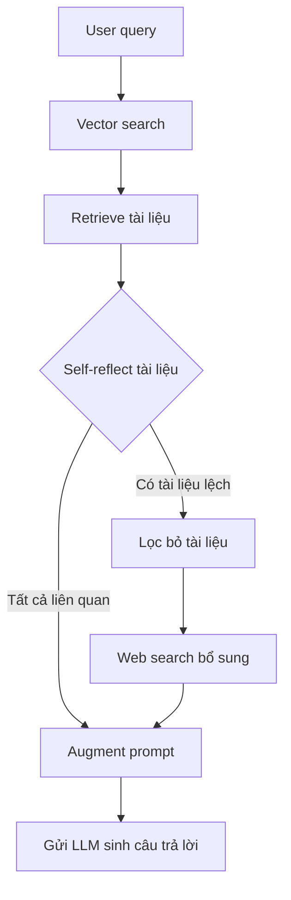

# 🔍 Nâng tầm chất lượng RAG với Corrective RAG: Khi tài liệu "lệch sóng" thì phải làm sao?

> Nguồn: `108-Improving-RAG-Quality-with-the-Corrective-RAG-Flow.txt` · [Udemy](https://ua.udemy.com/course/langchain/learn/lecture/51132487)

Chào các bạn, mình là Eden đây! 👋 Trong vài video tới, chúng ta sẽ cùng nhau hiện thực hóa **CRAG (Corrective RAG)** dựa trên bài báo nghiên cứu cùng tên.

Đây là một **advanced RAG technique (kỹ thuật RAG nâng cao)** giúp chúng ta nhận được câu trả lời chất lượng hơn khi thực hiện **retrieval, augmentation, generation**. Nghe có vẻ "cao siêu" nhưng khái niệm cơ bản của CRAG lại vô cùng dễ nắm, mình hứa đấy!

---

### 🎯 Corrective RAG khởi đầu như thế nào?

Đầu tiên, chúng ta lấy **query (câu hỏi)** của người dùng, thực hiện **vector search / semantic search (tìm kiếm ngữ nghĩa)** để truy xuất các document liên quan từ **vector store**.

Nếu tóm gọn lại, toàn bộ quy trình CRAG sẽ đi qua các bước sau:

1. Nhận **query** và **retrieve** các document liên quan từ vector store.
2. **Self-reflect:** tự critique xem những document đó có thật sự liên quan đến query gốc hay không.
3. Nếu tất cả đều ổn → **happy flow**: augment prompt và gửi cho LLM như RAG thường lệ.
4. Nếu có document không liên quan → **lọc bỏ** và **tìm kiếm thêm trên Internet** để bù đắp thông tin.

Toàn bộ quy trình được mô tả ngắn gọn trong sơ đồ sau:

Sau khi đã có đống tài liệu trong tay, bước tiếp theo mới là phần thú vị nhất: **self-reflection (tự phản chiếu)**.

---

### 🪞 Self-reflection: tự phê bình tài liệu trước khi tin dùng

Mình sẽ không vội vàng ném hết tài liệu cho LLM như cách làm RAG thông thường, mà sẽ **critique (phê bình) chính những document vừa truy xuất**, để xác định xem chúng có **thực sự liên quan đến query ban đầu** hay không.

Từ đây, câu chuyện rẽ thành hai nhánh:

1. **Happy flow:** nếu tất cả document đều liên quan đến câu hỏi, mọi thứ quá đẹp. Mình chỉ việc **augment (bổ sung) prompt gốc** rồi gửi tất cả cho LLM — y hệt cách chúng ta vẫn làm trong RAG.
2. **Nhánh "kém may mắn":** nếu phát hiện có document không liên quan, mình lập tức **lọc bỏ (filter) chúng**, đồng thời thực hiện **external search (tìm kiếm bên ngoài) trên Internet** để thu thập thêm thông tin.

Hai nhánh này khác nhau ở cách xử lý ngữ cảnh trước khi đưa cho LLM:

| Nhánh | Điều kiện | Cách xử lý |
|---|---|---|
| Happy flow | Tất cả document đều liên quan đến query | Augment prompt gốc và gửi hết cho LLM như RAG thường lệ |
| Nhánh kém may mắn | Có document không liên quan | Lọc bỏ document lệch, external search trên Internet, augment prompt bằng thông tin real-time |

---

### 🌐 Khi tài liệu nội bộ không đủ: gọi "viện binh" từ Internet

Những thông tin **real-time** lấy được từ online sẽ được dùng để **augment prompt**, giúp bù đắp phần kiến thức còn thiếu. Sau đó, mình mới gửi toàn bộ ngữ cảnh đã được làm giàu cho LLM.

Điểm mình thích ở kỹ thuật này là nó không "tin tưởng mù quáng" vào vector store: tài liệu nào không đủ tốt sẽ bị loại, và khi kiến thức nội bộ cạn ý tưởng, chúng ta vẫn có Internet làm phương án dự phòng.

So với RAG truyền thống, cách làm này sẽ mang lại cho chúng ta phản hồi **chất lượng cao hơn hẳn**.

*Đừng lo nếu các khái niệm còn hơi nhiều — chúng ta sẽ vừa code vừa ngấm dần từng phần, chắc chắn sẽ hiểu hết thôi!*

### 🎯 Tự kiểm tra nhanh

**Câu 1:** CRAG là viết tắt của cụm từ nào?

<b>Xem đáp án</b>

**Đáp án:** Corrective Retrieval Augmented Generation.

Giải thích: Đây là tên bài báo nghiên cứu mà kỹ thuật này dựa trên.

Tham chiếu: Đoạn mở bài.

**Câu 2:** Bước đầu tiên của CRAG là gì?

<b>Xem đáp án</b>

**Đáp án:** Nhận query, thực hiện vector search / semantic search để retrieve các document liên quan từ vector store.

Giải thích: Giống RAG thường, CRAG vẫn bắt đầu từ retrieval.

Tham chiếu: Mục Corrective RAG khởi đầu như thế nào.

**Câu 3:** Happy flow của CRAG diễn ra như thế nào?

<b>Xem đáp án</b>

**Đáp án:** Khi tất cả document đều liên quan, ta augment prompt gốc và gửi hết cho LLM như RAG thường lệ.

Giải thích: Không cần xử lý thêm gì khi tài liệu đã đủ tốt.

Tham chiếu: Mục Self-reflection.

**Câu 4:** Khi phát hiện document không liên quan, CRAG xử lý ra sao?

<b>Xem đáp án</b>

**Đáp án:** Lọc bỏ document lệch, thực hiện external search trên Internet và augment prompt bằng thông tin real-time.

Giải thích: Internet là nguồn dự phòng khi kiến thức nội bộ không đủ.

Tham chiếu: Mục Khi tài liệu nội bộ không đủ.

**Câu 5:** Vì sao CRAG cho phản hồi chất lượng hơn RAG truyền thống?

<b>Xem đáp án</b>

**Đáp án:** Vì không tin tưởng mù quáng vào vector store: tài liệu kém bị loại và luôn có Internet làm phương án dự phòng.

Giải thích: Đây chính là tinh thần corrective của kỹ thuật này.

Tham chiếu: Mục Khi tài liệu nội bộ không đủ.

Trong video tiếp theo, mình sẽ bắt tay vào dựng project cho **reflection agent** của chúng ta. Hẹn gặp lại các bạn nhé! 🚀

## Nguồn tham khảo

- [Udemy — Improving RAG Quality with the Corrective RAG Flow](https://ua.udemy.com/course/langchain/learn/lecture/51132487)
- [Corrective Retrieval Augmented Generation — arXiv 2401.15884](https://arxiv.org/abs/2401.15884)
