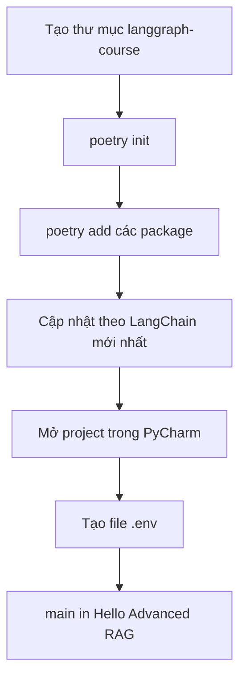

# ⚙️ Khởi tạo dự án Agentic RAG: Poetry, PyCharm và những cập nhật mới nhất của LangChain

> Nguồn: `109-Boilerplate-Setup-for-an-Agentic-RAG-Agent-with-LangGraph.txt` · [Udemy](https://ua.udemy.com/course/langchain/learn/lecture/57117695)

Chào các bạn, mình là Eden đây! 👋 Trong video này, chúng ta sẽ cùng nhau **setup project cho reflection agent** của mình.

Cụ thể, mình sẽ tạo thư mục dự án, dùng **Poetry** để tạo **virtual environment (môi trường ảo)** và cài đặt dependencies; sau đó mở **PyCharm** và cấu hình để trỏ đúng vào môi trường ảo đang dùng. Cuối cùng, chúng ta sẽ tạo file **.env** để chứa các API key.

---

### 📦 Bắt đầu với Poetry

Toàn bộ code của video này và cả series sẽ nằm trên **GitHub**, ở branch **1-start-here** — các bạn có thể vào đó để so sánh, hoặc xem mình đang dùng phiên bản nào.

Các bước khởi tạo:

1. `cd` vào Desktop và tạo thư mục mới tên là **langgraph-course**.
2. Đi vào thư mục đó và khởi tạo môi trường Poetry bằng lệnh **`poetry init`** — cứ Enter và tiếp tục phần setup.
3. Lúc này mình đã có file **pyproject.toml**, nhưng chưa cài gì cả. Vậy nên mình dùng **`poetry add`** để cài hàng loạt package:

* **beautifulsoup** — LangChain dùng thư viện này khi tải file từ web về để **ingest (nạp dữ liệu)** vào vector store.
* **langchain**, **langgraph**, **langchain-hub** và **langchain-community** — gói community cần thiết vì mình dùng các **third-party loader** để load document.
* **Tavily SDK** — cho search engine của chúng ta.
* **Chroma** — vector store mã nguồn mở.
* **python-dotenv** — quản lý environment variables.
* **Black** và **isort** — định dạng code.
* **pytest** — vì chúng ta sẽ viết test.

Toàn bộ quy trình setup của chúng ta sẽ đi qua các chặng sau:

---

### 🔄 "Eden của 2 năm sau" xuất hiện: cập nhật theo LangChain mới nhất

Đến đây, mình muốn xen ngang một chút: các bạn có thể nhận ra mình của hiện tại trông "già" hơn một chút so với phần đầu video. Lý do là **khoảng hai năm** đã trôi qua kể từ lúc mình quay video này, nên mình đã quay thêm và edit lại để đảm bảo chúng ta luôn đi cùng **phiên bản LangChain mới nhất**.

Tin cực vui là: **toàn bộ code gần như giữ nguyên, chỉ khác một vài import**. Cụ thể:

* **LangChain Community đã bị deprecated (ngừng hỗ trợ)** — mình đã nhắc điều này ở phần giới thiệu RAG. Vì vậy đừng cài gói này nữa.
* Để load document, chúng ta cài **langchain-unstructured**.
* Để split text, chúng ta cài **langchain-text-splitters**.

Bảng đối chiếu nhanh giữa gói cũ và gói mới:

| Nhu cầu | Gói cần cài |
|---|---|
| Load document | **langchain-unstructured** |
| Split text | **langchain-text-splitters** |
| (Không dùng nữa) third-party loader qua community | **langchain-community** đã deprecated |

Và nhân đây mình cũng muốn nhấn mạnh: **viết test cho ứng dụng generative là điều cực kỳ quan trọng**, đó là lý do mình đưa testing vào khóa học này. Sau khi cài xong (mất khoảng một phút, mình tua nhanh cho các bạn đỡ chờ), mình mở project trong **PyCharm**.

---

### 🛠️ Cấu hình PyCharm và file .env

PyCharm lập tức **phát hiện môi trường Poetry** của mình, mình bấm approve và để nó **index toàn bộ package**. Nhìn vào **pyproject.toml**, các bạn sẽ thấy đầy đủ phiên bản đang dùng. Mình cũng sẽ **liên tục cập nhật repository của khóa học** để luôn bám sát phiên bản LangChain và LangGraph mới nhất.

Tiếp theo, mình tạo file **.env** chứa toàn bộ biến môi trường:

* **OpenAI API key**.
* **LangSmith API key** — vì chúng ta sẽ dùng **LangSmith để tracing (theo dõi luồng chạy)**.
* Bật **LangSmith tracing** và đặt tên project là **CRAG**.
* **Tavily API key** cho search engine.
* Biến **Python path** trỏ về thư mục gốc của dự án.

---

### ✅ Phép thử đầu tiên: "Hello Advanced RAG"

Cuối cùng, mình tạo file **main** với đoạn boilerplate đơn giản: **load environment variables** rồi in ra dòng `Hello Advanced RAG`. Chạy thử như một **sanity check** — và mọi thứ hoạt động trơn tru!

### 🎯 Tự kiểm tra nhanh

**Câu 1:** Poetry được dùng để làm gì trong project?

<b>Xem đáp án</b>

**Đáp án:** Tạo virtual environment và cài đặt, quản lý dependencies (thông qua pyproject.toml).

Giải thích: `poetry init` khởi tạo môi trường, `poetry add` cài package.

Tham chiếu: Mục Bắt đầu với Poetry.

**Câu 2:** Vì sao không cài langchain-community nữa, thay vào đó dùng gì?

<b>Xem đáp án</b>

**Đáp án:** Vì langchain-community đã deprecated; thay bằng langchain-unstructured để load document và langchain-text-splitters để split text.

Giải thích: Đây là điểm khác biệt chính so với code gốc hai năm trước.

Tham chiếu: Mục Eden của 2 năm sau xuất hiện.

**Câu 3:** LangSmith được dùng để làm gì?

<b>Xem đáp án</b>

**Đáp án:** Tracing (theo dõi luồng chạy); mình bật tracing và đặt tên project là CRAG.

Giải thích: LangSmith API key nằm trong file .env.

Tham chiếu: Mục Cấu hình PyCharm và file .env.

**Câu 4:** PyCharm phản ứng thế nào khi mở project?

<b>Xem đáp án</b>

**Đáp án:** Tự phát hiện môi trường Poetry; mình bấm approve và để PyCharm index toàn bộ package.

Giải thích: pyproject.toml cũng cho thấy đầy đủ phiên bản đang dùng.

Tham chiếu: Mục Cấu hình PyCharm và file .env.

**Câu 5:** Phép thử sanity check đầu tiên là gì?

<b>Xem đáp án</b>

**Đáp án:** Tạo file main load environment variables rồi in ra dòng `Hello Advanced RAG`.

Giải thích: Mọi thứ chạy trơn tru nghĩa là setup đã ổn.

Tham chiếu: Mục Phép thử đầu tiên.

Nếu muốn đối chiếu code, các bạn ghé branch **1-start-here** của repository khóa học nhé. Ở video tiếp theo, chúng ta sẽ cùng xem **cấu trúc repository**. Hẹn gặp lại các bạn! 🚀

## Nguồn tham khảo

- [Udemy — Boilerplate Setup for an Agentic RAG Agent with LangGraph](https://ua.udemy.com/course/langchain/learn/lecture/57117695)
- [Poetry — Documentation](https://python-poetry.org/docs)
- [LangGraph — Overview](https://docs.langchain.com/oss/python/langgraph/overview)
