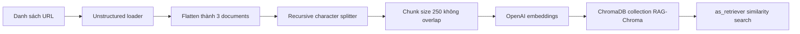

# 🗄️ Pipeline Ingestion cho Vector Store: Từ bài viết trên web đến ChromaDB

> Nguồn: `111-LangChain-Vector-Store-Ingestion-Pipeline-Unstructured-Chrom.txt` · [Udemy](https://ua.udemy.com/course/langchain/learn/lecture/51132395)

Chào các bạn, mình là Eden đây! 👋 Như các bạn đã biết, trước khi hiện thực một giải pháp RAG nâng cao, việc đầu tiên luôn là **index tài liệu vào vector store**.

Trong video này, chúng ta sẽ viết file **ingestion.py**: load các bài viết thành **LangChain Documents**, **chunk** chúng thành những mảnh nhỏ hơn, rồi **embed** và lưu tất cả vào **ChromaDB** — vector store mã nguồn mở.

---

### ⚖️ Một lời "disclaimer" về pipeline ingestion

Trong một ứng dụng GenAI — đặc biệt là ứng dụng dựa trên RAG, và ở đây chúng ta còn làm một phiên bản RAG rất nâng cao — pipeline ingestion có thể được tối ưu ở **mọi bước**: từ lúc **load document**, **transform và chunk**, cho đến lúc **embed**, tùy vào model đang dùng.

Tuy nhiên, trong dự án này, mình chọn tập trung vào **phần retrieval** hơn là ingestion. Nên ở phần ingestion, mình đơn giản quay về **cấu hình mặc định**, không làm gì đặc biệt: chỉ chunk tài liệu rồi nạp vào vector store. Còn phần retrieval, chúng ta sẽ dùng **LangGraph** để hiện thực những kỹ thuật truy xuất rất nâng cao.

---

### 📥 Load và chunk ba bài viết

Trước hết là imports. Mình dùng **load_dotenv** để nạp biến môi trường, **recursive character text splitter** để chia nhỏ tài liệu, **unstructured loader** để load document từ Internet, **Chroma** làm vector store và **OpenAI embeddings** cho phần embedding.

Tiếp theo, mình tạo một **list các URL** để scrape. Ba bài viết bao gồm:

1. Một bài về generative AI, bàn về **autonomous agents (agent tự chủ)** cùng các chủ đề cốt lõi: **memory, planning và reasoning**.
2. Một bài về **prompt engineering**, với đầy đủ kỹ thuật: **zero-shot, few-shot, chain-of-thought, ReAct**, v.v.
3. Một bài về **adversarial attacks on LLM security** — tức prompt hacking, tấn công vào LLM.

Sau đó, mình dùng **web-based loader** để nạp từng URL thành LangChain Documents. Khi debug, mình phát hiện kết quả trả về là **một list mà mỗi phần tử lại là một list con** chỉ chứa đúng một document. Vì vậy mình viết vòng lặp để **làm phẳng (flatten)** list này — và cuối cùng thu được một **document list** gồm **3 phần tử**, mỗi phần tử là một LangChain Document.

Bước tiếp theo là **chia nhỏ tài liệu**. Mình dùng **recursive character text splitter** với **`from_tiktoken_encoder`**, đặt **chunk size = 250** và **không overlap**. Kết quả trong debug: tài liệu được chia thành rất nhiều chunk, **gần 200 mảnh**.

---

### 🧪 Index vào ChromaDB và tạo retriever

Giờ đã sẵn sàng để index vào **ChromaDB** — chạy hoàn toàn **local trên máy của chúng ta**. Mình dùng phương thức **`from_documents`** của class **Chroma**, truyền vào các chunk, đặt **collection name là RAG-Chroma**, dùng **OpenAI embeddings** (mặc định sẽ là model **text-embedding-3-small**) và khai báo **`persist_directory`** là **./.chroma** để vector store được lưu xuống đĩa sau khi index xong.

Chạy thử — và đúng như mong đợi, thư mục **.chroma** xuất hiện với dữ liệu persistent.

Điều cuối cùng: tạo một **retriever object** từ ChromaDB. Mình khởi tạo object của class **Chroma**, rồi gọi phương thức **`as_retriever()`** để biến nó thành **LangChain retriever** phục vụ **similarity search**. Mình nạp lại từ đĩa bằng collection name và persistent directory đã khai báo, kèm **embedding function**.

Cả pipeline gói gọn trong sơ đồ sau:



---

### 💾 Đừng index lại từ đầu mỗi lần chạy

Sau khi mọi thứ hoạt động, mình **comment đoạn code indexing lại**, vì chúng ta không muốn index lại từ đầu mỗi lần chạy chương trình — chỉ cần **load mọi thứ từ đĩa**. Chạy lại chương trình một lần nữa để chắc chắn không có lỗi.

| Giai đoạn | Thao tác | Mục đích |
|---|---|---|
| Lần chạy đầu | Dùng `from_documents` trên các chunk, đặt `persist_directory` là ./.chroma | Index và lưu vector xuống đĩa |
| Các lần chạy sau | Khởi tạo Chroma với collection name và persist_directory, bỏ qua code indexing | Load lại từ đĩa, không index lại từ đầu |

---

### 💻 Code mẫu đầy đủ — `ingestion.py`

Toàn bộ code của bài nằm trong file `ingestion.py` (tham khảo từ repo chính thức của khóa học):

```python
from dotenv import load_dotenv
from langchain_chroma import Chroma
from langchain_openai import OpenAIEmbeddings
from langchain_text_splitters import RecursiveCharacterTextSplitter
from langchain_unstructured import UnstructuredLoader

load_dotenv()

urls = [
    "https://lilianweng.github.io/posts/2023-06-23-agent/",
    "https://lilianweng.github.io/posts/2023-03-15-prompt-engineering/",
    "https://lilianweng.github.io/posts/2023-10-25-adv-attack-llm/",
]

docs = [
    UnstructuredLoader(
        web_url=url, chunking_strategy="basic", max_characters=1000000
    ).load()
    for url in urls
]
docs_list = [item for sublist in docs for item in sublist]

text_splitter = RecursiveCharacterTextSplitter.from_tiktoken_encoder(
    chunk_size=250, chunk_overlap=0
)
doc_splits = text_splitter.split_documents(docs_list)

# vectorstore = Chroma.from_documents(
#     documents=doc_splits,
#     collection_name="rag-chroma",
#     embedding=OpenAIEmbeddings(),
#     persist_directory="./.chroma",
# )

retriever = Chroma(
    collection_name="rag-chroma",
    persist_directory="./.chroma",
    embedding_function=OpenAIEmbeddings(),
).as_retriever()
```

### 🎯 Tự kiểm tra nhanh

**Câu 1:** Pipeline ingestion trong bài gồm những bước chính nào?

<details>
<summary><b>Xem đáp án</b></summary>

**Đáp án:** Load document từ web, transform và chunk, embed rồi index vào vector store.

Giải thích: Đây là các bước tiêu chuẩn trước khi làm retrieval.

Tham chiếu: Mục Một lời disclaimer về pipeline ingestion.

</details>

**Câu 2:** Ba bài viết được scrape nói về chủ đề gì?

<details>
<summary><b>Xem đáp án</b></summary>

**Đáp án:** Autonomous agents (memory, planning, reasoning); prompt engineering (zero-shot, few-shot, chain-of-thought, ReAct); adversarial attacks on LLM security (prompt hacking).

Giải thích: Ba bài này tạo thành nguồn tri thức cho vector store.

Tham chiếu: Mục Load và chunk ba bài viết.

</details>

**Câu 3:** Text splitter được cấu hình như thế nào?

<details>
<summary><b>Xem đáp án</b></summary>

**Đáp án:** Recursive character text splitter với `from_tiktoken_encoder`, chunk size 250 và không overlap; kết quả gần 200 chunk.

Giải thích: Chạy thử trong debug cho thấy số mảnh thu được.

Tham chiếu: Mục Load và chunk ba bài viết.

</details>

**Câu 4:** ChromaDB được cấu hình với collection, embedding và thư mục lưu nào?

<details>
<summary><b>Xem đáp án</b></summary>

**Đáp án:** Collection **RAG-Chroma**, OpenAI embeddings (mặc định text-embedding-3-small), `persist_directory` là ./.chroma, chạy local.

Giải thích: Dữ liệu được lưu xuống đĩa sau khi index.

Tham chiếu: Mục Index vào ChromaDB và tạo retriever.

</details>

**Câu 5:** Vì sao sau đó phải comment đoạn code indexing?

<details>
<summary><b>Xem đáp án</b></summary>

**Đáp án:** Để không index lại từ đầu mỗi lần chạy chương trình — chỉ cần load mọi thứ từ đĩa.

Giải thích: Retriever được nạp lại bằng collection name, persist_directory và embedding function.

Tham chiếu: Mục Đừng index lại từ đầu mỗi lần chạy.

</details>

Toàn bộ code nằm ở branch **3-ingestion** trên repository GitHub — các bạn cứ tự do so sánh và dùng lại nhé. *Đừng lo nếu phần ingestion này có vẻ "đơn giản quá"* — vì phần hay ho nhất, tức **retrieval với LangGraph**, vẫn đang chờ chúng ta ở phía trước. Video tiếp theo, chúng ta sẽ nói về **GraphState**. Hẹn gặp lại! 🚀

## Nguồn tham khảo

- [Udemy — LangChain Vector Store Ingestion Pipeline (Unstructured, ChromaDB)](https://ua.udemy.com/course/langchain/learn/lecture/51132395)
- [LangChain — Retrieval](https://docs.langchain.com/oss/python/langchain/retrieval)
- [Chroma — Storage Layout (persist_directory)](https://cookbook.chromadb.dev/core/storage-layout)
