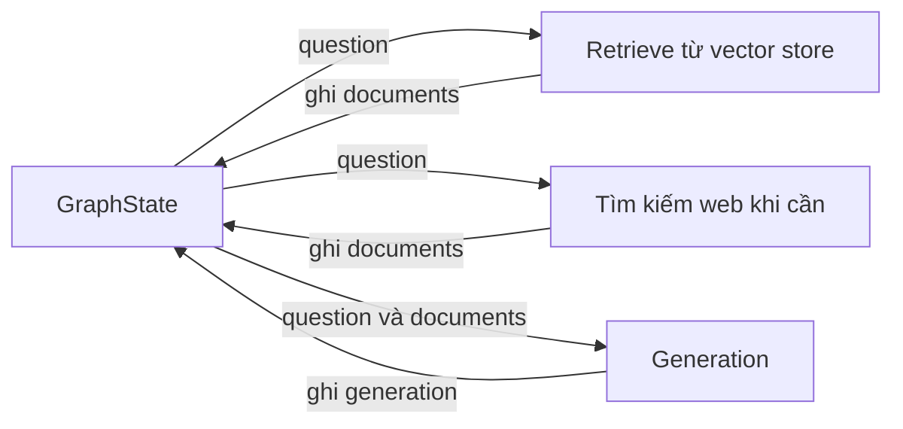

# 🧩 GraphState: "Dòng máu" chảy qua mọi node trong LangGraph

> Nguồn: `112-Managing-Information-Flow-in-LangGraph-The-GraphState.txt` · [Udemy](https://ua.udemy.com/course/langchain/learn/lecture/51132401)

Chào các bạn, mình là Eden đây! 👋 Video này chúng ta sẽ định nghĩa **graph state (trạng thái của graph)** — thứ sẽ được truyền qua truyền lại trong suốt quá trình các node thực thi.

Video này khá ngắn thôi, vì mọi thứ khá đơn giản và trực tiếp. Và như thường lệ, nếu muốn lấy code chính xác, các bạn ghé branch **4-state** trên GitHub nhé.

---

### 🧩 Vì sao graph cần một "state"?

Mình mở file **state.py** và bắt đầu với imports: **List** và **TypedDict**. Sau đó tạo class **GraphState** kế thừa từ **TypedDict** — class này sẽ chứa **toàn bộ state cần thiết cho quá trình graph thực thi**.

Trước khi code, hãy cùng điểm qua những gì mình muốn lưu trữ, vì mình luôn muốn định hình rõ ràng trước khi viết:

* **Question:** câu hỏi của người dùng. Mình luôn cần tham chiếu lại nó — để xác định xem tài liệu truy xuất được có liên quan đến câu hỏi hay không, hoặc để quyết định sẽ tìm kiếm gì trên mạng.
* **Documents:** những tài liệu giúp trả lời câu hỏi — có thể là tài liệu được **retrieve (truy xuất)** từ vector store, hoặc tài liệu lấy về từ **kết quả tìm kiếm**. Chúng sẽ được lưu trong một list.
* **Web search:** một **Boolean flag** cho biết chúng ta có cần tìm thêm kết quả trên Internet hay không.
* **Generation:** câu trả lời đã được sinh ra.

Dòng thông tin trong graph sẽ chảy như sau:

---

### 📋 Định nghĩa các trường trong GraphState

Vậy là mình khai báo các thuộc tính:

* **question** có kiểu **string**.
* **generation** có kiểu **string**.
* **web_search** có kiểu **Boolean**.
* **documents** là **list of strings** — tức list chứa **nội dung** của các document.

Bảng tóm tắt bốn trường của GraphState:

| Trường | Kiểu | Ý nghĩa |
|---|---|---|
| **question** | string | Câu hỏi người dùng, dùng để đối chiếu tài liệu và quyết định tìm kiếm gì |
| **generation** | string | Câu trả lời đã được sinh ra |
| **web_search** | Boolean | Có cần tìm thêm kết quả trên Internet hay không |
| **documents** | list of strings | Nội dung các document retrieve được hoặc lấy từ kết quả tìm kiếm |

Và thế là xong! State của chúng ta chỉ đơn giản như vậy. Tuy ngắn gọn, đây lại là "xương sống" của cả graph: mọi node đều đọc từ state này và ghi kết quả trở lại vào nó.

Đó cũng là lý do vì sao mình luôn dành thời gian định hình state thật kỹ trước khi viết node — state đúng và đủ thì các node sau này mới "khớp" với nhau được.

---

### 🔎 Xem code chính xác ở đâu?

Nếu muốn xem code chính xác, các bạn cứ ghé repository GitHub và tìm branch **4-state**. Ở đó, bên trong package **graph**, các bạn sẽ thấy file **state.py** với đúng phần hiện thực mình vừa viết.

### 🎯 Tự kiểm tra nhanh

**Câu 1:** Vì sao graph cần một state?

<b>Xem đáp án</b>

**Đáp án:** Vì state chứa toàn bộ dữ liệu cần thiết cho quá trình graph thực thi, được truyền qua lại giữa các node.

Giải thích: Mọi node đều đọc từ state và ghi kết quả trở lại vào nó.

Tham chiếu: Mục Vì sao graph cần một state.

**Câu 2:** Class GraphState kế thừa từ gì?

<b>Xem đáp án</b>

**Đáp án:** TypedDict.

Giải thích: Imports gồm List và TypedDict.

Tham chiếu: Mục Vì sao graph cần một state.

**Câu 3:** Trường documents có kiểu gì và lưu nội dung nào?

<b>Xem đáp án</b>

**Đáp án:** List of strings — chứa nội dung của các document, có thể từ vector store hoặc từ kết quả tìm kiếm.

Giải thích: Tài liệu retrieve và tài liệu web search đều đổ về đây.

Tham chiếu: Mục Định nghĩa các trường trong GraphState.

**Câu 4:** Trường web_search có vai trò gì?

<b>Xem đáp án</b>

**Đáp án:** Là Boolean flag cho biết chúng ta có cần tìm thêm kết quả trên Internet hay không.

Giải thích: Flag này điều khiển hướng xử lý tiếp theo của graph.

Tham chiếu: Mục Định nghĩa các trường trong GraphState.

**Câu 5:** Vì sao nên định hình state thật kỹ trước khi viết node?

<b>Xem đáp án</b>

**Đáp án:** Vì state đúng và đủ thì các node viết sau mới khớp với nhau được.

Giải thích: State là xương sống của cả graph.

Tham chiếu: Mục Định nghĩa các trường trong GraphState.

*Đừng lo nếu bạn thấy video này hơi ngắn* — state gọn gàng chính là điều mình muốn, vì mọi thứ sẽ được xây dần lên từ đây. Ở video tiếp theo, chúng ta sẽ dùng chính state này để xây **retrieve node** — nơi lấy ngữ cảnh cho LLM. Hẹn gặp lại các bạn! 🚀

## Nguồn tham khảo

- [Udemy — Managing Information Flow in LangGraph: The GraphState](https://ua.udemy.com/course/langchain/learn/lecture/51132401)
- [LangGraph — Graph API overview](https://docs.langchain.com/oss/python/langgraph/graph-api)
