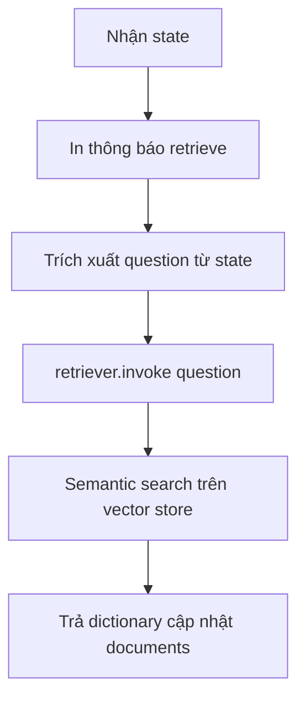

# 🔍 Retrieve Node: Bước đầu tiên để lấy ngữ cảnh cho LLM trong LangGraph

> Nguồn: `113-Fetching-Context-for-LLMs-The-LangGraph-Retrieve-Node.txt` · [Udemy](https://ua.udemy.com/course/langchain/learn/lecture/51132403)

Chào các bạn, mình là Eden đây! 👋 Trong video này, chúng ta sẽ cùng hiện thực **retrieve node** — node đầu tiên trong graph Agentic RAG của chúng ta.

Nhiệm vụ của node này rất gọn gàng: nhận **state**, trích ra **câu hỏi mà người dùng đã hỏi**, rồi **truy xuất những tài liệu liên quan** cho state đó bằng khả năng **semantic search** của vector store. Sau khi node chạy xong, chúng ta sẽ cập nhật trường **documents** trong state để giữ các tài liệu liên quan vừa lấy về.

---

### 🧱 Tạo file retrieve.py trong package nodes

Mình vào package **nodes** và tạo file mới tên là **retrieve.py**. Bắt đầu với imports:

* Từ **typing**, mình import **Any** và **Dict** để **type hinting**.
* Mình import **GraphState** — vì đây là **input của node** và cũng là thứ node sẽ cập nhật.
* Và mình import **retriever** từ file **ingestion** — tới thời điểm này, retriever đã trỏ đúng vào **local vector store** với toàn bộ embeddings đã được lưu sẵn.

---

### ⚙️ Bên trong hàm retrieve

Node của chúng ta là một **function** với dạng thức:

* **Nhận vào:** `state`.
* **Trả về:** một **dictionary** mô tả những gì cần cập nhật trong state.

Các bước xử lý bên trong:

1. **In ra thông báo** rằng chúng ta đang retrieve.
2. **Trích xuất question** từ state hiện tại.
3. Gọi phương thức **`retriever.invoke(question)`** — phương thức này sẽ thực hiện **semantic search** và mang về tất cả tài liệu liên quan.
4. **Trả về** dictionary cập nhật trường **documents** với các tài liệu vừa truy xuất.

Luồng chạy của node gói gọn như sau:



*Một chi tiết nhỏ:* trong phần giá trị trả về, mình cũng thêm cả **câu hỏi gốc** vào. Thành thật mà nói, điều này **không bắt buộc** — mình chỉ làm vậy cho chắc chắn, kiểu cẩn thận cho an toàn thôi!

---

### 📂 Xem code đầy đủ ở đâu?

Nếu muốn lấy code chính xác của video này, các bạn ghé branch **5-retrieve-node** trên GitHub — toàn bộ những gì mình vừa trình bày đều nằm ở đó.

---

### 💻 Code mẫu đầy đủ — `retrieve.py`

Toàn bộ code của bài nằm trong file `graph/nodes/retrieve.py` (tham khảo từ repo chính thức của khóa học):

```python
from typing import Any, Dict

from graph.state import GraphState
from ingestion import retriever


def retrieve(state: GraphState) -> Dict[str, Any]:
    print("---RETRIEVE---")
    question = state["question"]

    documents = retriever.invoke(question)
    return {"documents": documents, "question": question}
```

### 🎯 Tự kiểm tra nhanh

**Câu 1:** Nhiệm vụ của retrieve node là gì?

<details>
<summary><b>Xem đáp án</b></summary>

**Đáp án:** Nhận state, trích ra câu hỏi của người dùng, truy xuất tài liệu liên quan bằng semantic search và cập nhật trường documents.

Giải thích: Đây là node đầu tiên của graph Agentic RAG.

Tham chiếu: Đoạn mở bài.

</details>

**Câu 2:** Một node trong LangGraph nhận vào gì và trả về gì?

<details>
<summary><b>Xem đáp án</b></summary>

**Đáp án:** Nhận vào `state`, trả về một dictionary mô tả những gì cần cập nhật trong state.

Giải thích: Node là một function với dạng thức state → dictionary cập nhật.

Tham chiếu: Mục Bên trong hàm retrieve.

</details>

**Câu 3:** Biến retriever trong retrieve.py được import từ đâu?

<details>
<summary><b>Xem đáp án</b></summary>

**Đáp án:** Từ file ingestion — lúc này retriever đã trỏ đúng vào local vector store với embeddings đã lưu sẵn.

Giải thích: Ingestion chuẩn bị sẵn retriever, node chỉ việc dùng lại.

Tham chiếu: Mục Tạo file retrieve.py trong package nodes.

</details>

**Câu 4:** Bên trong hàm retrieve lần lượt làm những bước nào?

<details>
<summary><b>Xem đáp án</b></summary>

**Đáp án:** In thông báo đang retrieve, trích xuất question từ state, gọi `retriever.invoke(question)` để semantic search, rồi trả về dictionary cập nhật trường documents.

Giải thích: Giá trị trả về còn kèm cả câu hỏi gốc cho chắc chắn.

Tham chiếu: Mục Bên trong hàm retrieve.

</details>

**Câu 5:** Vì sao Eden thêm câu hỏi gốc vào dictionary trả về?

<details>
<summary><b>Xem đáp án</b></summary>

**Đáp án:** Điều này không bắt buộc — chỉ là cẩn thận cho an toàn thôi.

Giải thích: Mình thêm vào cho chắc chắn, không phải yêu cầu kỹ thuật.

Tham chiếu: Mục Bên trong hàm retrieve.

</details>

Retrieve node tuy nhỏ nhưng chính là "cửa ngõ" đưa tri thức bên ngoài vào cho LLM, và là viên gạch đầu tiên trong kiến trúc Agentic RAG mà chúng ta đang xây. *Đừng lo nếu bạn thấy node này hơi đơn giản* — độ phức tạp sẽ tăng dần ở các node sau, khi chúng ta bắt đầu thêm **reflection** và **relevance filter (bộ lọc độ liên quan)** cho tài liệu.

Hãy giữ vững tinh thần, hành trình còn dài và thú vị phía trước! Hẹn gặp lại các bạn ở video tiếp theo. 🚀

## Nguồn tham khảo

- [Udemy — Fetching Context for LLMs: The LangGraph Retrieve Node](https://ua.udemy.com/course/langchain/learn/lecture/51132403)
- [LangGraph — Graph API overview](https://docs.langchain.com/oss/python/langgraph/graph-api)
- [LangChain — Retrieval](https://docs.langchain.com/oss/python/langchain/retrieval)
