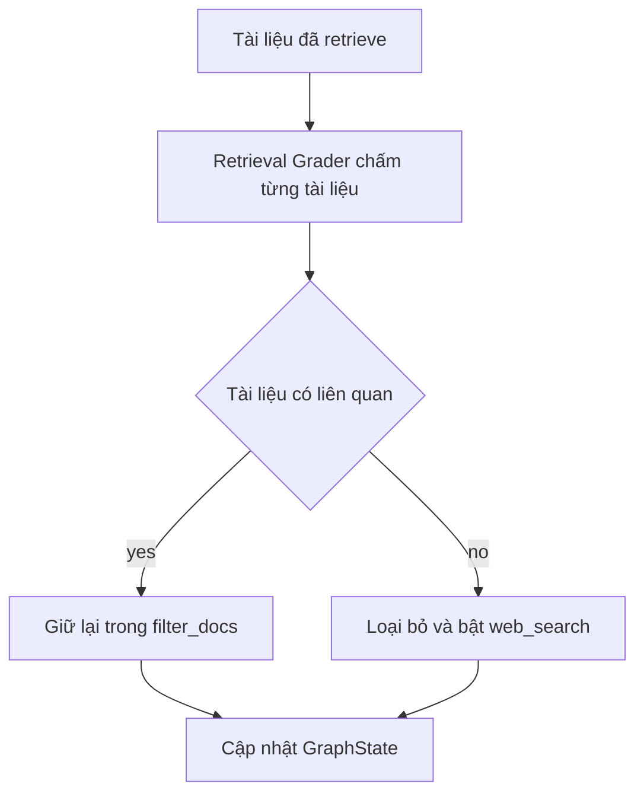

# 🎯 Relevance Filter: Dạy RAG biết lọc tài liệu trước khi trả lời (Structured Output thực chiến)

> Nguồn: `114-Building-a-Relevance-Filter-for-RAG-using-LangChains-Structu.txt` · [Udemy](https://ua.udemy.com/course/langchain/learn/lecture/51133261)

Sau khi đã dựng xong **retrieve node**, hành trình Agentic RAG của chúng ta bước sang một mắt xích cực kỳ quan trọng: **chấm điểm và lọc tài liệu**. Mình sẽ cùng các bạn xây dựng **document grader node** — nơi quyết định tài liệu nào thật sự đáng đưa cho LLM, tài liệu nào cần loại bỏ.

### 🎯 Document grader node: chỉ giữ lại tài liệu xứng đáng

Khi bước vào node này, trong state chúng ta đã có sẵn các tài liệu đã retrieve về. Nhiệm vụ bây giờ là duyệt qua từng tài liệu và xác định xem nó có thật sự liên quan đến câu hỏi hay không.

Mình sẽ viết một **retrieval grader chain**, sử dụng **structured output** (đầu ra có cấu trúc) của LLM và biến kết quả thành một **Pydantic object** chứa thông tin tài liệu có liên quan hay không. Cụ thể:

* Tài liệu **không liên quan** → lọc bỏ.
* Tài liệu **liên quan** → giữ lại.
* Nếu **không phải tất cả tài liệu đều liên quan** (tức có ít nhất một tài liệu bị loại), mình bật cờ **web search = true** để lát nữa đi tìm kiếm thêm trên internet.

Đây là một **heuristic đơn giản** nhưng hiệu quả mà mình chọn cho luồng Agentic RAG này.

Toàn bộ logic chấm điểm và lọc tài liệu gói gọn trong sơ đồ sau:



---

### 🧱 Xây dựng Retrieval Grader chain với Structured Output

Mình tạo file `retrieval_grader.py` trong package `chains`. Chain này nhận vào **câu hỏi gốc** và **tài liệu đã retrieve**, rồi chạy cho từng tài liệu một. Các bước chính:

1. **Imports:** `ChatPromptTemplate`, `BaseModel` và `Field` từ Pydantic, `ChatOpenAI`.
2. **Khởi tạo LLM** mặc định với `temperature = 0`.
3. **Tạo class `GradeDocuments`** — Pydantic model chỉ có một field `binary_score` kiểu string với hai giá trị `yes`/`no`. Phần **description của field cực kỳ quan trọng**, vì LLM dựa vào đó để quyết định và đảm bảo đúng schema.
4. **Gọi `with_structured_output(GradeDocuments)`** — "under the hood" LangChain dùng **function calling**, và mỗi lần gọi LLM sẽ trả về một Pydantic object đúng schema mong muốn.
5. **Lưu ý:** model mặc định của ChatOpenAI là **GPT-3.5**; nếu muốn dùng `with_structured_output` thì LLM phải hỗ trợ function calling, nếu không sẽ không chạy được. Mình khuyên các bạn đọc kỹ implementation của hàm này để hiểu LangChain làm gì bên dưới.
6. **Prompt:** system message mô tả vai trò grader + human message chứa placeholder cho tài liệu cần chấm và câu hỏi người dùng.

```python
class GradeDocuments(BaseModel):
    binary_score: str = Field(
        description="Documents are relevant to the question, 'yes' or 'no'"
    )

system = """You are a grader assessing relevance of a retrieved document to a user question.
If the document contains keywords or semantic meaning related to the question, grade it as relevant.
Give a binary score 'yes' or 'no' to indicate whether the document is relevant to the question."""

structured_llm_grader = llm.with_structured_output(GradeDocuments)
retrieval_grader = grade_prompt | structured_llm_grader
```

Và thế là xong chain — khá trực quan phải không các bạn?

---

### 🧪 Viết test cho ứng dụng LLM: khó nhưng đừng bỏ qua

Mình rất thích viết test và luôn coi đó là phần quan trọng của vòng đời phát triển phần mềm (SDLC). Nhưng phải thừa nhận: **test cho ứng dụng LLM khó hơn hẳn**, vì ba lý do:

1. **Phụ thuộc bên thứ ba:** LLM có tính xác suất (stochastic), câu trả lời **không idempotent** — mỗi request không đảm bảo trả về kết quả giống hệt nhau.
2. **Không kiểm soát được availability/durability:** có thể gặp **rate limiting**, **service not available**, hay **internal service error** từ phía nhà cung cấp.
3. **Tốn tiền:** mỗi lần gọi LLM đều tốn token.

Có thể dùng model rẻ hơn hoặc model open source để đưa vào SDLC, nhưng với mã nguồn mở các bạn phải tự lo **deployment, scalability và availability**. Mình chọn gác những khó khăn đó sang một bên và viết test trước — *vẫn tốt hơn là không có gì cả*. Dù chưa đưa vào CI/CD pipeline, mình vẫn chạy thủ công để có một **sanity check** xem ứng dụng làm đúng việc hay chưa.

Thật lòng mà nói, các model top tier gần đây ngày càng tốt hơn, nhanh hơn và rẻ hơn. Mình từng thấy có công ty tích hợp chúng vào cả CI/CD dù vẫn còn những hạn chế như trên — đều có cách giảm thiểu, nhưng nằm ngoài phạm vi khóa học này.

| Tiêu chí | Test thường | Test ứng dụng LLM |
|---|---|---|
| Tính lặp lại | Kết quả xác định, idempotent | Không idempotent — mỗi request có thể trả kết quả khác |
| Phụ thuộc | Nằm trong tầm kiểm soát của bạn | Phụ thuộc bên thứ ba — availability, durability |
| Chi phí | Gần như không đáng kể | Tốn token, tốn tiền mỗi lần gọi |

Hai test mình viết cho chain:

* **`test_retrieval_grader_answer_yes`:** câu hỏi "agent memory", dùng retriever lấy tài liệu, lấy document đầu tiên (index 1 hoặc 0 đều được — các document ở đầu mảng đều liên quan), rồi assert `binary_score == "yes"`. Chạy thử thì pass, mình còn đảo assert để chắc chắn test thật sự fail được — và nó fail đúng như mong đợi. Có thể chạy bằng terminal với `pytest -sv`.
* **`test_retrieval_grader_answer_no`:** vẫn retrieve tài liệu về agent memory, nhưng chấm với câu hỏi **"how to make pizza"** → kỳ vọng trả về `no`.

Tất cả test đều xanh, nghĩa là chain của chúng ta hoạt động đúng như thiết kế.

---

### ⚙️ Node grade_documents: lọc và cập nhật state

Giờ mình tạo file `grade_documents.py` trong thư mục `nodes`. Hàm nhận **state** (đã có sẵn tài liệu), rồi:

* In ra thông báo đang kiểm tra độ liên quan của tài liệu.
* Lấy **câu hỏi gốc** và **documents** từ state, tạo list `filter_docs` và biến `web_search = false`.
* Duyệt từng document, gọi `retrieval_grader` với câu hỏi và nội dung trang, lấy thuộc tính `binary_score`:
  * `yes` → thêm vào `filter_docs`.
  * `no` → bật `web_search = true` và bỏ qua tài liệu đó.
* Cuối cùng cập nhật **graph state**: `documents` là danh sách đã lọc, `question` giữ nguyên, kèm cờ `web_search`.

### 🎯 Tự kiểm tra nhanh

**Câu 1:** Vì sao description của field `binary_score` lại quan trọng?

<details>
<summary><b>Xem đáp án</b></summary>

**Đáp án:** Vì LLM dựa vào description để quyết định và đảm bảo output đúng schema `yes`/`no`.

Giải thích: Description càng rõ thì việc ép schema càng chặt, giảm khả năng trả sai định dạng.

Tham chiếu: Mục Xây dựng Retrieval Grader chain.

</details>

**Câu 2:** `with_structured_output` hoạt động như thế nào ở bên dưới?

<details>
<summary><b>Xem đáp án</b></summary>

**Đáp án:** LangChain dùng function calling; mỗi lần gọi LLM trả về một Pydantic object đúng schema mong muốn.

Giải thích: Vì thế model phải hỗ trợ function calling, nếu không sẽ không chạy được.

Tham chiếu: Mục Xây dựng Retrieval Grader chain.

</details>

**Câu 3:** Điều kiện nào bật cờ `web_search` sau khi grading?

<details>
<summary><b>Xem đáp án</b></summary>

**Đáp án:** Khi có ít nhất một tài liệu bị chấm `no` — tức không phải tất cả tài liệu đều liên quan.

Giải thích: Đây là heuristic đơn giản nhưng hiệu quả mà giảng viên chọn cho luồng Agentic RAG.

Tham chiếu: Mục Document grader node.

</details>

**Câu 4:** Node `grade_documents` cập nhật những gì vào state?

<details>
<summary><b>Xem đáp án</b></summary>

**Đáp án:** `documents` là danh sách đã lọc, `question` giữ nguyên, kèm cờ `web_search`.

Giải thích: Tài liệu `yes` vào `filter_docs`; tài liệu `no` bị loại và bật cờ web search.

Tham chiếu: Mục Node grade_documents.

</details>

**Câu 5:** Vì sao test cho ứng dụng LLM khó hơn test thông thường?

<details>
<summary><b>Xem đáp án</b></summary>

**Đáp án:** Vì LLM có tính xác suất, kết quả không idempotent; phụ thuộc availability bên thứ ba; và tốn token/tiền mỗi lần gọi.

Giải thích: Dù vậy vẫn nên viết test để có sanity check, thậm chí chạy thủ công bằng `pytest -sv`.

Tham chiếu: Mục Viết test cho ứng dụng LLM.

</details>

Thế là node chấm điểm tài liệu đã hoàn tất! Ở bài tiếp theo, mình sẽ dựng **web search node** với **Tavily** để agent biết tìm thông tin bên ngoài khi kho tài liệu nội bộ không đủ. Hẹn gặp lại các bạn! 🚀

## Nguồn tham khảo

- [Udemy — Building a Relevance Filter for RAG using LangChain's Structured Output](https://ua.udemy.com/course/langchain/learn/lecture/51133261)
- [LangChain Docs — Structured output](https://docs.langchain.com/oss/python/langchain/structured-output)
- [LangChain API — with_structured_output](https://reference.langchain.com/python/langchain-core/language_models/chat_models/BaseChatModel/with_structured_output)
