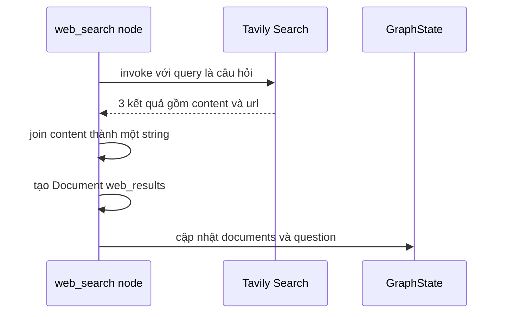

# 🌐 Web Search Node với Tavily: Khi kho tài liệu nội bộ "không đủ dùng"

> Nguồn: `115-Implementing-a-Web-Search-Node-in-LangGraph-using-Tavily-API.txt` · [Udemy](https://ua.udemy.com/course/langchain/learn/lecture/51133263)

Ở bài trước, chúng ta đã biết cách lọc bỏ tài liệu không liên quan và bật cờ **web search** khi cần. Hôm nay mình sẽ cùng các bạn dựng **web search node** — cánh tay nối dài giúp agent tìm thông tin ngoài internet bằng **Tavily**.

### 🎯 Vì sao cần node tìm kiếm web?

Node này chỉ được thực thi **sau khi grade documents đã chạy và lọc xong**. Vì thế, mọi tài liệu còn lại trong state chắc chắn đều liên quan đến câu hỏi — và khi cờ `web_search` được bật, chúng ta sẽ đi tìm thêm thông tin từ bên ngoài để bù đắp những tài liệu đã bị loại.

Điểm hay là Tavily là **search engine được tối ưu riêng cho các ứng dụng dựa trên LLM**: kết quả trả về được xử lý sẵn để đưa thẳng vào prompt. Để dùng Tavily, các bạn cần đảm bảo file `.env` có **Tavily API key**.

---

### 🧱 Tạo file web_search trong thư mục nodes

Các bước chuẩn bị:

1. **Imports:** module `typing`, class `Document` của LangChain (để chuyển kết quả tìm kiếm thành document), và search class — một **LangChain tool** chạy search engine trên query mình đưa vào.
2. **Import `GraphState`** để dùng cho state.
3. **Khởi tạo search tool** với `max_results = 3` — nghĩa là tối đa 3 kết quả mỗi lần tìm.
4. Viết hàm `web_search(state)` nhận state, in log để debug và trả về dictionary.

Vì node chỉ chạy sau bước grading, mình không cần lo về tài liệu "rác": **tất cả documents trong list lúc này đều đã liên quan** đến câu hỏi.

Luồng xử lý bên trong node diễn ra như sau:



---

### 🐛 Debug: kịch bản không tìm được tài liệu nào

Mình thêm đoạn `if __name__ == "__main__":` để chạy thử với câu hỏi "agent memory" và `documents = None` — đây chính là tình huống **không tìm được tài liệu liên quan nào** trong kho nội bộ.

Sau khi invoke search tool với query là câu hỏi, kết quả nhận về là một **list gồm 3 phần tử** (đúng như giới hạn), mỗi phần tử là một **dictionary có key `content` và `url`**. Điều mình cần là gom nội dung cả ba kết quả thành một tài liệu duy nhất.

```python
def web_search(state: GraphState):
    question = state["question"]
    documents = state["documents"]

    search_results = web_search_tool.invoke({"query": question})
    joined = "\n".join([d["content"] for d in search_results])
    web_results = Document(page_content=joined)

    if documents:
        documents.append(web_results)
    else:
        documents = [web_results]

    return {"documents": documents, "question": question}
```

Giải thích nhanh: mình duyệt từng phần tử và dùng hàm `join` với ký tự xuống dòng `"\n"` để nối toàn bộ nội dung thành một **string lớn**, rồi tạo document `web_results` từ string đó. Nếu state đã có documents (đều là tài liệu liên quan), mình **append** thêm kết quả web; nếu chưa có gì, mình tạo list chỉ chứa `web_results`.

| | Kết quả Tavily trả về | Sau khi node xử lý |
|---|---|---|
| Kiểu dữ liệu | List gồm 3 dictionary | Một `Document` duy nhất |
| Nội dung | Mỗi phần tử có `content` và `url` | Toàn bộ `content` nối bằng `\n` |
| Lưu vào state | Không lưu trực tiếp | Append vào `documents` |

---

### ⚙️ Cập nhật state và dọn dẹp

Hàm trả về dictionary cập nhật **graph state**: key `documents` chứa danh sách tài liệu mới (gồm cả kết quả web), key `question` giữ nguyên câu hỏi gốc để các node sau dùng tiếp.

Một chi tiết nhỏ nhưng đáng làm: mình đổi tên file thành `web_search.py` (thêm dấu gạch dưới) cho đúng quy ước đặt tên trong Python.

### 🎯 Tự kiểm tra nhanh

**Câu 1:** Vì sao node web search chỉ chạy sau khi grade documents hoàn tất?

<details>
<summary><b>Xem đáp án</b></summary>

**Đáp án:** Vì lúc đó mọi tài liệu còn lại trong state đều đã được xác nhận liên quan.

Giải thích: Nhờ vậy node không cần lo lọc "rác", cứ append thêm kết quả web là an toàn.

Tham chiếu: Mục Vì sao cần node tìm kiếm web.

</details>

**Câu 2:** Việc khởi tạo search tool với `max_results = 3` có ý nghĩa gì?

<details>
<summary><b>Xem đáp án</b></summary>

**Đáp án:** Mỗi lần tìm kiếm trả về tối đa 3 kết quả.

Giải thích: Khi debug với câu hỏi "agent memory", kết quả đúng là list 3 phần tử.

Tham chiếu: Mục Tạo file web_search trong thư mục nodes.

</details>

**Câu 3:** Kết quả Tavily trả về có cấu trúc như thế nào?

<details>
<summary><b>Xem đáp án</b></summary>

**Đáp án:** Một list các dictionary, mỗi phần tử có key `content` và `url`.

Giải thích: Node cần gom toàn bộ `content` lại thành một tài liệu duy nhất.

Tham chiếu: Mục Debug kịch bản không tìm được tài liệu nào.

</details>

**Câu 4:** Node biến 3 kết quả web thành gì trước khi lưu vào state?

<details>
<summary><b>Xem đáp án</b></summary>

**Đáp án:** Nối toàn bộ `content` bằng `\n` thành một string lớn, rồi tạo một `Document` tên `web_results`.

Giải thích: LLM chỉ cần một document chứa tất cả nội dung tìm được.

Tham chiếu: Mục Cập nhật state và dọn dẹp.

</details>

**Câu 5:** Nếu state đã có documents liên quan thì xử lý thế nào?

<details>
<summary><b>Xem đáp án</b></summary>

**Đáp án:** Append `web_results` vào danh sách; nếu chưa có gì thì tạo list chỉ chứa `web_results`.

Giải thích: Cả hai trường hợp node đều trả về `documents` và giữ nguyên `question` trong graph state.

Tham chiếu: Mục Cập nhật state và dọn dẹp.

</details>

Web search node xong rồi! *Đừng lo nếu bạn thấy phần gom tài liệu hơi "thủ công"* — đôi khi cách đơn giản nhất lại là cách chạy ổn định nhất. Bài tiếp theo, chúng ta sẽ viết **generation chain** để LLM tổng hợp mọi thứ và trả lời người dùng nhé! 🚀

## Nguồn tham khảo

- [Udemy — Implementing a Web Search Node in LangGraph using Tavily API](https://ua.udemy.com/course/langchain/learn/lecture/51133263)
- [LangChain Docs — Tavily search integration](https://docs.langchain.com/oss/python/integrations/tools/tavily_search)
- [Tavily Docs — LangChain integration](https://docs.tavily.com/documentation/integrations/langchain)
