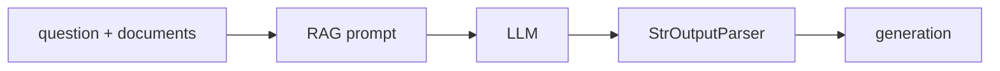

# ✍️ Generation Node: Đưa tài liệu vào LLM và sinh câu trả lời cuối cùng

> Nguồn: `116-Creating-the-LLM-Generation-Chain-and-Node-for-LangGraph.txt` · [Udemy](https://ua.udemy.com/course/langchain/learn/lecture/51133265)

Chào các bạn, Eden đây! Trong bài ngắn này, chúng ta sẽ hoàn thiện **mắt xích cuối cùng** của luồng Agentic RAG: **generation node** — nơi LLM tổng hợp tài liệu và đưa ra câu trả lời cho người dùng.

### 🎯 Node cuối cùng trong luồng RAG

Generation node là node **cuối cùng được thực thi**. Nó chỉ chạy khi chúng ta đã:

1. Retrieve được thông tin.
2. Lọc bỏ những tài liệu không liên quan đến câu hỏi.
3. Thực hiện web search cho câu hỏi nếu cần thiết.

Lúc này, khi đã có đủ tài liệu trong tay, chúng ta **augment** (tăng cường) câu hỏi gốc bằng ngữ cảnh vừa thu thập — và đã đến lúc "stuff" (nhồi) tất cả vào LLM để sinh câu trả lời. Nói ngắn gọn: retrieve → lọc → tìm thêm → **generate**.

---

### 🔐 RAG prompt từ LangChain Hub và câu chuyện bảo mật

Mình dùng **RAG prompt** rất chuẩn do **Lance Martin** (đội ngũ LangChain) viết: giao cho LLM vai trợ lý trả lời câu hỏi, đưa vào **context** (toàn bộ tài liệu retrieve hoặc kết quả web search) và **câu hỏi gốc**.

Tuy nhiên, có một cập nhật quan trọng theo phiên bản LangChain mới nhất mà mình muốn kể cho các bạn:

* LangChain đã **deprecate object `hub`** và chuyển khả năng tải prompt sang **LangSmith client** với method `pull_prompt` cùng prompt identifier.
* Nếu dùng theo cách cũ, bạn sẽ gặp lỗi: mặc định họ **không cho tải public prompt** nữa, bạn phải tự bật cờ `dangerously_pull_public_prompt=True` một cách tường minh.
* Lý do rất hay: prompt giờ được coi là **"executable configuration"** (cấu hình có thể thực thi), không đơn thuần là văn bản. Vì vậy hãy tránh dùng public prompt từ bên ngoài tổ chức nếu chưa review và tin tưởng; nếu buộc phải tải, hãy **pin vào một commit cụ thể** thay vì dùng bản latest.

Cách hiện đại và được khuyến nghị hơn: **dán thẳng prompt dạng plain text vào code**. Cách này không cần network call, không cần LangSmith API key, và mình biết chính xác mình đang chạy gì. Đây cũng là cách mình đưa vào GitHub repository của khóa học.

| Tiêu chí | Tải prompt từ Hub | Dán plain text vào code |
|---|---|---|
| Network call | Có | Không |
| API key | Cần LangSmith | Không cần |
| Kiểm soát nội dung | Phải review kỹ, nên pin vào commit cụ thể | Biết chính xác mình đang chạy gì |

---

### ⛓️ Generation chain và test sanity

Chain của chúng ta rất "standard": prompt → LLM → `StrOutputParser`. Trong đó `StrOutputParser` chỉ làm một việc: lấy nội dung từ message và chuyển nó thành string. Vài điểm cần lưu ý:

* Imports: `hub` từ LangChain (theo cách cũ), `StrOutputParser`, `ChatOpenAI`.
* Tạo instance LLM, sau đó pipe prompt vào LLM rồi vào output parser.
* Khi invoke với `documents` và `question`, ta sẽ nhận về câu trả lời mong muốn.



Về test `test_generation_chain`: mình nói thật, đây **không phải một test chắc chắn** — mình chỉ chạy chain với chủ đề "agent memory", retrieve tài liệu liên quan, rồi xem kết quả in ra. Mục đích là một **sanity check**. Kết quả pass và cho ra một đoạn tóm tắt về agent memory.

Mở **LangSmith** lên, các bạn còn thấy rõ hơn toàn bộ quá trình: phần retrieval với các document lấy về, nội dung tài liệu (đúng chủ đề memory), rồi runnable sequence với câu "You are an assistant...", context được nhồi vào, câu hỏi, và response được đẩy qua `StrOutputParser`. Sau đó mình chạy lại toàn bộ test để chắc không làm hỏng gì — tất cả đều xanh.

---

### ⚙️ Node generate

Mình tạo file `generate.py` trong thư mục `nodes`. Node này rất đơn giản: lấy `question` và `documents` từ state, chạy generation chain, rồi cập nhật key **`generation`** trong graph state bằng câu trả lời mà LLM trả về.

```python
generation_chain = prompt | llm | StrOutputParser()

def generate(state: GraphState):
    question = state["question"]
    documents = state["documents"]
    generation = generation_chain.invoke({"context": documents, "question": question})
    return {"documents": documents, "question": question, "generation": generation}
```

### 🎯 Tự kiểm tra nhanh

**Câu 1:** Generation node chạy ở thời điểm nào trong luồng RAG?

<details>
<summary><b>Xem đáp án</b></summary>

**Đáp án:** Là node cuối cùng, chỉ chạy sau khi đã retrieve, lọc tài liệu và web search nếu cần.

Giải thích: Khi đã có đủ tài liệu, ta augment câu hỏi gốc rồi "stuff" tất cả vào LLM.

Tham chiếu: Mục Node cuối cùng trong luồng RAG.

</details>

**Câu 2:** RAG prompt trong bài do ai viết và gồm những gì?

<details>
<summary><b>Xem đáp án</b></summary>

**Đáp án:** Do Lance Martin (đội ngũ LangChain) viết; gồm context là toàn bộ tài liệu retrieve hoặc kết quả web search, cùng câu hỏi gốc.

Giải thích: Chain rất "standard": prompt → LLM → `StrOutputParser`.

Tham chiếu: Mục RAG prompt từ LangChain Hub.

</details>

**Câu 3:** Vì sao LangChain deprecate object `hub` và cảnh báo bảo mật?

<details>
<summary><b>Xem đáp án</b></summary>

**Đáp án:** Vì prompt được coi là "executable configuration"; muốn tải public prompt phải tự bật `dangerously_pull_public_prompt=True` và nên pin vào commit cụ thể.

Giải thích: Đây là tín hiệu cho thấy LangChain ngày càng chú trọng security.

Tham chiếu: Mục RAG prompt từ LangChain Hub.

</details>

**Câu 4:** Cách hiện đại thay thế cho việc tải prompt từ Hub là gì?

<details>
<summary><b>Xem đáp án</b></summary>

**Đáp án:** Dán thẳng prompt dạng plain text vào code.

Giải thích: Không cần network call, không cần LangSmith API key, và biết chính xác mình đang chạy gì.

Tham chiếu: Mục RAG prompt từ LangChain Hub.

</details>

**Câu 5:** Node generate cập nhật key nào vào graph state?

<details>
<summary><b>Xem đáp án</b></summary>

**Đáp án:** Key `generation` — câu trả lời LLM trả về; ngoài ra vẫn giữ `documents` và `question`.

Giải thích: Node lấy `question` và `documents` từ state rồi chạy generation chain.

Tham chiếu: Mục Node generate.

</details>

Ba node đã xong: retrieve, grade, generate! Giờ chỉ còn thiếu bước ghép nối tất cả thành một graph hoàn chỉnh. Hẹn gặp các bạn ở bài tiếp theo — chúng ta sẽ cùng kết nối và "chạy thử" agent đầu tiên! 🚀

## Nguồn tham khảo

- [Udemy — Creating the LLM Generation Chain and Node for LangGraph](https://ua.udemy.com/course/langchain/learn/lecture/51133265)
- [LangSmith Docs — Manage prompts programmatically](https://docs.langchain.com/langsmith/manage-prompts-programmatically)
- [LangSmith API — pull_prompt](https://reference.langchain.com/python/langsmith/client/Client/pull_prompt)
