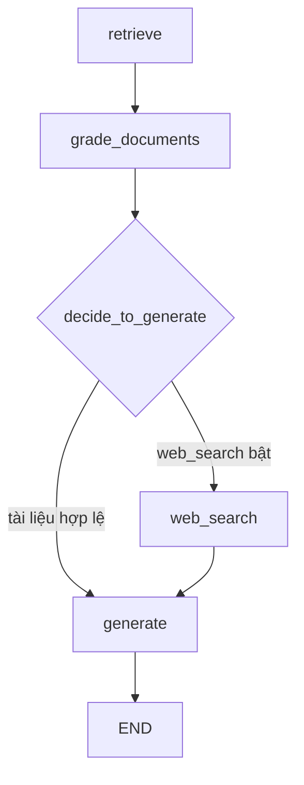

# 🧩 Ghép nối Graph hoàn chỉnh: Khi mọi node "nối vòng tay lớn" và agent chạy thật

> Nguồn: `117-Building-and-Running-the-Complete-LangGraph-Agent.txt` · [Udemy](https://ua.udemy.com/course/langchain/learn/lecture/51288589)

Chặng cuối đã đến! Hôm nay mình sẽ kết nối toàn bộ node và edge đã xây dựng thành một **LangGraph agent hoàn chỉnh**, rồi chạy thử để xem Agentic RAG "sống" như thế nào.

### 📦 Chuẩn bị: export node và khai báo hằng số

Trước khi lắp graph, có hai việc dọn dẹp nhỏ:

1. **File `__init__.py` trong package `nodes`:** import toàn bộ node chúng ta đã tạo — `generate`, `grade_documents`, `retrieve`, `web_search` — và khai báo `__all__` chứa tên các node. Nhờ vậy, các node có thể được import từ bên ngoài package một cách gọn gàng.
2. **File `const.py`:** định nghĩa các hằng số là **tên node** dùng trong graph (viết hoa), ví dụ `RETRIEVE = "retrieve"` với giá trị viết thường. Mục đích là **tránh trùng lặp code**: mọi nơi đều tham chiếu hằng số, nếu cần đổi tên node thì chỉ sửa một chỗ duy nhất.

---

### 🔀 Hàm quyết định: đi web search hay đi generate?

Mở file `graph.py`, mình import các thứ cần thiết: `load_dotenv`, các thành phần từ `langgraph.graph`, bộ hằng số, các node và `GraphState`.

Nhìn vào sơ đồ graph, sau node **grade_documents** sẽ có **hai nhánh**:

* Đi tới **web search** nếu phát hiện **ít nhất một tài liệu không liên quan** đến câu hỏi.
* Đi tới **generate** nếu **mọi tài liệu đều hợp lệ** và liên quan.

Đây chính là **conditional edge** (cạnh điều kiện) của graph. Mình viết hàm `decide_to_generate(state)` để quyết định:

```python
def decide_to_generate(state):
    if state["web_search"]:
        return "web_search"
    else:
        return "generate"

workflow.add_conditional_edges(
    "grade_documents",
    decide_to_generate,
    {"web_search": "web_search", "generate": "generate"},
)
```

Lưu ý nhỏ: mình **return hằng số** (tên node) trong hàm quyết định. Tham số thứ ba — **path map** — thực ra không bắt buộc ở đây vì hàm đã trả về đúng tên node; mình đưa vào để các bạn biết option này tồn tại. Nó đặc biệt hữu ích khi hàm quyết định của bạn không trả về tên node, ví dụ map giá trị trả về sang một node khác hoặc sang `END`.

| API | Khi nào dùng | Ví dụ trong bài |
|---|---|---|
| `add_edge` | Luồng cố định, không rẽ nhánh | `retrieve` → `grade_documents` |
| `add_conditional_edges` | Rẽ nhánh theo state | `grade_documents` → web search hoặc generate |
| `path_map` | Ánh xạ kết quả hàm quyết định sang tên node | `"web_search": "web_search"` |

---

### 🗺️ Lắp ráp và compile workflow

Các bước nối graph:

1. Tạo `workflow = StateGraph(GraphState)` với state chúng ta đã định nghĩa.
2. `add_node` cho **4 node**: `retrieve` (chạy hàm retrieve), `grade_documents`, `generate`, `web_search` — tên viết thường đúng như trong sơ đồ.
3. Đặt **entry point** là node `retrieve` — hàm đầu tiên chạy để lấy tài liệu.
4. Thêm **edge** từ `retrieve` sang `grade_documents`.
5. Thêm **conditional edge** từ `grade_documents` với hàm `decide_to_generate` như trên.
6. Sau web search, ta đã có kết quả nên nối **edge** từ `web_search` sang `generate`.
7. Cuối cùng nối **edge** từ `generate` tới `END`.
8. **Compile** graph và in ra file `graph.png` để xem cấu trúc.

Sơ đồ hoàn chỉnh của graph sau khi ghép nối:



---

### ✅ Chạy thử và kiểm chứng

Trong `main.py`, mình import graph và invoke với câu hỏi **"what is agent memory"**. Nhìn vào log, các bạn sẽ thấy đúng trình tự:

* Retrieve documents.
* Kiểm tra độ liên quan (check relevance) và xem tài liệu nào liên quan hoặc không.
* Phát hiện **một tài liệu không liên quan** → thực thi **external search**.
* Đi tiếp tới node **generate** và nhận về câu trả lời — chất lượng khá tốt.

Mở file `graph.png` ra, bạn sẽ thấy đúng sơ đồ mình vẽ. Còn trên **LangSmith**, trace của lần chạy cho thấy toàn bộ node đã thực thi theo đúng thứ tự; ví dụ ở node web search, bạn thấy câu query **"what is agent memory"** được gửi đi tìm kiếm.

Cuối cùng, nếu muốn xem code, các bạn ghé **GitHub repository** ở branch **LangGraph** — toàn bộ implementation vừa rồi nằm ở đó, đã được cập nhật với phiên bản LangChain và LangGraph mới nhất.

---

### 💻 Code mẫu đầy đủ — `const.py` và `nodes/__init__.py`

Toàn bộ code của phần khai báo hằng số và export node nằm trong hai file dưới đây (tham khảo từ repo chính thức của khóa học; repo đặt tên file là `consts.py` và dùng giá trị `"websearch"` — ở đây mình giữ cách gọi thống nhất với bài).

**`const.py`**

```python
RETRIEVE = "retrieve"
GRADE_DOCUMENTS = "grade_documents"
GENERATE = "generate"
WEBSEARCH = "web_search"
```

**`nodes/__init__.py`**

```python
from graph.nodes.generate import generate
from graph.nodes.grade_documents import grade_documents
from graph.nodes.retrieve import retrieve
from graph.nodes.web_search import web_search

__all__ = ["generate", "grade_documents", "retrieve", "web_search"]
```

### 🎯 Tự kiểm tra nhanh

**Câu 1:** Vì sao mình tách các tên node vào file `const.py`?

<details>
<summary><b>Xem đáp án</b></summary>

**Đáp án:** Để tránh trùng lặp code — cần đổi tên node thì chỉ sửa một chỗ duy nhất.

Giải thích: Hằng số viết hoa, giá trị viết thường, mọi nơi đều tham chiếu hằng số.

Tham chiếu: Mục Chuẩn bị export node và khai báo hằng số.

</details>

**Câu 2:** Hàm `decide_to_generate` quyết định dựa trên yếu tố nào?

<details>
<summary><b>Xem đáp án</b></summary>

**Đáp án:** Cờ `web_search` trong state — bật thì đi web search, tắt thì đi generate.

Giải thích: Cờ này do node `grade_documents` cập nhật khi phát hiện tài liệu không liên quan.

Tham chiếu: Mục Hàm quyết định.

</details>

**Câu 3:** Khi nào graph đi qua nhánh web search?

<details>
<summary><b>Xem đáp án</b></summary>

**Đáp án:** Khi phát hiện ít nhất một tài liệu không liên quan đến câu hỏi.

Giải thích: Nếu mọi tài liệu đều hợp lệ thì đi thẳng tới generate.

Tham chiếu: Mục Hàm quyết định.

</details>

**Câu 4:** `path_map` có bắt buộc không và hữu ích khi nào?

<details>
<summary><b>Xem đáp án</b></summary>

**Đáp án:** Không bắt buộc khi hàm đã trả về đúng tên node; hữu ích khi hàm không trả tên node, cần map sang node khác hoặc `END`.

Giải thích: Giảng viên đưa vào để giới thiệu option này tồn tại.

Tham chiếu: Mục Hàm quyết định.

</details>

**Câu 5:** Entry point của graph là node nào và vì sao?

<details>
<summary><b>Xem đáp án</b></summary>

**Đáp án:** Node `retrieve` — hàm đầu tiên chạy để lấy tài liệu.

Giải thích: Sau đó graph đi theo edge `retrieve` → `grade_documents` rồi rẽ nhánh điều kiện.

Tham chiếu: Mục Lắp ráp và compile workflow.

</details>

Chúc mừng các bạn — chúng ta đã có một **Agentic RAG hoàn chỉnh** chạy được từ đầu đến cuối! Nhưng còn một câu hỏi thú vị: *nếu LLM trả lời sai hoặc "bịa" thì sao?* Bài tiếp theo, mình sẽ giới thiệu **Self-RAG** — dạy agent tự soi lại câu trả lời của chính mình. Hẹn gặp lại! 🚀

## Nguồn tham khảo

- [Udemy — Building and Running the Complete LangGraph Agent](https://ua.udemy.com/course/langchain/learn/lecture/51288589)
- [LangGraph Docs — Graph API](https://docs.langchain.com/oss/python/langgraph/graph-api)
- [LangGraph API — add_conditional_edges](https://reference.langchain.com/python/langgraph/graph/state/StateGraph/add_conditional_edges)
