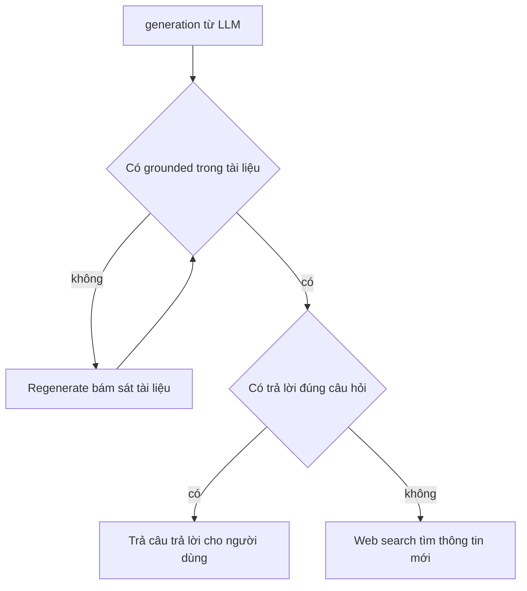

# 🪞 Self-RAG: Dạy Agent biết tự soi lại câu trả lời của chính mình

> Nguồn: `118-Self-RAG--Intro.txt` · [Udemy](https://ua.udemy.com/course/langchain/learn/lecture/51288657)

Mình hy vọng các bạn đã thấy hứng thú với dự án Agentic RAG vừa hoàn thành. Trong bài này, chúng ta sẽ nâng cấp nó lên một tầng "tự nhận thức" với **Self-RAG** — kỹ thuật được xây dựng từ **Self-RAG paper**.

### 💡 Self-RAG là gì?

Nói một cách dễ hiểu, Self-RAG nghĩa là chúng ta sẽ **phản chiếu (reflect) lại câu trả lời mà model đã sinh ra** — thay vì cứ thế trả thẳng cho người dùng.

Cụ thể, mình lấy **generation** (câu trả lời LLM vừa tạo) đem so sánh với **documents** đã retrieve, để kiểm tra xem model có **hallucinate (bịa)** hay không. Câu hỏi trọng tâm ở đây là:

* Câu trả lời có thật sự **grounded** (bám chắc, neo vào) tài liệu không?
* Hay model đang "tự diễn" những thông tin không hề tồn tại trong ngữ cảnh?

Nói ngắn gọn: **đừng tin ngay, hãy kiểm chứng trước khi trao câu trả lời cho người dùng.**

---

### 🔍 Lớp phản chiếu thứ nhất: kiểm tra grounding

Bước đầu tiên là kiểm tra xem câu trả lời có **grounded trong tài liệu** hay không:

* Nếu **grounded** → tuyệt vời, xem như "cool" luôn, ta sẵn sàng bước sang giai đoạn hai.
* Nếu **hallucinated** (không grounded) → ta **regenerate**, tức sinh lại câu trả lời và buộc nó phải bám sát tài liệu.

Tài liệu chính là "mặt đất" để câu trả lời đứng vững. Không có grounding thì câu trả lời không đáng tin.

---

### ❓ Lớp phản chiếu thứ hai: câu trả lời có đúng câu hỏi?

Khi câu trả lời đã grounded, ta chuyển sang bước thứ hai: **phản chiếu xem câu trả lời có trả lời đúng câu hỏi ban đầu của người dùng hay không**.

* Nếu **có** → chúc mừng, ta có thể **trả câu trả lời cho người dùng**.
* Nếu **không** → nhiều khả năng ta cần **web search**, vì tìm thêm trong vector store cũng không tìm được thông tin nào mới.

Điểm mình thích ở Self-RAG là agent không chỉ "trả lời", mà còn tự đặt câu hỏi: *câu trả lời này có thật sự ích cho người hỏi không?*

| Lớp phản chiếu | Câu hỏi kiểm tra | Nếu đạt | Nếu không đạt |
|---|---|---|---|
| Grounding | Câu trả lời có bám tài liệu không | Sang lớp kiểm tra tiếp theo | Regenerate |
| Answer | Câu trả lời có đúng câu hỏi gốc không | Trả câu trả lời cho người dùng | Web search |

---

### ⚙️ Kế hoạch triển khai end-to-end

Trong bài này, mình sẽ làm trọn vẹn luồng Self-RAG từ đầu đến cuối:

1. Viết các **chain** phản chiếu.
2. Viết **test** cho chúng.
3. Thêm các **node** tương ứng vào luồng.
4. Và tất nhiên, thêm toàn bộ **conditional branch** (nhánh điều kiện) để agent tự chọn bước tiếp theo.

Logic hai lớp phản chiếu của Self-RAG:

*Đừng lo nếu bạn cảm thấy hơi choáng* — chúng ta đã có sẵn cấu trúc từ dự án trước, nên mọi thứ sẽ dễ hơn rất nhiều.

### 🎯 Tự kiểm tra nhanh

**Câu 1:** Self-RAG được xây dựng dựa trên nền tảng nào?

<b>Xem đáp án</b>

**Đáp án:** Self-RAG paper.

Giải thích: Ý tưởng cốt lõi là phản chiếu lại câu trả lời model đã sinh ra thay vì trả thẳng cho người dùng.

Tham chiếu: Đoạn mở bài.

**Câu 2:** Lớp phản chiếu thứ nhất kiểm tra điều gì và xử lý ra sao nếu không đạt?

<b>Xem đáp án</b>

**Đáp án:** Kiểm tra câu trả lời có grounded trong tài liệu không; nếu hallucinated thì regenerate để bám sát tài liệu.

Giải thích: Tài liệu là "mặt đất" để câu trả lời đứng vững; không grounded thì không đáng tin.

Tham chiếu: Mục Lớp phản chiếu thứ nhất.

**Câu 3:** Lớp phản chiếu thứ hai kiểm tra điều gì và xử lý ra sao nếu không đạt?

<b>Xem đáp án</b>

**Đáp án:** Kiểm tra câu trả lời có đúng câu hỏi ban đầu không; nếu không thì cần web search.

Giải thích: Lúc này tìm thêm trong vector store cũng không tìm được thông tin mới.

Tham chiếu: Mục Lớp phản chiếu thứ hai.

**Câu 4:** Vì sao khi trả lời sai câu hỏi lại chọn web search thay vì vector store?

<b>Xem đáp án</b>

**Đáp án:** Vì vector store không còn thông tin nào mới để tìm — câu trả lời grounded nhưng không giải quyết câu hỏi nghĩa là thiếu dữ liệu bên ngoài.

Giải thích: Đây là lý do tồn tại của nhánh web search trong Self-RAG.

Tham chiếu: Mục Lớp phản chiếu thứ hai.

**Câu 5:** Kế hoạch triển khai end-to-end trong bài gồm những gì?

<b>Xem đáp án</b>

**Đáp án:** Viết các chain phản chiếu, viết test, thêm node tương ứng và thêm toàn bộ conditional branch cho agent.

Giải thích: Nhờ cấu trúc có sẵn từ dự án trước nên mọi thứ dễ hơn rất nhiều.

Tham chiếu: Mục Kế hoạch triển khai end-to-end.

Hẹn gặp các bạn ở bài tiếp theo, khi chúng ta bắt tay vào code thật đấy! 🚀

## Nguồn tham khảo

- [Udemy — Self RAG: Intro](https://ua.udemy.com/course/langchain/learn/lecture/51288657)
- [Self-RAG paper — Learning to Retrieve, Generate, and Critique through Self-Reflection](https://arxiv.org/abs/2310.11511)
- [Self-RAG official site](https://selfrag.github.io/)
