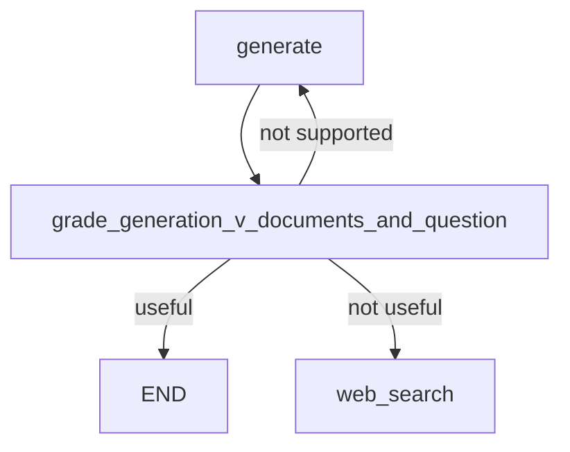

# 🧠 Self-RAG Implementation: Hai "giám khảo" canh chừng câu trả lời của LLM

> Nguồn: `119-Self-RAG--Implementation.txt` · [Udemy](https://ua.udemy.com/course/langchain/learn/lecture/51288659)

Chào các bạn! Đây sẽ là một bài dài vì chúng ta triển khai trọn vẹn **Self-RAG paper** từ đầu đến cuối. Tin vui là mọi thứ sẽ dễ hơn nhiều nhờ cấu trúc đã có sẵn — mình chỉ cần thêm một tầng reflection (phản chiếu) ngay sau node generate mà thôi.

### 🗺️ Bức tranh tổng thể

Thay vì đi thẳng từ `generate` tới `END`, chúng ta thêm **conditional branching** (nhánh điều kiện) sau generate. Trong bài này mình viết hai chain phản chiếu:

* **Hallucination Grader** — kiểm tra xem câu trả lời của LLM có **grounded** trong tài liệu không (model có bịa không).
* **Answer Grader** — kiểm tra xem câu trả lời có **thật sự giải quyết câu hỏi gốc** hay không.

Bạn có thể thắc mắc: *sao không gói mỗi kiểm tra vào một node riêng?* Câu trả lời là hoàn toàn có thể. Nhưng vì quá trình này phải **quyết định bước tiếp theo** (kết thúc, sinh lại, hay tìm kiếm thêm), nên với mình **conditional branching trực giác hơn** — ta chọn node kế tiếp ngay tại điểm rẽ nhánh.

---

### 🕵️ Hallucination Grader: câu trả lời có bám tài liệu không?

Mình tạo file `hallucination_grader.py` trong package `chains`, với các import quen thuộc: `ChatPromptTemplate`, `BaseModel` và `Field` từ Pydantic, `RunnableSequence` để type hinting, và `ChatOpenAI`. Điểm đáng chú ý:

* Class `GradeHallucinations` kế thừa BaseModel, chỉ có **một attribute `binary_score` kiểu boolean**, description là *"answer is grounded in the facts, yes or no"*. Vì type hint là boolean nên output parser của LangChain sẽ **tự cast** câu trả lời của LLM thành boolean.
* Dùng `with_structured_output` với class này → kết quả trả về luôn đúng định dạng Pydantic mong muốn.
* System prompt: yêu cầu LLM chấm xem generation có grounded/được hỗ trợ bởi tập tài liệu hay không, trả về `yes`/`no`.
* `ChatPromptTemplate.from_messages` nhận list các tuple: một **system message**, một **human message** chứa các facts (tài liệu mình plug vào) và generation của LLM.

```python
class GradeHallucinations(BaseModel):
    binary_score: bool = Field(
        description="Answer is grounded in the facts, 'yes' or 'no'"
    )

hallucination_grader = hallucination_prompt | llm.with_structured_output(GradeHallucinations)
```

Về phần test, mình viết hai case:

1. **`test_hallucination_grader_answer_yes`:** câu hỏi "agent memory", retrieve tài liệu, dùng generation chain để sinh câu trả lời từ chính tài liệu đó — câu trả lời phải grounded → kết quả `yes`. *Lần chạy đầu mình gặp lỗi vì import trước khi load biến môi trường*; sửa thứ tự là chạy pass ngay.
2. **`test_hallucination_grader_answer_no`:** giữ nguyên mọi thứ, đổi kỳ vọng thành `no` và thay generation bằng nội dung "bịa": *"In order to make pizza, we first need to start with the dough."* Kết quả trả về `binary_score = false` — đúng là hallucinated. Mình cũng xóa một dòng không còn dùng trong test, rồi chạy lại toàn bộ test — tất cả đều pass ngon lành.

---

### 📝 Answer Grader: câu trả lời có đúng câu hỏi không?

Tương tự, mình tạo file `answer_grader.py` trong `chains`:

* Class `GradeAnswer` với một attribute `binary_score`, description: *"answer addresses the question, yes or no"*.
* Structured output với LLM, kèm system prompt: chấm xem câu trả lời có **giải quyết câu hỏi** hay không; `yes` nghĩa là có.
* `ChatPromptTemplate.from_messages` gồm system message và human message chứa câu hỏi của người dùng cùng generation của LLM.
* Chain `answer_grader` trả về object `GradeAnswer` cho biết `true/false` — không có gì mới về prompt engineering, vẫn là structured output với Pydantic class.

| | Hallucination Grader | Answer Grader |
|---|---|---|
| Câu hỏi kiểm tra | Generation có grounded trong tài liệu không | Answer có giải quyết câu hỏi gốc không |
| Class Pydantic | `GradeHallucinations` | `GradeAnswer` |
| Kiểu `binary_score` | `bool` | `str` yes/no |
| Nhánh khi không đạt | `not supported` → regenerate | `not useful` → web search |

```python
class GradeAnswer(BaseModel):
    binary_score: str = Field(
        description="Answer addresses the question, 'yes' or 'no'"
    )

answer_grader = answer_prompt | llm.with_structured_output(GradeAnswer)
```

---

### 🔀 Ghép vào graph và chạy thử

Giờ là phần thú vị nhất: mình import `answer_grader` và `hallucination_grader` vào `graph.py`, rồi viết hàm điều kiện `grade_generation_v_documents_and_question(state)` trả về **tên node tiếp theo**. Đầu tiên, mình lấy `question`, `documents`, `generation` từ state rồi chạy hallucination grader:

* Nếu **grounded** (không hallucinate) → chạy answer grader. Nếu câu trả lời **giải quyết câu hỏi** → trả về `"useful"`; nếu không → trả về `"not useful"`.
* Nếu **không grounded** → trả về `"not supported"`.

À, mình cố tình trả về `"useful"` thay vì `END` để lát nữa demo cho các bạn cách dùng **path map**. Và đây là các conditional edge, kèm ý nghĩa từng nhánh:

```python
workflow.add_conditional_edges(
    "generate",
    grade_generation_v_documents_and_question,
    {
        "not supported": "generate",
        "useful": END,
        "not useful": "web_search",
    },
)
```

* `"not supported"` → quay lại **generate** để sinh lại cho grounded.
* `"useful"` → đi tới **END**, trả câu trả lời cho người dùng.
* `"not useful"` → đi tới **web search**, vì vector store không đủ thông tin để trả lời.

Các nhánh phản chiếu sau node `generate` nhìn một cách trực quan như sau:



Một điểm rất hay: chính những string này sẽ được hiển thị trên các edge của graph, khiến luồng chạy trở nên **explainable** (dễ hiểu, dễ giải thích) hơn hẳn.

Cuối cùng, mình chạy `main.py` với câu hỏi "what is agent memory" — đúng như kỳ vọng, đây là **happy flow**: câu trả lời grounded trong tài liệu và giải quyết đúng câu hỏi. Nhìn vào log, các bạn thấy rõ từng bước; còn trên **LangSmith**, trace cho thấy sau node generate, node `grade_generation...` được kích hoạt — nó gọi LLM **2 lần** (một cho grounding, một cho việc trả lời đúng câu hỏi) trước khi quyết định trả câu trả lời cho người dùng.

### 🎯 Tự kiểm tra nhanh

**Câu 1:** Vì sao chọn conditional branching thay vì tách mỗi kiểm tra vào một node riêng?

<details>
<summary><b>Xem đáp án</b></summary>

**Đáp án:** Vì quá trình này phải quyết định bước tiếp theo — kết thúc, sinh lại hay tìm kiếm thêm — nên chọn node kế tiếp ngay tại điểm rẽ nhánh trực giác hơn.

Giải thích: Giảng viên nhấn mạnh tách node vẫn hoàn toàn khả thi nếu bạn muốn.

Tham chiếu: Mục Bức tranh tổng thể.

</details>

**Câu 2:** Vì sao `binary_score` của `GradeHallucinations` để kiểu `bool` mà không phải string?

<details>
<summary><b>Xem đáp án</b></summary>

**Đáp án:** Vì output parser của LangChain sẽ tự cast câu trả lời `yes`/`no` của LLM thành boolean.

Giải thích: Structured output với Pydantic vẫn đảm bảo đúng định dạng mong muốn.

Tham chiếu: Mục Hallucination Grader.

</details>

**Câu 3:** Hàm điều kiện `grade_generation_v_documents_and_question` chạy gì trước?

<details>
<summary><b>Xem đáp án</b></summary>

**Đáp án:** Chạy hallucination grader trước; nếu grounded mới chạy tiếp answer grader.

Giải thích: Trên LangSmith thấy rõ node này gọi LLM 2 lần trước khi quyết định trả câu trả lời.

Tham chiếu: Mục Ghép vào graph và chạy thử.

</details>

**Câu 4:** Ba nhánh của conditional edge sau `generate` tương ứng điều gì?

<details>
<summary><b>Xem đáp án</b></summary>

**Đáp án:** `not supported` → generate (sinh lại), `useful` → END (trả người dùng), `not useful` → web search (vector store không đủ).

Giải thích: Chuỗi `not supported`/`useful`/`not useful` hiển thị trên edge giúp graph explainable hơn.

Tham chiếu: Mục Ghép vào graph và chạy thử.

</details>

**Câu 5:** Vì sao hàm điều kiện trả về `"useful"` thay vì `END`?

<details>
<summary><b>Xem đáp án</b></summary>

**Đáp án:** Để demo cách dùng path map — map `"useful"` sang `END`.

Giải thích: Nhờ path map, hàm quyết định không cần trả về đúng tên node.

Tham chiếu: Mục Ghép vào graph và chạy thử.

</details>

Chúc mừng các bạn! Chúng ta vừa hoàn thành một workflow phức tạp với khả năng tự kiểm tra chính mình. Nếu muốn đối chiếu, các bạn có thể xem code trong **GitHub repository** của khóa học. Ở bài cuối của section, mình sẽ giới thiệu **Adaptive RAG** — dạy agent biết chọn "đúng cửa" cho từng câu hỏi. Hẹn gặp lại! 🚀

## Nguồn tham khảo

- [Udemy — Self RAG: Implementation](https://ua.udemy.com/course/langchain/learn/lecture/51288659)
- [Self-RAG paper — Learning to Retrieve, Generate, and Critique through Self-Reflection](https://arxiv.org/abs/2310.11511)
- [LangGraph Docs — Graph API](https://docs.langchain.com/oss/python/langgraph/graph-api)
