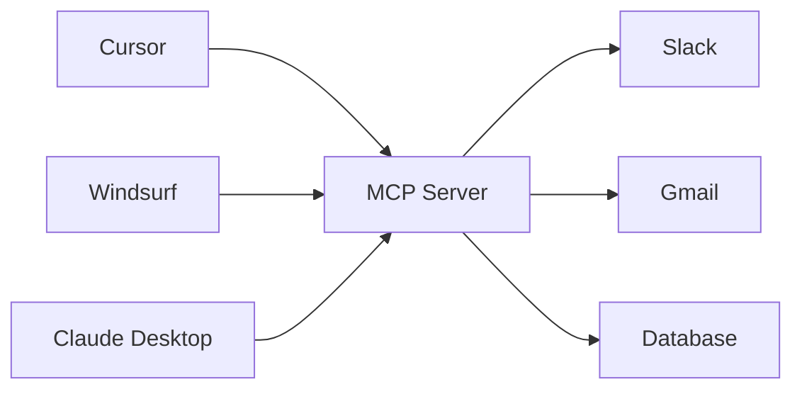

# 🧩 Vì sao chúng ta cần MCP? (Giải mã "cổng cắm vạn năng" cho mọi AI Application)

> Nguồn: `121-Theory-Why-MCP-Model-Context-Protocol.txt` · [Udemy](https://ua.udemy.com/course/langchain/learn/lecture/49043719)

Xin chào các bạn, lại là Eden đây! Hôm nay mình muốn kể cho các bạn nghe về **MCP (Model Context Protocol)** – chủ đề đang "nóng" đến mức cả cộng đồng AI đều bàn tán, với **vô số MCP server** (máy chủ cung cấp tool/dữ liệu cho AI) được triển khai mỗi ngày, và rất nhiều người đang dùng MCP ngay trong các ứng dụng AI quen thuộc như **Cursor** hay **Claude**.

Mục tiêu của mình rất rõ ràng: giúp các bạn **hiểu chính xác điều gì đang diễn ra "under the hood"**, biết cách sử dụng MCP server và tự tay xây dựng MCP server của riêng mình. Nhưng trước khi hỏi "MCP giải quyết được gì", chúng ta phải hiểu **vì sao chúng ta cần nó** đã.

---

### 🎯 Nỗi đau: mỗi AI application lại cần một kiểu tích hợp riêng

Giả sử chúng ta có một AI agent và muốn nó làm được vài việc: gửi tin nhắn trên **Slack**, đọc và gửi **email**, hay truy vấn **database (DB)**. Để làm được, ta phải tự tìm hiểu cách làm việc với **Slack API** hoặc **Gmail API**, rồi viết code custom bọc lại thành một **tool** để agent gọi tới.

Thường thì phần "custom" này lại là điều chúng ta muốn nhất:

* Mình không muốn ai đó xóa mất email, nên sẽ **không cấp cho agent quyền truy cập API delete của Gmail**.
* Với những nhu cầu chung chung hơn, ta có thể dùng luôn **built-in tools của LangChain** – bộ tool đã implement sẵn toàn bộ Gmail API – và dùng out of the box.

Vậy là agent của chúng ta đã gửi được email, nhắn Slack và query DB. Mọi thứ chạy ngon lành... cho tới khi agent **thành công đến mức người khác cũng muốn dùng nó** – trong agent của họ, hoặc trong những ứng dụng họ đang có.

Lấy ví dụ cụ thể: agent đó chính là **Cursor**. Bây giờ giả sử nhóm dùng **Windsurf** muốn dùng lại đúng chức năng này. Vì ta viết code "đo ni đóng giày" cho Cursor, muốn tích hợp sang Windsurf là phải tự làm lại toàn bộ phần integration. Xong Windsurf, lại tới **Lovable**, **Bolt**, **GitHub Copilot**... và **mọi AI coding assistant khác**. Cứ mỗi ứng dụng là một lần viết lại. Thử hỏi có ai muốn viết cả **nghìn bản integration** như vậy?

---

### 🧠 Giải pháp: thêm một lớp trừu tượng (Layer of Abstraction)

Đây là một nguyên lý cốt lõi của khoa học máy tính: muốn giải một bài toán, hãy **thêm một lớp trừu tượng**. MCP làm chính xác điều đó.

Ý tưởng rất gọn: chúng ta **chỉ tích hợp một lần duy nhất vào MCP server của mình**. Bởi vì mọi agent khác đều **hỗ trợ giao thức MCP**, chúng sẽ tự kết nối được tới server đó. Ta cũng chỉ cần implement agent **một lần với khả năng tương thích MCP**, rồi có thể chuyển sang dùng với tất cả các agent khác hỗ trợ giao thức này.

Nói cách khác: agent viết cho Cursor sẽ **tự động tương thích với Windsurf**. Chúng ta – những người phát triển – **không phải thêm bất kỳ logic nào**. Ai hỗ trợ giao thức MCP đều có thể dùng chức năng của ta một cách liền mạch.

Hình dung luồng tích hợp "viết một lần" mà MCP mang lại:

Đặt cạnh cách làm cũ, khác biệt hiện ra rất rõ:

| Tiêu chí | Tích hợp truyền thống | Qua MCP |
|---|---|---|
| Viết integration | Riêng cho từng AI application | Một lần vào MCP server |
| Thêm app mới | Viết lại từ đầu | Cắm vào là chạy |
| Thêm dịch vụ mới | Custom code ở từng app | Thêm tool vào server |

---

### 🚀 Hiệu ứng flywheel: MCP giống như một mạng xã hội

Hãy nghĩ về một ứng dụng mạng xã hội: nếu chỉ vài người dùng, nó chẳng mang lại nhiều giá trị. Nhưng khi có **hàng triệu người** cùng dùng và tạo nội dung, nó trở thành một **flywheel khổng lồ** và mang lại giá trị cực lớn.

MCP đang diễn ra đúng như vậy: rất nhiều người đang dùng, **hàng tấn MCP server** đã có mặt ngoài kia, và thật sự thì **khả năng là vô hạn**.

### 🎯 Tự kiểm tra nhanh

**Câu 1:** Vì sao mỗi AI application trước đây lại phải viết integration riêng?

<b>Xem đáp án</b>

**Đáp án:** Vì code tích hợp được "đo ni đóng giày" cho từng app, không có chuẩn chung.

Giải thích: Cursor, Windsurf, Lovable, Bolt, GitHub Copilot... mỗi ứng dụng một kiểu, dẫn tới hàng nghìn bản integration trùng lặp.

Tham chiếu: Mục Nỗi đau.

**Câu 2:** MCP giải quyết vấn đề đó bằng cách nào?

<b>Xem đáp án</b>

**Đáp án:** Thêm một lớp trừu tượng — chỉ tích hợp một lần duy nhất vào MCP server.

Giải thích: Mọi agent hỗ trợ giao thức MCP đều tự kết nối được tới server đó.

Tham chiếu: Mục Giải pháp.

**Câu 3:** Vì sao agent viết cho Cursor có thể dùng luôn trên Windsurf?

<b>Xem đáp án</b>

**Đáp án:** Vì cả hai đều hỗ trợ giao thức MCP, ta không phải thêm bất kỳ logic nào.

Giải thích: Chức năng được dùng liền mạch giữa các ứng dụng tương thích MCP.

Tham chiếu: Mục Giải pháp.

**Câu 4:** Hình ảnh "flywheel" nói lên điều gì về MCP?

<b>Xem đáp án</b>

**Đáp án:** Càng nhiều người dùng và nhiều server, giá trị của MCP càng lớn — giống như mạng xã hội.

Giải thích: Hiện đã có hàng tấn MCP server ngoài kia và khả năng gần như vô hạn.

Tham chiếu: Mục Hiệu ứng flywheel.

**Câu 5:** Mục tiêu của mình trong chương MCP là gì?

<b>Xem đáp án</b>

**Đáp án:** Giúp các bạn hiểu chính xác điều gì diễn ra under the hood, biết dùng MCP server và tự xây server của riêng mình.

Giải thích: Đây là lộ trình xuyên suốt chương MCP của khóa học.

Tham chiếu: Đoạn mở đầu.

Hẹn gặp lại các bạn ở bài tiếp theo, nơi chúng ta cùng "mổ xẻ" cách LLM thực sự gọi tool nhé! 🚀

## Nguồn tham khảo

- [Udemy — Why MCP (Model Context Protocol)](https://ua.udemy.com/course/langchain/learn/lecture/49043719)
- [Model Context Protocol — Introduction](https://modelcontextprotocol.io/docs/getting-started/intro)
