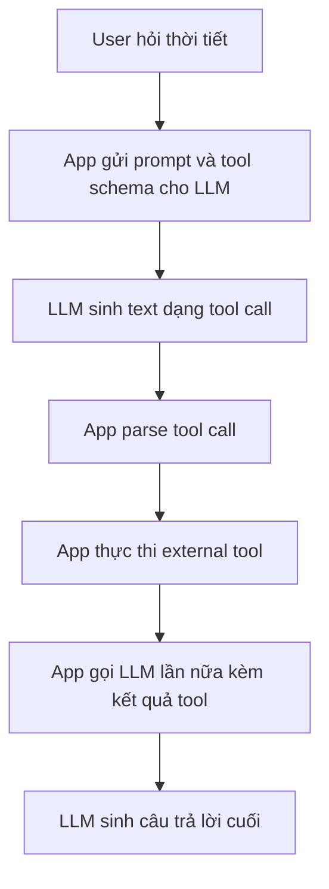

# 🔧 LLM thực sự "dùng tool" như thế nào? (Toàn bộ sự thật về Tool Calling)

> Nguồn: `122-Theory-How-LLMs-REALLY-Use-Tools-Understanding-Tool-Calling.txt` · [Udemy](https://ua.udemy.com/course/langchain/learn/lecture/49563229)

Để hiểu MCP một cách sâu sắc, chúng ta cần lùi lại một chút và nói về lịch sử của **LLM** và các ứng dụng AI nói chung. Hãy cùng mình nhắc lại một điều tưởng như đơn giản nhưng bị bỏ qua rất nhiều: **LLM chỉ là những cỗ máy sinh token (token generator)**.

---

### 🧠 Sự thật đầu tiên: LLM không có siêu năng lực

* LLM là **token generator** và **token predictor** – chúng đoán từng token một, đơn thuần chỉ **sinh ra văn bản**.
* Điều này không hề rõ ràng với nhiều người: với làn sóng agentic hiện nay, người ta nghĩ LLM có siêu năng lực và làm được đủ thứ – **không phải vậy đâu**.
* LLM chỉ có thể **output text** (với multimodal LLM thì thêm ảnh và một số định dạng khác), nhưng chắc chắn **không thể tự mình thực hiện hành động**.
* Những khả năng như **tìm kiếm web**, **deep research**, hay **gọi một hàm Python**... đều là **external tools (tool bên ngoài)** được tích hợp vào **application đang chạy LLM**. Ví dụ bạn dùng ChatGPT desktop hay ChatGPT web: LLM được "bọc" bên trong một application do **các software engineer viết ra**.

---

### ⚙️ Tool calling hoạt động ra sao "under the hood"?

Tool – như web search – là **external code không thuộc về LLM**, do engineer viết. Vậy bằng cách nào ta có được hành vi "gọi tool" này?

Bí mật nằm ở một **system prompt cực kỳ "xịn"**. Với câu hỏi kiểu "What is the weather right now?", thay vì bịa ra "thời tiết hiện tại là 25 độ C", LLM sẽ sinh ra đoạn text dạng **`get_weather(<thành phố>)`** – tức là nó **sinh ra tool call** thay vì hallucinate câu trả lời, vì nó không có quyền truy cập thông tin thực tế.

* Tool call được thiết kế theo **format riêng của từng vendor**, rất **dễ parse**: dễ tách ra **function cần gọi** và dễ tách ra **arguments** truyền vào function.
* Có **nhiều biến thể tool calling**, mỗi vendor implement một kiểu, nhưng tất cả đều **quy về một system prompt đặc biệt**. Mình từng review **ReAct prompt** trong khóa học – đó là một ví dụ điển hình.

Application (ví dụ ChatGPT) sau đó **nhận output, parse nó**, và nếu có tool call thì **invoke functionality** mà engineer đã viết. Ví dụ bạn hỏi giá cổ phiếu NVIDIA, nó sẽ sinh ra token của "search on the web" kèm query "NVIDIA stock price". Sau khi tool chạy xong, application tạo **thêm một LLM call nữa** với **kết quả tool + câu hỏi gốc của user**. Đây chính là **basic functionality của gần như mọi agent**.

Toàn bộ vòng tool calling diễn ra theo trình tự sau:

Phân chia trách nhiệm giữa LLM và application có thể tóm gọn như sau:

| Khả năng | LLM | Application bọc ngoài |
|---|---|---|
| Sinh text và token | Có | Không |
| Tự thực thi hành động | Không | Có, qua external tool |
| Quyết định gọi tool | Có, sinh tool call dạng text | Parse và invoke |
| Nối context giữa các bước | Không | Có |

---

### ⚠️ Lời nhắc quan trọng: LLM là "sinh vật thống kê"

LLM đoán token từng cái một – chúng là **statistical creatures (sinh vật thống kê)**. Nghĩa là cơ chế tool calling **không hoạt động 100% nhuần nhuyễn**, nhưng nó đúng **phần lớn thời gian** và trong đa số trường hợp là **khá tốt cho các ứng dụng agentic**. Đừng kỳ vọng sự hoàn hảo tuyệt đối nhé!

---

### 🌐 Vậy MCP giúp được gì?

Tóm lại: LLM là **cỗ máy sinh token**, còn **tool calling thực chất là hành vi "ad hoc" mà chúng ta thêm vào ở application layer**.

Và đây là lúc MCP tỏa sáng: nó cho phép chúng ta **tập trung vào việc viết tools và expose chúng trong MCP server**. Những tool đó có thể dùng trên **mọi application hỗ trợ function calling**: ChatGPT (đã công bố sẽ hỗ trợ MCP), **Claude Desktop**, **Cursor**...

### 🎯 Tự kiểm tra nhanh

**Câu 1:** Về bản chất, LLM thực sự làm được gì?

<b>Xem đáp án</b>

**Đáp án:** Chỉ là token generator/predictor — đoán và sinh ra text.

Giải thích: Multimodal LLM có thể thêm ảnh, nhưng không tự mình thực hiện hành động.

Tham chiếu: Mục Sự thật đầu tiên.

**Câu 2:** Vì sao LLM sinh ra tool call thay vì bịa câu trả lời?

<b>Xem đáp án</b>

**Đáp án:** Vì nó không có quyền truy cập thông tin thực tế, và được dạy cách sinh tool call qua system prompt đặc biệt.

Giải thích: Với câu hỏi thời tiết, nó sinh get_weather thành phố thay vì hallucinate.

Tham chiếu: Mục Tool calling hoạt động ra sao.

**Câu 3:** Tool call được thiết kế như thế nào?

<b>Xem đáp án</b>

**Đáp án:** Theo format riêng của từng vendor, nhưng luôn dễ parse ra function cần gọi và arguments.

Giải thích: Nhiều biến thể tool calling nhưng tất cả đều quy về một system prompt đặc biệt.

Tham chiếu: Mục Tool calling hoạt động ra sao.

**Câu 4:** Sau khi external tool chạy xong, application làm gì?

<b>Xem đáp án</b>

**Đáp án:** Tạo thêm một LLM call nữa với kết quả tool + câu hỏi gốc của user.

Giải thích: Đây chính là basic functionality của gần như mọi agent.

Tham chiếu: Mục Tool calling hoạt động ra sao.

**Câu 5:** Vì sao tool calling không hoạt động hoàn hảo 100%?

<b>Xem đáp án</b>

**Đáp án:** Vì LLM là statistical creature — đoán token từng cái một.

Giải thích: Cơ chế đúng phần lớn thời gian và khá tốt cho ứng dụng agentic, nhưng đừng kỳ vọng tuyệt đối.

Tham chiếu: Mục Lời nhắc quan trọng.

Hiểu được "bản chất token" này rồi, các bạn sẽ thấy mọi thứ về agent trở nên dễ hiểu hơn rất nhiều. Hẹn gặp lại ở bài tiếp theo! 🚀

## Nguồn tham khảo

- [Udemy — How LLMs REALLY Use Tools: Understanding Tool Calling](https://ua.udemy.com/course/langchain/learn/lecture/49563229)
- [Model Context Protocol — Introduction](https://modelcontextprotocol.io/docs/getting-started/intro)
