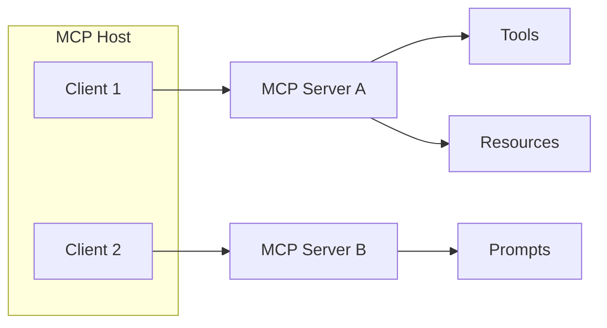

# 🏗️ Kiến trúc MCP: Host, Client, Server (Và câu chuyện nhờ Cursor đặt đồ ăn)

> Nguồn: `123-Theory-MCP-Architecture.txt` · [Udemy](https://ua.udemy.com/course/langchain/learn/lecture/52638003)

Trước khi đi vào từng component của MCP, mình muốn cùng các bạn điểm qua **kiến trúc tổng thể và mục tiêu của giao thức này**. Và để thấy nó thú vị cỡ nào, chúng ta sẽ bắt đầu bằng một ví dụ khó tin nhưng có thật: dùng AI application để... đặt đồ ăn.

---

### 🎯 MCP chuẩn hóa cách ứng dụng cung cấp "ngữ cảnh" cho LLM

**Model Context Protocol** được sinh ra để **chuẩn hóa cách các application cung cấp context cho LLM**. Và context thì có thể "mỏng" theo nhiều cách khác nhau:

* Context có thể là **thông tin bổ sung cho prompt**.
* Context có thể là **tool nào nên được invoke**.
* Context thậm chí có thể **chính là prompt**.

*Nghe câu cuối có vẻ hơi lạ tai, nhưng mình sẽ cho các bạn thấy ví dụ cụ thể trong các video sau nhé!*

Một khi một chuẩn trở nên phổ biến, người ta bắt đầu xây dựng những thứ "điên rồ". Ví dụ: **Eric Dickerson** viết một MCP server cho **Cursor** để **đặt đồ ăn**, kết nối thẳng vào tài khoản **Uber Eats** của anh ấy. Server được cấp các tool để **tìm menu**, **lọc kết quả**, rồi **hỏi user có muốn order không**. Khi user xác nhận, nó invoke tool **Order Food** và đặt món. Kết quả là một loại bánh pastry trông cực kỳ ngon mắt! Repo mã nguồn mở của server này được chia sẻ công khai, và điểm mấu chốt là: bạn có thể làm được **những điều tưởng như không tưởng** như vậy.

Và vì **MCP giống như USB-C**, còn **MCP server giống như một thiết bị ngoại vi**, ta có thể nhấc server đó cắm sang một AI application khác như **Claude Desktop** hay **Windsurf** và nó vẫn chạy ngon. Chú ý nhé: mình nói **AI application**, không phải model trực tiếp – Claude Desktop là ứng dụng dùng model của Anthropic bên dưới. Application do chúng ta tự xây cũng vậy – miễn là **tuân thủ và implement đúng protocol**, ta có thể plug-and-play để **làm giàu ứng dụng bằng nguồn dữ liệu và tool bên ngoài**.

---

### ⚖️ Hai lợi ích cốt lõi: plug-and-play và không bị "khóa" vào vendor

Tài liệu chính thức của MCP liệt kê hai lợi ích nổi bật:

1. **Hệ sinh thái tích hợp khổng lồ:** vô số integration, tool và data source có thể cắm thẳng (plug and play) vào application của bạn.
2. **Không bị ràng buộc (decoupled) với bất kỳ LLM vendor hay AI application builder nào:** bạn viết tool của mình **một lần**, rồi có thể **di chuyển và tái sử dụng** chúng ở nhiều vendor khác nhau.

Thú vị là **LangChain** – framework mã nguồn mở mà chúng ta đang học – cũng giải quyết nhóm vấn đề tương tự, nhưng theo **cách hoàn toàn khác**. Hai bên **không hề trùng lặp cách giải quyết** (ví dụ khả năng plug-and-play). Mình sẽ có hẳn một video so sánh LangChain và MCP, xem chúng "ăn khớp" với nhau ra sao và mỗi bên đem lại giá trị gì.

---

### 🧩 Bộ ba Host – Client – Server

Các component cốt lõi của MCP gồm:

* **MCP host:** application mà ta muốn mở rộng – ví dụ **Claude Desktop**, các IDE như **Cursor**, **Windsurf**, hoặc bất kỳ AI application chuyên biệt nào (kể cả agent do ta viết) **hỗ trợ giao thức MCP**. Ta có thể cấp thêm tool, kết nối thêm data source, thậm chí thêm cả prompt cho chúng.
* **Những thứ được "cắm thêm":** tool bên ngoài (ví dụ gọi API lấy thời tiết), truy vấn database, hay nguồn tri thức như **PDF**, văn bản dài... danh sách còn dài vô tận.
* **MCP server:** component **expose** resource, tool, prompt ra ngoài – đóng vai trò **proxy/gateway**. Để làm được điều đó, server phải implement đúng protocol với các hàm như **list prompts, get prompt, list tools, call tool, list resource templates, progress notification** – mình sẽ đi sâu ở phần xây dựng server.
* **MCP client (bên gọi server):** nằm **bên trong MCP host**, chịu trách nhiệm giao tiếp với MCP server thông qua **MCP protocol**. Ví dụ: kết nối **weather MCP server** vào **Claude Desktop**. Một điểm rất quan trọng: quan hệ giữa client và server là **1-1** – một client không nói chuyện với nhiều server. Muốn cắm host vào nhiều server, host phải chứa **nhiều client** bên trong.

Mối quan hệ 1-1 đó được mô tả như sau:

Tóm tắt vai trò của từng thành phần:

| Thành phần | Nằm ở đâu | Vai trò chính |
|---|---|---|
| MCP host | Application | Mở rộng app, quản lý các client |
| MCP client | Bên trong host | Giao tiếp 1-1 với một server |
| MCP server | Component riêng | Expose tools, resources, prompts |

### 🎯 Tự kiểm tra nhanh

**Câu 1:** MCP được sinh ra để chuẩn hóa điều gì?

<b>Xem đáp án</b>

**Đáp án:** Cách các application cung cấp context cho LLM.

Giải thích: Context có thể là thông tin bổ sung cho prompt, tool nên invoke, hoặc chính là prompt.

Tham chiếu: Mục MCP chuẩn hóa cách ứng dụng cung cấp ngữ cảnh.

**Câu 2:** Hai lợi ích cốt lõi của MCP là gì?

<b>Xem đáp án</b>

**Đáp án:** Hệ sinh thái tích hợp khổng lồ plug-and-play, và không bị ràng buộc với một LLM vendor hay AI application builder.

Giải thích: Viết tool một lần rồi di chuyển, tái sử dụng ở nhiều vendor.

Tham chiếu: Mục Hai lợi ích cốt lõi.

**Câu 3:** Quan hệ giữa MCP client và MCP server là gì?

<b>Xem đáp án</b>

**Đáp án:** 1-1 — một client không nói chuyện với nhiều server.

Giải thích: Muốn cắm host vào nhiều server, host phải chứa nhiều client bên trong.

Tham chiếu: Mục Bộ ba Host – Client – Server.

**Câu 4:** MCP host là gì?

<b>Xem đáp án</b>

**Đáp án:** Application mà ta muốn mở rộng — Claude Desktop, Cursor, Windsurf, hoặc agent do ta viết.

Giải thích: Host có thể được cấp thêm tool, data source và cả prompt.

Tham chiếu: Mục Bộ ba Host – Client – Server.

**Câu 5:** Ví dụ MCP server đặt đồ ăn trên Cursor chứng minh điều gì?

<b>Xem đáp án</b>

**Đáp án:** Server mã nguồn mở có thể cắm sang AI application khác như Claude Desktop hay Windsurf mà vẫn chạy ngon.

Giải thích: Vì MCP giống USB-C, còn MCP server giống thiết bị ngoại vi — miễn tuân thủ protocol là plug-and-play.

Tham chiếu: Mục MCP chuẩn hóa cách ứng dụng cung cấp ngữ cảnh.

Điểm "game-changing" nằm ở đây: viết functionality **một lần**, rồi cắm vào được **rất nhiều MCP host**. Quá tiện! Hẹn gặp lại các bạn ở video tiếp theo nhé! 🚀

## Nguồn tham khảo

- [Udemy — MCP Architecture](https://ua.udemy.com/course/langchain/learn/lecture/52638003)
- [Model Context Protocol — Architecture overview](https://modelcontextprotocol.io/docs/learn/architecture)
