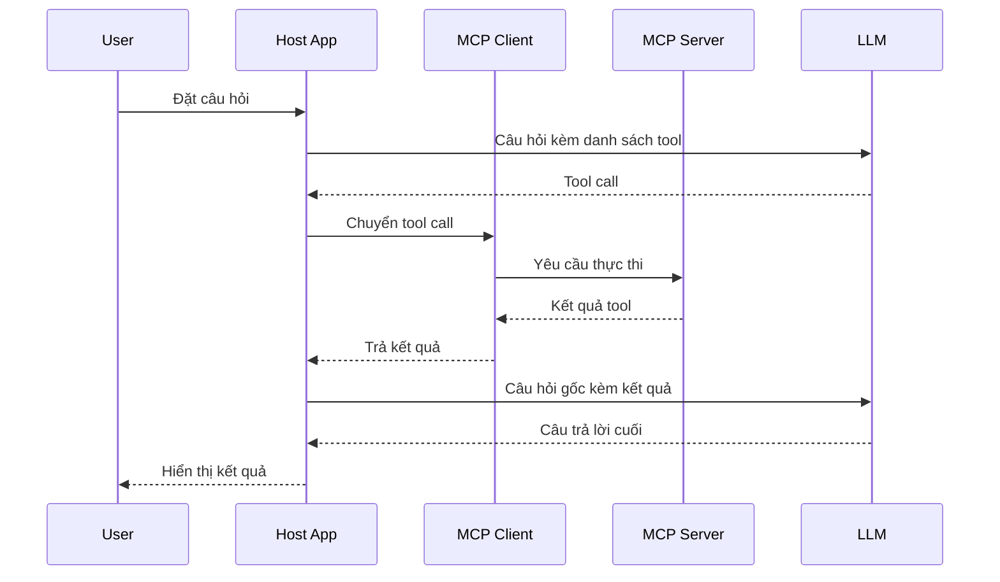

# 🔄 Toàn cảnh luồng chạy của MCP: Một câu hỏi đi qua những "trạm" nào?

> Nguồn: `124-Theory-The-GIST-of-the-Protocol-with-Tool-Calling.txt` · [Udemy](https://ua.udemy.com/course/langchain/learn/lecture/52632217)

Chào các bạn, Eden đây! Trong bài này, mình sẽ chỉ cho các bạn **"gist" của giao thức MCP**: mọi component tương tác với nhau ra sao – client nói gì với server, host nằm ở đâu, user và LLM tham gia lúc nào, và tất cả ráp lại thành một luồng hoàn chỉnh như thế nào.

---

### 🗺️ Sân khấu và các nhân vật

Trên sơ đồ, **user** là người đặt câu hỏi vào application. Application có thể là **Cursor**, **Windsurf**, **Claude Desktop**, hoặc agent do chính chúng ta viết và deploy. Application sẽ gọi tới một **LLM**, và phía còn lại là **MCP server** (máy chủ cung cấp tool/dữ liệu) mà ta tích hợp vào app.

Còn **MCP client (bên gọi server)** ở đâu? Nó **nằm ngay bên trong application**. Bạn có thể coi application chính là **MCP host** luôn. Trong một app có thể có **nhiều client**, và **mỗi client kết nối tới một MCP server khác nhau**.

---

### 🔌 Bước khởi động: server "báo danh" kho vũ khí của mình

Mọi chuyện bắt đầu khi **application được load** – khi bạn mở Cursor, mở Claude Desktop hay chạy agent của chính mình:

1. Các **client nằm trong host kết nối tới (những) MCP server** đã được tích hợp vào app.
2. Chúng dùng **MCP protocol** để **khởi tạo kết nối**, gửi message qua lại; MCP server **xác nhận (acknowledge)** client, rồi kết nối giữa hai bên được thiết lập.
3. Khi khởi tạo xong, **server thông báo cho client biết nó có những tool nào**. Điểm cần nhấn mạnh: không chỉ **tools**, mà là **mọi thứ server expose** – resources, prompts, tools. Với **weather MCP server** đã nhắc ở đầu khóa, đó là tool **alert** và tool **forecast**.

Toàn bộ quá trình này diễn ra **trước cả khi user tương tác** – ngay lúc ứng dụng vừa khởi động.

---

### 💬 Khi user đặt câu hỏi: LLM nhận cả query lẫn danh sách tool

Khi user gửi câu hỏi tới application (ví dụ Cursor), **client bên trong app đã biết server expose những tool gì**. Nó lấy **câu hỏi gốc của user và "đắp" thêm danh sách tool khả dụng** vào. Đây chính là "system prompt đặc biệt" mà mình nhắc ở bài trước: LLM không chỉ nhận câu hỏi, mà nhận **câu hỏi + các tool đang có sẵn**.

LLM sau đó phản hồi theo một trong hai hướng:

* Trả về **câu trả lời cuối cùng**, hoặc
* Trả về một **tool call** cần được thực thi.

Nhớ nhé: **MCP chỉ hoạt động với những LLM biết tool calling**. Tool call sẽ nói rõ **tool nào cần gọi** và **arguments nào cần truyền vào** – đủ thông tin để thực thi.

Toàn bộ hành trình của một câu hỏi được tóm gọn trong sơ đồ:

---

### ⚙️ Khác biệt then chốt: tool chạy ở MCP server, không chạy trong app

Đây là điểm khác biệt cốt lõi giữa **MCP** và các framework như **LangChain**:

* Với **LangChain**, mọi thứ được **thực thi ngay trong application layer** của bạn.
* Với **MCP**, ta **gửi tool call tới MCP server** – qua **stdio** hoặc **Server-Sent Events** – và **server sẽ chạy tool đó**. Tool execution diễn ra trong **runtime của server**, không phải trong graph agent hay app Cursor.

| Tiêu chí | LangChain | MCP |
|---|---|---|
| Nơi thực thi tool | Application layer | Runtime của MCP server |
| Giao tiếp | Gọi hàm nội bộ | stdio hoặc Server-Sent Events |
| Tách rời tool | Gắn trong app và agent | Tool là service riêng |
| Scale và monitor | Phụ thuộc app | Thuận lợi hơn nhờ decouple |

Vì sao điều này đáng giá? Vì nó **tách rời (decouple) MCP server và việc thực thi tool khỏi agent**. Tương lai muốn **scale** lên **Kubernetes**, chạy **serverless**, hay **monitor** trong một hệ thống riêng – mọi thứ đều thuận lợi hơn. Mình sẽ bàn sâu khi nói về **system design** ở phần sau của khóa học.

Sau khi tool chạy xong (ví dụ tool **forecast** trả về dự báo cho California), server gửi kết quả về. Kết quả đi qua "người đưa tin" là **MCP client**, rồi vào application layer. Tại đây, app **gọi LLM thêm một lần nữa** với **câu hỏi gốc + kết quả của tool**. LLM quyết định **dừng lại** hay **gọi thêm tool**; nếu dừng, câu trả lời cuối cùng được trả về cho user.

---

### 🧠 Vì sao decouple lại hay: orchestration vs. execution

So sánh trực tiếp với **LangChain ReAct agent**: nếu dùng bản "vanilla", tool sẽ chạy **bên trong app, bên trong agent của bạn**. Khi tích hợp MCP vào graph agent, tool sẽ chạy **trên MCP server** – component tool được tách hẳn thành **một service riêng**.

Lợi ích rất rõ ràng:

* **Debug**, **logging**, tính **cost** và **scaling** đều thuận lợi hơn.
* Theo mình, đây là một **quyết định kiến trúc tốt hơn**: chạy mọi thứ trong MCP server.
* Về mặt kỹ thuật, bạn hoàn toàn có thể tạo các **dummy tool** trong graph chỉ để gọi sang một service khác và nhận hành vi tương tự. Nhưng khác biệt mấu chốt là **MCP chuẩn hóa việc ủy quyền này** và cho ta **một interface duy nhất** để làm mọi thứ.

Và một điểm cộng nữa: **agent chịu trách nhiệm orchestration** (khi nào gọi tool, có gọi thêm tool không, khi nào hỏi lại user để lấy feedback...), còn **server chịu trách nhiệm thực thi tool**. Nhờ đó, ta có thể **cập nhật server động**, deploy phiên bản mới, và thiết lập để client **khởi tạo lại định kỳ** – agent sẽ nhận tool mới theo cơ chế **dynamic tool calling** mà **không cần redeploy**. Quá tiện!

### 🎯 Tự kiểm tra nhanh

**Câu 1:** Khi application vừa được load, các MCP client làm gì?

<b>Xem đáp án</b>

**Đáp án:** Kết nối tới các MCP server đã tích hợp, khởi tạo kết nối qua MCP protocol.

Giải thích: Sau khi server xác nhận, server thông báo cho client biết nó expose những gì.

Tham chiếu: Mục Bước khởi động.

**Câu 2:** Khi user đặt câu hỏi, LLM nhận được gì?

<b>Xem đáp án</b>

**Đáp án:** Câu hỏi gốc + danh sách tool khả dụng.

Giải thích: Đây chính là "system prompt đặc biệt" — MCP chỉ hoạt động với LLM biết tool calling.

Tham chiếu: Mục Khi user đặt câu hỏi.

**Câu 3:** LLM có thể phản hồi theo những hướng nào?

<b>Xem đáp án</b>

**Đáp án:** Trả về câu trả lời cuối cùng, hoặc trả về một tool call cần thực thi.

Giải thích: Tool call nói rõ tool nào cần gọi và arguments nào cần truyền.

Tham chiếu: Mục Khi user đặt câu hỏi.

**Câu 4:** Khác biệt then chốt giữa MCP và LangChain về nơi thực thi tool?

<b>Xem đáp án</b>

**Đáp án:** LangChain thực thi trong application layer; MCP gửi tool call tới server và server chạy tool.

Giải thích: Giao tiếp qua stdio hoặc Server-Sent Events, tool execution diễn ra trong runtime của server.

Tham chiếu: Mục Khác biệt then chốt.

**Câu 5:** Việc tách rời (decouple) tool khỏi agent đem lại lợi ích gì?

<b>Xem đáp án</b>

**Đáp án:** Debug, logging, tính cost và scaling đều thuận lợi hơn; cập nhật server động không cần redeploy.

Giải thích: Agent lo orchestration, server lo execution — client khởi tạo lại định kỳ để nhận tool mới.

Tham chiếu: Mục Vì sao decouple lại hay.

Ở video tiếp theo, chúng ta sẽ **tự tay implement một MCP client bên trong agent** để hiểu tường tận những gì vừa bàn. Hẹn gặp lại các bạn! 🚀

## Nguồn tham khảo

- [Udemy — The GIST of the Protocol with Tool Calling](https://ua.udemy.com/course/langchain/learn/lecture/52632217)
- [Model Context Protocol — Architecture overview](https://modelcontextprotocol.io/docs/learn/architecture)
- [LangChain Docs — Model Context Protocol](https://docs.langchain.com/oss/python/langchain/mcp)
