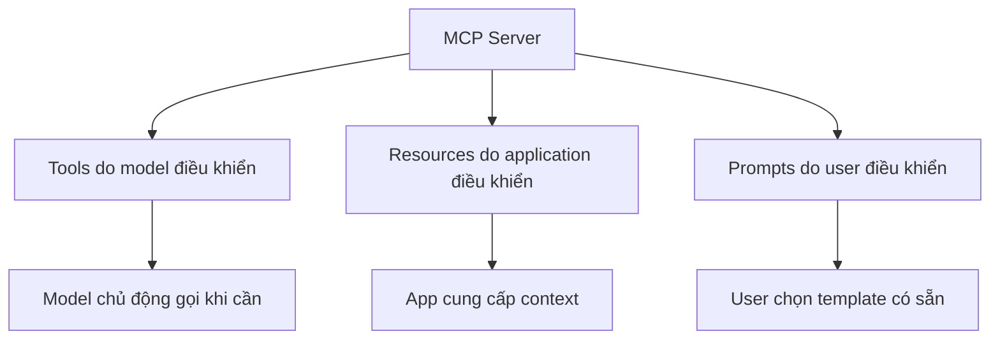

# 🖥️ MCP Server: Ba giao diện cốt lõi và bốn cách sở hữu (Cẩm nang từ A đến Z)

> Nguồn: `125-Theory-MCP-Servers.txt` · [Udemy](https://ua.udemy.com/course/langchain/learn/lecture/52637949)

Nếu bài trước là "toàn cảnh", thì bài này mình muốn cùng các bạn đi sâu vào **MCP server** (máy chủ cung cấp tool/dữ liệu): nó thực chất là gì, expose được những gì, xây bằng cách nào, chạy ra sao, và tương lai sẽ đi về đâu.

---

### 🧰 MCP server expose được những gì? Ba giao diện chính

MCP server thực chất là những **wrapper/interface** giúp **federate quyền truy cập** vào nhiều hệ thống và tool khác nhau, để AI application dùng được chúng theo **cách chuẩn hóa**. Nó làm điều đó qua ba giao diện chính:

1. **Tools – do model điều khiển:** những function mà AI có thể gọi khi cần. Ví dụ bộ tool thời tiết ta từng thấy: **get weather**, **get forecast**, **get alerts** – tất cả đều quy về những function. Vì là function nên bạn có **toàn quyền**: đọc dữ liệu, ghi dữ liệu sang hệ thống khác, làm bất cứ thứ gì bạn muốn. AI system (Cursor, Claude Desktop hay bất kỳ app nào) sẽ **tự quyết định dùng tool nào dựa trên context**.
2. **Resources – do application điều khiển:** dữ liệu được expose cho AI system. Có thể là dữ liệu **tĩnh** như **PDF**, file văn bản, hình ảnh, **JSON**... bất kỳ format nào; cũng có thể là **động** – bạn chỉ cần nói cách lấy resource tại thời điểm chạy. Mình sẽ demo cả resource tĩnh lẫn resource động trong vài video tới.
3. **Prompts – do user điều khiển:** các **template cho những tương tác phổ biến**, được định nghĩa sẵn để user có thể gọi. Chúng giúp **chuẩn hóa những tương tác phức tạp**.

*Resources và prompts có thể đang hơi mơ hồ với các bạn, nhưng mình hứa: chỉ cần xem ví dụ trong vài video tới, mọi thứ sẽ trở nên cực kỳ trực quan và thanh lịch.*

Ba giao diện này khác nhau ở **ai là người điều khiển**:

| Giao diện | Ai điều khiển | Ví dụ |
|---|---|---|
| Tools | Model | Gọi API, query DB, ghi dữ liệu |
| Resources | Application | PDF, JSON, hình ảnh, dữ liệu động |
| Prompts | User | Template tương tác dựng sẵn |

---

### 🏗️ Bốn cách để có một MCP server (và lời khuyên "đừng phát minh lại bánh xe")

1. **Tự viết tay:** có thể cần vài trăm dòng code **Python** hoặc **Node.js**.
2. **Nhờ AI sinh giúp:** dùng các tool như **Cursor** hoặc **MCP generator** – chúng ta sẽ làm thử trong khóa học.
3. **Xài server cộng đồng:** hiện có **hàng nghìn** MCP server **mã nguồn mở** do cộng đồng xây; bạn có thể **clone về và sửa** nếu muốn. Ví dụ **weather map server** – có source code nên tùy ý chỉnh sửa.
4. **Dùng tích hợp chính thức:** từ các công ty như **Cloudflare**, **Stripe** – họ tự maintain MCP server của mình.

Điều này rất giống hệ sinh thái **LangChain**: mỗi vendor tự maintain package riêng – **LangChain OpenAI**, **LangChain Google Vertex AI**, **LangChain Anthropic**, **LangChain Pinecone**, **LangChain Chroma**... Với MCP cũng vậy: công ty nào có sản phẩm muốn người khác dùng sẽ **tự viết và open source** MCP server, vì càng nhiều người dùng thì sản phẩm càng phổ biến. **Stripe** là ví dụ điển hình – họ có **động lực rất lớn** để viết và duy trì MCP server thật tốt.

Vì thế, lời khuyên quan trọng nhất: **đừng phát minh lại bánh xe**. Nếu cần MCP server cho dịch vụ của bên thứ ba, hãy **kiểm tra trước xem họ đã có chưa** – khả năng rất cao là có rồi. Bạn không cần tự viết integration Stripe khi **team Stripe đã làm sẵn MCP server**. Nếu thiếu tính năng bạn cần, hãy **liên hệ bên thứ ba** để hỏi xem nó có trong roadmap không, hoặc nhờ họ làm custom cho bạn – đừng tự sa vào "hố" implement lại hàng loạt server mà người khác đã làm.

---

### 🚀 Cách chạy server, sampling và sức mạnh composability

MCP server có thể được chạy theo nhiều cách:

* **Local** qua **standard input/output channel (stdio)** – như weather server chúng ta từng chạy.
* **Remote** qua **Server-Sent Events (SSE)** hoặc **SSH** – sẽ có ví dụ trong khóa học.
* Đóng gói thành **Docker container** – nếu bạn muốn mình làm nội dung này, cứ cho mình biết nhé!

Một tính năng rất đáng chú ý nữa là **sampling**: MCP server có thể **yêu cầu host AI system** (ví dụ Cursor hay Claude Desktop) **generate một completion** với một loại prompt. Điều này rất mạnh, mở ra nhiều khả năng mới, nhưng cũng kéo theo những **vấn đề về bảo mật và quyền riêng tư** – mình sẽ cover kỹ ở phần sau của khóa học.

Còn về **composability**: bất kỳ application hay agent nào đều có thể **vừa là MCP client, vừa là MCP server**. Điều này cho phép xây dựng những **multi-layered agentic application** với các **specialized agent** tập trung vào từng nhiệm vụ riêng.

---

### 🔮 Tương lai: registry, xác minh và những "well-known endpoints"

Hệ sinh thái MCP đang tiến hóa rất nhanh. Những điều đáng mong chờ:

* **Registry và discovery:** sẽ có **central registry API** để khám phá MCP server; bạn có thể listing server của mình để người khác dùng.
* **Xác minh server chính thức:** hiện ai cũng có thể viết MCP server rồi đẩy lên GitHub – mở đường cho **supply chain attack**. Kẻ xấu có thể upload một "Stripe MCP server" giả chứa code **đánh cắp dữ liệu** hoặc **chạy mã độc trên máy bạn**. Verification sẽ giúp giảm thiểu vấn đề này.
* **Self-evolving agents:** tự khám phá **capability mới ngay trong lúc chạy (runtime)**.
* **Website mở chức năng cho agent:** giống như **robots.txt** giúp search engine index website, các web application sẽ giúp agent khám phá và điều hướng. Chuẩn dự kiến là **well-known endpoint** – một **well-known JSON** để website công bố khả năng của mình cho **MCP client**.
* **Authentication:** hỗ trợ các protocol như **OAuth 2.0** cho truy cập an toàn vào hệ thống bên ngoài, cùng **session token** để duy trì kết nối – qua đó **tăng cường bảo mật cho MCP protocol**.

### 🎯 Tự kiểm tra nhanh

**Câu 1:** Ba giao diện chính của MCP server là gì và do ai điều khiển?

<b>Xem đáp án</b>

**Đáp án:** Tools do model điều khiển, Resources do application điều khiển, Prompts do user điều khiển.

Giải thích: Tools là function AI gọi khi cần; resources là dữ liệu expose; prompts là template tương tác.

Tham chiếu: Mục Ba giao diện chính.

**Câu 2:** Bốn cách để có một MCP server?

<b>Xem đáp án</b>

**Đáp án:** Tự viết tay, nhờ AI sinh giúp, xài server cộng đồng, dùng tích hợp chính thức.

Giải thích: Ví dụ tương ứng: vài trăm dòng Python/Node.js, Cursor/MCP generator, clone mã nguồn mở, Cloudflare/Stripe.

Tham chiếu: Mục Bốn cách để có một MCP server.

**Câu 3:** Lời khuyên quan trọng nhất khi cần MCP server cho dịch vụ bên thứ ba?

<b>Xem đáp án</b>

**Đáp án:** Đừng phát minh lại bánh xe — kiểm tra trước xem họ đã có server chưa.

Giải thích: Nếu thiếu tính năng, liên hệ bên thứ ba hỏi roadmap thay vì tự implement lại.

Tham chiếu: Mục Bốn cách để có một MCP server.

**Câu 4:** MCP server có thể được chạy theo những cách nào?

<b>Xem đáp án</b>

**Đáp án:** Local qua stdio, remote qua SSE hoặc SSH, hoặc đóng gói thành Docker container.

Giải thích: Mỗi cách phù hợp với một tình huống triển khai khác nhau.

Tham chiếu: Mục Cách chạy server, sampling và composability.

**Câu 5:** Sampling trong MCP là gì?

<b>Xem đáp án</b>

**Đáp án:** Server có thể yêu cầu host AI system generate một completion với một loại prompt.

Giải thích: Rất mạnh nhưng kéo theo vấn đề bảo mật và quyền riêng tư sẽ được cover ở phần sau.

Tham chiếu: Mục Cách chạy server, sampling và composability.

Khi những tính năng này được hiện thực hóa, mình sẽ đào sâu ngay. Hẹn gặp lại các bạn ở bài tiếp theo! 🚀

## Nguồn tham khảo

- [Udemy — MCP Servers](https://ua.udemy.com/course/langchain/learn/lecture/52637949)
- [Model Context Protocol — Understanding MCP servers](https://modelcontextprotocol.io/docs/learn/server-concepts)
