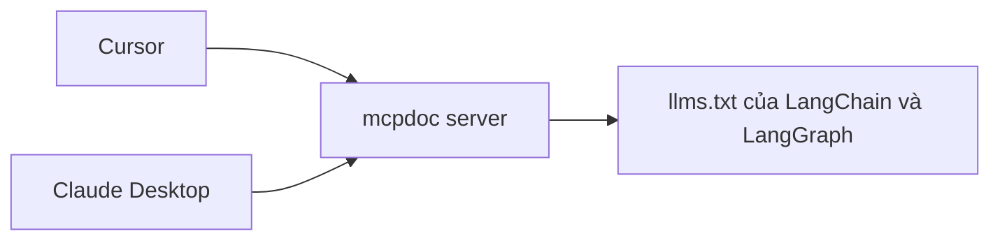

# 🧭 MCP Doc là gì và chúng ta sắp xây gì? (Điểm khởi đầu của hành trình MCP)

> Nguồn: `126-What-are-we-building-MCP-Doc.txt` · [Udemy](https://ua.udemy.com/course/langchain/learn/lecture/52635201)

Chào các bạn, Eden đây! Để hiểu thật đầy đủ về **MCP (Model Context Protocol)**, chúng ta cần đi qua một hành trình có lộ trình rõ ràng, và cách bắt đầu tốt nhất là **tích hợp một MCP server dựng sẵn vào một MCP client dựng sẵn** – trước khi tự tay viết bất cứ thứ gì.

*Vì sao lại bắt đầu từ những thứ "dựng sẵn"? Vì khi mọi thứ chạy trơn tru trước mắt, bạn sẽ thấy rõ vai trò của từng mảnh ghép trước khi tự tay tạo ra chúng.*

---

### 📦 Gặp gỡ MCP Doc (mcpdoc) – MCP server "cắm là chạy" của LangChain

Trong vài video tới, chúng ta sẽ dùng một **pre-built MCP server** có tên **MCP Doc** (viết gọn là **mcpdoc**), do **LangChain phát hành**. Server này cho chúng ta quyền truy cập vào **tài liệu LangChain và LangGraph mới nhất, đầy đủ nhất**.

Tin mình đi – tài liệu của những package này **thay đổi nhanh kinh khủng**. Thay vì tự đuổi theo từng bản cập nhật mỗi ngày, **mcpdoc sẽ tự động giữ chúng ta luôn kết nối với documentation "tươi mới" nhất** của LangChain.

Cụ thể, mcpdoc mang lại cho chúng ta:

* **Luôn bám sát bản mới nhất:** không phải tự tay theo dõi từng thay đổi của tài liệu.
* **Bỏ hẳn việc "săn" cập nhật thủ công:** server tự lo phần giữ tài liệu luôn tươi mới.
* **Cắm là chạy:** server đã được đóng gói sẵn, bạn chỉ việc kết nối nó vào client.

*Nếu bạn từng mệt mỏi vì tài liệu thay đổi nhanh hơn tốc độ đọc của mình, thì đây chính là "vũ khí" dành cho bạn.*

---

### 🖥️ Phía client: Cursor và Claude Desktop

Ở phía client, chúng ta sẽ bắt đầu với **Cursor** – ứng dụng này **đã tích hợp sẵn MCP client (bên gọi server)**. Bạn chỉ cần cấu hình server vào là dùng được.

Phần thú vị nhất là mình sẽ **làm lại y hệt như vậy với Claude Desktop**. Tức là vẫn là server mcpdoc, nhưng cắm sang một AI client hoàn toàn khác – và cả hai vẫn "nói chuyện" với nhau qua **Model Context Protocol**.

| Thành phần dựng sẵn | Vai trò | Ví dụ trong chuỗi bài |
|---|---|---|
| MCP server | Cung cấp tool và tài liệu | mcpdoc của LangChain |
| MCP client | Kết nối và gọi server | Cursor, Claude Desktop |

*Điểm hay là bạn không phải tự viết MCP client – Cursor đã lo phần đó giúp bạn.*

---

### 🎯 Thành quả cuối cùng của chuỗi bài này

Sau khi hoàn thành loạt video tiếp theo, các bạn sẽ:

1. Biết cách **tích hợp một pre-built MCP server** vào hai **pre-built MCP client** khác nhau.
2. Hiểu cách hai component **giao tiếp với nhau qua giao thức MCP** – đúng tinh thần "viết một lần, cắm nhiều nơi" mà chúng ta đã bàn.

### 🎯 Tự kiểm tra nhanh

**Câu 1:** Vì sao hành trình MCP bắt đầu bằng những thứ "dựng sẵn"?

<b>Xem đáp án</b>

**Đáp án:** Để khi mọi thứ chạy trơn tru trước mắt, bạn thấy rõ vai trò của từng mảnh ghép trước khi tự tay tạo ra chúng.

Giải thích: Đây là cách học trực quan nhất theo lộ trình của khóa học.

Tham chiếu: Đoạn mở đầu.

**Câu 2:** MCP Doc (mcpdoc) là gì và do ai phát hành?

<b>Xem đáp án</b>

**Đáp án:** Là pre-built MCP server do LangChain phát hành.

Giải thích: Server này cho quyền truy cập tài liệu LangChain và LangGraph mới nhất.

Tham chiếu: Mục Gặp gỡ MCP Doc.

**Câu 3:** mcpdoc giải quyết nỗi đau gì cho developer?

<b>Xem đáp án</b>

**Đáp án:** Tài liệu các package thay đổi nhanh kinh khủng — mcpdoc tự động giữ ta luôn kết nối với documentation tươi mới nhất.

Giải thích: Thay vì tự đuổi theo từng bản cập nhật mỗi ngày.

Tham chiếu: Mục Gặp gỡ MCP Doc.

**Câu 4:** Hai MCP client dựng sẵn được dùng trong chuỗi bài là gì?

<b>Xem đáp án</b>

**Đáp án:** Cursor và Claude Desktop.

Giải thích: Cursor đã tích hợp sẵn MCP client; sau đó cắm đúng server mcpdoc sang Claude Desktop.

Tham chiếu: Mục Phía client.

**Câu 5:** Thành quả cuối cùng của chuỗi bài này là gì?

<b>Xem đáp án</b>

**Đáp án:** Biết tích hợp một pre-built MCP server vào hai pre-built MCP client, và hiểu cách chúng giao tiếp qua giao thức MCP.

Giải thích: Đúng tinh thần "viết một lần, cắm nhiều nơi".

Tham chiếu: Mục Thành quả cuối cùng.

Đây sẽ là nền tảng trực quan để các bạn đi sâu vào kiến trúc MCP ở các phần sau. Thắt dây an toàn và hẹn gặp lại ở video tiếp theo nhé! 🚀

## Nguồn tham khảo

- [Udemy — What are we building? MCP Doc](https://ua.udemy.com/course/langchain/learn/lecture/52635201)
- [GitHub — langchain-ai/mcpdoc](https://github.com/langchain-ai/mcpdoc)
- [LangChain Docs — Model Context Protocol](https://docs.langchain.com/oss/python/langchain/mcp)
