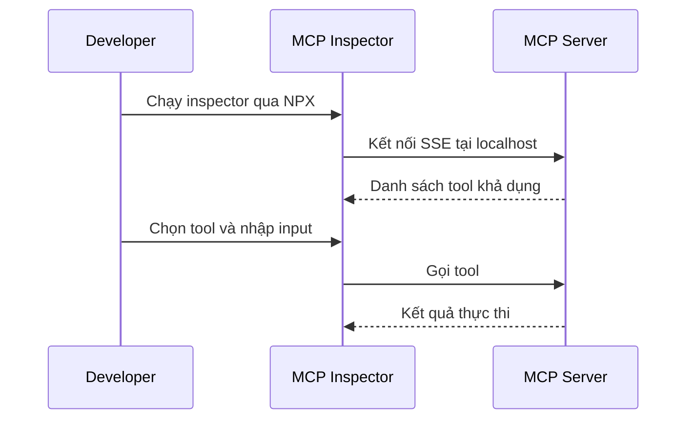

# 🕵️ MCP Inspector: "Kính hiển vi" để soi và debug MCP Server (Công cụ mã nguồn mở từ Anthropic)

> Nguồn: `127-MCP-Inspector.txt` · [Udemy](https://ua.udemy.com/course/langchain/learn/lecture/49353235)

Chào các bạn, Eden đây! Hôm nay mình muốn giới thiệu **MCP Inspector** – một **dự án mã nguồn mở của team Anthropic**, chính là những người đã tạo ra **MCP (Model Context Protocol)**.

Công cụ này giúp chúng ta **troubleshoot, debug, trace** và **nhìn thấy chính xác điều gì đang diễn ra bên trong MCP server**. Khi bắt tay vào xây MCP server, đây là một trong những tool **quan trọng nhất**, giúp cuộc sống dev của bạn nhẹ nhàng hơn hẳn. Bài này chỉ là **tổng quan nhanh**; phần còn lại của khóa học sẽ dùng đến **hầu hết những tính năng hữu ích** của nó.

---

### 🧪 MCP Inspector là gì và chạy thế nào?

**MCP Inspector** là một **interactive dev tool** dành cho việc **test và debug MCP server**. Nó cho phép developer **inspect và tương tác** với MCP server **mà không cần cài đặt gì cả** – bạn chạy nó **locally từ NPX**.

*Nghĩa là bạn có ngay một "cửa sổ" để nhìn vào server mà không phải dựng thêm bất kỳ môi trường phức tạp nào.*

---

### 📋 Bốn khu vực hữu dụng nhất

Khi kết nối vào một MCP server, bạn sẽ làm việc chủ yếu với:

* **Resources tab:** liệt kê toàn bộ **resource** khả dụng, hiển thị **metadata** và cho phép **inspect nội dung**.
* **Prompts tab:** hiển thị các **prompt template**, các **prompt arguments**, và thậm chí cho phép **test với input tùy chỉnh**.
* **Tools tab:** liệt kê mọi **tool khả dụng** cùng **schema** của chúng, và cho phép **chạy thử tool với input tùy chỉnh**.
* **Notifications pane:** hiển thị **log và notification** do server gửi ra.

| Khu vực | Hiển thị gì | Hành động chính |
|---|---|---|
| Resources | Resource và metadata | Inspect nội dung |
| Prompts | Prompt template và arguments | Test với input tùy chỉnh |
| Tools | Tool và schema | Chạy thử tool |
| Notifications | Log và notification | Theo dõi server |

---

### 🎬 Demo: kết nối, list tool và chạy thử trong playground

Trong phần demo, mình kết nối tới một server chạy trên **localhost**, và lần này mình dùng **SSE server** chứ không phải **STDIO server**. Sau khi bấm **Connect**, server lộ diện các tool của nó.

Mục tiêu của phần demo rất đơn giản: xem server đang expose những gì, và kiểm tra từng tool chạy ra sao với input thật.

* Bấm **list tools** → server này có **2 tool**: **`list document sources`** và **`fetch docs`**.
* Đây là một **documentation MCP server**, giúp **fetch động tài liệu mới nhất của các package nổi tiếng**. Đừng bận tâm quá về việc server làm gì cụ thể – mình muốn các bạn thấy **cách MCP Inspector hoạt động**.
* Ta có thể **run tool `list document sources`** và xem **output trả về**.
* Với **`fetch docs`**, mình dán một **input động** và xem **kết quả sau khi thực thi tool**.

Cái **playground** này cực kỳ hữu ích để **debug tool** và xác nhận **MCP server của chúng ta đang chạy đúng**.

Luồng demo diễn ra như sau:

*Và đây mới chỉ là phần nổi của tảng băng – còn nhiều tính năng rất hữu ích của MCP Inspector sẽ xuất hiện xuyên suốt khóa học.*

### 🎯 Tự kiểm tra nhanh

**Câu 1:** MCP Inspector là gì và do ai phát triển?

<b>Xem đáp án</b>

**Đáp án:** Là interactive dev tool để test và debug MCP server, là dự án mã nguồn mở của team Anthropic.

Giải thích: Anthropic chính là những người tạo ra MCP.

Tham chiếu: Đoạn mở đầu.

**Câu 2:** Cách chạy MCP Inspector có gì đặc biệt?

<b>Xem đáp án</b>

**Đáp án:** Chạy locally từ NPX, không cần cài đặt gì cả.

Giải thích: Bạn có ngay một "cửa sổ" nhìn vào server mà không phải dựng môi trường phức tạp.

Tham chiếu: Mục MCP Inspector là gì và chạy thế nào.

**Câu 3:** Bốn khu vực hữu dụng nhất của Inspector?

<b>Xem đáp án</b>

**Đáp án:** Resources tab, Prompts tab, Tools tab và Notifications pane.

Giải thích: Resources xem metadata; Prompts test template; Tools chạy thử tool; Notifications xem log.

Tham chiếu: Mục Bốn khu vực hữu dụng nhất.

**Câu 4:** Trong demo, mình kết nối qua transport nào?

<b>Xem đáp án</b>

**Đáp án:** SSE server chạy trên localhost, không phải STDIO server.

Giải thích: Sau khi bấm Connect, server lộ diện các tool của nó.

Tham chiếu: Mục Demo.

**Câu 5:** Server demo expose hai tool nào?

<b>Xem đáp án</b>

**Đáp án:** list document sources và fetch docs.

Giải thích: Đây là một documentation MCP server giúp fetch động tài liệu mới nhất.

Tham chiếu: Mục Demo.

Hẹn gặp lại các bạn ở video tiếp theo! 🚀

## Nguồn tham khảo

- [Udemy — MCP Inspector](https://ua.udemy.com/course/langchain/learn/lecture/49353235)
- [Model Context Protocol — MCP Inspector](https://modelcontextprotocol.io/docs/tools/inspector)
- [GitHub — modelcontextprotocol/inspector](https://github.com/modelcontextprotocol/inspector)
