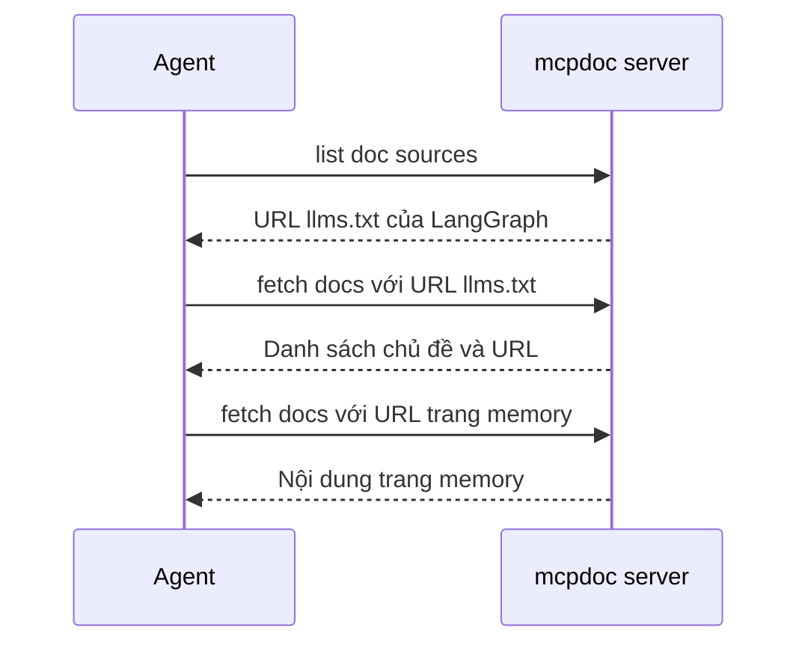

# 🔬 Thực hành mcpdoc: Từ clone repo đến câu trả lời "grounded" trong Claude Desktop

> Nguồn: `129-mcpdoc.txt` · [Udemy](https://ua.udemy.com/course/langchain/learn/lecture/49375709)

Chào các bạn, Eden đây! Sau khi đã nắm lý thuyết, hôm nay chúng ta sẽ **chạy thật**: đi từ GitHub repo của **MCP Doc**, khởi động server, soi nó bằng **MCP Inspector**, rồi cắm vào **Claude Desktop**. Và như mọi hành trình thực chiến, sẽ có vài lỗi "dở khóc dở cười" để chúng ta cùng gỡ.

---

### 🧠 Cách mcpdoc hoạt động: cuốn sách có mục lục

Mình đang ở **GitHub repository chính thức của MCP Doc** – nơi có cả sơ đồ giải thích server này làm gì. Ý tưởng cốt lõi: nó khai thác **llms.txt của tài liệu công khai** của các package (ví dụ LangGraph có một file như vậy), để giúp agent – dù là **Cursor**, **Windsurf** hay **Claude Desktop** – có khả năng **fetch tài liệu mới nhất**.

Lý do rất thực tế: tài liệu của các open-source project, đặc biệt trong lĩnh vực GenAI, **thay đổi liên tục**. Nếu ta tự index thủ công, chúng sẽ **lỗi thời rất nhanh**. Server này scrape tài liệu **trực tiếp từ website chính thức** – nơi được cho là luôn cập nhật.

Cách nó hoạt động gồm hai bước:

1. **Truy cập llms.txt** – nơi chứa danh sách URL cùng giải thích mỗi URL đại diện cho chủ đề gì. Mình thích ví von: đây là **trang đầu của một cuốn sách, gồm mục lục từng chương kèm mô tả ngắn**.
2. **Xác định URL phù hợp với câu hỏi của user**, rồi **fetch thông tin liên quan** bằng một **curl request**.

Kết quả: **không còn tài liệu cũ kỹ (no more stale documentation)**.

---

### ⚙️ Khởi động server và "soi" bằng MCP Inspector

MCP Doc được implement bằng **Python** và cần **UV** để chạy. Các bước mình đã thực hiện:

1. Mở terminal, **clone repo**, rồi **cd vào thư mục** và **cài dependencies** theo tài liệu.
2. **Tạo và kích hoạt virtual environment** – bạn sẽ thấy `mcpdoc` xuất hiện ở thanh bên trái. Dependencies được mô tả trong file **uv.lock**.
3. Chạy `which uv` để lấy **đường dẫn đầy đủ** của file thực thi UV – mình sẽ cần nó ở phần sau.
4. Làm **sanity check**: dùng lệnh trong docs để chạy server local với **llms.txt của LangGraph** – server chạy trên **port 8082**.

Sau đó, mình mở **terminal thứ hai** để chạy **MCP Inspector**:

* Lấy lệnh chạy inspector từ README của repo, chạy qua **NPX** và bấm **Y** để cài dependencies – quá trình này **có thể mất vài phút**.
* Inspector chạy trên **port 3000**. Mình bấm **Connect** vào **SSE server** đang chạy ở **port 8082**.
* Bấm **list tools** → có **2 tool**: **`list doc sources`** (hiển thị URL tới file llms.txt để ta HTTP request và scrape) và **`fetch docs`** (nhận một URL rồi **retrieve toàn bộ nội dung bằng cách scrape**).
* Chạy thử **`fetch docs`** với llms.txt → ta nhận được **toàn bộ nội dung file llms.txt của LangGraph**, gồm các URL. Agent sẽ **trích xuất URL** từ đây rồi gọi `fetch docs` cho đúng URL cần thiết.

| Transport | Kiểu kết nối | Dùng ở đâu trong bài |
|---|---|---|
| SSE | Remote qua HTTP | Server chạy port 8082, nối từ MCP Inspector |
| stdio | Local qua standard input/output | Claude Desktop chạy qua UVX, port 8081 |

---

### 🖥️ Tích hợp vào Claude Desktop: hai lần gỡ lỗi "nhớ đời"

Trước tiên, mình chứng minh **"khi chưa có MCP"**: mở Settings → Developer → tab MCP, danh sách server đang **trống trơn**. Mình hỏi Claude Desktop câu **"What is LangGraph memory?"** → nó trả lời **dựa trên dữ liệu huấn luyện**. Câu trả lời nhìn có vẻ đúng, nhưng **không được grounded vào dữ liệu real-time**, và sẽ **lỗi thời rất nhanh** khi các package LangGraph và LangChain cập nhật liên tục.

Rồi mình cắm server vào bằng cách:

1. Mở **MCP settings config file**, dán **snippet từ repo** để chỉ cho client cách chạy server.
2. Snippet chạy server qua **UVX**, trỏ tới thư mục `mcpdoc`, khai báo URL chứa llms.txt của tài liệu LangGraph (có thể thay đổi), transport layer là **stdio**, port **8081**. *Lưu ý: lúc chạy thử ta dùng SSE, còn giờ đổi sang stdio – cả hai đều chạy được.*

**Lần gỡ lỗi thứ nhất:** restart Claude Desktop → gặp lỗi **ENOENT**, không chạy được lệnh **UVX**. Mở error log thì thấy vấn đề nằm ở lệnh UVX. Cách sửa: kích hoạt virtual environment, lấy **đường dẫn đầy đủ của UVX** rồi dán vào config. Lần này server load được, icon hiện **llms.txt MCP server**, và settings hiển thị đúng.

**Lần gỡ lỗi thứ hai:** mình hỏi lại "What is langgraph memory?" – **kết quả vẫn không đổi**, dù tool button cho thấy server expose tool bình thường. Sau khi debug offline, mình phát hiện nguyên nhân: khi chạy lệnh UVX, cần chỉ định **absolute path tới nơi lưu code**, vì ta không biết lệnh sẽ được chạy từ thư mục nào. Sửa xong và restart → **"boom"**, tool được kích hoạt!

---

### ✅ Khoảnh khắc "boom": câu trả lời được grounded bằng tài liệu real-time

Sau khi sửa xong, luồng chạy diễn ra như sau:

1. Agent gọi tool **`list doc sources`**. Vì server được khởi tạo với llms.txt của LangGraph và **không truyền argument**, nó trả về **URL tới file llms.txt của LangGraph**.
2. Agent gọi **`fetch docs`** với URL vừa nhận → scrape nội dung llms.txt (chỉ gồm **chủ đề và URL**, không phải toàn bộ tài liệu).
3. Từ danh sách đó, agent tìm **URL phù hợp về memory**, rồi gọi lại **`fetch docs`** với URL mới – lần này là **langgraph/concepts/memory**.
4. Kết quả: bản tóm tắt về **LangGraph memory** được **grounded vào thông tin real-time**, lấy trực tiếp từ **tài liệu chính thức của LangGraph**.

### 🎯 Tự kiểm tra nhanh

**Câu 1:** mcpdoc hoạt động theo hai bước nào?

<b>Xem đáp án</b>

**Đáp án:** Truy cập llms.txt để lấy danh sách URL kèm mô tả, rồi xác định URL phù hợp và fetch nội dung bằng curl request.

Giải thích: Mình ví von llms.txt như trang đầu cuốn sách gồm mục lục từng chương.

Tham chiếu: Mục Cách mcpdoc hoạt động.

**Câu 2:** Vì sao server scrape tài liệu trực tiếp thay vì index thủ công?

<b>Xem đáp án</b>

**Đáp án:** Vì tài liệu open-source, đặc biệt trong GenAI, thay đổi liên tục — index thủ công sẽ lỗi thời rất nhanh.

Giải thích: Scrape từ website chính thức giúp không còn tài liệu cũ kỹ.

Tham chiếu: Mục Cách mcpdoc hoạt động.

**Câu 3:** Lỗi ENOENT khi restart Claude Desktop được sửa thế nào?

<b>Xem đáp án</b>

**Đáp án:** Kích hoạt virtual environment, lấy đường dẫn đầy đủ của UVX rồi dán vào config.

Giải thích: Lỗi nằm ở lệnh UVX không chạy được.

Tham chiếu: Mục Tích hợp vào Claude Desktop.

**Câu 4:** Vì sao cần chỉ định absolute path tới nơi lưu code?

<b>Xem đáp án</b>

**Đáp án:** Vì ta không biết lệnh UVX sẽ được chạy từ thư mục nào.

Giải thích: Sửa xong và restart thì tool được kích hoạt — khoảnh khắc "boom".

Tham chiếu: Mục Tích hợp vào Claude Desktop.

**Câu 5:** Khi chưa cắm MCP server, Claude Desktop trả lời câu hỏi về LangGraph memory thế nào?

<b>Xem đáp án</b>

**Đáp án:** Dựa trên dữ liệu huấn luyện — không được grounded vào dữ liệu real-time và sẽ lỗi thời nhanh.

Giải thích: Sau khi cắm mcpdoc, câu trả lời được grounded vào tài liệu chính thức.

Tham chiếu: Mục Tích hợp vào Claude Desktop.

Và đó chính là sức mạnh của MCP: **giữ câu trả lời của agent luôn bám sát tài liệu thật, tại thời điểm thật**. Mình thấy điều này cực kỳ thú vị, và hy vọng các bạn cũng vậy. Hẹn gặp lại ở bài tiếp theo nhé! 🚀

## Nguồn tham khảo

- [Udemy — mcpdoc](https://ua.udemy.com/course/langchain/learn/lecture/49375709)
- [GitHub — langchain-ai/mcpdoc](https://github.com/langchain-ai/mcpdoc)
- [Model Context Protocol — MCP Inspector](https://modelcontextprotocol.io/docs/tools/inspector)
